# Unit 1: Systems design

## System development life cycle

This unit considers the equivalent of the old MYP Design cycle. At university level for a Computer Science course, the design cycle is known as the SDLC: System development life cycle (some books substitute "system" with "software").

The major sections of the SDLC are:

* Requirements analysis
* Design
* Implementation
* Testing
* Evolution

We will examine each section for what needs to occur.

---

## SDLC Phase 1: Requirements analysis

Aim of phase 1: Figure out what the project needs to accomplish.

There are typically 4 elements to this:

* Project scoping
* Stakeholder consultation
* Project research
* Requirements planning

---

### Project scoping

> Find out exactly what it is you have to do

A scope document allows all parties to agree in writing as to what is and is not included within the project. It effectively becomes the contract and establishes common expectations for client and creator.

* Happy customer = good word of mouth.
* Disgruntled customer (feels ripped off or that you didn't deliver on what was promised) = bad for business.
* Burnt out producer (feeling taken advantage of, frustrated at changing requirements) = Not healthy!

Scoping should be SMART

* Specific
* Measurable
* Agreed upon
* Realistic
* Time bound

Ensure your scopes identify time, financial and resource constraints!

It is inevitable that a project scope will change over time. When that occurs, beware the challenges of scope creep vs scope discovery:

* Changes to the scope that make it more clear / less vague = Scope discovery
* Changes that make the scope less clear / more vague = Scope creep

---

### Stakeholder consultation

> Identifying stakeholders

* Who is relevant? Employers, employees, customers…?
* Who will use the system?
* Who will depend on the system (even if they don't use it directly)?
* Who will provide information the system depends on? (even if they don't enter it directly)
* Who is paying for the system? (why?)

Possible strategies for obtaining requirements from stakeholders

* Surveys
* Interviews
* Direct observations
* Document collection

Failure to involve all relevant stakeholders may lead to software that is not suitable for its intended use! (The manager doesn't necessarily always know what the clerical staff do!)

Effective collaboration and communication between all parties: client, developer, end users.

Consultation should occur continually throughout the lifecycle to identify problems early.

Be aware of privacy issues – being able to get honest, frank information from a stakeholder without fear of retribution (eg: a staff member who might have valuable insight into how some part of the system doesn't work the way management thinks it does) – create an environment where you can extract those valuable nuggets

### Exercise

Split off into pairs - one taking the role of customer, one taking the role of developer. Customer comes up with an app/software project they want the developer to "design". Developer must ask questions to ascertain:

 * A scope document: Eexplicitly list "in scope" and "out of scope" items
 * Identify stakeholders
 * Requirement specification: Functional and non-functional items

Reverse roles when ready.

Save these project outlines as we will use them later.

---

### Project research

* Examine the **current system** that yours will replace – strengths, weaknesses, idiosyncrasies.
* Examine **competing products** – strengths, weaknesses, idiosyncrasies.
* Examine **your capabilities** – what are you capable of producing? if you need additional expertise, what can you afford to recruit?
* Examine the **literature** (journals, online forums) – how are other people addressing the problem?

When researching your project, don't forget to account for international factors.

* Does your program only have to work for a homogeneous group of people in the same location? Or might you have to deal with different timezones, different languages, different conventions in date formats? Things can get very complex very quickly as these videos demonstrate.

* The Problem with Time & Timezones - Computerphile  
  [https://www.youtube.com/watch?v=-5wpm-gesOY](https://www.youtube.com/watch?v=-5wpm-gesOY)

* Internationalis(z)ing Code - Computerphile  
  [https://www.youtube.com/watch?v=0j74jcxSunY](https://www.youtube.com/watch?v=0j74jcxSunY)

---

### Requirements planning

Turn your project scope into a detailed set of requirements that you can give to your engineering team. Your requirements are generally split into functional and non-functional requirements.

* Functional: What will the program actually do? For example:
  * Store hours worked per employee per day
  * Store hourly rates for employees by category of employment
  * Store daily timesheets for up to 5 years history
  * Calculate income tax obligiations per employee at the end of each month
* Non-functional: Doesn't affect what the program will actually do, but will impact on creating it anyway. For example:
  * The system shall run on Android / iOS / the web.
  * The system shall be compatible with Microsoft SQL / Google Firebase
  * The system shall share data with (insert other existing product here)
  * The system shall be operational in 3 months
  * The system shall store it's data within Switzerland (due to privacy laws)

---

## SDLC Phase 2: Design

Aim of phase 2: Create a plan on paper before hacking away at code

There are typically 3 elements to this:

* Organise your time constraints
* Diagrammatic representation
* Prototyping
* Client sign off

There are a range of diagrams that may be useful when designing a new software project. We will learn a few key ones now...

### Gantt charts

* [What is a Gantt Chart?](https://www.youtube.com/watch?v=fB0wsdmV3Sw) (5:21)

### Data flow diagrams

Dataflow diagrams (DFDs) come in two flavours: 

* DFD context diagram – shows the "context" (environment?) your system is part of, particularly external entities it has a relationship with
* DFD level 0 diagram – shows inside the main / top level process of the system: the core functional parts and the flow of data between them.

**Symbols for DFDs**  

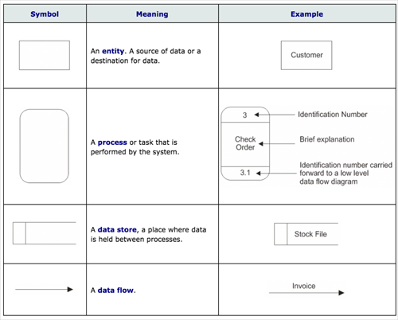

An example of the two diagrams for a lemonade stand might look like:

**Context diagram**  

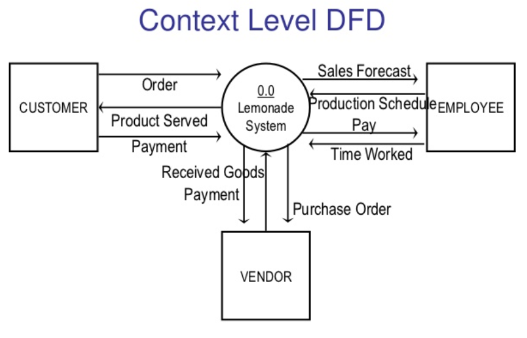

**Level 0 diagram**  

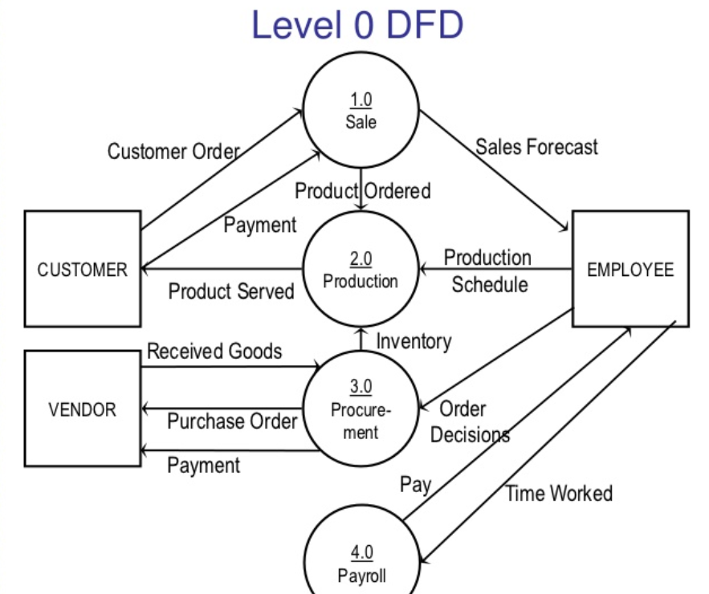

Source: https://www.slideshare.net/mohit4192/dfd-examples

**Rules for DFD**  

| Context diagram | Level 0 diagram |
| --------------- | --------------- |
| Only 1 process (it represents your entire system) | Identifies the key processes within your system (typically 3 to 8) |
| Identifies all external entities your system interacts with | Identifies all external entities your system interacts with |
| Dataflow arrows should identify if the external entity is an input, output or both | Dataflow arrows from entities must go to/from a process. You never want external entities reading/writing direct to your data sources |
| Arrows do not need to be labelled | Data flow arrows should be labelled indicating what data is travelling across that path |
| No data store elements should be identified | Data stores may or may not be required dependent on the project |

Let's look through a few simple examples.

* A food ordering system for a restaurant to manage it's inventory and food re-ordering process.
* An app for a supermarket that allows customers to check promotional sales, search for items, and order through an online shopping cart. Also lists store locations / opening hours etc.
* A system for stock market trader that keeps track of customer accounts, orders placed, transactions, deposits and withdrawals.

**Restaurant food ordering system**  

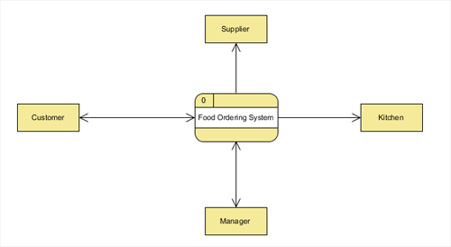

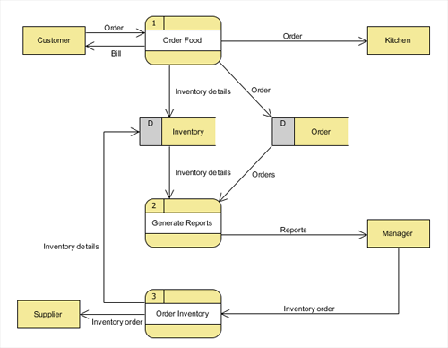

**Supermarket customer app**  

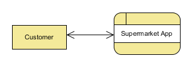

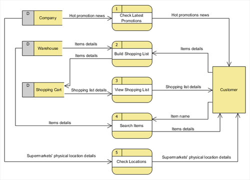

**Stock market trading app**  

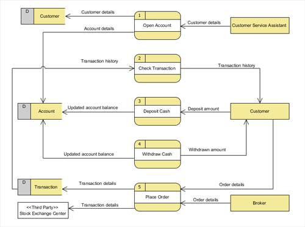

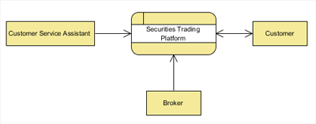

### Exercise

For one of the projects dreamed up in class during phase 1, create the context and level 0 DFD.

For example, here is a level 0 DFD from a student dreamed up "Party Finder" app.

**PartyFinder app**

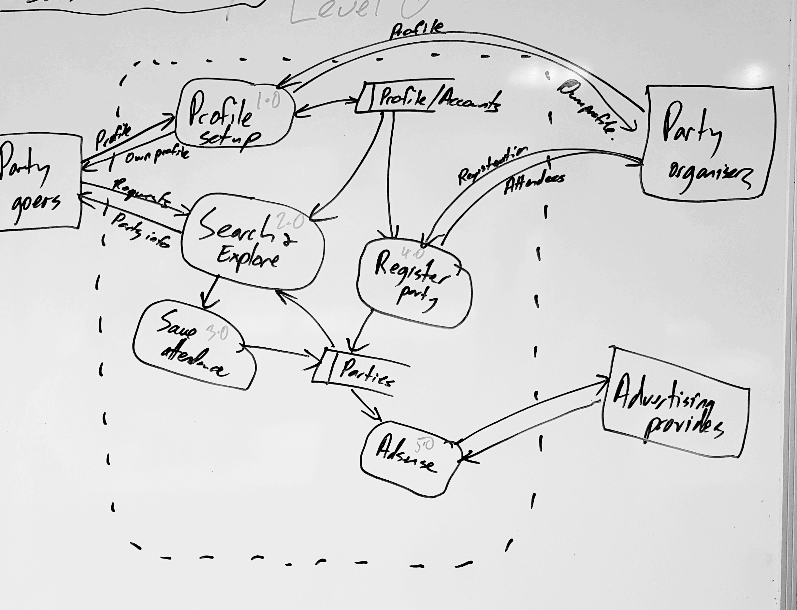

---

### System flow charts

Not to be confused with the logic flow chart.

The main difference between system flowchart and program flowchart is that a system flowchart represents an entire system and the data flows within it, while a program flowchart represents a single program or algorithm.

A system flowchart is a diagram that describes how an entire system operates. It helps to recognize the flow of operations in the system. It also helps in preparing the required documents of the system.

Features:

* Components of system represented by symbols.
* High level picture that includes the physical system
* Discrete components represented with separate symbols

Example:

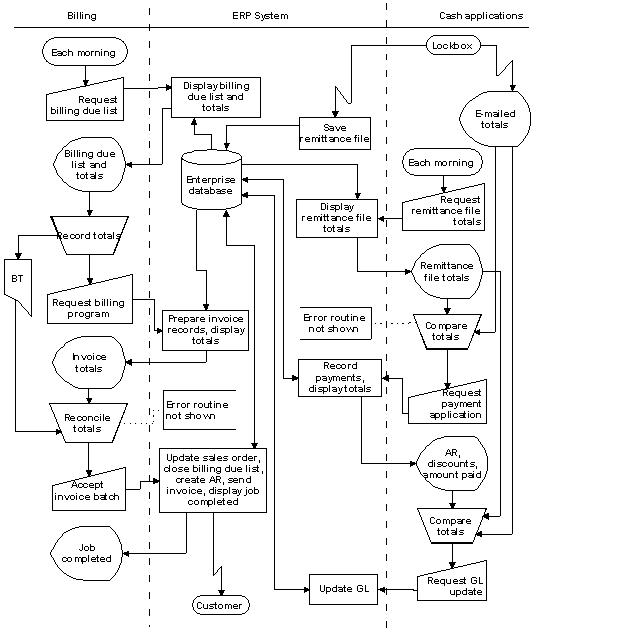

Tips:

* The reality is most documentation online referring to a system flow chart actually discuss it as if it were a logic flow chart, and the difference is really debatable. 
* In an IB exam setting, given the simplicity they have to keep the questions to (with so much to cover in an exam, one element like a system flow chart wouldn't be more than a few marks at most) there is very little difference, and you couldn't go far wrong by drawing a logic flow chart... maybe just make a conscious effort to add to it a couple of bubbles for reading/writing to/from a file, send to a printer, hardware bits etc.

Symbols:

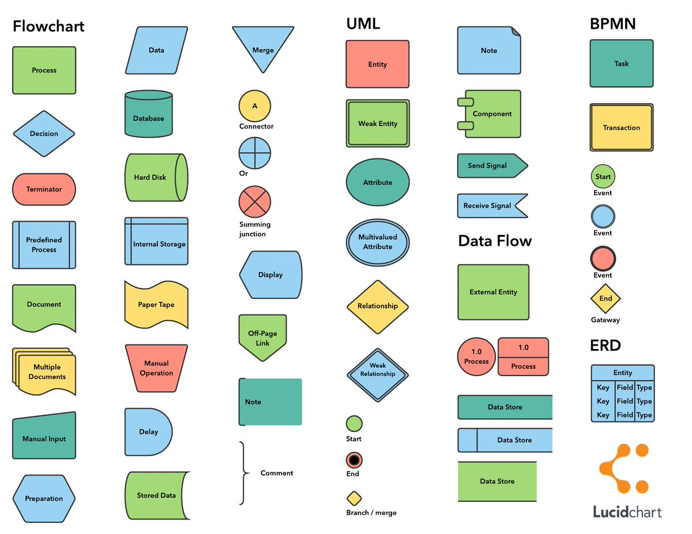

Sources:

* Lithmee 2018: What is the Difference Between System Flowchart and Program Flowchart  
  http://pediaa.com/what-is-the-difference-between-system-flowchart-and-program-flowchart/
* Comp Franklin 2013, System Flow Charts  
  https://www.youtube.com/watch?v=QF-ml1QVQYs (8 min)
* edward (nd), "Stockbridge system flowchart example" (CC BY-SA 3.0) via Commons Wikimedia
* RFF Electronics (nd), What do the different flowchart shapes mean?   
  https://www.rff.com/flowchart_shapes.php
* Lucidchart (2017), Flowchart Symbols & Notation [+ Cheat Sheet]  
  https://twitter.com/lucidchart/status/889621014212227072

---

### Structure charts

Provides a top-down approach to explain how the different parts of the program are put together.

Simplistically:

* Programs are made up of modules
* Modules are made up of subroutines and functions
* Subroutines & functions are made up of algorithms
* Algorithms are made up of lines of code
* Lines of code are made up of statements and data

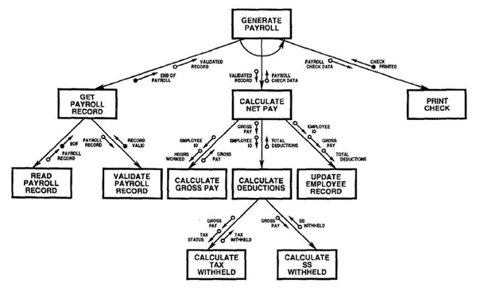

---

### Prototyping

For our purposes we can treat wireframes, mockups and prototypes as generally referring to the same thing (which they do just to different levels of detail). In this sense, we are referring to sketches or diagrams that protray screen shots of your intended product.

Purpose? Demonstrates the proposed system to the client.

Through building multiple prototypes along the way, and iteratively reviewing your planning documents, it is hoped you can avoid this kind of scenario…

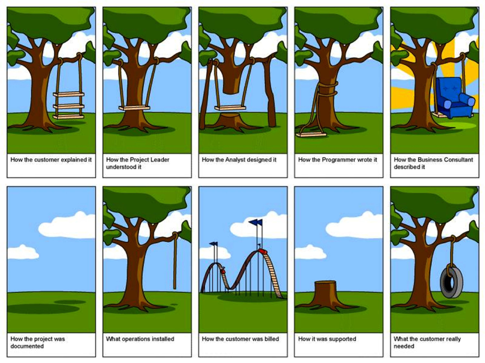

Some cliche prototypes

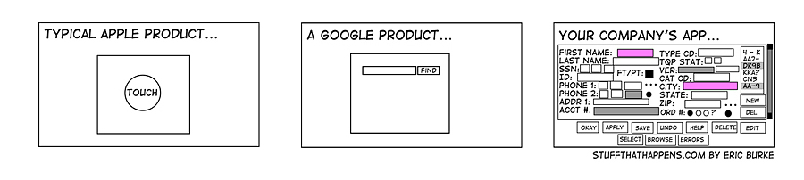

An example set of wireframe diagrams follows. You can see that it would make things very clear to the client what is being proposed!

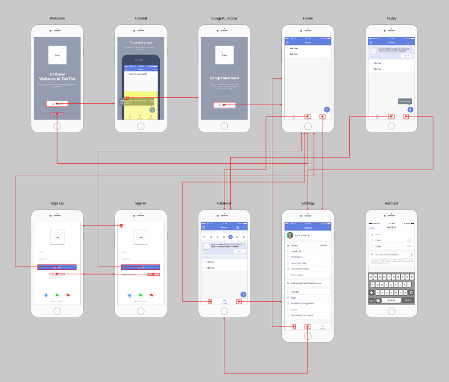

Search for "free wireframe tools" and you will find a bunch of useful tools you can use to help you with this.

Some possiblities:

* [https://mockflow.com/](https://mockflow.com/) (limited free plan)
* [https://moqups.com/](https://moqups.com/) (limited free plan, 1 project (limited to 300 objects) and 5MB of storage)
* [https://www.lucidchart.com/](https://www.lucidchart.com/) (limited free plan available)
* [https://www.adobe.com/products/xd.html](https://www.adobe.com/products/xd.html) (free plan available?)
* [https://balsamiq.com/wireframes/](https://balsamiq.com/wireframes/) (30 day free trial)
* [https://pencil.evolus.vn/](https://pencil.evolus.vn/) (open source - not updated in a while)
* [https://www.uxbox.io/](https://www.uxbox.io/) (open source - still in development)

Source:

* https://www.mockplus.com/blog/post/wireframe-example

Additional recommended reading:

* https://medium.com/@erikdkennedy/7-rules-for-creating-gorgeous-ui-part-1-559d4e805cda

---

### Entity relationship diagrams

(not in IB syllabus unless doing Databases option)

---

### Client sign off

If you expect them to pay your bill, make sure they've agreed to everything... in writing.

You had the signed and agreed scope, now have them agree to the design you've built as the proposed incarnation of that project before you start serious development!

---

## SDLC Phase 3: Implementation (Creation)

Aim of phase 3: Build it compliant to the design

Some issues that need to be considered in this phase:

* Choice of technology stack
* Migration issues
* Deployment issues
* Implementation issues

Implementation issues

---

### Technology stack

Will your software be available for purchase as:

* Perpetual license? (buy once, use forever)
* Rent? (SaaS… software as a service is becoming popular. Eg: Adobe Creative Suite, Microsoft Office 365)

A lot of major products are moving to a SaaS model (eg: Microsoft Office 365, Evernote, Adobe Suite). Sometimes you aren't even installing anything on your computer because you are using the "software" through their web portal. Eg: Google Docs.

Modern tools available give wider options for how your new technology might be implemented. Specifically a huge development that is comparatively recent is the emergence of cloud computing.

Amazon Web Services, Google Cloud, and Microsoft Azure are the three big global players in this space at the moment, though there are others.

What technologies will you use to build your project and why?

Common concerns/questions about using the cloud reside around you lacking ultimate control over where your data resides, who has access to it. Trust in the cloud provider is necessary for this approach to work.

Elements to evaluate if weighing a cloud-based project:

* Security?
* Encryption?
* Privacy laws (restrictions on where your data may be)?
* Backups?
* Cost?
* Reliability?

Degrees of cloud based computing.

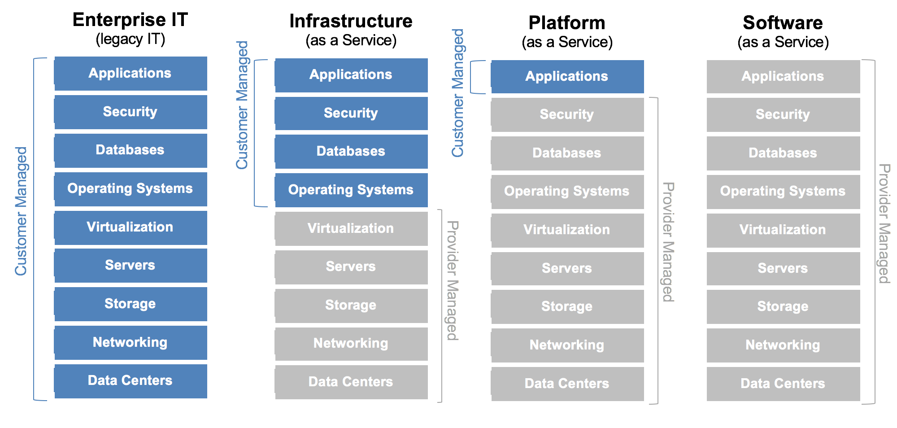

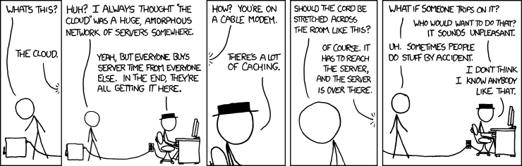

---

### Migration issues

Issues regarding the maintaining compatiblity of your customers data as they migrate to your new system.

* Migrating from legacy systems, or through business mergers etc
* International issues: languages, dates, currency, timezones
* System issues: data types and limits. Example: the Y2K issue and Year 2038 problem
* Converting file formats
* Validating the data you convert from one system to the next (did it all copy across? Accurately?)

---

### Deployment issues

How are you going to deploy your tool?

* App store?
* Website download and install?
* Distribute CD/DVD/USB disks?

How will you manage updates/patches to your tool?

* Online, self downloading and updating (bonus: customer never has to think about it. Downside: think of the fuss over Windows 10 "auto" updating)
* Beware of annoying people by using up their internet quotas, or slowing down their link when they are wanting to do something else.
* How can you charge for an update they get automatically? Subscription model which is the way most major vendors are going (eg: Office 365).
* Download and manually install at the customers leisure.
* Distribute disks??? Really? Still?
* If your product is web based, you simply update YOUR systems, and all the customers get the new experience immediately (whether they want it or not – aka facebook's downfall)

The lesson of Google Chrome in relation to auto-updates done "right". *There are a multitude of reasons why Google Chrome burst onto the browser market to rapidly dominate market share. See Full Circle Design if you are interested in some well articulated reasons. The aspect that is of relevance here is automatic updates. No longer does the user have to be prompted (nagged) to download updates, go through an install screen, possibly reboot their computer etc; Google Chrome keeps itself up to date for you behind the scenes. This meant new features, bug fixes, security patches, are all rolled out automatically.*

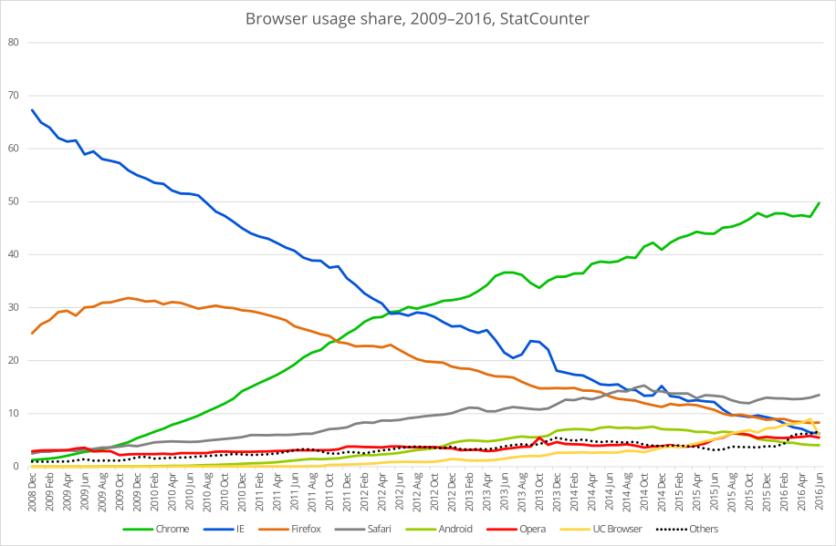

---

### Implementation issues

What implementation / conversion method will you use?

* Parallel running - new system runs simultaneously with the old for a given period of time
* Phased conversion - new system is implemented one stage at a time
* Pilot running - new system is tried out at a test site before launching it company-wide
* Direct change over - entire system is replaced in an instant

What can you see as the plus/minus/interesting of each?

See what you can come up with, then read [this](https://www.igcseict.info/theory/8/implem/)

For more detail including examples, read [changeover techniques @ smallbusiness.chron](https://smallbusiness.chron.com/changeover-techniques-34890.html).

---

## SDLC Phase 4: Testing

Elements to be considered within the testing phase:

* Test
* User documentation
* User training
* Backup regime tested & in place

---

### Testing

Testing strategies

* Debugging
* Beta testing
* User acceptance
* Automated testing

Eg: Seige

---

### User documentation & training

The quality of your user documentation will affect the rate of implementation, or even overall success, of the new system.

What to provide?

* Big fat textbook style "user manuals"? … pretty old school. Some people don't like reading off a screen. Updating the textbook with changes will be difficult though.
* Help files
* Online support (online chat to support, online community forums)
* Videos

What is best for YOUR users in YOUR project? No one-size-fits-all approach

Along with the documents, there might be a need for actual "training" too…

* Self instruction
* Formal classes
* Online course
* 1:1 coaching

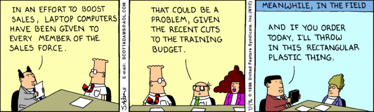

---

### Backup regieme

Data can be lost through a variety of ways. How will your system protect from:

* Malicious activity (crackers, malware, insider espionage)
* Natural disasters (fire, flood)
* Human idiocy (dropping the computer, spilling drink, losing it, leaving laptop in a hot car)
* Time (all disks deteriorate over time)

The amount of effort/expense dedicated to data loss prevention should be judged by the answer to: How would the worst case scenario affect my business?

Eg: hotels/airlines losing all record of reservations? Banks losing record of all account balances? loss of medical records?!

A data loss prevention reigeme should include a mix of: failover systems, redundancy, removable media, offsite/online storage

Strategies:

* Hot spares
* Cold spares
* Backups

3-2-1 rule of backups:

* At least 3 copies
* At least 2 different forms
* At least 1 copy offsite

Other backup related considerations

* Automated vs manual backups
* Full vs differential backups

Does the cloud count as a backup? 

* debatable question? 
* always live and available is a positive and a negative? 
* quick and easy restoration vs vulunerable to ransomeware attacks
* Simply syncing your files somewhere does not help in many scenarios such as:
* Data corruption
* Malicious software
* Deleting files by mistake

---

## SDLC Phase 5: Evolution

So, your project is up and running. What's left to do? A post implementation review!

Gather stakeholder feedback on the whole experience (design, migration, training) not just the functionality of the final product.

What improvements or enhancements do they suggest?

Start the cycle all over again with your identified changes!

---

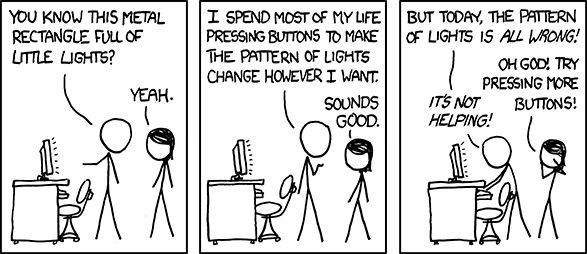
