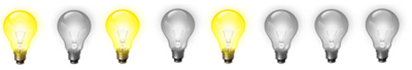
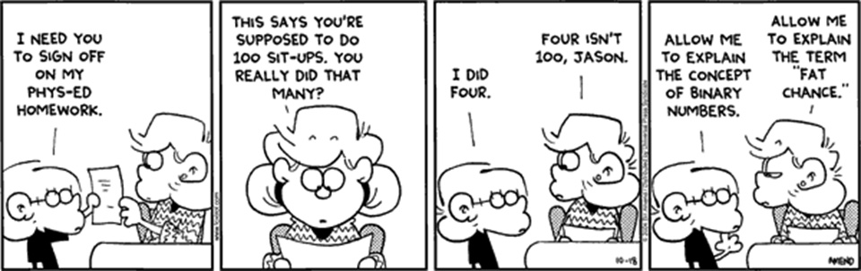
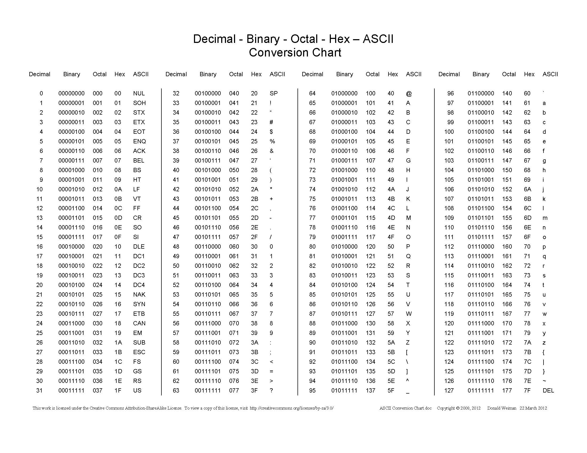
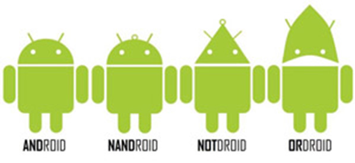
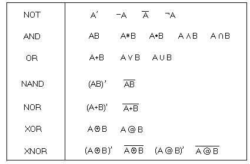
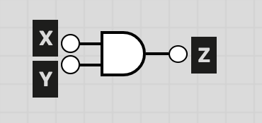
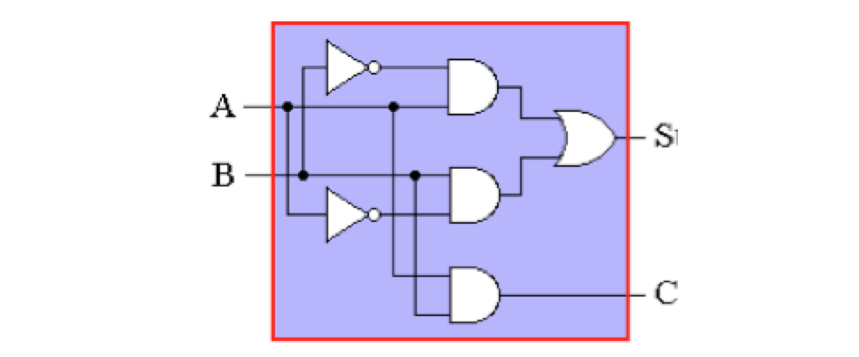
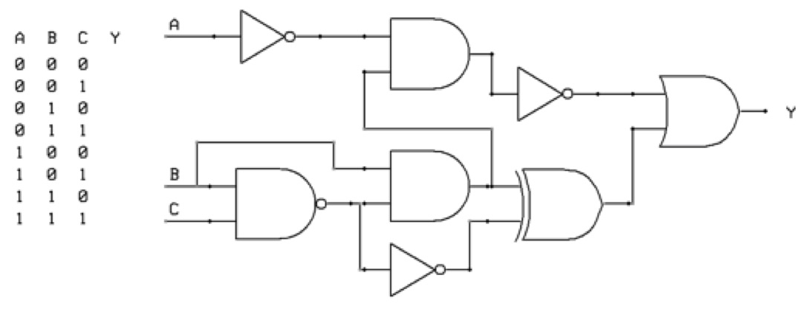
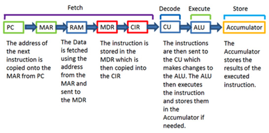
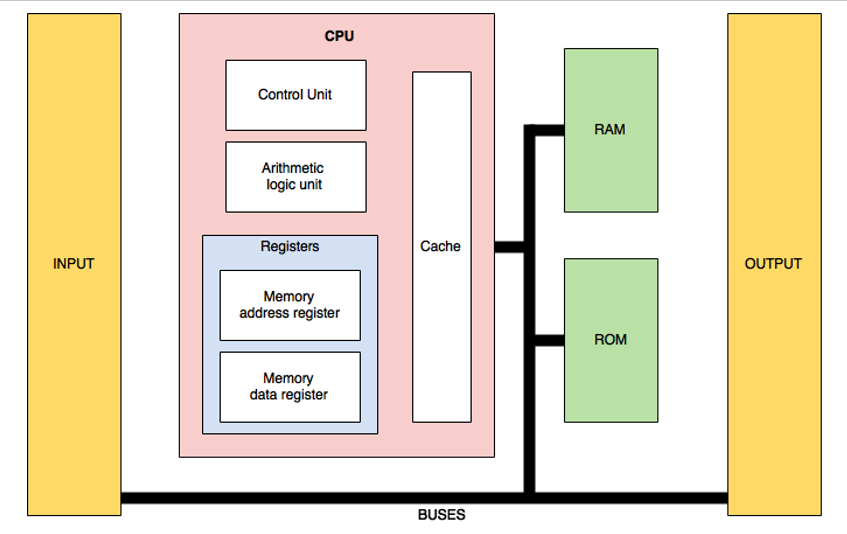

# Unit 2: Computer architecture


## Introduction

What is the simplest form of information you could transmit as a message?

* A word? - A humble 5 letter word has 265 possible combinations. That’s almost 12 million.
* A letter? - 26 possibilities (52 if we distinguish between upper and lower case)
* A numerical digit? - Still 10 possibilities
* A light bulb! - just 2 possible states! on or off.

In Computer Science, this ON or OFF value is known as a bit, and can be thought of the literal presence or absence of an electrical charge within a transistor. 

Our modern computer processors are made of millions of these transistors, each of which is on or off at a given moment in time, and it is on this foundation that our entire world of computing is built upon!

Computers take the simple ON or OFF values of a transistor, and scale them up to create the complexity we know and love.

## The byte

Given each bulb can have two states, “on or off”, or 2 possible combinations, how many total possible combinations are possible with 8 light bulbs?



Given there are 8 bulbs, and 2 possible states of each, this should scale to 8^2 = 256 possibilities.

Rather than lightbulbs, in computer science we use 1 to represent ON, and 0 to represent OFF.

The 0 or 1 is known as a bit.

A cluster of 8 bits is known as one byte with values 0 to 255 (being 256 possible values)

---

### Video: Binary & related number systems

Watch the following video for an introduction to binary and other related number systems.

> Heliosphere (2017): Binary - How to make a computer: Part II  
> https://www.youtube.com/watch?v=NRKORzi5tnM (7m15)

### Practice: Number system conversions

Complete the following table of number conversions

| Bits      | Byte |
| --------- | ---- |
| 0101 0101 |   85 |
| 1010 1010 |      |
| 1100 0011 |      |
| 1111 1111 |      |
| 0010 0011 |      |
|           |  234 |
|           |   97 |
|           |    7 |
|           |  132 |
|           |   16 |



---

## ASCII

As powerful as computers can be using bits and bytes, humans don't intuitively operate on that level, we use characters and words, so there needed to be a way for letters (and thereby words) to be represented somehow within a computer.

To achieve this, an arbitrary table was decided on in the 1960s called the ASCII table. This table still forms the basis of much of today's character representation system. The significance of this table is that a "string of letters" is really just a sequence of binary that, according to this lookup table, can be used to represent alphanumeric text.

| 01001000 | 01100101 | 01101100 | 01101100 | 01101111 |
| -------- | -------- | -------- | -------- | -------- |
|    H	   |    e	  |     l	 |    l	    |      o   |



Sourced from: Weiman, D 2010: ASCII Conversion Chart http://web.alfredstate.edu/faculty/weimandn/miscellaneous/ascii/ascii_index.html

---

### Practice: ASCII conversions

Convert the following ASCII to it's binary representation.

```
01110100 - 01101000 - 01101001 - 01110011
00100000 - 01101001 - 01110011 - 00100000
01110011 - 01101100 - 01101111 - 01110111
00100000 - 01100111 - 01101111 - 01101001
01101110 - 01100111
```

---

## Unicode

ASCII was incredibly useful and opened up a world of computing accessible to a lot of people, but there are still significant limitations. ASCII was built on an 8 bit / 1 byte conversion table. That means there are only 256 possible characters that can be used for conversion. While this is generally fine for Latin based languages such as English, it imposes restrictions on how multilingual computing is capable of being.

The solution to overcome this was the development of the UNICODE standard, which was published in 1991. UNICODE is a 16 bit lookup table (65536 possible values). While this means it takes 2 bytes to store every letter, the cost of data storage has fallen significantly enough that that is not a major problem. The upside is it means all Asian characters etc can now be represented.

To look at the Unicode table for yourself, check out  

* http://unicode-table.com/en/

### Video: Unicode explained

Please watch this excellent introduction into unicode. 

> Computerphile (2013) Characters, Symbols and the Unicode Miracle by Tom Scott  
> https://www.youtube.com/watch?v=MijmeoH9LT4 (9m36)

---

## Number systems

So far we've been talking in binary, which is a base 2 number system (2 possible values per place column). Historically we are also familiar with the decimal number system, or base 10. In Computer Science there are others for you to be familiar with that we will now look at.

* Octal
* Hexadecimal
* Floating point
* 2s complement

### Hexadecimal & Octal

**Octal** 
 
* Octal was briefly mentioned in the previously watched video at https://youtu.be/NRKORzi5tnM
* Octal is a base 8 numbering system. Think of it as the numbering system we would have if humans only had 4 fingers (including the thumb) per hand instead of 5! You can only count from 0 to 7 after which you run out of digits and so need to increment the next column (the "tens" column).
* The least significant column is the 1s, the next column is the number of 8s, and the column after that is the number of 64s (8^2).
* The convenience of Octal is that base 8 makes octal counting equivalent to a 3 digit binary number!

**Hexadecimal**  

* Hexadecimal is a base 16 numbering system. Base 16 means it has 16 numerials for each column.
* The least significant column is the 1s, the next column is the number of 16s, and the column after that is the number of 256s (16^2).
* Hexadecimal is even more convenient than octal because each hexadecimal numerial can represent a 4 digit binary number, resulting in a two digit hexadecimal being able to convey one byte!

---

**Look up table**

| Decimal | Binary | Octal | Hexadecimal |
| -- | ----- | -- | -- |
| 00 | _0000 | 00 | 00 |
| 01 | _0001 | 01 | 01 |
| 02 | _0010 | 02 | 02 |
| 03 | _0011 | 03 | 03 |
| 04 | _0100 | 04 | 04 |
| 05 | _0101 | 05 | 05 |
| 06 | _0110 | 06 | 06 |
| 07 | _0111 | 07 | 07 |
| 08 | _1000 | 10 | 08 |
| 09 | _1001 | 11 | 09 |
| 10 | _1010 | 12 | 0A |
| 11 | _1011 | 13 | 0B |
| 12 | _1100 | 14 | 0C |
| 13 | _1101 | 15 | 0D |
| 14 | _1110 | 16 | 0E |
| 15 | _1111 | 17 | 0F |
| 16 | 10000 | 20 | 10 |
| 17 | 10001 | 21 | 11 |
| 18 | 10010 | 22 | 12 |
| 19 | 10011 | 23 | 13 |
| 20 | 10100 | 24 | 14 |

---

### Floating point

Tom Scott has another excellent introduction to this concept in the following Computerphile video.

> Computerphile (2014) Floating Point Numbers by Tom Scott  
> https://www.youtube.com/watch?v=PZRI1IfStY0 (9m15)

A good written summary can be found here

> floating-point-gui.de (undated): Floating Point Numbers  
> https://floating-point-gui.de/formats/fp/

For our purposes, you don't need to be able to do manual conversions with floating point numbers, you just need to understand the concept, it's limitations and work arounds (as Tom Scott outlines in his video).

---

### Twos complement

In the examples we have been looking at so far, we have used the entire byte to represent a number: 8 bits to represent values 0 to 255. In reality computers need to be able to cater to negative values as well, so the most significant bit is actually reserved to indicate the sign (positive or negative) of the number. This system is known as twos complement, or having a signed integer.  To use the full size of the binary number for a positive only value is known as having an unsigned integer.

How this looks in a conversion table is as follows:

| Binary    | Decimal |
| --------- | ---- |
| 0000 0011 |    3 |
| 0000 0010 |    2 |
| 0000 0001 |    1 |
| 0000 0000 |    0 |
| 1111 1111 |   -1 |
| 1111 1110 |   -2 |
| 1111 1101 |   -3 |
| 1111 1100 |   -4 |

Notice that this will mean the number range is greater for the negatives than the positives. For an 8 bit integer, the decimal values will range from +127 to -128.

Converting negative decimals to twos complement binary (example using -13):

* Obtain the positive value of your decimal number (13)
* Subtract one (12)
* Convert to binary (0000 1100)
* Flip all the bits (1111 0011)

Converting twos complement binary to negative decimal (example using 1110 1110):

* Flip all the bits (0001 0001)
* Convert to decimal (17)
* Add one (18)
* Add the negative sign (-18)

---

**Twos complement arithmetic**

By using twos complement, binary addition and subtraction work quite simply. Some examples:

* Addition of 68 + 12

```
     1 1    (carry over row)
  0100 0100 (68)
+ 0000 1100 (12)
  0101 0000 (80)
```

* Subtraction of 68 - 12, which is really 68 + (-12)

```
  1    1    (carry over row)
  0100 0100 (+68)
+ 1111 0100 (-12)
  0011 1000 (+56)
```

* Subtraction of 12 - 68, which is really 12 + (-68)

```
   111 1    (carry over row)
  0000 1100 (+12)
+ 1011 1100 (-68)
  1100 1000 (-56)
```

---

### Practice

Assume you are using twos complement binary numbers.

| Binary    | Octal     | Hex       | Decimal   | Ascii     |
| --------- | --------- | --------- | --------- | --------- |
| 0011 0101 |           |           |           |           |
| 1011 1001 |           |           |           |           |
|           |           | 4f        |           |           |
|           |           | b7        |           |           |
|           | 76        |           |           |           |
|           | 51        |           |           |           |
|           |           |           | -99       |           |
|           |           |           | 120       |           |
|           |           |           |           | space     |
|           |           |           |           | Q         |


Looking for more practice? This website has a number of online quizzes for you to convert between number systems and practice your binary arithmetic.

* http://www.free-test-online.com/binary/binary_numbers.htm


---

## Interesting binary uses

**Colours**

If you’ve used Photoshop, you have probably seen colours expressed as #FF0000. You should now be able to recognise this type of number as hexadecimal.

What is the value of the number? Colours in the computer are actually split into RGB – Red, Green Blue. One unsigned byte (256 values) for each.

So, #FF0000 is actually:

* FF for Red, 00 for Green, 00 for Blue, or, ...
* 1111 1111 for Red, 0000 0000 for Green, 0000 0000 for Blue

Note: 256^3 = 16’777’216 colour combinations

**Time**

Computers store time internally as the number of seconds that have lapsed from an arbitrarily agreed epoch (zero-point) of midnight, 1st January 1970 UTC.

32 bit computers take their name by the fact their internal calculations are performed using an integer size of 32 bits. A signed 32bit integer has a range of −2,147,483,648 to 2,147,483,647.

That means that a little after 2 billion seconds have lapsed from the start of the 1970s, a 32 bit computer would be unable to accurately store an integer that represented the time! In fact, it would clock over from being 1970 plus 2 billion seconds to becoming 1970 minus 2 billion seconds!  When do we reach this limit? 03:14:07 UTC on 19 January 2038!

The subsequent second, any computer still running a 32 bit signed system will clock over to 13 December 1901, 20:45:52.

While your personal computer may be a 64 bit system, so you think you are safe, there are a lot of systems still around that we all rely on that have 32 bit internals. This is particularly true of embedded systems in transportation infrastructure, electrical grid control, pumps for water and sewer systems, internal chips on cars and other machinary, even a lot of Android mobile phones (though admittedly the changes of one of them still being in use in 20 years is unlikely!). If you research into the "2038 problem" you'll discover just how many critical systems are still vunerable.

---

## Logic gates & circuits

So we've seen that binary can be used to store numbers, text, and colour codes, what we can use binary for much more than storing values; binary also forms the basis of all the logic functionality that occurs within computers.

We do this through what are commonly known as logic gates. All gates can be simplified down into the three of AND, OR and NOT but there are six gates we will learn to love in this course:

* AND
* OR
* NOT
* NAND
* NOR
* XOR

The following video provides a great introduction into how you can easily create your own logic gates and how they work.

> Heliosphere (2016) Relays and Logic Gates - How to Make a Computer: Part I
> https://www.youtube.com/watch?v=fB85NrUBBhQ


To help you try to remember what the various symbols look like, it might be helpful to remember the ANDroid way (cheesy I know)...



### Order of precedence

Be aware that like PEMDAS in mathematics, an order of precedence exists for equations involving gates. The order of precedence is:

* NOT
* AND (NAND)
* OR (NOR, XOR)

### Boolean notation

Logic equations can either use the written name of the relevant logic gates, or they could be expressed using boolean notation as per the following table. Unfortunately there are several different notations that you may come across.



---

### Conversions required

There are three different ways of representing logic circuits that you need to be able to convert between for this course.

* Logic diagram <--> logic equation <--> truth table

For example, an AND gate could be represented four different ways:

* Logic equation using boolean notation: XY = Z

* Logic equation using gate names: X AND Y = Z

* Truth table:

| X | Y | Z |
| - | - | - |
| 0 | 0 | 0 |
| 0 | 1 | 0 |
| 1 | 0 | 0 |
| 1 | 1 | 1 |

* Logic diagram:



---

### Practice

Question 1.

| A | B | C | X |
| - | - | - | - |
| 0 | 0 | 0 | 0 |
| 0 | 0 | 1 | 0 |
| 0 | 1 | 0 | 1 |
| 0 | 1 | 1 | 1 |
| 1 | 0 | 0 | 1 |
| 1 | 0 | 1 | 1 |
| 1 | 1 | 0 | 1 |
| 1 | 1 | 1 | 1 |

Question 2.  

| A | B | C | X |
| - | - | - | - |
| 0 | 0 | 0 | 0 |
| 0 | 0 | 1 | 1 |
| 0 | 1 | 0 | 0 |
| 0 | 1 | 1 | 1 |
| 1 | 0 | 0 | 0 |
| 1 | 0 | 1 | 1 |
| 1 | 1 | 0 | 1 |
| 1 | 1 | 1 | 1 |

---

Question 3.  


Question 4.  



---

Question 5.  

| A | B | C | X |
| - | - | - | - |
| 0 | 0 | 0 | 0 |
| 0 | 0 | 1 | 1 |
| 0 | 1 | 0 | 1 |
| 0 | 1 | 1 | 1 |
| 1 | 0 | 0 | 0 |
| 1 | 0 | 1 | 1 |
| 1 | 1 | 0 | 0 |
| 1 | 1 | 1 | 1 |

Question 6.  



---

Question 7.  

| A | B | C | X |
| - | - | - | - |
| 0 | 0 | 0 | 0 |
| 0 | 0 | 1 | 0 |
| 0 | 1 | 0 | 0 |
| 0 | 1 | 1 | 1 |
| 1 | 0 | 0 | 1 |
| 1 | 0 | 1 | 0 |
| 1 | 1 | 0 | 0 |
| 1 | 1 | 1 | 1 |

Question 8.  

X = not A and B or A and not B

Question 9.  

X = (A | B) & (not C | B)

---

## The CPU

### Origins

Modern CPU’s are just taking the idea of logic circuits made from transistors and scaling up!

> Real Engineering (2016) Transistors - The Invention That Changed The World  
> https://www.youtube.com/watch?v=OwS9aTE2Go4 (8m11)

As this video demonstrates it is perfectly possible to build a modern computer from normal transistors for those so inclined...

> Computerphile (2017): MegaProcessor  
> https://www.youtube.com/watch?v=lNa9bQRPMB8

### Function

The functions it can perform are not complicated, it’s power comes from it’s speed. They are just created through millions/billions of logic gates working together.

What is the speed of a typical CPU today? What does that speed “mean”?

A CPU can add, subtract, multiply, divide, load from memory, save to memory. From those simple building blocks we get the computers we have today. 

---

### Video explainations

It's hard to actually find explainations what happens inside a CPU pitched to the correct level for this course. These videos are the best I've found to date but they still introduce a level of complexity beyond what you need for the course.

To save class time, I recommend watching these videos outside of class, taking notes on them as you do. We will then discuss in class and address questions that arise.

> CrashCourse (2017): How Computers Calculate - the ALU: Crash Course Computer Science #5  
> https://www.youtube.com/watch?v=1I5ZMmrOfnA (11m09)
> 
> CrashCourse (2017): Registers and RAM: Crash Course Computer Science #6  
> https://www.youtube.com/watch?v=fpnE6UAfbtU  (12m17)
>
> CrashCourse (2017): The Central Processing Unit (CPU): Crash Course Computer Science #7  
> https://www.youtube.com/watch?v=FZGugFqdr60 (11m37)

Another possible alternative explaination is through the following video that also uses an imagined CPU called the Scott CPU to attempt to simplify things.

> In One Lesson (2013): How a CPU Works
> https://www.youtube.com/watch?v=cNN_tTXABUA (20m41)

The key things for you to appreciate is the CPU cycle and the interaction of the key components within and beyond the CPU.

---

### Fetch-decode-execute cycle



Watch [Tom Scott's exellcent explainer into the Fetch-decode-execute cycle](https://www.youtube.com/watch?v=Z5JC9Ve1sfI) (9:03m).

* Fetch - Each instruction is stored in memory and has its own address. The processor takes this address number from the program counter, which is responsible for tracking which instructions the CPU should execute next.
* Decode - All programs to be executed are translated to into Assembly instructions. Assembly code must be decoded into binary instructions, which are understandable to your CPU. This step is called decoding.
* Execute - While executing instructions the CPU can do one of three things: Do calculations with its ALU, move data from one memory location to another, or jump to a different address.
* Store - The CPU must give feedback after executing an instruction and the output data is written to the memory.

From: https://turbofuture.com/computers/What-are-the-basic-functions-of-a-CPU

---

Diagramatically we could create a simple representation of the internals of a CPU and it's connections as follows (this is the level of complexity for the course)



Terminology:

* CU - Control Unit - controls the operations of the processor.
* ALU - Arithmetic logic unit - Performs arithmetic operations
* Register – A small memory location to temporarily hold information as part of the operations process. 
  * MAR - Memory Address Register - the address in RAM that the data is to be stored in, or fetched from.
  * MDR - Memory Data Register - data to be stored, or has just been fetched, from memory.
* Cache – Fast (small) memory that reduces time to access items from memory. Keeps the most frequently used items.
* Input – Keyboard, mouse, scanner, mic etc
* Output – Monitor, printer, speakers etc
* Primary Memory
  * RAM – “Working memory” the documents you are currently working on
  * ROM – “Startup program” to boot the computer. cf. BIOS/CMOS
* Secondary Memory
  * HDD, CD/DVD, USB – Non-volatile bulk storage. Needed to store data between execution / power on
* Bus – transfers data from one part of the computer to another

---

## Memory

We have looked at a lot of different types of memory. Let's briefly compare each type to make some generalisations about their different properties.

| Memory type | Speed | Capacity | Cost | Storage duration |
| ----------- | ----- | -------- | ----- | --------------- |
| CPU register | Very fast | Very small (a few bytes) | Very expensive (built into the CPU) | For immediate use |
| Cache | Very fast | Small (a few MB) | Very expensive | Immediate use |
| RAM   | Fast      | Large-ish (8 GB) | About USD 1c/MB | Short term (seconds to minutes) |
| SSD | Moderate | Large 100s of GB | About USD 0.2c/MB | Long term, non-volatile |
| HDD | Slow | Large TBs | Cheap! About USD 0.005c/MB | Long term, non-volatile |
| Tape | Excruciatingly slow | Many TBs or Petabytes | Extremely cheap! | Several years |

* What is the difference between volatile and non-volatile memory?

---

## Operating systems

We continue our abstraction journey upward. We started with the humble electron, called it a bit, scaled up into bytes, started grouping bits together to build logic circuits, grouped bits together into bytes, and then started performing operations on them with ALUs inside CPUs and storing the results in memory. Finally we move into looking at the software that manages all this hardware for us, the operating system.

Operating System (OS) can be defined as a set of programs that manage computer hardware resources and provide common services for application software. The operating system acts as an interface between the hardware and the programs requesting I/O.

That said, we will be looking at operating systems in more depth in unit 6.

For now, there is just one question: What are main functions of an operating system?

* To manage hardware resources, and
* To provide services to the applications

What are the hardware resources that require managing? What are some of the services an OS provides to applications? Rather than repeating myself, see my notes in unit 6 for this as it is all addressed there.

---

## Application software

Finally, after we have an operating system to manage the hardware, we get to finally run our application software to "do stuff"!

What are some of the common application uses available with computing? Some common categories include:

* Word processors
* Spread sheets
* Database management systems
* Email
* Web browsers
* Computer aided design (CAD)
* Graphic processing
* Video & audio editing

Names of a few of the main ones for each category? A key differentiator between each?

What are some of the more common features across most applications?

* Toolbars, menus, dialogue box, graphical user interface (GUI)

Which features are provided by the OS, and which by the application?

## Review questions

Computer Science Illuminated by Nell Dale & John Lewis (page numbers based on 6th edition):

* Binary number systems and conversions: End of chapter 1 (page 50), all exercises
* Logic gates & circuits: End of chapter 4 (page 116), up to exercise 62 (you can also exclude the ones about transistors)
* CPU architecutre: End of chapter 5 (page 149), exercise 24, 26, 27, 28, 34, 37-44, 54


