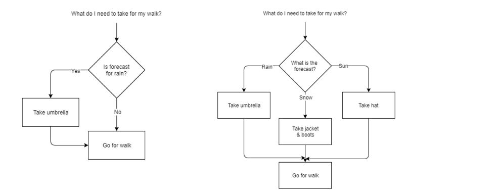
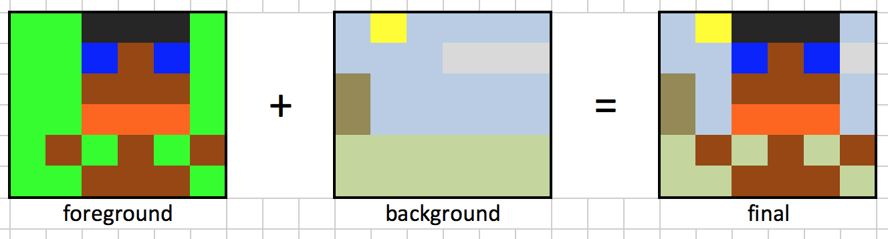
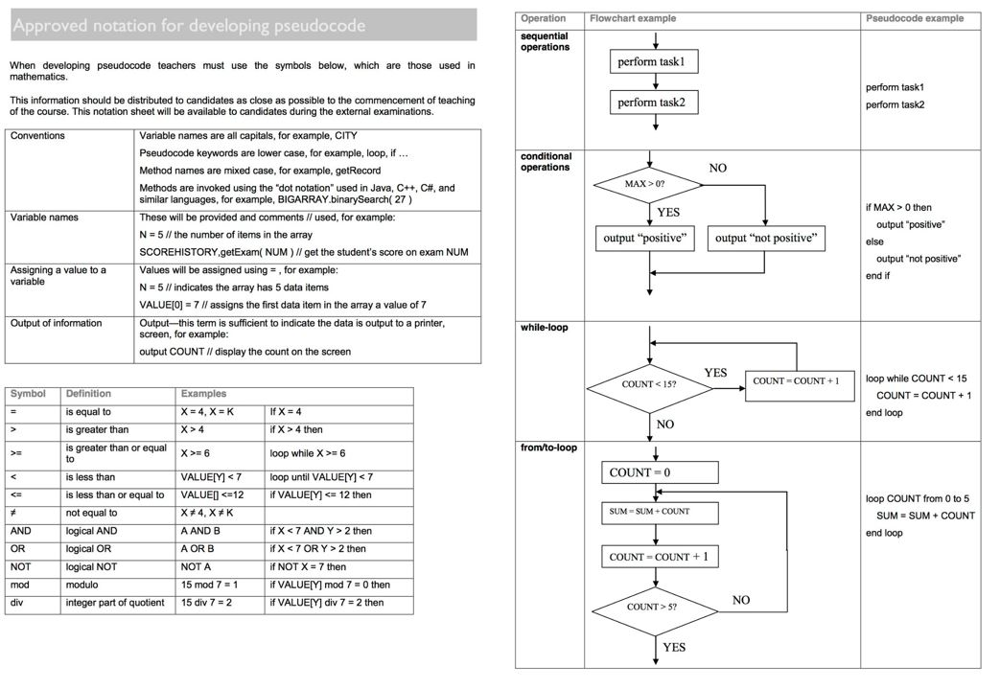
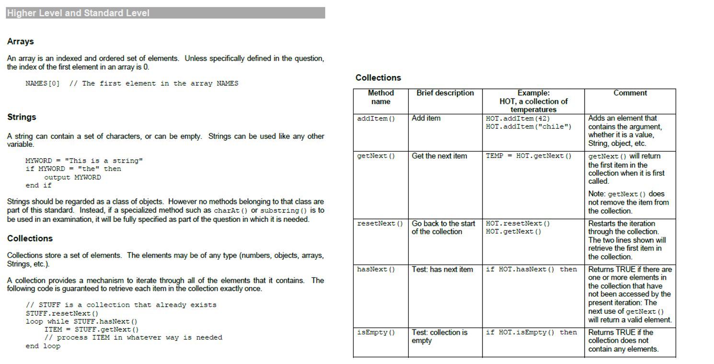
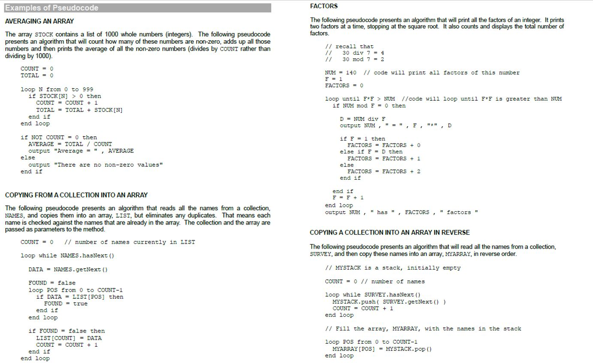
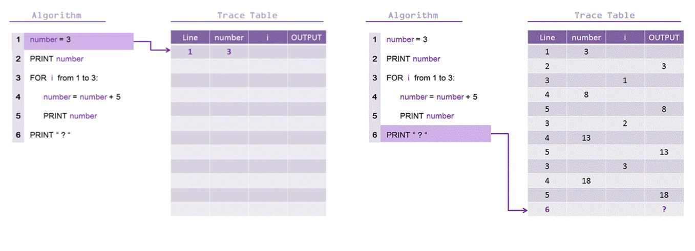
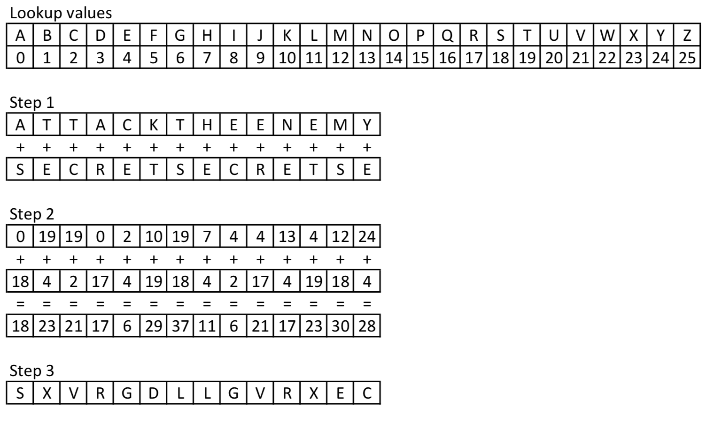

# Unit 4: Computational thinking, problem solving and programming

# Unit 4.1: Computational thinking

Jeanette Wing (Vice President of Microsoft Research, and previously President’s Processor of Computer Science at Carnegie Mellon University, Pittsburgh) wrote a short but highly influential paper outlining the importance of computational thinking. That paper forms the basis of this unit within the IB course.

You should read it... [https://www.cs.cmu.edu/~15110-s13/Wing06-ct.pdf](https://www.cs.cmu.edu/~15110-s13/Wing06-ct.pdf )

There are competing thoughts as to how best categorize computational thinking processes. The IB uses these six:

* Thinking procedurally
* Thinking logically
* Thinking ahead
* Thinking concurrently
* Thinking abstractly
* Thinking recursively (HL)

Others, such as Google and Code.org use the following alternative labels:

* Decompose – Break a big problem into it’s constituent parts.
* Patterns – Identify what pieces have in common, and what remains distinct
* Abstraction – Create an abstraction around the patterns
* Algorithms – Write an algorithm so that resolves are easy to achieve.

They all achieve the same point – a set of thinking skills that guides you through solving a problem.

## Thinking procedurally

* Turning the solution to your problem into a set of steps that can be followed.
* Following those steps should reproduce the correct solution each time.
* Each step may call upon a sub-procedure with its own list of steps.
* Divide and conquer – take the one overwhelming whole and break it down into manageable pieces. 
* Sequencing (ordering) of steps is usually an important consideration.

Example: Cleaning the entire house/apartment, against cleaning the kitchen, bathroom, living room, bedrooms

* Tackle it one task at a time, and eventually the whole will be done.
* Each task identified can also be broken down into sub-tasks. Using the cleaning analogy, this could be vacuum, dust, sweep, put rubbish in the bin, pick clothes up from the floor.
* One important consideration is the order of tasks. Look back at that list of cleaning tasks - is that the order that will achieve the cleanest bedroom? What should the order be?

Finally, Look for familiar things. Do not reinvent the wheel. If a solution exists, use it. If you have solved the same or a similar problem before, just repeat the successful solution. We usually do not consciously think, "I have seen this before, and I know what to do" - we just do it. Humans are good at recognizing similar situations. We do not have to learn how to go to the store and buy milk, then to buy eggs, then to buy candy. We know that going to the store is always the same and only what we buy is different.

## Thinking logically

Thinking logically is all about making decisions, and formalising the conditions that will affect those decisions. There are generally three steps:

* Identify when decision making is required.
* Identify what is the decision that needs to be made.
* Identify the conditions which will form the basis of each decision.

Decisions may be multi faceted. Compare these two:



The question we ask ourselves in the "if" statement is known as the condition. We can use "boolean logic" to create multiple conditions for a single "if". Both of these do the same thing:

```
if (time is 6:00am) and (day is weekday) then
    wake up for school
end if
```

```
if (time is 6:00am) and ((day is Monday) or (day is Tuesday) or 
    (day is Wednesday) or (day is Thursday) or (day is Friday)) then
    wake up for school
end if
```

Logical decisions can also be applied to things of a repetitive nature

```
while (hungry) then  
    raid pantry 
    eat 
end 
```

```
for (each episode of Game Of Thrones) 
    watch the episode 
end 
```

### Activity: Logical thinking with a flow chart

On 1st June 2009, Air France flight 447 left Rio de Janeiro heading to Paris.  It was a routine international flight.  In the early hours of the morning, over the Atlantic Ocean, contact was lost, and the aeroplane vanished.

On investigation, the plane showed signs of a high-speed impact with water as the nose cone was flattened.  This ruled out a bomb or structural break-up.  It was determined that the plane crashed into the water due to pilot error.

The plane flew through a thunderstorm.  Other aeroplanes had diverted that night, as is standard practice in bad weather.  The pitot tubes (speed sensors) had frozen over as a result.  This caused the autopilot to switch off and incorrect readings to be sent to the cockpit.  This is expected behaviour, and pilots are trained to recognise this.  Believing that the plane was losing altitude, the pilot pulled back on the stick to raise the nose, in an attempt to gain height.  The instruments continued to show the plane falling.  If an aircraft’s nose is pointed up too far, it loses speed, causing the engines to stall.  The correct action is to point the nose down, gaining speed, before levelling off.

With the aid of a flowchart, show how logical thinking could have avoided this accident.

### Activity: Film canister sort

You will be divided into groups. Each group will receive 8 film canisters and a balance scale. Your task is to sort the canisters from lightest to heaviest.

Use your procedural and logical thinking skills to devise the most efficient instructions for sorting the canisters. Count the number of "comparisons" your procedure makes. The winning team are the ones with the least comparisons (most efficient algorithm)

## Thinking ahead

Thinking ahead is all about pre-planning and attempting to anticipate future needs.

What are the pre-conditions to solving the problem?

* What has to be in place, or known, in order to be able to solve the problem? ie: what are the inputs going to be? Prepare sample testing data to test the algorithm with

What are the post-conditions of the problem?

* What will be in place, or known, after the problem has been correctly solved? ie: what are the outputs going to be?

Anticipate exceptions to the rule

* What are the likely exceptions we are going to need to deal with? How do we want to handle them?
* Test anticipated exceptions to verify your responses work as intended.

Examples of thinking ahead in daily life:

* Pre-ordering.
* Shopping lists. You know you want to bake a cake, so you make sure you have all the necessary ingredients ahead of time.
* Pre-heating an oven. You know you're going to need it in a few minutes, start getting it warm now.
* Grabbing books/files from your locker and putting them into your bag for the lessons until the next break.
* Gantt charts.
* The cache on a computer is an example of thinking ahead.

### Activity: Die Hard movie challenge

Can you solve the puzzle in Die Hard?

* Introducing the problem (play up to 1:05)
* Solution (play from 1:05)

[https://www.youtube.com/watch?v=6cAbgAaEOVE](https://www.youtube.com/watch?v=6cAbgAaEOVE)

### Activity: Egg drop

You are given two eggs, and access to a 100-storey building. Both eggs are identical. The aim is to find out the highest floor from which an egg will not break when dropped out of a window from that floor. If an egg is dropped and does not break, it is undamaged and can be dropped again. However, once an egg is broken, that’s it for that egg.

If an egg breaks when dropped from floor n, then it would also have broken from any floor above that. If an egg survives a fall, then it will survive any fall shorter than that.

The question is: What strategy should you adopt to minimize the number egg drops it takes to find the solution?. (And what is the worst case for the number of drops it will take?)

** Hint **

Whilst it’s not strictly part of the puzzle, let’s first imagine what we’d do if we had only one egg.

Once this egg is broken, that’s it, no more egg. So, we really have no other choice but to start at floor 1. If it survives, great, we go up to floor 2 and try again, then floor 3 … all the way up the building; one floor at a time. Eventually the egg will break* and we’ll have a solution. For example, if it breaks on floor 57, we know that the highest floor that an egg can withstand a drop from is floor 56.

There’s no other one egg solution. If we’d been feeling lucky we could have gone up the floors in two’s but imagine if the egg broke on floor 16; we have no way of knowing if it would have also broken on floor 15!

** Hint part 2 **

At the other extreme, what if we had an infinite number of eggs? (Or at least as many eggs as we need). What would our strategy be here? In this case we’d use one of a programmer’s favorite tools, the binary tree.

First we’d go to floor 50 and drop an egg. It either breaks, or it does not. The outcome of this drop instantly cuts our problem in half. If it breaks, we know the solution lives in the bottom half of the building (floor 1 – floor 49). If it survives, we know the solution is in the top half of the building (floor 51 – 100). On each drop, we keep dividing the problem in half and half again until we get to our solution.

The mathematicians in the audience will quickly see that the number of drops required for this solution is log2 n, where n is the number of floors of the building. (This is like asking how many powers of two there are). ie: log2 100 = 6.644, or 7.

** Hint part 3 **

It does not take much imagination to see why a binary search solution will not work (optimally) for two eggs. Let’s imagine we did try a binary search and dropped our first egg from floor 50. If it broke, we’d be instantly reduced to a one egg problem.

What happens if we started off with our first egg going up by floors ten at a time? We can start dropping our egg from floor 10; if it survives we try floor 20, then floor 30 … we carry on until the first egg breaks. Once we’ve broken our first egg we know that the solution must lay somewhere in the nine floors just below, so we back off nine floors and step through these floors one at a time until we find a solution.

The question really comes down to: what is the optimal number of floors to skip with the first egg?

** Hint part 4 **

What we need is a solution that minimizes our maximum regret. We need is a strategy that tries to make solutions to all possible answers the same depth (same number of drops). The way to reduce the worst case is to attempt to make all cases take the same number of drops.

### Activity: Ball bearings

You have 10 boxes of ball bearings (each ball weighing exactly 10 gm) with one box with defective ball bearings (each one of the defects weigh 9 gm). You are given an electronic weighing machine and only one chance at it. How will find out which box has the defective ball bearings?

## Thinking concurrently

Concurrency = dealing with multiple things happening at the same time.

Tasks are broken down into subtasks that are then assigned to separate processors to perform simultaneously, instead of sequentially as they would have to be carried out by a single processor. (Oracle)

A non-computing example is the GANTT chart where multiple processes occur simultaneously. For example project managing the construction of a new house.

GPU’s are a popular and powerful way to do multithreaded programming on computers.

Syllabus note: Students will not be expected to construct an algorithm related to concurrent processing (but you may be expected to be able to interpret/understand/recognise one presented to you)

### Activity: Multi theaded sorting

How long (comparisons) does it take to sort a deck of cards with:

* 1 thread (1 person)
* 2 threads (2 people)
* 4 threads (4 people)?

## Thinking abstractly

Being able to create a meaningful model, or way to represent, a real world “thing” in a way that contains everything that is relevant, and nothing that isn’t.

Video: [Robotics Academy (2016) Abstraction - Computational Thinking](https://www.youtube.com/watch?v=jV-7Hy-PF2Q) (2:28)

Real world examples:

* Maps – An abstraction contain pertinent information about a physical place. Different maps contain different information dependent on their purpose.
* Daily planners – An abstraction to represent hours, days, weeks and months in a simple manner that allows us to stay organised.
* Schools – People are abstracted into groups such as teachers, students, year 1, year 2, etc

When you take a real-world situation and are writing a program or algorithm for it, you are creating an abstraction: a way to represent that situation within the computer. As such you will make decisions about how that abstraction should be created such as what variables you need, what you will call them, what data type they will be, and how your algorithm will behave in response.

To succeed at thinking abstractly, you need to be able to take a problem and identify the parts that are relevant to your solution.

### Exercises

**Jake & Jill's weekly food shop**

Jake and Jill are quite fed up of how long they spend in the supermarket each week doing their weekly food shop. They decide what they want when they are actually walking around the supermarket and they often have to go back multiple times in the week as they run out of items. This method of shopping is also resulting in a very expensive total weekly shopping bill!

How could they use the principles of computational thinking to make their weekly shopping experience as efficient as possible.  There overall aims are to:

* Spend as little time as possible in the supermarket each week
* Save as much money as possible

**Taxi driver**

A taxi driver uses his experience, a GPS navigation system and radio tuned to traffic information to work out how to get passengers from A to B.

In what ways is the taxi driver able to:

* Think abstractly
* Think ahead
* Think logically

---

# Unit 4.2: Program design

Program design is all about **solving problems**.

If you can’t solve and articulate the problem by hand, you will not be able to solve it with code!

## Introducing the 7 step process

Duke University have identified a 7 step process to learning problem solving with programming which we will work through.

1. Work example by hand
2. Write down what you did
3. Find patterns
4. Check by hand & buddy check
5. Translate to code
6. Run test cases
7. Debug any failed test cases

(from Duke University (2018), "Programming Foundations with JavaScript, HTML and CSS: A seven step approach to solving programming problems" available [online](https://www.coursera.org/lecture/duke-programming-web/a-seven-step-approach-to-solving-programming-problems-AEy5M))

## Practice the 7 step process

Exercise 1: The green screen problem



What would be the instructions (recipe) to perform a simple version of the green screen problem?

Exercise 2:

* I have pre-printed a number of different algorithm problems for you to solve.
* I will distribute the problems so that no-one sitting next to each other is working on the same problem. 
* Do not show your neighbour your problem - you are to use your neighbour as your buddy check in step 4 so they can’t know in advance what your procedure is supposed to achieve. 
* For today: We'll stop after you achieve success at step 4 (ie: clear written instructions correctly interpreted by another)

## Documenting program design

There are three key strategies this course would like you to be familiar with for articulating and testing algorithms. They are:

* Pseudo code
* Flow charts
* Trace tables

## Pseudo code

There are a lot of different computer programming languages available, each serving different needs. Algorithms, however, are universal. A programmer who uses one language, should be able to communicate how to create an algorithm to another programmer who uses a completely different language without knowing anything about it!

For that reason, most of the time an algorithm is being written it won't be in a language-specific format, but one of two generic forms: flow charts or pseudo-code.

**What is pseudo code?**

Notation that is intended to be **language-neutral**, so a programmer can understand what is required regardless of the languages they know.

Oxford dictionaries define "pseudo" as being *Not genuine; spurious or sham.*. In that way, pseudo-code is not a genuine programming language; It is a documentation tool. With that in mind there is no 100% "correct" or "incorrect" way of writing it. If you search "how to write pseudo code", you will find a variety of different answers and syntax articulated. Don't stress too much about memorising a "correct" way of writing it. If what you write achieves the purpose of **providing a language neutral way of documenting an algorithm so a programmer can understand it regardless of the languages they know**, then you have written good pseudo code.

**IB expectations**

You need to be able to create as well as interpret/analyse pseudo code.

>Where answers are to be written in pseudocode, the examiners will be looking for clear algorithmic thinking to be demonstrated. In examinations, this type of question will be written in the approved notation, so a familiarity with it is expected. It is accepted that under exam conditions candidates may, in their solutions, use pseudocode similar to a programming language with which they are familiar. This is acceptable. The markscheme will be written using the approved notation. Provided the examiners can see the logic in the candidate’s response, regardless of language, it will be credited. No marks will be withheld for syntax errors ... for answers to be written in pseudo code

**IB syntax**

Given the statements made above about there not being a "correct" way to write it, there is a set syntax that the IB will use when they write pseudo code questions for you in the exam. As per the expectations comments above, you are not obligied to follow their syntax in your responses, and you will not lose credit for doing so, but you should be familiar enough with their syntax to be able to properly interpret the questions they give you.

*These methods, in their pseudocode format, may be used without explanation or clarification in examination questions. Teachers should ensure that candidates will be able to interpret these methods when presented as part of an examination question.*

The following comes from the IB documents

* "Approved notation for developing pseudocode" available at [https://pbaumgarten.com/ib-compsci/ib-compsci-pseudocode-flowcharts.pdf](https://pbaumgarten.com/ib-compsci/ib-compsci-pseudocode-flowcharts.pdf)
* "Pseudocode in Examinations" available at [https://pbaumgarten.com/ib-compsci/ib-compsci-pseudocode-in-detail.pdf](https://pbaumgarten.com/ib-compsci/ib-compsci-pseudocode-in-detail.pdf)






## Flow charts

IB exams will not require you to create your own flow charts but they will present flow charts to you for analysis and interpretation.

Check the previous pages for the "official" IB method of presenting flow chart questions to you.


## Trace tables

A trace table is a technique used to test algorithms, in order to make sure that no logical errors occur whilst the algorithm is being processed. The table usually takes the form of a multi-column, multi-row table; With each column showing a variable, and each row showing each number input into the algorithm and the subsequent values of the variables (Wikipedia: Trace table).

Trace tables are a useful way of checking the algorithm is going to behave the way you want it to. You should have columns for all variables, and for all comparison checks.

You are expected to be able to analyse and create trace tables for different algorithms. You could, for instance, be asked to:

* Create a trace table to identify the error within a given algorithm.
* Determine the number of times a step in a given algorithm will be performed for given input data
* Suggest changes in an algorithm that would improve efficiency, for example, using a flag to stop a search immediately when an item is found
* Justify an algorithms efficiency, correctness, reliability or flexibility



---

## Excercises for pseudo code

**Question 1**

Write pseudo code that will sum all the even numbers input from a user. Stop after 10 numbers have been input.

**Question 2**

Write pseudo code that reads in any three numbers and outputs them into sorted order.

**Question 3**

Write pseudo code that will perform the following:

* Read in 5 separate numbers.
* Calculate the average of the five numbers.
* Find the smallest (minimum) and largest (maximum) of the five entered numbers.
* Output the results found from steps 2 and 3.

**Question 4**

Write pseudo code that will calculate a running sum. A user will enter numbers that will be added to the sum and when a negative number is encountered, stop adding numbers and write out the final result.

**Question 5: Cricket scores**

SCORES is a collection that stores the runs scored by a cricketer in each match he played. 

In your answer, make use of the collections functions of isEmpty(), hasNext(), getNext(), resetNext() and addItem()

Write pseudocode for the following: 

1. Count and display the number of matches the player has played.
2. Calculate and display the average runs scored by the player.
3. Get a number S as input and check if it is present in the collection SCORES. Display appropriate message.
4. Count and display the number of times the player scored above 99.
5. Add the following scores to STORES – 145, 78, 26, 89

(sourced from Rajesh Kumar via IB teacher forums)

**Question 6: Rainfall**

The rainfall of each day during a monsoon period is stored in a collection RAINFALL. Write pseudocode for the following:

1. Get a value D as input. Search for D in RAINFALL and display an appropriate message “Found” or “Not found”.
2. To store the data in RAINFALL, into an array RAIN. (Assume that the array RAIN has enough locations to store data and the collection RAINFALL is non-empty)
3. To get a number R as input and count the array RAIN for number of days the rainfall was above or equal to R. Display the count.
4. Sort the array RAIN in descending order, using either Bubble or Selection sort technique.
5. To get two numbers MIN and MAX as inputs. Check the Collection RAINFALL and store all the values between MIN and MAX (both inclusive) into a linked list LINKRAIN.
6. To calculate and display the average of the list LINKRAIN.

(sourced from Rajesh Kumar via IB teacher forums)

**Question 7: Hailstone problem**

The Hailstone Series is generated using the following high level algorithm: 

* Pick a positive number ( 0 or greater ) 
* If it is odd, triple the number and add one. 
* If it is even, divide the number by two. 
* Go back to step 2. 

This series will eventually reach the repeating ”ground” state: 4, 2, 1, 4, 2, 1 

Here is the sequence generated for an initial value of 26: 

* 26, 13, 40, 20, 10, 5, 16, 8, 4, 2, 1, 4, 2, 1

Task 1: Convert the high-level algorithm into pseudo-code subject to the following:

* At the end, display how many items are in the sequence
* At the end, display what is the largest number computed in the sequence
* You can assume the ”ground” state commences when the integer 4 is computed. At this stage you can terminate computation of the series. 
* If 0 is input as the positive number your algorithm should terminate without calculating the series. 

Task 2: Produce a trace table for your Hailstone Series algorithm, given an input of 17.

**Question 8: Fizz buzz**

This is a "famous" programming job interview question.

* Write a program that prints the numbers from 1 to 100. 
* For multiples of three print "Fizz" instead of the number
* For the multiples of five print "Buzz". 
* For numbers which are multiples of both three and five print "FizzBuzz"

Example output: 1, 2, Fizz, 4, Buzz, Fizz, 7, 8, Fizz, Buzz, 11, Fizz, ...

Task: Create the pseudo code for a Fizz Buzz generater, and use a trace table to for values up to 15.

**Question 9: Secret number guesser**

Create pseudo code for an algorithm where the computer picks a "secret" number at random from 1 to 100. The user is then repeatedly prompted to guess the number, the computer responds with "too low", "too high", or "correct!". The computer should also keep count of the number of guesses and let the user know how many guesses it required at the end.

Swap with your neighbour to test each others algorithms with trace tables. Have they documented it correctly?

Assume availability of a random number generator function to complete this exercise. The function can be Math.random( maximum ) where a number will be generated between 0 and the maximum.

Task:

 * Create the pseudo code for the algorithm
 * Use a trace table to test your algorithm picking a "random number" of 37, and "input" guesses of 50, 25, 40, 35, 37.

**Question 10: An IB question**

The following exercise comes from the May 2015 IB exam. 

Trace the following algorithmic fragment for N = 6. 

Show all working in a trace table. 

```
SUM = 0
loop COUNT from 1 to (N div 2)
    if N mod COUNT = 0 then
        SUM = SUM + COUNT
    end if
end loop
if SUM = N then
    output "perfect"
else
    output "not perfect"
end if
```

**More questions**

The following past paper questions include those that require use arrays and collections. Make sure you are confident with those for your exams.

* [Pseudocode past paper questions for practice](teacher/pseudocode-past-questions.pdf)

---

## The standard algorithms

There are a number of algorithms the IB course will assume you know by memory. These are the "standard algorithms".

* Sequential search
* Binary search
* Bubble sort
* Selection sort

Any algorithm not defined as a "standard algorithm" can be considered a "novel algorithm" and will be either presented to you in the exam or is an algorithm you would be expected to devise.

---

### Sequential search

Search through a set of data sequentially until you find the item you are looking for.

```
function sequential( haystack, needle ) {
    for (var i=0; i<haystack.length; i++) {
        if (needle == haystack[i]) {
            return(i);
        }
    }
    return(-1);
}
```

One interesting thing to note with the sequential search is it does not require your data to be sorted ahead of the search. This could save a lot of processing time. If, however, your data is already sorted, you can include within your sequential search a test to see if we have already gone past the point at which the record we are looking for would exist. In that case, we can abort the remainder of the search and return a "not found" result.

---

### Binary search

A binary search divides a range of values into halves, and continues to narrow down the field of search until the unknown value is found. It is the classic example of a "divide and conquer" algorithm. Your data must be pre-sorted!

```
function binary( haystack, needle ) {
    var max = haystack.length;
    var min = 0;
    while (max >= min) {
        var mid = Math.floor((min+max)/2);
        if (haystack[mid] == needle) {
            return mid;
        }
        if (haystack[mid] > needle) {
            max = mid - 1;
        }
        if (haystack[mid] < needle) {
            min = mid + 1;
        }
    }
    return (-1);
}
```

Note: This is known as an iterative binary search. There is also a recursive binary search which we will look at in a later unit. Just be aware if you have to google binary search that there are two types.

### Search algorithm exercises

**Question 1: Tracing binary search**

Create a trace table on the binary search algorithm above with the following values:

* haystack = [ 1, 2, 3, 5, 7, 11, 13, 17, 19, 23, 29, 31, 37 ]
* 1st needle = 15
* 2nd needle = 5

Compare that on a trace table for a sequential search algorithm.

It should be fairly simple to code an implementation of this to test your algorithms - have a go.

**Question 2: Simple spell checker**

If user inputs a sentence, separate the individual words, strip out any punctuation, check each word against your dictionary list. Print each word out with PASS or FAIL against it based on if it was found in your dictionary.

Use the 7 step process to devise an algorithm for this and have a go at implementing it if you wish. Will you use the sequential or binary search? Why?

* You will need a "word list" to use as your dictionary. There are lots of good word lists available online. This is one I've used before but feel free to find your own. https://github.com/dolph/dictionary/blob/master/popular.txt

### Bubble sort

Bubble sort: The highest value "bubbles" to the top each round.

```
function bubbleSort( data ) {
    var done = false;
    while (!done) {
        done = true;
        for (var i=1; i<data.length; i++) {
            if (data[i] < data[i-1]) {
                done = false;
                var temp = data[i-1];
                data[i-1] = data[i];
                data[i] = temp;
            }
        }
    }
    return(data);
}
```

### Selection sort

The selection sort is just as inefficient as the bubble search, so why bother learning both? The big advantage for the selection sort is it optimised for when writing data is very expensive (slow) when compared to reading, eg. writing to flash memory or EEPROM. No other sorting algorithm has less data movement!  This is important to realise as you can be asked questions justifying the use of one algorithm over another.

```
function selectionSort( data ) {
    for (var i=0; i<data.length; i++) {
        var indexOfLowest = i;
        for (var j=i; j<data.length; j++) {
            if (data[j] < data[indexOfLowest]) {
                indexOfLowest = j;
            }
        }
        var temp = data[i];
        data[i] = data[indexOfLowest];
        data[indexOfLowest] = temp;
    }
    return(data);
}
```

To see an animation of either sort in action look at https://visualgo.net/bn/sorting 

---

### Sort algorithm exercises

**Question 1**

Go to https://www.random.org/integer-sets/ and produce 1 set of 50 random integers. Be sure to turn off the tick box that sorts the results for you, you want unsorted data.

Implement both sorting algorithms to process your data set. Create two programs that will load the array, sort it, and then output the list of names to the screen. Your two programs is to create one version that implements a bubble sort, and one version that implements a selection sort.

**Question 2**

Once you are successfully sorting numbers, how about sorting strings such as a list of names?

**Question 3**

Sort a set of dates given in dd/mm/yyyy format into their correct calendar order so the date which occurs first, appears first in the list.

---

## Algorithm efficiency and Big-O

From the IB CS syllabus:

> Students should understand and explain the difference in efficiency between a single loop, nested loops, a loop that ends when a condition is met or questions of similar complexity.
> Students should also be able to suggest changes in an algorithm that would improve efficiency, for example, using a flag to stop a search immediately when an item is found, rather than continuing the search through the entire list.
> Examination questions will involve specific algorithms (in pseudocode/flowcharts), and students may be expected to give an actual number (or range of numbers) of iterations that a step will execute.

As you can see from the above, it is important to understand the efficiency of different algorithms. One measure used in industry is called Big O notation.

Big-O describes the relationship of how the run time will scale with respect to certain input variables.

Some common examples of Big-O expressions:

* `O(1)` - constant
* `O(log(n))` - logarithmic
* `O(n)` - linear
* `O(n^2)` - quadratic
* `O(n^c)` - polynomial
* `O(c^n)` - exponential

If the run time will increase linearly with respect to the size of the input data, this would be O(n). An example is to loop through the values of an array.

If the run time will increase exponentially with respect to the size of the input data, this would be O(n^2). An example is to have a loop instead a loop, where both iterate through the values of an array.

A good introduction to Big O notation can be found with the following video: 

* [HackerRank (2016), Big O notation](https://www.youtube.com/watch?v=v4cd1O4zkGw)

There were four important rules from the video:

1. If you have two important steps in your algorithm, you add those steps.

```
function something() {
    doTask1()       // O(a)
    doTask2()       // O(b)
}
// Overall result = O(a+b)
```

2. Drop constants.

```
function something() {
    for each item in array:     // O(n)
        min = MIN(item, min)
    for each item in array:     // O(n)
        max = MAX(item, max)
}
// The overall run time will still increase linearly, so it is O(n) not O(2n).
```

3. Different inputs usually use different variables to represent them in the O() relationship.

```
function something() {
    for each item in A:
       total = total + item
    for each item in B:
       total = total + item
    return total
}
// The overall runtime would be O(a*b)
```

4. Drop non-dominant terms.

For example, if an algorithm as a nested for-loop which would be O(n^2) and a regular for-loop O(n), it is not O(n + n^2) because the O(n) is going to be completely dominated by the O(n^2) to such a degree that it is meaningless to worry about.

Here is also a great analogy from the comments section of that video: Let's say you're making dinner for your family. O is the process of following a recipe, and n is the number of times you follow a recipe.

* O(1) - you make one dish that everyone eats whether they like it or not. You follow one recipe from top to bottom, then serve (1 recipe). <-- How I grew up
* O(n) - you make individual dishes for each person. You follow a recipe from top to bottom for each person in your family (recipe times the number of people in your family).
* O(n^2) - you make individual dishes redundantly for every person. You follow all recipes for each person in your family (recipe times the number of people squared).
* O(log n) - you break people into groups according to what they want and make larger portions. You make one dish for each group (recipe times request)

For a graphical comparison that illustrates the difference in processing load of different O() algorithms, check the [bigocheatsheet.com](http://bigocheatsheet.com/) website.

## Practice: Determine the Big O

**Question 1**

```
boolean containsValue(int[] list, int val) {
   for (int item : list) {
      if item==val {
         return true;
      }
   }
   return false;
}
```

**Question 2**

```
Boolean containsDuplicates(int[] a, int[] b) {
   for (int x : a) {
      for (int y : b) {
         if (x==y) { return true; }
      }
   }
   return false;
}
```

**Question 3**

```
int fibonacci(int n) {
   if (n <= 1) { return n; }
   int fib = 1;
   int prev = 1;
   for (int i=2; i<n; i++) {
      int temp = fib;
      fib += prev;
      prev = temp}
   return fib
}
```

**Question 4**

```
boolean isFirstElementZero(int[] a) {
   if (a[0] == 0) {
      return true;
   } else {
      return false;
   }
}
```

**Question 5**

Which is algorithmically more efficient? 

You are maintaining a customer contact details database for a sales business, currently with 1+ million records. On any given day, several hundred customers will notify a change of address for the database. Additionally, on any given day, the support staff will receive several thousand calls through the switchboard, where they will have to look up the customer data.

Should your program...?

* Save new changes as they occur, and have the support desk app sequentially search through the records OR 
* Bubble sort after every save, and have the support desk app binary search through the records.

Justify your choice with reference to the O(n) of each method. [5 marks]

**Question 6**

A supermarket inventory system needs to be updated to keep an accurate record of the various stock on hand. The supermarket carries a range of about 10 000 different items on its shelves. The hard disk of the computer used is efficient at performing data lookups, but takes about 100 times longer to write to disk than a lookup.

With approximately 1000 transactions per day, would it be more efficient to:

 * Selection sort the data after each individual sale? or
 * Bubble sort the data after closing each day?

---

# Unit 4.3: Programming

The following assumes you have already been introduced to a programming language. It only outlines the theory content associated with unit 4.3 not the introduction to a programming language.

## Nature of programming languages

As we saw in unit 2, the CPU uses the fetch-decode-execute-store cycle.

Software programs are sets of instructions. For a CPU to execute these instructions, each one must first be translated into machine code – simple binary codes that activate parts of the CPU.

The CPU only performs a few basic functions:

* performing mathematical operations like addition and subtraction
* moving data from one memory location to another
* making decisions and jumps to a new set of instructions based on those decisions

A piece of software, such as a game or web browser, combines these functions to perform more complex tasks. These are known as compound operations.

## Low level v higher level languages

A computer program is a list of instructions that enable a computer to perform a specific task.

Computer programs can be written in high and low level languages, depending on the task and the hardware being used.

When we think about computer programmers, we are probably thinking about people who write in high-level languages.

**High Level Languages**  

High level languages are written in a form that is close to our human language, enabling to programmer to just focus on the problem being solved.

No particular knowledge of the hardware is needed as high level languages create programs that are portable and not tied to a particular computer or microchip.

These programmer friendly languages are called ‘high level’ as they are far removed from the machine code instructions understood by the computer.

Examples include: C++, Java, Pascal, Python, Visual Basic.

Advantages

* Easier to modify as it uses English like statements
* Easier/faster to write code as it uses English like statements
* Easier to debug during development due to English like statements
* Portable code – not designed to run on just one type of machine

**Low Level Languages**  

Low level languages are used to write programs that relate to the specific architecture and hardware of a particular type of computer.

They are closer to the native language of a computer (binary), making them harder for programmers to understand.

Low level lanuages include Assembly Language and Machine Code.

Assembly Language

* Few programmers write programs in low level assembly language, but it is still used for developing code for specialist hardware, such as device drivers.
* It is easy distinguishable from a high level language as it contains few recognisable human words but plenty of mnemonic code.

Typical assembly language opcodes include: add, subtract, load, compare, branch, store

Advantages

* Can make use of special hardware or special machine-dependent instructions (e.g. on the specific chip)
* Translated program requires less memory
* Write code that can be executed faster
* Total control over the code
* Can work directly on memory locations

Machine Code

* Programmers rarely write in machine code (binary) as it is difficult to understand.

## Interpretation v compilation

**Compiler**  

A compiler translates a human-readable program directly into an executable, machine-readable form before the program can run.

**Interpreter**  

An interpreter translates a human-readable program into an executable, machine-readable form, instruction by instruction. It then executes each translated instruction before moving on to the next one. A program is translated every time it is run. Python is an example of an interpreted language.

## Core constructs in modern programming languages

Regardless of the programming language you learn, there are core constructs that are generally available in all major, modern programming langauges. Be sure you are aware of the terminology involved.

* Variables & constants
* Types - integers, floating point numbers, characters, strings, booleans
* Operators - add, subtract, multiply, divide, modulus, concatenate etc
* Loops - for, while, repeat until
* Branching - if, if else, else
* Collections - saving and retrieving multiple items to one variable identifier
* Arrays/lists - a subtype of collection
* Sub routines, functions
* Error or exception handling

---

# Debugging programs

We're going to do sone programming practice shortly, so, before we do let's review some useful strategies to debug our programs. 

1. Print things a lot
2. Start with code that already works
3. Run your code every time you make a small change
4. Read the error message
5. Google the error message
6. Guess and Check
7. Comment-out code
8. If you’re not sure where the problem is, do a binary search
9. Take a break and walk away from the keyboard
10. How to ask for help

    Before asking anyone about a bug in your code, it’s important that you make sure you have all of the following components of an excellent question:

    1. Explain what you’re trying to do
    2. Show the code that’s giving the error
    3. Show the entire stack trace including the error message
    4. Explain 2-3 things that you’ve tried already and why they didn’t work
    
Source: [hartleybrody (2016)](https://www.reddit.com/r/learnprogramming/comments/5ebip6/ive_been_teaching_an_online_coding_class_and_have/)

---

# Programming problems to practice

The following problems are intended for you to practice all you have learnt so far. Use the 7 step method with pseudo code and trace tables and then program functional solutions to these problems. Use the debugging strategies to help you when you get stuck.

## Caesars cipher

Julius Caesar created one of the first own encryption algorithms. It used a substitution method where each letter was replaced by another a fixed number of letters across from the original.

For example: with a cipher key of 1, each letter shifts up one position as shown:

> `plaintext:     defend the east wall of the castle`
> `ciphertext:    efgfoe uif fbtu xbmm pg uif dbtumf`

Create pseudo code that replicates the Caesar Cipher algorithm. Swap and test your neighbours algorithm with a trace table.

Only once your trace table verifies your algorithm (and you have shown it to me), may you proceed with attempting it in code.

## Vigenère cipher

Earlier, we designed and coded a Caesar cipher. Unfortunately they’re very easy to crack. How about trying a Vigenère cipher or a Rail fence cipher?

For a full explination of the Vigenère, try this:
> https://pages.mtu.edu/~shene/NSF-4/Tutorial/VIG/Vig-Base.html

While the normal way of learning the Vigenère relies on a 26x26 lookup table, it actually isn't necessary. The trick to the Vigenère over the Ceasar is that you use a word as your cipher key instead of a single value letter or number. You iterate through the value positions of each letter of your key word, and then resetting to the start again when you need more values.  The following illustration shows how to encode the message "ATTACK THE ENEMY" using the cipher key of "SECRET". 



See how you go at building a Vigenère encoder and decoder.

## Rail fence cipher

To quote from the wikipedia article on the Rail Fence cipher:

In the rail fence cipher, the plain text is written downwards and diagonally on successive "rails" of an imaginary fence, then moving up when the bottom rail is reached. When the top rail is reached, the message is written downwards again until the whole plaintext is written out. The message is then read off in rows. For example, if 3 "rails" and the message 'WE ARE DISCOVERED. FLEE AT ONCE' is used, the cipherer writes out:

```
W . . . E . . . C . . . R . . . L . . . T . . . E
. E . R . D . S . O . E . E . F . E . A . O . C .
. . A . . . I . . . V . . . D . . . E . . . N . .
```

Then reads off to get the ciphertext:

```
WECRLTEERDSOEEFEAOCAIVDEN
```

Note that this particular example does NOT use spaces separating the words. The decipherer will need to add them based on context. If spaces are shown in the ciphertext, then they must be included in the count of letters to determine the width of the solution grid.

Keys can also be used in this cipher eg In this example shown above have Key=3 which means there is three rails, or three lines of text.

More info: [https://en.wikipedia.org/wiki/Rail_fence_cipher](https://en.wikipedia.org/wiki/Rail_fence_cipher)

## Closest pair problem

The closest pair problem is a "classic" algorithm for beginning coders. (The closest pair of points problem or closest pair problem is a problem of computational geometry: given n points in metric space, find a pair of points with the smallest distance between them). It has real life significance in many applications. Consider: where are the closest shops? where is the closest hospital?

Your task:

* Derive an algorithm based on the Haversine formula (use your 7 step process). 
* Use the your algorithm to find the distance from our classroom to each city. 
* Generate a list in sorted order of every location, from closest to most distant.

Assumptions provided:

* The radius of the earth is 6373 km.
* The coordinates of my classroom @ ISL are: `{"lat": 46.542816, "lng":6.637191}`

Location data: Use any of the following...

* [City information dataset 1](https://github.com/paulbaumgarten/data-sets) - 660 records (good starting point)
* [City information dataset 2](https://github.com/bahar/WorldCityLocations) - ~10 thousand records
* [City information dataset 3](https://github.com/lutangar/cities.json) - ~4 million records!

You will likely need to check the documentation for the math functionality you will require for your programming language:

* [Javascript Math library reference](https://developer.mozilla.org/en-US/docs/Web/JavaScript/Reference/Global_Objects/Math)
* [Python Math library reference](https://docs.python.org/3/library/math.html)
* [Java Math library reference](https://docs.oracle.com/javase/8/docs/api/java/lang/Math.html)

The haversine formula determines the great-circle distance between two points on a sphere given their longitudes and latitudes.

It holds that where:

* `d` -  the distance between the two points (along the surface of the sphere),
* `r` -  the radius of the sphere,
* `φ1` - latitude of point 1 
* `φ2` - latitude of point 2,
* `λ1` - longitude of point 1,
* `λ2` - longitude of point 2.

then d =


## Further problems

Programming practice?

* [CodingBat for Javascript](https://codingjs.pbaumgarten.com/) (great for beginner programmers)
* [CodingBat for Java](https://codingbat.com/java) (great for beginner programmers)
* [CodingBat for Python](https://codingbat.com/python) (great for beginner programmers)
* [Practice python](http://www.practicepython.org/) (while aimed at Python users, the exercises are generic enough that they are suitable regardless of the language you want to practice)
* [Project Euler practice problems](https://projecteuler.net/archives) (more challenging)

---

# Unit review

Computer Science Illuminated by Nell Dale & John Lewis (page numbers based on 6th edition):

* Problem solving strategies: End of chapter 4 (page 240), exercises 1-15
* Programming concepts: End of chapter 4 (page 240), exercises 16-33 (exlcude recursion questions)
* Algorithm design: End of chapter 4 (page 240), exercises 40-62


