# Unit 5: Abstract data structures (HL) with Unit D4: Advanced OOP (HL)

As there is considerable overlap between Unit 5 and Unit D4, it makes more practical sense to teach the two units together.  In actual fact, both can also be subdivided into two subparts that also work well together, firstly recursion, and secondly abstract data structures themselves, so I have actually organised these two units into those two sub-parts. I have indicated the syllabus alignment for each part.

# Preamble: Programming conventions

Before we proceed any further, as our programs are now becoming more complex, it is time to address the issue of programming conventions. *(D.4.15)*

Meaningful identifiers, proper indentation and adequate comments all improve the readability of code and thus save money, time and effort in programming teams. Some general conventions that need to be observed in order to improve readability are

* Coding should follow tabbed indentations in blocks between braces.
* Commenting should be clear, consistent, and regular.
* Names for variables methods and classes should be meaningful.

When naming your identifiers, Java conventions are as follows

* Class name: Start with uppercase and be a noun. Animal, Genus etc.
* Method name: Start with uppercase letter eg. addToList, initialiseStack etc.
* Variable name: Start with lowercase letter eg. firstName, orderNumber etc.
* Package name: Lowercase letters data structures, GUIs etc.
* Constants name: Uppercase letter. RED, MAX_PRIORITY

Please follow these conventions! Not only will it make life a lot easier for you to maintain your own code, but it will make it a lot easier on anyone marking your code too!

---

# Part 1: Recursion

> To understand recursion,one must first understand recursion.

Definition:

* Recursion defines the solution to a problem in terms of itself.

We use it to create looping behaviour without actually using a loop construct in our code. 

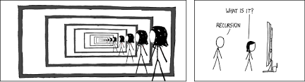

Any recursive algorithm could be solved iteratively, and vice-versa. Here is a simple algorithm shown with both it's iterative and recursive versions.

```text
// Iteration
function goHome()
    while (I am not home) then
        face the direction of home
        take one step
    end while
end function

// Recursion
function goHome()
    if (I am not home) then
        face the direction of home
        take one step
        goHome()
    end if
end function
```

## Requirements for recursion

Every recursive algorithm has

* A **base case**: a point at which the recursion will stop because the most basic end point has been reached, so a simple answer can be given.
* A **test** (an "if"): to determine if we have reached the base case. If we don't have a test, our recursive loop could go for infinity.

In a recursive algorithm, the computer "remembers" every previous state of the problem. This information is "held" by the computer on the "activation stack" (i.e., inside each function's memory workspace). Every function has its own workspace for every call of the function.

Recursive functionality really suits some problems – makes it a lot simpler / more elegant than the iterative equivalent. However, stack space is limited and the computer will only be able to recurse so many times before it runs out of memory.

1. Identify the base case – and write the procedure for it
2. Identify the recurring case – and write the procedure for it
3. Identify the test for determining whether the present case is base or recurring
4. Code it
5. Trace test
6. Test on a small scale
7. Test on a larger scale

## Recursive situations

Here are a few of the more commonly known recursive situations.

### Factorial number sequence

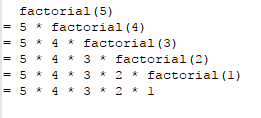

* What is the base case?
* What is the test?
* What is the recursive call?
* How would we trace this algorithm?

### Fractal tree


The recursive steps for a fractal tree could be described as

* Draw the trunk
* At the end of the trunk, split by some angle and draw two branches
* Repeat at the end of each branch until a sufficient level of branching is reached

Without worrying about the programming, focusing just on the pseudo code logic, how would you create a fractal drawing algorithm? Manually test it for for depths 1, 2 and 3.

Image credit: https://rosettacode.org/mw/images/8/8a/MathFractalTree.png

### Snowflake

The humble snowflake, is very similar to fractals and is recursive in nature.

Here is a Python implementation of a snowflake drawing algorithm

```python
from turtle import *

def drawFlake(length, depth):
    hideturtle()
    if depth > 0:
        for i in range(6):
            forward(length)
            drawFlake(length // 3, depth - 1)
            backward(length)
            left(60)

if __name__ == "__main__":
    drawFlake(200,4)
```

See the live demo at https://repl.it/@PaulBaumgarten/SnowflakeRecursion

### Others

What other other real-world recursive situations can you identifty?

## Construct & trace recursive algorithms

### Exercise: Factorials

We looked at the factorial algorithm earlier. Did you obtain this solution? Have a go at implementing it if you haven't done so yet.

```java
public static long factorial(int n) { 
    if (n == 1) {                   // test
       return 1;                    // base case
    } else {
       return n * factorial(n-1);   // recursive call
    }
} 
```

### Exercise: Fibonacci

The fibonacci sequence is 1, 1, 2, 3, 5, 8, 13, 21, 34, 55, 89, 144, ...

Determine the pseudo code, do a trace table test of your algorithm, then code it in Java.

[Solution](teacher)

### Exercise: Fractal tree

Can you implement the fractal tree algorithm you came up with earlier?

* You can see code samples for common languages at [https://rosettacode.org/wiki/Fractal_tree](https://rosettacode.org/wiki/Fractal_tree).

### Exercise: Snowflake

Can you implement the snowflake algorithm you came up with earlier?

Here is a good stack overflow discussion of creating a snowflake algorithm with Python.

* [https://stackoverflow.com/questions/32303391/drawing-a-snowflake-using-recursion](https://stackoverflow.com/questions/32303391/drawing-a-snowflake-using-recursion)

### Exercise: Tower of hanoi

The Tower of Hanoi is a straight forward game that requires recursion to solve. In this puzzle, we have three pegs and several disks, initially stacked from largest to smallest on the left peg. The rules are simple:

* We are finished when the entire tower has been moved to another peg.
* We can only move one disk at a time.
* We can never place a larger disk on a smaller one.


An example of how it works with 3 disks.

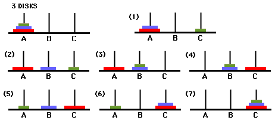

You don't need to create a graphical output, a printed set of instructions is fine. Eg:

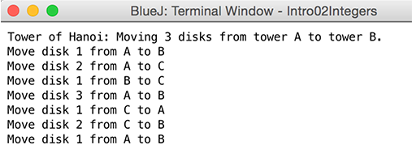

(note: you'd very quickly find solutions online... while I can't stop you, I emphasis this would deprive yourself of the learning experience the problem solving brings)

### Exercise: Binary search

By now we should all know and love the binary search algorithm, but did you realise there is a recursive version of the algorithm?

Can you create a recursive version of the algorithm? (no cheating with google)

Here is an array of 50 sorted names you can use for your binary search.

```java
String[] names = {"Aaliyah","Abigail","Adalyn","Aiden","Alexander","Amelia","Aria","Aubrey","Ava","Avery","Benjamin","Caden","Caleb","Carter","Charlotte","Chloe","Daniel","Elijah","Emily","Emma","Ethan","Evelyn","Grayson","Harper","Isabella","Jack","Jackson","Jacob","James","Jayden","Kaylee","Layla","Liam","Lily","Logan","Lucas","Luke","Madelyn","Madison","Mason","Mia","Michael","Noah","Oliver","Olivia","Riley","Ryan","Sophia","William","Zoe"};
```

## Exercises & review

Textbooks

* Computer Science Illuminated by Nell Dale & John Lewis (page numbers based on 6th edition): Programming concepts: End of chapter 4 (page 240), some recursion questions
* AQA A-level Computer Science by Bob Reeves (2015 edition)

Programming exercises for recursion:

* [Codingbat Recursion-1](http://codingbat.com/java/Recursion-1) 
* [GeeksForGeeks Recursion practice](https://www.geeksforgeeks.org/recursion-practice-problems-solutions/)
* If you’ve completed a number of the above and are looking for a challenge, the popular numbers game of Sodoku is actually a recursive puzzle. Can you write an algorithm that will solve it? Check the [Sudoku algorithms explainer on wikipedia](https://en.wikipedia.org/wiki/Sudoku_solving_algorithms)

---

# Part 2: Abstract data structures

The key content of this section is

* 2 dimensional arrays (static only)
* Dynamic collections (conceptual)
* Stacks
* Queues
* Linked lists (singly linked, doubly linked, circularly linked)
* Binary trees

An abstract data structure:

* Uses the principle of abstraction. You create a model to represent data in the form you require, and hide the " behind the scenes" complexity of how it functions.
* Uses dynamic memory allocation to resize the data structure as required.

| Dynamic | Static |
| ------- | ------ |
| Memory is allocated as the program runs. | Memory size is fixed, and is set at time of compilation. |
| Disadvantage: Possibility of overflow or underflow during runtime if allocations are exceeded. | Advantage: As memory size is fixed, there will be no problems with memory allocations during run time. |
| Advantage: Makes most efficient use of memory, uses only what is required. | Disadvantage: Potentially wasted memory space. |
| Disadvantage: Harder to program. Programmer must keep track of memory sizes and locations. | Advantage: Easier to program. Only need to check you don't exceed your preset limit. |

---

## Two dimensional arrays

As the name suggests, a two dimensional array will allow us to model data that is two dimensional in nature. Programming uses for this include spreadsheets, databases and 2D games.

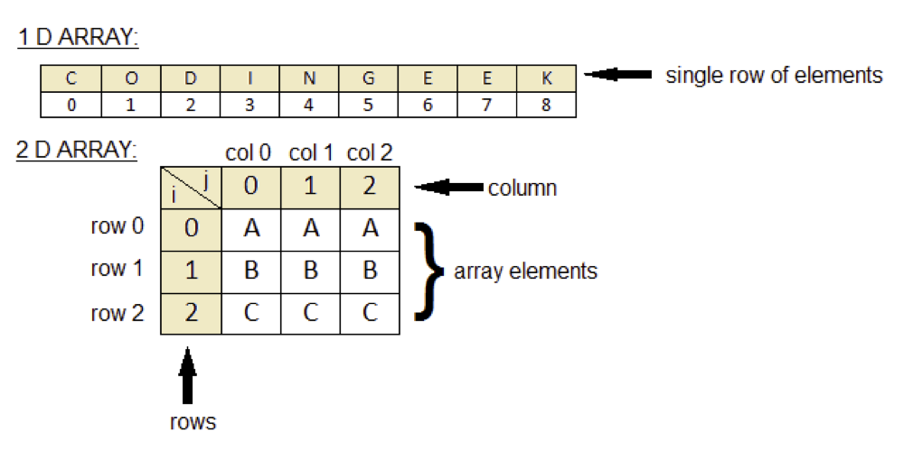

As with one dimensional arrays, we have a couple of methods of declaring static 2D arrays with Java.

Method 1

```java
int numbers[][]= { {25,10, 5}, 	//row 0
                   { 4, 6,13},	//row 1
                   {45,90,78}	//row 2
                 };
for (int row=0; row<numbers.length; row++) {
    for (int col=0; col<numbers[row].length; col++) {
        int val = numbers[row][col];
        System.out.println("numbers["+row+"]["+col+"] = "+val);
    }
}
```

Method 2

```java
int numbers[][] = new int[3][3];

numbers[0][0] = 25;
numbers[0][1] = 10;
numbers[0][2] = 5;
numbers[1][0] = 4;
numbers[1][1] = 6;
numbers[1][2] = 13;
numbers[2][0] = 45;
numbers[2][1] = 90;
numbers[2][2] = 78;

// using the other for-loop method
for (int[] row : numbers) {
    for (int cell : row) {
        System.out.println( cell );
    }
}
```

---

### Exercise 1

A teacher has decided to use a 2D array to store the marks for one of their classes. The grade book takes the following form:

| Marksbook | Test 1 | Test 2 | Test 3 | Test 4 | Test 5 |
| --------- | ------ | ------ | ------ | ------ | ------ |
| Student A | 67% | 50% | 93% | 83% | 43% |
| Student B | 70% | 52% | 96% | 85% | 48% |
| Student C | 90% | 81% | 100% | 93% | 68% |
| Student D | 55% | 32% | 71% | 72% | 58% |
| Student E | 60% | 47% | 65% | 74% | 61% |

Convert the above into a suitable 2D array then write code to determine the following

1. Determine the overall average mark
2. Determine the average mark for each individual student
3. Determine the average mark for each individual assessment
4. Given the following grade cut offs, determine the grade for each student: A = 85%, B = 70%, C = 55%, D = 40%, F < 40%


[Solution](teacher)

---

### Exercises: 2D array patterns

Given the following template code, can you solve the algorithm that creates each given pattern?

```java
package com.pbaumgarten.teachingnotes;

public class TwoDimensionArrayReview {

    public static void printArray(int[][] arr) {
        for (int i=0; i<arr.length; i++) {
            for (int j=0; j<arr[i].length; j++) {
                System.out.print(arr[i][j]+" ");
            }
            System.out.println();
        }
    }

    public static void main(String[] args) {
        int[][] arr = new int[9][9];

        System.out.println("Example");
        arr = example(arr);
        printArray(arr);

        System.out.println("Q1");
        arr = question1(arr);
        printArray(arr);
    }
```

Example problem: Create the following number sequence

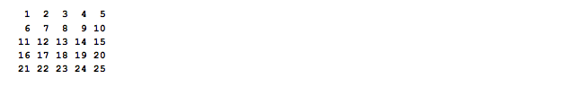

```java
    public static int[][] example(int[][] arr) {
        int counter = 1;
        for (int i=0; i<arr.length; i++) {
            for (int j=0; j<arr[i].length; j++) {
                arr[i][j] = counter++;
            }
        }
        return (arr);
    }

```

Questions 1 through 12

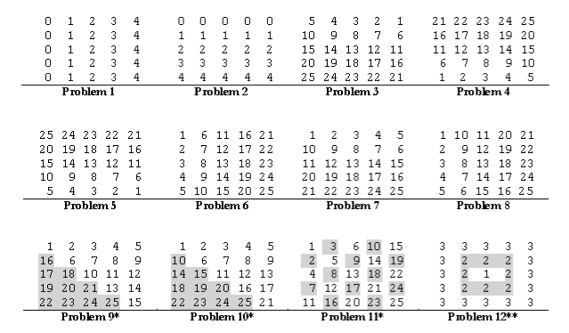

(note: for problem 12 you can assume the array length will always be an odd integer)

```java
    public static int[][] question1(int[][] arr) {
        for (int i=0; i<arr.length; i++) {
            for (int j=0; j<arr[i].length; j++) {
                arr[i][j] = j;
            }
        }
        return (arr);
    }
}
```

Question 13

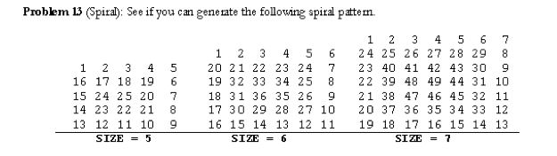

(Questions adapted for Java by P Baumgarten. Original C++ version by Brian Choi 2011)

---

## Dynamic collections

Before proceeding, we need to revisit the idea of a collection from Unit 4.

* A collection is a generic term to refer to a class that allows us to store a set of elements.
* These elements can generally be of any type (integers, objects, Strings, even other collections).
* Collections provide the methods to iterate through and maintain the elements contained within.
* ArrayList and LinkedList are built in collections classes in Java.
* There are some standard methods typically available by all collections that the IB expects you to be aware of (ie: know how they behave if they appear in an exam). These are: `addItem()`, `getNext()`, `resetNext()`, `hasNext()`, `isEmpty()`

---

## Linked lists


View the linked list animation @ [https://visualgo.net/en/list](https://visualgo.net/en/list) 

Visually comparing a linked list to an array

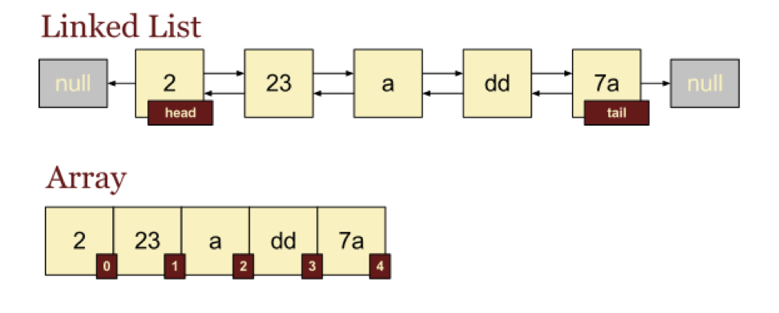

Common operations for a linked list include

* `addHead( value )` - adds at the front of the list
* `addTail( value )` - adds at the end of the list
* `add( value )` - same as addTail()
* `insert( value )` - in order insertion
* `delete( value )`
* `list()`
* `getNext()` - advance pointer to next item in the list
* `resetNext()` - returns to the beginning of the list
* `hasNext()` - returns true/false if there is a next item
* `isEmpty()`
* `isFull()`

Example usage of a linked list as follows

```java
LinkedList list = new LinkedList()
list.add( 12 )
list.add( 99 )
list.add( 37 )
print(list.getValue())
print(list.getNext().getValue())
print(list.getNext().getNext().getValue())
Iterator = list
while ( iterator.hasNext ) {
   print( iterator.getValue() )
   iterator = iterator.getNext()
}
```

Doubly linked list


Circularly linked list


Inserting a node

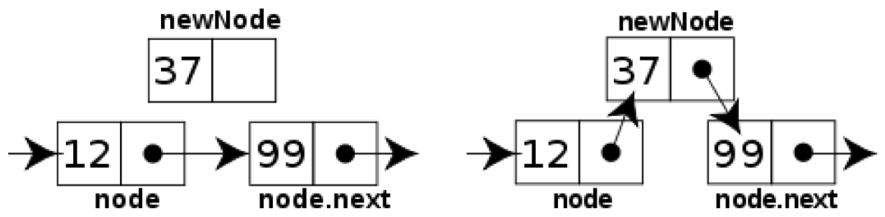

Deleting a node

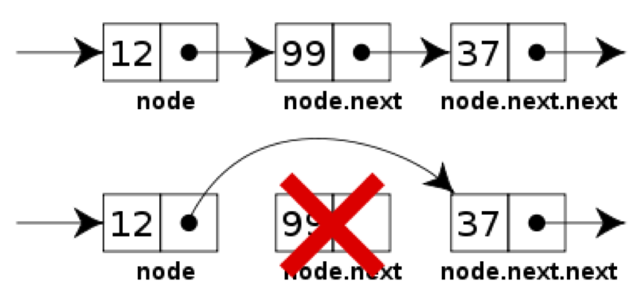

### Sketching operations

*Students should be able to sketch diagrams illustrating: adding a data item to linked list, deleting specified data item, modifying the data held in the linked list, searching for a given data item.*

Given the following linkedlist

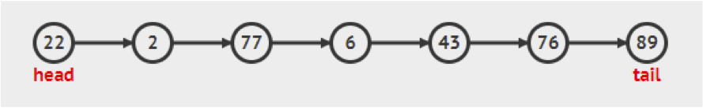

* Sketch adding the value 42 to the end of the list
* Sketch deleting node with value 77
* Sketch search for a node of value 6

### Pseudocode operations

* What would the pseudo-code resemble for the previous 3 operations?

### Java coding a LinkedList

* There is a built in Java class called LinkedList. Unfortunately this does not actually have all the methods of a "traditional" linked list (such as no .getNext() method). If we require such a method, we have to create our own. You could either make your own that maintains nodes and everything from scratch, or make one that is effectively a wrapper for the Java provided class.
* [Java code: Roll your own complete LinkedList](teacher/linkedlist-own)
* Have a go at making your class that uses the existing Java Linkedlist class for it's internal storage.

Using Java's built in LinkedList

```java
package com.pbaumgarten.teachingnotes;

import java.util.LinkedList;

public class LinkedListDemo {
   public static void main(String args[]) {
      LinkedList ll = new LinkedList();
      
      // add elements to the linked list
      ll.add("F");
      ll.add("B");
      ll.add("D");
      ll.add("E");
      ll.add("C");
      ll.addLast("Z");
      ll.addFirst("A");
      ll.add(1, "A2");
      System.out.println("Original contents of ll: " + ll);

      // remove elements from the linked list
      ll.remove("F");
      ll.remove(2);
      System.out.println("Contents of ll after deletion: " + ll);
      
      // remove first and last elements
      ll.removeFirst();
      ll.removeLast();
      System.out.println("ll after deleting first and last: " + ll);

      // get and set a value
      String val = (String)ll.get(2);
      ll.set(2, val + " Changed");
      System.out.println("ll after change: " + ll);
   }
}
```

### Problems

1. Write a count() function that counts and returns the number of times a given int occurs in a list.
2. Write a GetNth() function that takes a linked list and an integer index and returns the data value stored in the node at that index position.
3. A more difficult problem is to write a function InsertNth() which can insert a new node at any index within a list.
4. Write a SortedInsert() function which given a list that is sorted in increasing order, and a single node, inserts the node into the correct sorted position in the list.
5. Write an InsertSort() function which given a list, rearranges its nodes so they are sorted in increasing order. It should use SortedInsert().
6. Write a RemoveDuplicates() function which takes a list sorted in increasing order and deletes any duplicate nodes from the list. To make it more challenging, code it so the list is only be traversed once.

(when you are ready, ask me for the solutions file, "cs-unit-5-linkedlist-problems-with-solutions.pdf")

---

## Stacks

A LIFO (last in, first out) data structure with the following methods:

* `push()` to add to the stack
* `pop()` to remove from the stack
* `isEmpty()` to query stack status

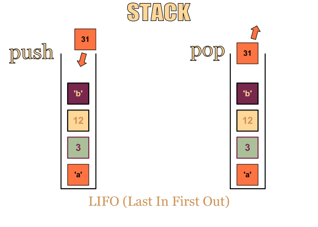

View the stack animation @ [https://visualgo.net/en/list](https://visualgo.net/en/list) 

Make your own Stack data structure with Java

```java
package com.pbaumgarten.teachingnotes;

import java.util.LinkedList;

public class MyStack {
    private LinkedList list;

    public Stack() {
        list = new LinkedList();
    }

    public boolean isEmpty() {
        return (list.size() == 0);
    }

    public void push(Object item) {
        list.add(item);
    }

    public Object pop() {
        Object item = list.get(list.size());
        list.remove(list.size());
        return item;
    }
}
```

Java actually includes a built in Stack class you can use

```java
package com.pbaumgarten.teachingnotes;

import java.util.Stack;

public class StackUsageExample {
    public static void main(String[] args) {
        Stack<Integer> s = new Stack<Integer>();
        System.out.println( s );
        s.push(new Integer(42));
        s.push(new Integer(66));
        s.push(new Integer(99));
        System.out.println( s );
        while ( ! s.isEmpty() ) {
            int val = s.pop();
            System.out.println("Item removed: "+val);
            System.out.println( s );
        }
    }
}
```

---

## Queues

A queue is a FIFO (first in, first out) data structure:

* `enqueue()` to add an item to the back of the queue.
* `dequeue()` to remove an item from the front of the queue.
* `isEmpty()` to query the queue status.

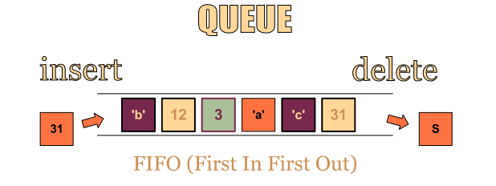

View the queue animation @ [https://visualgo.net/en/list](https://visualgo.net/en/list)

```java
package com.pbaumgarten.teachingnotes; 

import java.util.LinkedList;

public class MyQueue {
    // Use the Java built in LinkedList to manage our queue
    private LinkedList list;

    public MyQueue() {
        list = new LinkedList();
    }

    public boolean isEmpty() {
        return (list.size() == 0);
    }

    public void enqueue(Object item) {
        list.add(item);
    }

    public Object dequeue() {
        Object item = list.get(0);
        list.remove(0);
        return item;
    }

    public Object peek() {
        return list.get(0);
    }

    public static void main(String[] args) {
        MyQueue q = new MyQueue();
        System.out.println( "Queue:" );        
        q.enqueue("person 1");
        q.enqueue("person 2");
        q.enqueue("person 3");
        q.enqueue("person 4");
        q.dequeue();
        q.enqueue("person 5");
        q.enqueue("person 6");
        while (! q.isEmpty() ){
            int i = 1;
            System.out.println( "Now calling customer " + q.dequeue() );
        }
    }
}
```

---

## Stacks & Queues: Static implementation

If we wanted to implement our own stack or queue, in addition to using a dynamic structure such as the LinkedList like we used above, we can make one quite easily using an object that used a static array as an instance variable.

What would be required of our object to be able to implement this?

Task: Build the classes `StaticStack` and `StaticQueue` that use a statically declared array as the data store. Use an array size of 100 items. Your class should only publically expose the methods of a queue or stack, with the addition of an `isFull()` method.

(Yes, Philipp, it must be a static array. The course demands it you show you can do this)

* [solution](teacher)

---

## Stacks & Queues: Exercises

1. For any given string, reverse its contents by way of using a stack.

* [solution](teacher)

2. For any given string, use a stack to determine if every opening parenthesis is matched with a closing parenthesis.

3. What does the following code fragment print when n is 50? Give a high-level description of what the code fragment does when presented with a positive integer n.

```java
Stack stack = new Stack();
while (n > 0) {
    stack.push(n % 2);
    n /= 2;
}
while (!stack.isEmpty()) {
     print(stack.pop());
}
println();
```

4. Consider the following pseudo code. Assume that IntQueue is an integer queue. What does the function fun do?

```java
void fun(int n) {
    IntQueue q = new IntQueue();
    q.enqueue(0);
    q.enqueue(1);
    for (int i = 0; i < n; i++) {
        int a = q.dequeue();
        int b = q.dequeue();
        q.enqueue(b);
        q.enqueue(a + b);
        print(a);
    }
}
```

5. **more challenging** For any given string, use a stack to create a PEMDAS compliant calculator. For example, `( 2 + ( ( 3 + 4 ) * ( 5 * 6 ) ) )`

---

## Trees

Trees are a commonly used data structure in computing. One place you will have used them all the time without even a moments thought is when navigating the folder/file structure of your computer.

This course only requires you to be familiar with the binary tree, a tree that has no more than two branches coming off each node.

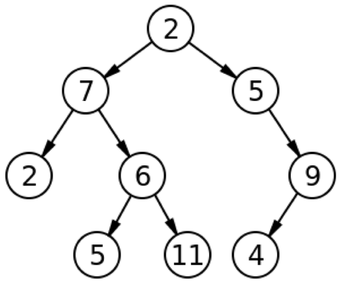

Some terminology

* Left child
* Right child
* Parent
* Sub tree
* Root
* Leaf
* Height of a node: The length of the longest downward path to a leaf from that node.
* Depth of a node: The length of the path to its root (i.e., its root path)

There are three ways of traversing a tree, starting from the root: 

* Pre order: Print the node, visit the left node, visit the right node
* In order: Visit the left node, print the node, visit the right node
* Post order: Visit the left node, visit the right node, print the node.

A simple way of visually remembering these traversal methods is to imagine flags as follows

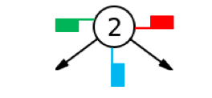

* Pre order: The order in which you visit the green flags
* In order: The order in which you visit the blue flags
* Post order: The order in which you visit the red flags

Example

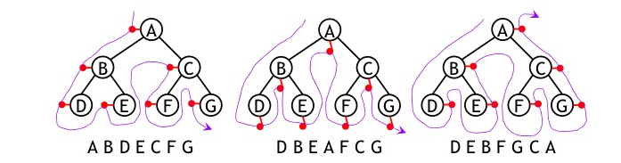

So, with the original tree shown at the start (root node = 2), what would the pre-order, in-order and post-order traversal be?

### Coding a Binary Tree

There is not a pre-built Binary Tree class for us to use in Java. Can you write your own so the following `main()` will work?

```java
public static void main(String[] args) {
    MyBinaryTree bt = new MyBinaryTree();
    bt.insert( 13 );
    bt.insert( 4 );
    bt.insert( 2 );
    bt.insert( 15 );
    bt.insert( 100 );
    bt.insert( 1000 );
    bt.insert( 222 );
    bt.insert( 23 );
    bt.insert( 7 );
    bt.insert( 8 );
    System.out.println("Node count");
    System.out.println( bt.countNodes() );
    System.out.println("Pre order traversal");
    bt.preorder();
    System.out.println("In order traversal");
    bt.inorder();
    System.out.println("Post order traversal");
    bt.postorder();
}
```

Hint: Take a look my `LinkedList` class, you will need to create your own `Node` subclass like I did there.

* [solution](teacher)

### Binary Tree exercises

1. Program the function inorder() to output the data contained in a binary tree using inorder tree traversal
2. Program the function preorder() to output the data contained in a binary tree using preorder tree traversal
3. Program the function postorder() to output the data contained in a binary tree using postorder tree traversal
4. Program the function lookup(), which given a value, will search the binary tree to determine if the value is present in the tree, and returns true or false accordingly (you may assume the contents of the tree are sorted in order)
5. Program the function insert(), which given a value, will insert a new node with the given value at the correct location within the tree, and shuffles the rest of the tree accordingly as required.
6. Program the function maxdepth() which returns the longest path from the root node to the furthest leaf node.
7. Program the function isInOrder() which searches the contents of the tree and returns true if the contents are sorted for in order traversal.

(when you are ready, ask me for the solutions file, "cs-unit-5-binarytree-problems-with-solutions.pdf")

---

## Extension: Hash tables/maps

The commonly used data structure known as hash tables, key-value pairs, or a dictionary is quite a fascinating yet complex structure. This video does a great job of clearly explaining the underlying concepts of how it works.

* [Hash Tables and Hash Functions](https://www.youtube.com/watch?v=KyUTuwz_b7Q)

Can you make your own simple hash table class?

---

## Exercises & Review

* Computer Science Illuminated by Nell Dale & John Lewis (page numbers based on 6th edition): End of chapter 8 (page 280), exercises 1-50, 61-69 (exclude any Graph questions)

---

# Syllabus alignments

Recursion

* 5.1.1 Identify a situation that requires the use of recursive thinking. *(eg: snowflakes, fractals, towers of Hanoi)*
* 5.1.2 Identify recursive thinking in a specified problem solution.
* 5.1.3 Trace a recursive algorithm to express a solution to a problem. *(required to state output of recursive algorithms)*
* D.4.1 Define the term recursion.
* D.4.2 Describe the application of recursive algorithms. *(recursion can be applied to a small subset of programming problems to produce elegant solutions. is used in practice - discuss efficiency reasons why this is so)*
* D.4.3 Construct algorithms that use recursion. *(limited to 1 result, and 1 or 2 recursive calls)*
* D.4.4 Trace recursive algorithms. *(all steps and calls to be shown clearly)*

Two dimensional arrays

* 5.1.4 Describe the characteristics of a two-dimensional array.
* 5.1.5 Construct algorithms using two-dimensional arrays.

Abstract data structures

* 5.1.6 Describe the characteristics and applications of a stack. *(Last in, first out (LIFO); Examples may include running recursive processes, return memory addresses)*
* 5.1.7 Construct algorithms using the access methods of a stack. *(push; pop; isEmpty)*
* 5.1.8 Describe the characteristics and applications of a queue. *(First in, first out (FIFO); Examples applications print queues, computer modelling of physical queues; linear and circular implementation required)*
* 5.1.9 Construct algorithms using the access methods of a queue. *(enqueue; dequeue; isEmpty)*
* 5.1.10 Explain the use of arrays as static stacks and queues. *(using static arrays to push & pop; test empty/full stack; enqueue & dequeue; test empty/full queue)*
* 5.1.11 Describe the features and characteristics of a dynamic data structure. *(nodes, pointers)*
* 5.1.12 Describe how linked lists operate logically.
* 5.1.13 Sketch linked lists (single, double and circular). *(diagram adding item, deleting specified item, modifying data, searching for an item)*
* 5.1.14 Describe how trees operate logically (both binary and non-binary).
* 5.1.15 Define the terms: parent, left-child, right-child, subtree, root and leaf.
* 5.1.16 State the result of inorder, postorder and preorder tree traversal.
* 5.1.17 Sketch binary trees. *(diagram adding new item, add one or more nodes, remove one or more nodes)*
* 5.1.18 Define the term dynamic data structure.
* 5.1.19 Compare the use of static and dynamic data structures.
* 5.1.20 Suggest a suitable structure for a given situation.
* D.4.5 Define the term object reference. *(typified by simple classes that are self-referential)*
* D.4.6 Construct algorithms that use reference mechanisms.
* D.4.7 Identify the features of the abstract data type (ADT) list. *(understand the nature of an ADT—where no implementation details are known but the actions/methods are standard)*
* D.4.8 Describe applications of lists. *(lists can be used to represent stacks and queues)*
* D.4.9 Construct algorithms using a static implementation of a list. *(singly linked lists only. Methods: add (head and tail), insert (in order), delete, list, isEmpty, isFull)*
* D.4.10 Construct list algorithms using object references. *(singly linked lists only. Methods: add (head and tail), insert (in order), delete, list, isEmpty, isFull)*
* D.4.11 Construct algorithms using the standard library collections included in JETS. *(ArrayList and LinkedList; understanding of operation and methods yes, internal structure no)*
* D.4.12 Trace algorithms using the implementations described in assessment statements D.4.9–D.4.11. *(In exams, definitions of ArrayList and LinkedList methods will be given where necessary)*
* D.4.13 Explain the advantages of using library collections. *(libraries provide convenient and reliable implementations of common programming tasks)*
* D.4.14 Outline the features of ADT’s stack, queue and binary tree. *(diagram, example applications and descriptions of these ADTs. eg: binary tree can be used to efficiently store and retrieve unique keys)*
* D.4.15 Explain the importance of style and naming conventions in code. *(meaningful identifiers, proper indentation and adequate comments all improve the readability of code for humans and thus save money, time and effort in programming teams)*
