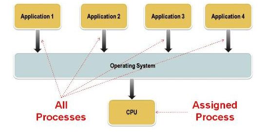
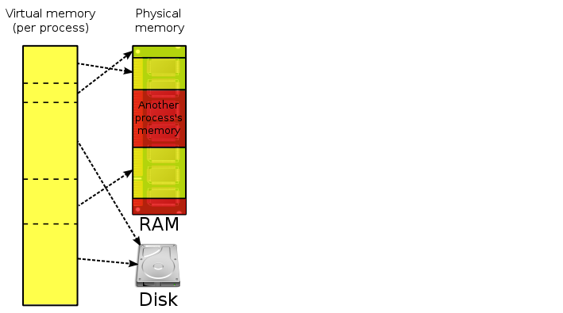
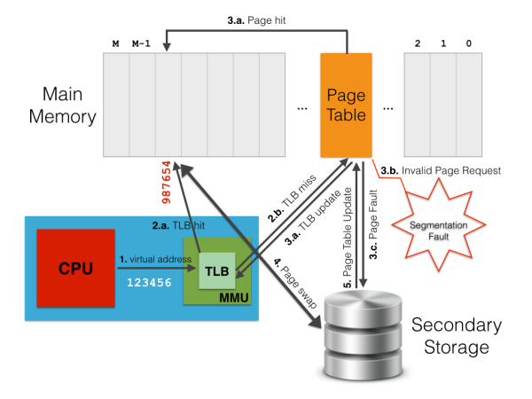

# Unit 6: Resource management (HL)

## System resources

There are various aspects or resources that require management in a computer system, including:

* Primary memory,
* Secondary storage,
* Processor,
* Bandwidth,
* Screen,
* Sound processor,
* Graphics processor,
* Cache,
* Network connectivity.

Each application wants to have access to many or all of these. What determines which program can use what and when? That is the role of the operating system.

## Role of the Operating System

The various roles of an operating system generally revolve around the idea of "sharing nicely."

Multiple users, multiple programs, multiple devices all taking their turn to share the CPU between them. The OS acts as the playground monitor and makes sure everyone cooperates and has a chance.

## Evaluating the limits available

Before it can manage the resources, the OS needs to determine what is available. 

Anything with a CPU inside it is effectively a computer system. Mobile phones, digital cameras, standalone GPS units (Tom Toms), digital radio systems, through to Cray supercomputers (universities, NASA, NSA)

Different operating systems are required to manage an enormous range of resource levels. Consider the variety of systems these OSes have to contend with:

* Microsoft Windows - From the slowest weakest laptop to the beefiest gaming desktop
* Apple Mac OSX
* Linux
* Apple iOS - iPads v iPhones v iPods v iWatch all have very different specifications
* Android 

Limitations in the resources of a specific computer system are often closely related to the hardware of the system and its capabilities. Limitations could include:

* RAM - Speed, capacity, OS’s own demands
* CPU - Clock speed, number of cores, 32 v 64 bit
* Graphics card - Processing power, video memory, eg: demands of 4K frames/s?
* Network card - Speed 1Gbps, 100Mbps, 10Mbps other?
* Hard drive - Type (SSD v magnetic), seek rate, storage capacity

## Device drivers

How could one operating system communicate with and manage an impossibly large varity of devices?

Usually that communication is accomplished with the help of a device driver, a small program that "knows" the way a particular device expects to receive and deliver information. With device drivers, every operating system no longer needs to know about every device with which it might possible be expected to communicate in the future. 

It's another beautiful example of abstraction. 

## Management techniques used

While what we will be looking at are simplifications, there are several common techniques used by operating systems for managing the sharing of the system resources amongst the competing demands.

* Scheduling
* Policies
* Multi tasking
* Virtual memory & paging
* Interrupts
* Polling

### Scheduling

CPU scheduling, which determines which process in memory is executed by the CPU at any given point
Common strategies:

* **First come first served (FCFS)** - Processes are moved to the CPU in the order in which they arrive in the running state. FCFS scheduling is nonpreemptive. Once a process is given access to the CPU, it keeps it unless it makes a request that forces it to wait, such as request that forces it to wait, such as a request for a device in use by another process.
* **Shortest job next (SJN)** - CPU scheduling algorithm looks at all processes in the ready state and dispatches the one with the smallest service time. Like FCFS, it is generally implemented as a non-preemptive algorithm.
* **Round robin** or **time slicing** - distributes the processing time equitably among all ready processes. The algorithm establishes a particular time slice (or time quantum), which is the amount of time each process receives before being preempted and return to the ready state to allow another process its turn. Eventually the preempted process will be given another time slice on the CPU. This procedure continues until the process eventually gets all the time it needs and terminates.

### Policies

The "rules" in place to govern competing resources all wanting access to the computer’s resources.
For instance, when the user is attempting to have a Skype video chat, the webcam, microphone, graphics, audio output and network must all the juggled in such a way to allow a "smooth" conversation to occur.

Affects things such as:

* Network connectivity and bandwidth management
* Sound and graphics management
* Printers
* Cameras, scanners

### Multi tasking

Multitasking is the technique of keeping multiple programs in main memory at the same time; these programs compete for access to the CPU so that they can do their work. All modern operating systems employ multiprogramming to one degree or another. An operating system must therefore perform memory management to keep track of what programs are in memory and where in memory they reside. *(page 340)*

Thus, operating systems must employ techniques to:

* track where and how a program resides in memory, and
* convert logical program addresses into actual memory addresses.

A program is filled with references to variables and to other parts of the program code. When the program is compiled, these references are changed into the addresses in memory where the data and code resides. But since one doesn't know exactly where a program will be loaded into main memory, how can one know what address to use for anything?

The solution is to use two kinds of addresses: logical addresses and physical addresses. A logical address (sometimes called a virtual or relative address) is a value that specifies a generic location, relative to the program but not to the reality of main memory. A physical address is an actual address in the main memory device − again shown in the figure.

When a program is compiled, a reference to an identifier (such as a variable name) is changed to a logical address. When the program is eventually loaded into memory, each logical address finally corresponds to a specific physical address. The mapping of a logical address to a physical address is called address binding. Logical addresses allow a program to be moved around in memory or loaded in different places at different times. As long as one keeps track of where the program is stored, one is always able to determine the physical address that corresponds to any given logical address. *(pages 344-245)*

### Virtual memory & paging

Virtual Memory is a memory management technique that is implemented using both hardware (MMU) and software (operating system). It abstracts from the real memory available on a system by introducing the concept of virtual address space, which allows each process thinking of physical memory as a contiguous address space (or collection of contiguous segments).
 
The goal of virtual memory is to map virtual memory addresses generated by an executing program into physical addresses in computer memory. This concerns two main aspects: address translation (from virtual to physical) and virtual address spaces management. The former is implemented on the CPU chip by a specific hardware element called Memory Management Unit or MMU. The latter is instead provided by the operating system, which sets up virtual address spaces (i.e., either a single virtual space for all processes or one for each process) and actually assigns real memory to virtual memory. Furthermore, software within the operating system may provide a virtual address space that can exceed the actual capacity of main memory (i.e., using also secondary memory) and thus reference more memory than is physically present in the system.

The primary benefits of virtual memory include freeing applications (and programmers) from having to manage a shared memory space, increasing security due to memory isolation, and being able to conceptually use more memory than might be physically available, using the technique of paging. Indeed, almost every virtual memory implementations divide a virtual address space into blocks of contiguous virtual memory addresses, called pages, which are usually 4 KB in size.

In order to translate virtual addresses of a process into physical memory addresses used by the hardware to actually process instructions, the MMU makes use of so-called page table, i.e., a data structure managed by the OS that store mappings between virtual and physical addresses.
Concretely, the MMU stores a cache of recently used mappings out of those stored in the whole OS page table, which is called Translation Lookaside Buffer (TLB).

The picture below describes the address translation task as discussed above.

When a virtual address needs to be translated into a physical address, the MMU first searches for it in the TLB cache (step 1. in the picture above). If a match is found (i.e., TLB hit) then the physical address is returned and the computation simply goes on (2.a.). Conversely, if there is no match for the virtual address in the TLB cache (i.e., TLB miss), the MMU searches for a match on the whole page table, i.e., page walk (2.b.). If this match exists on the page table, this is accordingly written to the TLB cache (3.a.). Thus, the address translation is restarted so that the MMU is able find a match on the updated TLB (1 & 2.a.).

Unfortunately, page table lookup may fail due to two reasons. The first one is when there is no valid translation for the specified virtual address (e.g., when the process tries to access an area of memory which it cannot ask for). Otherwise, it may happen if the requested page is not loaded in main memory at the moment (an apposite flag on the corresponding page table entry indicates this situation). In both cases, the control passes from the MMU (hardware) to the page supervisor (a software component of the operating system kernel). In the first case, the page supervisor typically raises a segmentation fault exception (3.b.). In the second case, instead, a page fault occurs (3.c.), which means the requested page has to be retrieved from the secondary storage (i.e., disk) where it is currently stored. Thus, the page supervisor accesses the disk, re-stores in main memory the page corresponding to the virtual address that originated the page fault (4.), updates the page table and the TLB with a new mapping between the virtual address and the physical address where the page has been stored (3.a.), and finally tells the MMU to start again the request so that a TLB hit will take place (1 & 2.a.).

As it turns out, the task of above works until there is enough room in main memory to store pages back from disk. However, when all the physical memory is exhausted, the page supervisor must also free a page in main memory to allow the incoming page from disk to be stored. To fairly determine which page to move from main memory to disk, the paging supervisor may use several page replacement algorithms, such as Least Recently Used (LRU). Generally speaking, moving pages from/to secondary storage to/from main memory is referred to as swapping (4.), and this is why page faults may occur.

### Interrupts & polling

An interrupt is a signal to the processor emitted by hardware or software indicating an event that needs immediate attention. 

An interrupt alerts the processor to a high-priority condition requiring the interruption of the current code the processor is executing.

An alternative to using interrupts is a method known as 'polling'.

This is where the CPU periodically checks each device to see if it needs service.

* It takes CPU time even when no requests pending
* Overhead may be reduced at expense of response time
* Can be efficient if events arrive rapidly

"Polling is like picking up your phone every few seconds to see if you have a call. ..." 

Which is more efficient? 

* Interrupts win if processor has other work to do and event response time is not critical
* Polling can be better if processor has to respond to an event ASAP ??
* Polling may sometimes be used in device controller that contains dedicated secondary processor

This video demonstrates through using an Arduino the differences between polling and interrupts.

* Computerphile (2017) Program, Interrupted - [https://www.youtube.com/watch?v=54BrU82ANww](https://www.youtube.com/watch?v=54BrU82ANww) (6m40)

This is an interesting article looking at the Apollo Guidance Computer of the 1970s and the challenges they tackled building an operating system for it. The article discusses the unsuitablity of round-robin scheduling and the adoption of priority queues through interrupts.

* Srikanth, V (2018): The Magic behind Apollo - [https://medium.com/delta-force/the-magic-behind-apollo-cf89aede34d4](https://medium.com/delta-force/the-magic-behind-apollo-cf89aede34d4)

## Dedicated device operating systems

Mobile devices, such as smartphones and tablet computers, run operating systems that are tailored to their needs. The memory constraints and the smaller set of peripherals involved, for example, are different than those of a typical desktop or laptop computer. Apple's iPod Touch, iPhone, and iPad all run the iOS mobile operating system which is derived from Mac OS. The Android operating system, developed by Google, is an open source project as part of the Open Handset Alliance.
What are the advantages and disadvantages to using a dedicated operating system for different devices?

## Hiding complexity

Operating systems aim to hide complexity through abstraction and high level API's (application programming interfaces). Some examples of these include

* Drive letters
* Virtual memory
* Input devices
* Java virtual machine
* International localisation compatibility issues

Modern computer hardware is incredibly complex. Luckily, the operating system hides this complexity through the use of abstraction and high-level APIs. For example, if an application wants to create a file in a particular location, it orders the OS to create that file. The program doesn't need to be concerned with what filesystem the disk is running (FAT, NTFS, etc), which disk it is, whether it's a network server or local drive. The OS hides all these details.

## Review questions

What is the difference between a program using physical addresses and logical addresses of memory?

Outline the concept of virtual memory and suggest a scenario when it could be a problem. What would a potential solution be for a computer owner whose system is continually paging the virtual memory?

Compare and contrast the advantages of Solid State Drives have over the traditional spinning magnetic Hard Drive Drives, and why they are becoming increasing popular?

If applications are loaded into RAM to execute, why is it that a computer with a full hard drive would freeze up?

Describe one way that the operating system of a networked workstation hides the complexity of the network from the user?

Define the term operating system?

Outline the role of paging in the management of primary memory?

## References

Multi tasking

* Dale & Lewis (2016) Computer Science Illuminated

Virtual memory & paging

* Tolomei, G (2014?) Virtual Memory, Paging, and Swapping - https://gabrieletolomei.wordpress.com/miscellanea/operating-systems/virtual-memory-paging-and-swapping/
* Virtual memory image by ehamberg (2018) Wikimedia commons - CC BY-SA 3.0 - https://commons.wikimedia.org/w/index.php?curid=8352077
