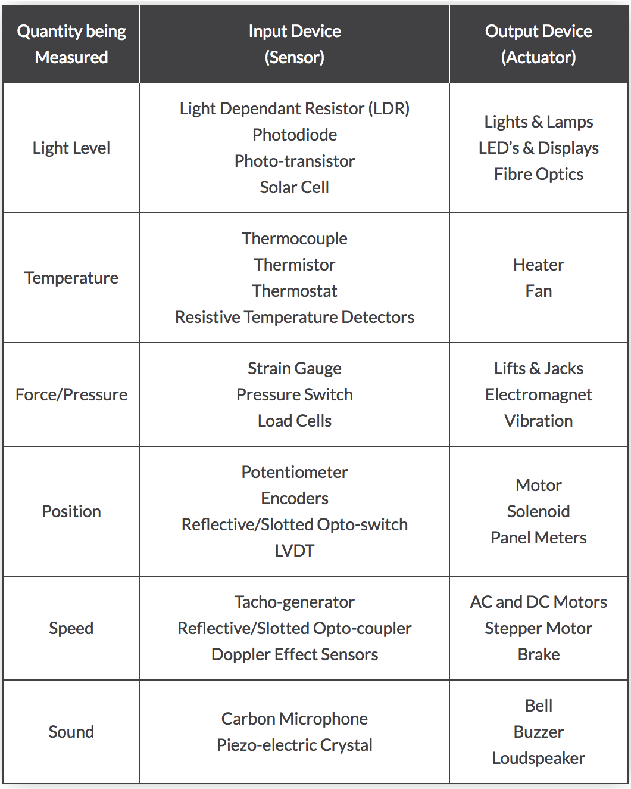

# Unit 7: Control systems (HL)

A control system is a device, or set of devices, that manages, commands, directs or regulates the behaviour of other devices or systems. Industrial control systems are used in industrial production for controlling equipment or machines. (Wikipedia)

## 7.1.1 Discuss a range of control systems

A variety of control systems should be examined such as

* Automatic doors
* Heating systems
* Taxi meters
* Elevators
* Washing machines
* Process control (combination of control engineering and chemical engineering that uses industrial control systems to achieve a production level of consistency, economy and safety which could not be achieved purely by human manual control)
* Domestic robots (eg: robotic vacuum cleaners)
* GPS systems
* Traffic lights

Some other devices I think are interesting to consider:

* Heart monitors (pacemakers)
* Planes (flight control systems, auto pilot etc)
* Drones
* Self driving cars
* "Normal" cars (power steering, cruise control etc). The recent Jeep hack is a very interesting recent case study.

## 7.1.2 Outline the uses of microprocessors and sensor input in control systems

What use does a microprocessor have in control systems?

* Computers can respond very quickly to any change of state
* Computers can run 24/7 without needing a rest
* Computers can operate in hazardous environments
* Computers are consistent
* Computers require electricity
* Computers can only respond to anticipated events as per their programming

What use does sensor input have in control systems?

Check adafruit.com for sensors that are easily available.

Common sensors and transducers

Input type transducers or sensors, produce a voltage or signal output response which is proportional to the change in the quantity that they are measuring (the stimulus). The type or amount of the output signal depends upon the type of sensor being used. But generally, all types of sensors can be classed as two kinds, either Passive Sensors or Active Sensors.

Generally, active sensors require an external power supply to operate, called an excitation signal which is used by the sensor to produce the output signal. Active sensors are self-generating devices because their own properties change in response to an external effect producing for example, an output voltage of 1 to 10v DC or an output current such as 4 to 20mA DC. Active sensors can also produce signal amplification.

A good example of an active sensor is an LVDT sensor or a strain gauge. Strain gauges are pressure-sensitive resistive bridge networks that are external biased (excitation signal) in such a way as to produce an output voltage in proportion to the amount of force and/or strain being applied to the sensor.

Unlike an active sensor, a passive sensor does not need any additional power source or excitation voltage. Instead a passive sensor generates an output signal in response to some external stimulus. For example, a thermocouple which generates its own voltage output when exposed to heat. Then passive sensors are direct sensors which change their physical properties, such as resistance, capacitance or inductance etc.

But as well as analogue sensors, Digital Sensors produce a discrete output representing a binary number or digit such as a logic level "0" or a logic level "1".

From: https://www.electronics-tutorials.ws/io/io_1.html

## 7.1.3 Evaluate different input devices for the collection of data in specified situations

Input devices tend to be classed as either digital or analogue.

Examples of digital input devices?

Examples of analogue input devices?

How is analogue input read by digital computers?

What input devices would be best suited for...?

* Measure traffic at intersection? 
* Detect fire, smoke or a toxic gas?
* The size of a load in a washing machine? 
* An elevator detect when it has reached (and is exactly level with) a particular floor?
* Detect altitude and orientation of an airliner?
* Detect wind speed and direction?
* Maintain the temperature in a climate control system?

Brainstorm other familiar situations where there could be a computer with an input device. What input devices would be best suited for that situation?

## 7.1.4 Explain the relationship between a sensor, the processor and an output transducer

**Technical hardware details are not expected.**

Open v closed loops (diagrams)

What other examples could we illustrate with?

## 7.1.5 Describe the role of feedback in a control system

Feedback in a open and closed loop

## 7.1.6 Discuss the social impacts and ethical considerations associated with the use of embedded systems

For example: tagging prisoners, surveillance, CCTV, improved safety systems.

Quick in class brain storm.

Automating jobs traditionally performed by people

"Employee Monitoring: How Far is Too Far? ­ Innovative ..." 2014. 18 Sep. 2015 <http://www.innovativeemployeesolutions.com/articles/employee­monitoring­how­far­is­too­far/>

"Should school children have tracking chips? ­ Science ..." 2013. 18 Sep. 2015 <http://blogs.discovery.com/inscider/2013/04/should­children­have­tracking­chips.html>

"U.S. Confirms That It Gathers Online Data Overseas ­ The ..." 2013. 18 Sep. 2015 <http://www.nytimes.com/2013/06/07/us/nsa­verizon­calls.html>

"BBC NEWS | UK | Satellite tracking for criminals." 2004. 18 Sep. 2015 <http://news.bbc.co.uk/2/hi/uk_news/3620024.stm>

"Closed­circuit television ­ Wikipedia, the free encyclopedia." 2011. 18 Sep. 2015 <https://en.wikipedia.org/wiki/Closed­circuit_television>

"After Boston: The pros and cons of surveillance ... ­ CNN.com." 2013. 18 Sep. 2015 <http://www.cnn.com/2013/04/26/tech/innovation/security­cameras­boston­bombings/>

## 7.1.7 Compare a centrally controlled system with a distributed system

A type of computing in which different components and objects comprising an application can be located on different computers connected to a network.

Pro: Cost, performance, scalability, reliability
Con: Bandwidth, Security, Complexity

(from Michael Brooke, emjbe.net, CC-BY-NC)

## 7.1.8 Outline the role of autonomous agents acting within a larger system

**What are autonomous agents?**

An autonomous agent is an intelligent agent operating on an owner's behalf but without any interference of that ownership entity. (Wikipedia, 2017)

The defining metaphor of an autonomous agent is the **thinking machine**.

They are (usually) designed in interact with their environment:

* Their behaviour is action-driven.
* Their physical implementation is important - at least their ability to manipulate symbols
* They do things in the physical world
* They go where humans do not (can not) go - eg: planetary rovers

It has been suggested agenthood of a computer system is restricted to the following (Woolridge et al 1995):

* Autonomy: being in control of its own actions
* Reactivity: reacts to events in it's environment
* Proactivity: the ability to act of its own initiative
* Sociality: the ability to interact with other agents

From [Federico Gobbo, 2013](https://www.slideshare.net/goberiko/a-history-of-autonomous-agents-from)

**Interaction within a larger system**  

Example: Self driving cars. When not everything is within the systems control.

## Past paper questions

Ask me for access.
