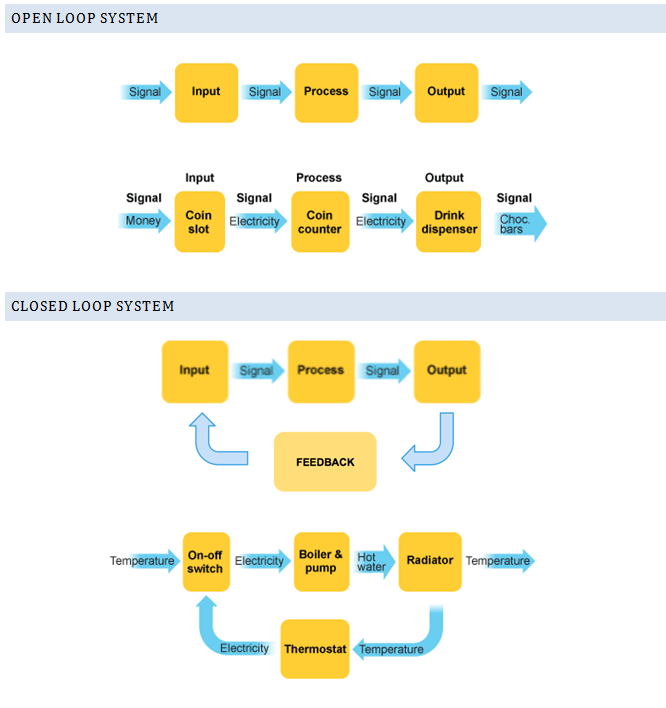
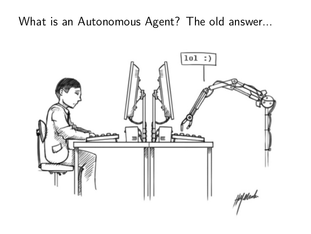

# Unit 7: Control systems (HL)

**Not yet updates for 2020/21**

## Introducing control systems

A control system is a device, or set of devices, that manages, commands, directs or regulates the behaviour of other devices or systems. Industrial control systems are used in industrial production for controlling equipment or machines. (Wikipedia)

Some examples of control systems include:

* Automatic doors
* Heating systems
* Taxi meters
* Elevators
* Washing machines
* Process control (combination of control engineering and chemical engineering that uses industrial control systems to achieve a production level of consistency, economy and safety which could not be achieved purely by human manual control)
* Domestic robots (eg: robotic vacuum cleaners)
* GPS systems
* Traffic lights
* Heart monitors (pacemakers)
* Planes (flight control systems, auto pilot etc)
* Drones
* Self driving cars
* "Normal" cars (power steering, cruise control etc). The recent [Jeep hack](https://www.youtube.com/watch?v=MK0SrxBC1xs) is a very interesting recent case study.

## Microprocessors

What use does a microprocessor have in control systems?

* Computers can respond very quickly to any change of state
* Computers can run 24/7 without needing a rest
* Computers can operate in hazardous environments
* Computers are consistent
* Computers require electricity
* Computers can only respond to anticipated events as per their programming

## Sensor input

What role do sensors or transducers have in control systems?

Sensors can be broadly categorised into two types: active and passive.

Generally, active sensors require an external power supply to operate, called an excitation signal which is used by the sensor to produce the output signal. Active sensors are self-generating devices because their own properties change in response to an external effect producing for example, an output voltage of 1 to 10v DC or an output current such as 4 to 20mA DC. Active sensors can also produce signal amplification.

A good example of an active sensor is an LVDT sensor or a strain gauge. Strain gauges are pressure-sensitive resistive bridge networks that are external biased (excitation signal) in such a way as to produce an output voltage in proportion to the amount of force and/or strain being applied to the sensor.

Unlike an active sensor, a passive sensor does not need any additional power source or excitation voltage. Instead a passive sensor generates an output signal in response to some external stimulus. For example, a thermocouple which generates its own voltage output when exposed to heat. Then passive sensors are direct sensors which change their physical properties, such as resistance, capacitance or inductance etc.

There are an enormous variety of sensors easily available for hobbyist projects. Check [adafruit.com](https://adafruit.com/) for an indication.

Sensors can also be categorised into analogue or digital. Analogue sensors produce a voltage or signal output response which is proportional to the change in the quantity that they are measuring (the stimulus). Digital Sensors produce a discrete output representing a binary number or digit such as a logic level "0" or a logic level "1".

Common sensors and transducers by environment they detect are:

* Light - Light dependant resistor, photodiode, photo-transistor, solar cell
* Temperature - Thermocouple, thermister, thermostat, resistive temperature detectors
* Force/pressure - Strain gauge, pressure switch, load cells
* Position - Potentiometer, encoder, reflective/slotted opto-swtich, lvdt
* Speed - Tacho-generator, reflective/slotted opto-swtich, doppler effect sensor
* Sound - Carbon microphone, piezo-electric crystal
* Location - GPS
* Others?

Source: https://www.electronics-tutorials.ws/io/io_1.html

## Digital v Analogue input

* When would it be more appropriate to use a digital v analogue input device?
* How can an analogue input be read by our digital computer systems (suggest: use an analogue input with a Raspberry Pi or Arduino to figure this out)

What input devices would be best suited for...?

* Measure traffic at intersection? 
* Detect fire, smoke or a toxic gas?
* The size of a load in a washing machine? 
* An elevator detect when it has reached (and is exactly level with) a particular floor?
* Detect altitude and orientation of an airliner?
* Detect wind speed and direction?
* Maintain the temperature in a climate control system?

Brainstorm other familiar situations where there could be a computer with an input device. What input devices would be best suited for that situation?

## Transducer (outputs)

* Light - LED, displays/screens, lamps
* Temperature - Heater, fan, airconditioning
* Force/pressure - Lift, jack, electromagnet, vibration
* Position - Motor, solenoid, servo
* Proximity - Ultrasonic range finder, infrared LED
* Speed - AC motor, DC motor, stepper motor, brake
* Sound - Buzzer, bell, speaker

## Open and closed loop systems

There is commonly a cyclic relationship between a sensor, the processor and an output transducer. This can be either an open-loop or a closed-loop depending on the circumstance. The difference between the two is the role that feedback plays within the system. If the output has a direct bearing on future inputs, then it is said to be a closed loop system.

What other examples could we illustrate with?

## Social impacts and ethical considerations

Control systems, commonly also referred to as embedded systems, come with a range of social and ethical issues.

Some examples:

* [Employee Monitoring: How Far is Too Far?](http://www.innovativeemployeesolutions.com/articles/employee­monitoring­how­far­is­too­far/)
* [Should school children have tracking chips?](http://blogs.discovery.com/inscider/2013/04/should­children­have­tracking­chips.html)
* [U.S. Confirms That It Gathers Online Data Overseas](http://www.nytimes.com/2013/06/07/us/nsa­verizon­calls.html)
* [Satellite tracking for criminals](http://news.bbc.co.uk/2/hi/uk_news/3620024.stm)
* [CCTV](https://en.wikipedia.org/wiki/Closed­circuit_television)
* [After Boston: The pros and cons of surveillance](http://www.cnn.com/2013/04/26/tech/innovation/security­cameras­boston­bombings/)
* Automating jobs traditionally performed by people
* Automated safety systems
* Driverless trains (Singapore MTR, Lausanne Metro), and buses

## Central vs distributed control

Control systems deployed in industry may be either centrally controlled or use a distributed system of control.

In a centrally controlled system, all sensors and transducers run cabling (or wireless signal) over a network back to a central control system; where as in the distributed model control is more locallised. Each method comes with it's own advantages and disadvantages.

* Pro: Cost, performance, scalability, reliability
* Con: Bandwidth, Security, Complexity

## Autonomous agents acting within a larger system

An autonomous agent is an intelligent agent operating on an owner's behalf but without any interference of that ownership entity. (Wikipedia, 2017)

The defining metaphor of an autonomous agent is the **thinking machine**.

They are (usually) designed in interact with their environment:

* Their behaviour is action-driven.
* Their physical implementation is important - at least their ability to manipulate symbols
* They do things in the physical world
* They go where humans do not (can not) go - eg: planetary rovers

It has been suggested agenthood of a computer system is restricted to the following (Woolridge et al 1995):

* Autonomy: being in control of its own actions
* Reactivity: reacts to events in it's environment
* Proactivity: the ability to act of its own initiative
* Sociality: the ability to interact with other agents

From [Federico Gobbo, 2013](https://www.slideshare.net/goberiko/a-history-of-autonomous-agents-from)

Example: Self driving cars. When not everything is within the systems control.

## Activity

The best way of learning about how different sensors and transducers interact is through hands on experience. Using a Raspberry Pi or Arduino, experiment with different inputs and outputs. 

* What are the complexities involved for a programmer to read in analogue sensor input?
* What are the complexities involved for a programmer to read in digital sensor input?
* What are the complexities involved for a progarmmer to control a digital output?
* What are the complexities involved for a progarmmer to control an analogue output?
* What are the power management methods that can be used to control an output without overloading the microprocessor/microcontroller? (how does the circuit need to be wired up etc, what other components are typically required?)

Experiment and gain practical hands-on experience from a programmers perspective of:

* Wiring up and programmatically reading the input from digital sensors
* Wiring up and programmatically reading the input from analogue passive sensors
* Wiring up and programmatically reading the input from analogue active sensors
* Wiring up and programmatically controlling the output of low powered digital outputs eg: LEDs
* Wiring up and programmatically controlling the output of low powered analogue outputs
* Wiring up and programmatically controlling the output of higher powered digital outputs
* Wiring up and programmatically controlling the output of higher powered analogue outputs

If time allows, experiment with creating a simple closed loop feedback system.  Options include:

* Light sensors controllinng LED lighting
* Proximity sensors controllinng motors on a simple vehicle/robot

## Past paper questions

Ask me for access.
