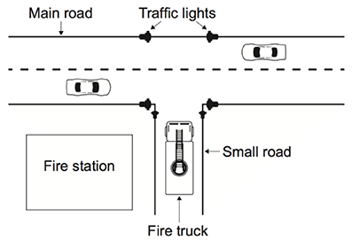

## Unit 7: Past paper questions

### 2014 May, Paper 1, HL, Q10

Outline two distinct features of autonomous agents.

### 2014 May, Paper 1, HL, Q11

A builder is renovating a series of apartments and is considering integrating a few electrical devices in each apartment into an automatic programmable system. One example is the integration of lighting, heating, ventilation and air conditioning.

1.  Identify two groups of users that might find this integrated technology particularly appealing. [2]

2.  Discuss two advantages, offered by this technology, that could be used in an advertisement for the apartments. [4]

3.  Evaluate two ways users can access the functionality of the integrated system at home. [6]

The same technology is adapted and used for intensive chicken farming; in this context a decentralized control is preferred.

1.  Describe how this could be achieved. [3]

### 2014 November, Paper 1, HL, Q13

An automated security system monitors a prison.

1.  Suggest the sensors that could be used to detect any person crossing the perimeter. [2] A team of security guards patrols the perimeter of the prison at night. The guards each carry a device incorporating a GPS that links to the prison’s security system.

2.  Outline a suitable output that would notify a guard that a prisoner has escaped. [2] The guards’ GPS devices transmit information to the security system.

3.  Suggest the most suitable method for the transmission

    1.  between the perimeter’s sensors and the security system; [1]

    2.  between the security system and the guards’ devices. [1]

4.  State one method of network security that could be used when transmitting the GPS information. [1]

5.  Outline how this GPS information may be used once transmitted to the security system. [2]

There are other situations where people may be required to carry GPS devices.

1.  Discuss the ethical implications of insisting people carry GPS devices. [6]

### 2015 May, Paper 1, HL, Q12

In a town, a set of traffic lights control access from a small road, where a fire station is located, to a main road that has heavy traffic. In times of emergency, many vehicles from the fire station may need to leave the station at the same time. A system is put in place so that when a fire truck on the small road approaches the main road, the traffic lights switch to green (Go) on the small road and to red (Stop) on the main road.

1.  Outline the role of sensors and a microprocessor in controlling the traffic lights in this way. [4]

2.  Suggest how the traffic lights can be changed back to their original state once there are no more fire trucks coming from the small road. [3]

These traffic lights are controlled by embedded systems at the point of use. It is proposed that they should be controlled from the same central computer as all the other traffic lights in the town.

1.  Discuss the advantages and disadvantages of running the town’s traffic light system on one central computer with multiple inputs and outputs. [5]

A series of cameras are installed at each of the town’s traffic lights. These cameras are connected to the central computer.

1.  Discuss the social implications of monitoring traffic in this way. [3]

### 2015 November, Paper 1, HL, Q9

A control system is used to control sliding doors which automatically open to allow people in and out of a shop.

1a. Identify one type of sensor in this system. [1]

1b. Identify one piece of hardware, other than sensors, that is part of the control system. [1]

1c. With reference to the role of sensors, outline the sequence of steps within the computer control system that will take place when a person approaches the door. [3]

2a. Define the term interrupt. [2]

2b. Describe a situation in this system where an interrupt would occur. [2]

3.  Discuss the contribution of computer control systems in industry where they replace human workers. [6]

### 2016 May, Paper 1, HL, Q10

Discuss one ethical consideration of using CCTV in a workplace. [3]

