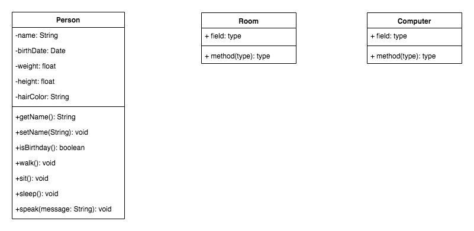
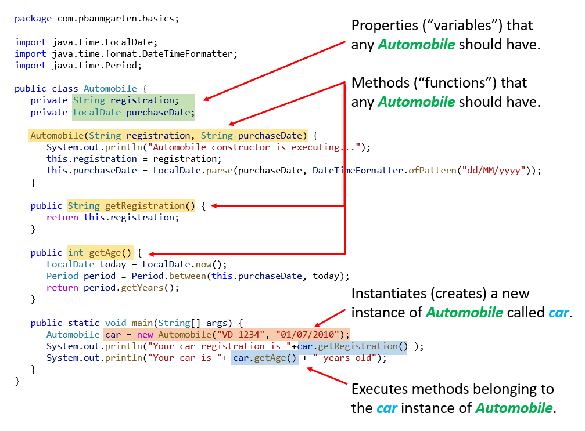
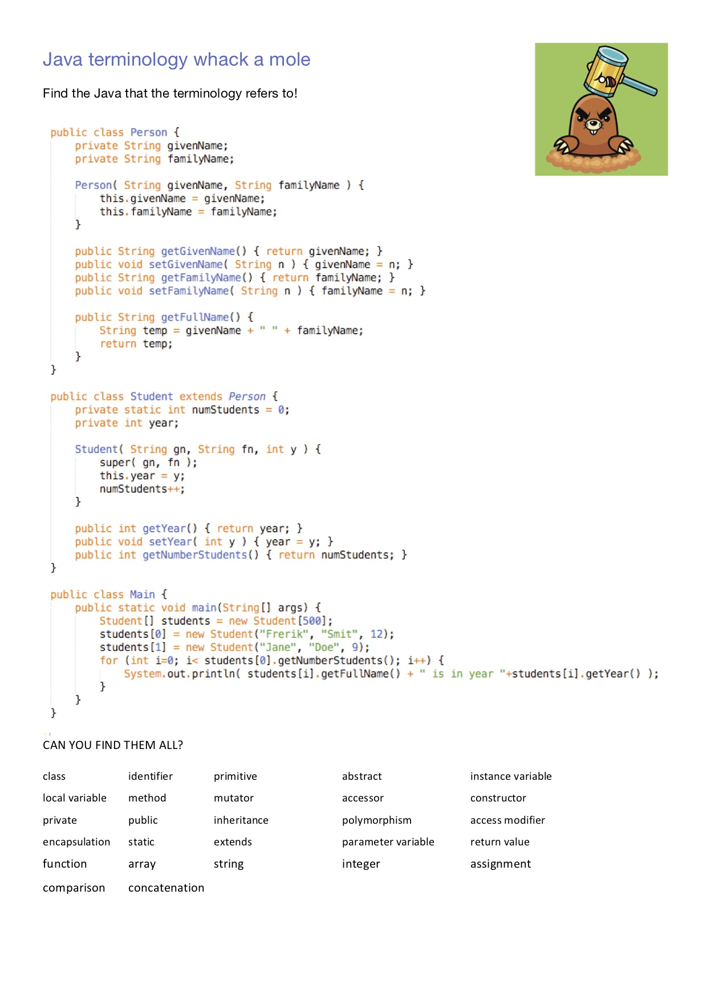

# Unit D1: OOP concepts

Video: Object-oriented Programming in 7 minutes by Mosh (2018)

* [https://www.youtube.com/watch?v=pTB0EiLXUC8](https://www.youtube.com/watch?v=pTB0EiLXUC8)

There's a couple of things that aren't perfect with this video, but as beginners it should serve you fairly well. If you grasp the usefulnesss of grouping related variables and functions together as the main takeaway then you've done well.

## Historical perspective

So far, we have been using a procedural style of programming. That is, our programs have started at the top of a big long list of instructions and worked their way to the bottom where it finished. Along the way our code may have looped a few times, or jumped off to other functions, but it always returned to where it jumped from and kept working it's way through the procedure list.

Object orientated programming is a different way of thinking about computer programming. It was developed in the 1970s by a research project funded by the US Department of Defence that examined ways to improve code re-usability and maintainability. The findings of the research project were:

* 80% of the budget went to the software (with the remaining 20% to the hardware).
* More than 80% of the software budget went to maintenance (only the remaining 20% for new software development).
* Hardware components could be applied to various products, and their integrity normally did not affect other products. (Hardware can share and reuse! Hardware faults are isolated!)
* Software procedures were often non-sharable and not reusable. Software faults could affect other programs running in computers.

The task force proposed to make software behave like hardware OBJECTs. Subsequently, DoD replaces over 450 computer languages, which were then used to build DoD systems, with an object-oriented language called Ada.

Object orientated programming, as the name suggests, is centred around... objects! But what does that mean? In our case, an object is anything that we may want to make a program about! 

## What are objects?

I am an object, you are an object, our classroom is an object, our laptops are objects. The easiest way to grasp the concept initially is to think of physical objects in our known universe (though OOP programming can and is just as easily used to describe "abstract" or "logical" objects not just physical ones).

Designing object orientated programming depends identifying four things:

* Identify the objects relevant to your problem
* Identify how the different objects relate to one-another
* Identify the properties of each class of object
* Identify the behaviours of each class of objet

---

## Classes and objects

What is a class?

The class is the blueprint to the object. Think of the class as architectural drawings, and the objects as all the homes built from those drawings.

In OOP, the class is a classification system for the types or categories of our objects. Each object belongs to a class/type/category.

For example, you and I might belong to a class called People. Our classroom could belong to a class called Rooms, and our laptops could belong to a class called Computers. Each class will be defined to describe various attributes and behaviours that all the objects have that class have.

If we consider the People class, attributes or properties that an object belonging to People may have include: 

* a name, height, age, weight, or hair colour

Behaviours for People objects could include:

* sit, run, sleep, eat, listen, or speak

These are attributes and behaviours that all People objects have, but that objects of Rooms and Computers may not.

What are attributes and behaviours you can think of for the classes of Rooms and Computers?

## Terminology gotcha

Beaware that depending on the documentation you read, some of the following terminology may be used interchangably. Some are more philosphically aligned with object orientated methods, where as others (such as variables and functions) are importing the procedural programming term for the OOP equivilant.

* Consider these terms equivilant: Properties, attributes, and variables
* Consider these terms equivilant: Behaviours, methods, and functions

As with procedural programming, attributes have a data type associated with them. These may be the implicit types int, long, double, String, or they could be another class.

## Instantiation

This process of actually "creating" an object based on its class definition is known as instantiation. It is instantiation that will allocate the memory required to a new object based off the class definition and will execute the code necessary at its construction or birth (more on that later). (as per previous analogy: the act of building the house from the drawings)

---

## UML

This wouldn't be Computer Science if we didn't love a diagram! UML, or the Unified Modelling Language, is a set of diagrams used to document programs. We will use the UML Class diagram to document classes, their attributes and methods, and their relationships to each other. In this course you are expected to be able to (a) interpret and (b) create UML Class diagrams in the exam setting.

A simple UML Class diagram for the Person class we previously discussed would look like this:



Essentially it is a three row box. The first row is the class name, the second is the list of attributes (properties, variables) and the third is the list of methods (behaviours, functions).

## UML Exercises

Let's explore a few common scenarios and decompose them into likely classes of objects that are documentated through UML diagrams.

* Employment
* Motor vehicle licensing
* Air traffic control
* Calculators
* Calendars
* Media collections

---

## Relationships

Objects (and by extension their classes) are frequently related to each other. This relationship is also identified in the UML diagram. While there are others, there are three types of relationships the IB syllabus dictates you understand. They are:

* dependency (“uses”); 
* aggregation (“has a”) (which is really a subset type of dependency); and
* inheritance (“is a”)

Looking at the example of a car, here are the three types of relationship and how the links are depicted in UML.


## Conceptual summary

At its heart, OOP methodology is about abstracting a problem into the objects within the problem. The idea is that each object becomes a self contained unit, with all it's attributes and methods enclosed within. 

It is thought that this makes data safer and manipulation of data more predictable. 

---

## Coding example

If you haven't used Java before, you really should look at my introduction to [Java programming notes](https://pbaumgarten.com/java/java-intro/)

That said, to create a simple class and an object from it, it would look like the following:

```java
package com.pbaumgarten.basics;

public class Automobile {
   private String registration;

   Automobile(String registration) {
      System.out.println("Automobile constructor is executing...");
      this.registration = registration;
   }

   public String getRegistration() {
      return this.registration;
   }

   public static void main(String[] args) {
      Automobile car = new Automobile("VD-1234");
      System.out.print("Your car registration number is: "+car.getRegistration() );
   }
}
```

Let's pause at this point and go through what's happening. Specifically we should discuss:

* Defining the class
* Instantiating an object from the class (by declaring the datatype of the new object and invoking the constructor for the class - [see more detailed example here](oop-declare-and-instantiate.md)).
* The use of `static` and the `main()` function, if this is your first ever Java program
* The use of `package`
* The strict naming requirements linkage between the .java filename, the class and the constructor.
* The keyword `this` can be used to internally reference any property or method belonging to oneself. (ie: When an instance (object) of the class is running a method)

While the above shows you the basic structure, it doesn't actually do anything. So let's add just a little functionality to our class so we can build "something" out of it as we go.

```java
package com.pbaumgarten.basics;

import java.time.LocalDate;
import java.time.format.DateTimeFormatter;
import java.time.Period;

public class Automobile {
   private String registration;
   private LocalDate purchaseDate;

   Automobile(String registration, String purchaseDate) {
      System.out.println("Automobile constructor is executing...");
      this.registration = registration;
      this.purchaseDate = LocalDate.parse(purchaseDate, DateTimeFormatter.ofPattern("dd/MM/yyyy"));
   }

   public String getRegistration() {
      return this.registration;
   }

   public int getAge() {
      LocalDate today = LocalDate.now();
      Period period = Period.between(this.purchaseDate, today);
      return period.getYears();
   }

   public static void main(String[] args) {
      Automobile car = new Automobile("VD-1234", "01/07/2010");
      System.out.println("Your car is " + car.getAge() + " years old");
   }
}
```

For now, I don't want you to be too concerned about all the extra boiler plate and language specific keywords with Java. The core idea at this time is to appreciate that

* A class is a template from which multiple objects can be created
* In our example below, any object created from *Automobile* will have two properties `String registration` and `LocalDate purchaseDate`, and three methods `Automobile()`, `getRegistration()` and `getAge()`.
* That those methods can be executed by any object that is created from the class template. (The properties can be accessed as well if they are designated public but that is considered bad practice - to be discussed later).



---

# Unit D2: OOP features

There are three core principles of object orientated programming you must be familiar with: Inheritance, encapsulation, and polymorphism.

## Abstraction

Not one of the "three cores of OOP" according to the IB syllabus, but in reality it is a fairly fundamental idea you need to understand. The phrase has appeared in past papers as well, so, go figure.

Abstraction refers to the concept of hiding the complexities of a system from the users of that system.

From a programmers perspective, we must be comfortable with operating at two different levels of abstraction.

We can be the end user of an abstraction; Using the documentation provided for us, we use classes written by others (released via a library or API), and make method calss etc on that abstraction.

We can also be the author of an abstraction; Writing classes to be used by others. We design our classes to be self-contained with all the information they need to perform their functions without undeclared dependcies on other parts of the system.

## Encapsulation

Encapsulation is a language construct which bundles data and behavior together. In addition, it restricts access to this data and behavior bundled together.

Looking at the example of a power steering mechanism of a car. Power steering of a car is a complex system, which internally have lots of components tightly coupled together, they work synchronously to turn the car in the desired direction. It even controls the power delivered by the engine to the steering wheel. But to the external world there is only one interface is available and rest of the complexity is hidden. Moreover, the steering unit in itself is complete and independent. It does not affect the functioning of any other mechanism.

Encapsulated code should have following characteristics:

* Everyone knows how to access it.
* Can be easily used regardless of implementation details.
* There shouldn’t any side effects of the code, to the rest of the application.

Put another way, the only way the attributes (variables) within an object should be read or modified is by the methods (functions) belonging to that particular object. Code external to the object should never attempt to access the data directly. In theory, the code outside the object shouldn't care what the data inside the object is – it should be able to treat it as a black box and just trust that it looks after itself correctly.

Because of the principle of encapsulation, it is quite common to write some simple methods that are known as "getters and setters" whose purpose is basically to get and set object variables. This would be for those attributes that the object doesn't really care if they are modified by others or not.

* A getter is a function in an object that can be used to return the value of a private variable.
* A setter is a function in an object that can be used to set the value of a private variable.

For example, if you have an attribute `String email;`, it's getter and setter would be:

```java
public String getEmail() { return email; }
public void setEmail(String email) { this.email = email; }
```

Notice that we have been using getters and setters already.

Another example that illustrates the difference between haing your properties properly encapsulated and not. (don't bother with coding this)

```java
class Person {
   String name = "";
   String getName(){
      return name;
   }
   void setName(String name){
      this.name = name;
   }
}

//.... later in our main

Person genta = new Person();
genta.name = "Genta";            // <--- This breaks encapsulation
genta.setName( "Genta" );        // <--- This obeys encapsulation
println( genta.getName() );
```

Obviously if our getter and setter functions just automatically and blindly accept the data provided, they don't provide much material benefit over making the attributes public. In reality, however, they would not behave that way. They could be used to provide implicit security checking and validation of the data.

As an example, the Person class below has a private attribute for the `dateOfBirth`. The `setDateOfBirth()` function is able to validate the date supplied is valid before accepting it.

```java
import java.time.LocalDate;

class Person {
    private LocalDate dateOfBirth;

    Person() {
        dateOfBirth = null;
    }

    public void setDateOfBirth( LocalDate dateOfBirth ) {
        LocalDate today = LocalDate.now();
        // Check that the year of birth is in the past
        if (dateOfBirth.getYear() <= today.getYear()) {
            this.dateOfBirth = dateOfBirth;
        }
    }
```

### Access modifiers

In Java, encapsulation can be enforced by use of access modifiers. They specify the accessibility of a class and its members with respective to other classes and members. In Java they are:

* public – visible to the world
* protected – visible to the package and all sub classes
* package/default/no access modifier provided - visible to the package
* private – visible to the class only

Visibility of the class is checked before the visibility of the variable defined inside that class. If the class is visible only then the variables defined inside that class will be visible. If the class is not visible then no variable will be accessible, even if it is set to public.

We'll revisit the previous example but add the access modifiers.

```java
public class Person() {
   private String name = "";     // <---- By adding the use of `private` here...
   public String getName(){
      return name;
   }
   public void setName(String name){
      this.name = name;
   }
}

Person genta = new Person();
Person fred = new Person();
genta.name = "Genta";            // <---- Will cause Java to refuse to allow this here
genta.setName( "Genta" );
println( genta.getName() );
```

---

## Inheritance

Inheritance is the idea that a new class can be based off an already existing class. In doing so, it can inherit the methods and attributes of the superclass without them having to be re-written. If you change the code within the superclass, that change will automatically flow through to any subclasses created based off it.

For example the Dept of Transport could have an Automobile class which contains vehicle owner details, registration tag etc. They can also have a Motorcycle class, Car class, and Truck class that inherit from automobile.

Some other examples:


* Superclass: Pet; ... Subclasses: Dog, cat, bird, rabbit
* Superclass: Person; ... Subclasses: Teacher, student, parent
* Superclass: Room; ... Subclasses: Penthouse, Suite, King room, Double room, Twin room

Be aware that unlike humans, classes in OOP can only have one parent!

Coding example, adding to our previous code.

```java
package com.pbaumgarten.basics;

public class Car extends Automobile {
   private String color;

   Car(String registration, String purchaseDate, String color) {
      super(registration, purchaseDate);
      System.out.println("Car constructor is executing...");
      this.color = color;
   }

   public String getColor() {
      return this.color;
   }

   public static void main(String[] args) {
      Car car = new Car("VD-1234", "01/07/2010", "lime green!");
      System.out.println("Your car is " + car.getAge() + " years old");
      System.out.println("And it's color is " + car.getColor() );
   }
}
```

Key points to discuss:

* The use of `extends` keyword
* The use of `super()` in the constructor. It must be the first line.
* Where does the `car.getAge()` function come from we are using in `main`?


---

## Polymorphism

Polymorphism is the concept that allows our object to have multiple implementations of the same behaviour depending on the data it receives. There are two types of polymorphism that can be used within Java OOP: Overloading, and Overriding.


### Polymorphism by overloading

Overloading means we will have two methods with the identical name, but expecting different input parameters. Which one is executed depends on the parameters that are provided at run time. 

Returning to the Person example with the setDateOfBirth() function, what if we want to be able to set the date of birth using a text string (which is how our program is more likely to receive the information from a user). We can use overloading to provide us several different options that will execute the same task. Consider the following...

```java
    public void setDateOfBirth( LocalDate dateOfBirth ) {
        LocalDate today = LocalDate.now();
        if (dateOfBirth.getYear() <= today.getYear()) {
            this.dateOfBirth = dateOfBirth;
        }
    }

    public void setDateOfBirth( int year, int month, int day ) {
        LocalDate today = LocalDate.now();
        if (day >= 1 && day <= 31 && month >= 1 && month <= 12 && year >= 1900 && year <= today.getYear()) {
            LocalDate dob = LocalDate.of(year, month, day);
            setDateOfBirth(dob);
        }
    }

    public void setDateOfBirth( String dateOfBirth ) {
        LocalDate today = LocalDate.now();
        String[] dateParts = dateOfBirth.split("/");
        int d,m,y;
        if (dateParts.length == 3) {
            d = Integer.parseInt(dateParts[0]);
            m = Integer.parseInt(dateParts[1]);
            y = Integer.parseInt(dateParts[2]);
            if (d >= 1 && d <= 31 && m >= 1 && m <= 12 && y >= 1900 && y <= today.getYear()) {
                LocalDate dob = LocalDate.parse(dateOfBirth, DateTimeFormatter.ofPattern("dd/MM/yyyy"));
                setDateOfBirth(dob);
            }
        }
    }
```

Above we have three methods for setting a date of birth. What determines which one is executed depends on the combination of parameters provided.  All three of the following function calls will work:

```java
Person demo = new Person();

LocalDate date = LocalDate.of( 2000, 1, 1 );
demo.setDateOfBirth( date );                    // Supply a LocalDate object
System.out.println( demo.getDateOfBirth() )
System.out.println( demo.getAge() );

demo.setDateOfBirth( 2005, 5, 1 );              // Supply three integers
System.out.println( demo.getDateOfBirth() )
System.out.println( demo.getAge() );

demo.setDateOfBirth( "14/03/2010" );            // Supply a String
System.out.println( demo.getDateOfBirth() )
System.out.println( demo.getAge() );
```

Overloading polymorphism is a very handy tool as it means we don't have to continually remember "what did I call that method for this circumstance?". It comes in particularly useful when we are usually going to want our program to assume a default value, so we don't want to have to manually specify it every time, but also allowing us the possibility to override the default – such as the above example with the speed of the vehicle.

### Polymorphism by overriding

Overriding means a subclass is implementing a method of the same name as exists in the superclass.

In this case the subclass will override the method of the superclass. Just like the inherited constructors, the super keyword can be used to invoke the parent method.

```java
public class Person {
    String name;
    Person(String name) {
        this.name = name;
    }
    public String getName() {
        return this.name;
    }
}

public class Royalty extends Person {
    Royalty(String name) {
        super(name);
    }
    public String getName() {   // Overriding the .getName() method in Person
        return "Your Royal Highness "+name;
    }
}

public class Demo {
    public static void main() {
        Person commoner = new Person("John");
        System.out.println( commoner.getName() );
        Royalty queen = new Royalty("Elizabeth");
        System.out.println( queen.getName() );   // Will run the overriden getName() method
   }
}
```

### Questions on Polymorphism

Examine the following codes and draw the class diagram.

Note: An abstract class is a class that cannot be directly instantiated. It serves as a template that you can inherit existing functionalty from.

```java
abstract public class Animal {
   protected String name;

   public Animal(String name) {
      System.out.println("(Animal constructor)");
      this.name = name;
   }

   public String getName() { return name; }

   abstract public void greeting();
}

public class Cat extends Animal {
   public Cat(String name) {
      super(name);
      System.out.println("(Cat constructor)");
   }

   @Override
   public void greeting() {
      System.out.println(name+" says Meow!");
   }
}

public class Dog extends Animal {
   public Dog(String name) {
      super(name);
      System.out.println("(Dog constructor)");
   }

   @Override
   public void greeting() {
      System.out.println(name+" says Woof!");
   }
   
   public void greeting(Dog another) {
      System.out.println(name+"says Woooooooooof! to "+another.getName());
   }
}

public class Chihuahua extends Dog {
   public Chihuahua(String name) {
      super(name);
      System.out.println("(Dog constructor)");
   }

   @Override
   public void greeting() {
      System.out.println(name+" says Yap!");
   }
   
   @Override
   public void greeting(Dog another) {
      System.out.println(name+" says Yapyapyapyapyap! to "+another.getName());
   }
}
```

Explain the outputs (or error) for the following test program.

```java
public class TestAnimal {
   public static void main(String[] args) {
      // Using the subclasses
      Cat felix = new Cat("Felix");
      felix.greeting();
      Dog snoopy = new Dog("Snoopy");
      snoopy.greeting();
      Chihuahua chihuahua = new Chihuahua("Chihuahua");
      chihuahua.greeting();
       
      // Using Polymorphism
      Animal garfield = new Cat("Garfield");
      garfield.greeting();
      Animal scooby = new Dog("Scooby");
      scooby.greeting();
      Animal ren = new Chihuahua("Ren");
      ren.greeting();
      Animal animal4 = new Animal("Animal");
      
      // Downcast
      Dog brian = (Dog)scooby;
      Chihuahua ren2 = (Chihuahua)ren;
      Dog pluto = (Dog)ren;
      Cat sylvester = (Cat)scooby;
      brian.greeting(pluto);
      pluto.greeting(brian);
      brian.greeting(ren2);
      ren2.greeting(brian);
      ren2.greeting(chihuahua);
   }
}
```

## Advantages of OOP

Once you start programming in Java, you'll quickly realise the importance of **packages**. Packages in Java are a mechanism to encapsulate a group of classes, interfaces and sub packages.

Packaging of classes is used as loading the entire suite of functionality would consume too many system resources, especially when many/most programs don't need it. A programmer can therefore make their application more efficient by loading in the various subsets of functionality to suit their needs.

Packages are also a convenient way of grouping together classes we have written for reuse in other programs. You can easily package several classes together, and bundle them into a JAR file to share with others in their **library of packages**.

As a result, complex algorithms and processes do not have to be “re-invented” but **shared and re-used**.

Some added advantages of this modularity is

* It (in theory) makes for **easier debugging and testing**. If your classes are properly encapsulated with no other classes affecting them, and they don't have sideeffects on others, then you should be able to fully test and debug a class in isolation for other parts of the code base.

* It (again, in thoery) should also ease the process of **programming in teams**. Individuals can take responsiblity for the programming of certain classes, and provided the internal programming is sound, it should be able to be placed into the larger project with ease.

Object­ oriented programming is popular in big companies, because it suits the way they write software. At big companies, software tends to be written by large (and frequently changing) teams of mediocre programmers. OOP imposes a discipline on these programmers that prevents any one of them from doing too much damage. The price is that the resulting code is bloated with protocols and full of duplication. This is not too high a price for big companies, because their software is probably going to be bloated and full of duplication anyway.

## Disadvantages of OOP

Where there are advantages, there are of course, disadvantages. It is also the case that some of the "advantages" are increasingly contentious so make up your own mind.

The most glaring disadvantages of OOP are:

* it increases complexity for small problems where a simple procedual approach would suffice
* it is a methodology that is unsuited to particular classes of problem

Also the Java incarnation of OOP is known for being particularly verbose. You'll particularly notice this whenever trying to deal with any I/O.

The following is a very interesting paper, looking at some of the risks with our industry's increased reliance on software dependancies, particularly the use of 3rd party modular libraries in our codebase. I highly recommend reading it.

* Cox, Russ (2019) "Our Software Dependency Problem" available at [https://research.swtch.com/deps](https://research.swtch.com/deps)

# Unit D3: OOP programming

## Terminology

Before we spend too much time programming OOP, are there any terms we need to discuss? You should be familiar with all of these:

* class
* identifier
* primitive
* instance variable
* parameter variable
* local variable
* method
* accessor
* mutator
* constructor
* signature
* return value
* private
* protected
* public
* extends
* static

---



## Programmer considerations

Finally, before we start too much more programming, here are some considerations for you when programming your projects:

* Inclusionary practices
* Features related to internationalisation
* Timezones
* Multi language support
* Unicode (necessary for multi-language character support)

How much do programmers have ethical & moral duties in their work?  For instance:

* Is it the programmers duty to ensure adequate testing of products to prevent the possibilities of commercial or other damage? 
* What about acknowledging the work of other programmers? 
* What is the Open Source movement, and ethically how important is it to contribute to it if you plan on taking advantage of open source code in your project?

---

## OOP example code

```java
package com.pbaumgarten.oop;

public class Circle {
   private static final double pi = 3.1415;
   private double radius;

   Circle(double radius) {
      this.radius = radius;
   }
   public double getCircumference() {
      return( 2 * pi * radius );
   }
   public double getArea() {
      return( pi * radius * radius );
   }
   public double getRadius() {
      return( radius );
   }
   public void setRadius(double radius) {
      this.radius = radius;
   }
   public static void main(String[] args) {
      Circle c = new Circle(20);
      System.out.println("=== CIRCLE ===");
      System.out.println("Radius: "+c.getRadius() );
      System.out.println("Area: "+c.getArea() );
      System.out.println("Circumference: "+c.getCircumference() );
   }
}
```

In the above example, where is the code...

* Defining the class
* Defining the constructor
* Instantiating the object
* Using the object

---

To use inheritance with our Circle, we might create a Sphere class.

```java
package com.pbaumgarten.oop;

public class Sphere extends Circle {
   Sphere(double radius) {
      super(radius);
   }
   public double getVolume() {
      return( (4.0 * pi * radius * radius * radius ) / 3.0 );
   }
   public double getArea() {
      return( 4 * pi * radius * radius );
   }
   public static void main(String[] args) {
      Circle c = new Circle(5);
      Sphere s = new Sphere(10);
      System.out.println("=== CIRCLE ===");
      System.out.println("Radius: "+c.getRadius() );
      System.out.println("Area: "+c.getArea() );
      System.out.println("Circumference: "+c.getCircumference() );
      System.out.println("=== SPHERE ===");
      System.out.println("Radius: "+s.getRadius() );
      System.out.println("Surface area: "+s.getArea() );
      System.out.println("Volume: "+s.getVolume() );
   }
}
```

* Caution: For the above Sphere to work, you will need to make one change to Circle. The access modifier for radius will not allow Sphere to compile. What access modifier should be used instead of `private`? Check your access modifier notes.

## Problem set

### Q0: Warm up

Create a Cylinder class such that the following `main()` will execute as expected. Notice you need an overloaded constructor!

```java
   public static void main(String[] args) {
      Circle c = new Circle(5);
      Sphere s = new Sphere(10);
      Cylinder cy1 = new Cylinder(c,10);
      Cylinder cy2 = new Cylinder(30,10);
      System.out.println("=== CIRCLE ===");
      System.out.println("Radius: "+c.getRadius() );
      System.out.println("Area: "+c.getArea() );
      System.out.println("Circumference: "+c.getCircumference() );
      System.out.println("=== SPHERE ===");
      System.out.println("Radius: "+s.getRadius() );
      System.out.println("Surface area: "+s.getArea() );
      System.out.println("Volume: "+s.getVolume() );
      System.out.println("=== CYLINDER 1 ===");
      System.out.println("Radius: "+cy1.getRadius() );
      System.out.println("Length: "+cy1.getLength() );
      System.out.println("Surface area: "+cy1.getArea() );
      System.out.println("Volume: "+cy1.getVolume() );
      System.out.println("=== CYLINDER 2 ===");
      System.out.println("Radius: "+cy2.getRadius() );
      System.out.println("Length: "+cy2.getLength() );
      System.out.println("Surface area: "+cy2.getArea() );
      System.out.println("Volume: "+cy2.getVolume() );
   }
```

### Q1: Student's books

Create a class for `Student` and a class for `Book`.

Create an `ArrayList<Student>`, where each Student has a collection of books stored in `ArrayList<Book>`.

Methods to consider:

1. A particular student buys a new book (add to `ArrayList<Book>`)
2. A particular student donates a selected book (remove from `ArrayList<Book>`)
3. Print out list of books a particular student has.
4. Print out the name of a student who has a particular book.
5. Print number of books each student has.
6. Provide a simple console based user interface to add student, add book, donate book, and to run each of the print tasks.

Student fields should include: givenName, familyName, studentNumber, academicYear.

Book fields should include: title, author, isbn.

(Adapted from: N.Ghazaryan via IB forums)

If it helps, I have a CSV file of book data available at [https://github.com/paulbaumgarten/data-sets](https://github.com/paulbaumgarten/data-sets) (but it is not required for the question)

### Q3: Hotel reservations

Create a simple Hotel reservation system.

Classes required include:

* `Rooms` class which should allow for different types of rooms.
* `Customer` class which should allow for a loyalty scheme.
* `Booking` class.  Keep it simple, one customer can only reserve one room per booking.
* Create a booking interface that maintains an array of bookings, allows for new bookings, viewing bookings for a room, viewing bookings for a customer etc.

### Q4: Employee


### Q5: Province animal registrations

Create a simple animal registration system for your local government authority.

* Design your own classes. The system needs for allow for different breeds, and to store the age, color, animal name and owner information. Each owner may have multiple pets.

---

### Q6. Contacts information system

Create a contacts information system, along the lines of the one in my Java tutorials

* [https://pbaumgarten.com/java/swing.html](https://pbaumgarten.com/java/swing.html)


### Credits

Some exercies from http://www.ntu.edu.sg/home/ehchua/programming/java/J3f_OOPExercises.html

