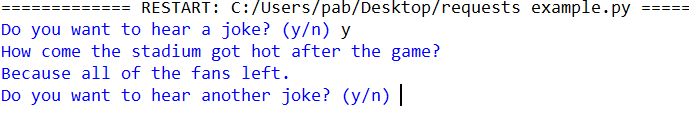
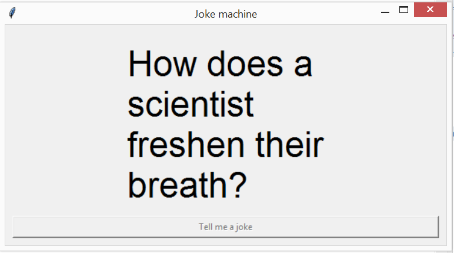

# Random joke machine

In the context of creating a random joke machine, this exercise will introduce you to three new concepts.

* Reading content from websites
* Dictionaries
* Graphical user interfaces (tkinter)

## Reading content from websites

As the world of technology is increasingly interconnected, it is a frequent desire to have one program communicate with another, and the web is most commonly used for this purpose.

A web based API (application programming interface), describes a set of messages that the programming team managing a web server has published to allow other programs to interact with their system.

Let's start with the very basics of reading the content of a webpage via Python. We can do this in just a few lines as follows.

```python
import requests

response = requests.get("https://raw.githubusercontent.com/paulbaumgarten/data-sets/master/download-test.txt")
status = response.status_code
content_type = response.headers['content-type']
content = response.content.decode("utf-8")
print(f"The status code is {status}")
print(f"The content type is {content_type}")
print("The content of the document is...")
print(content)
```

The `requests` library, while not part of the standard Python library, is so commonly and extensively used that it might as well be. It dramatically simplifies the process involved in interacting with web servers via your Python program. If you get an error indicating that `requests` is not installed open your command prompt and run `pip install requests`.

Looking at the above three lines, the `requests.get()` is probably quite intuitive. Given an internet URL address, it gets the content at that address and saves it into the `response` variable. The second line is the one that might need some explaining.

The response received from a website is not simply just the text information. It includes a variety of "meta information" as well. For instance, `response.status_code` is used to communicate how successful the response received from the server was. There are internationally established and recognised codes for web servers to use for this. The official list of them can be found here [https://en.wikipedia.org/wiki/List_of_HTTP_status_codes](https://en.wikipedia.org/wiki/List_of_HTTP_status_codes) but some of the more common ones are:

* 200 - OK (this is what you will be mostly hoping for)
* 401 - Unauthorised
* 403 - Forbidden
* 404 - Not found (you've probably seen this before)

The actual content of the web page received is also typically encoded, so lets quickly discuss the line...

```python
content = response.content.decode("utf-8")
```

The response object (or variable) obviously contains all the content of the webpage or file that we have downloaded. That is stored in the `.content` attribute. This content is natively stored as bytes (that is, numbers 0 to 255) rather than as characters. This might seem strange at first but there are some very good reasons for it when you think about it. In our simple example, we have just used the `requests` tool to download a text file. We could also easily use it to read a HTML file the same way (such as if you used it on `https://wikipedia.org/` or some other website address). 

The issue is that text isn't the only type of content we could download. In fact, most of the content on the web is no longer text. There are videos, photos, audio files, and everything else in between. We can use the `requests` library for it all, so it needs to be able to deal with all the different types of content that could be downloaded. `utf-8` is a commonly used format for text strings, so we are instructing the response to interpret the content as utf-8. This would obviously produce a garbled mess if we downloaded a JPG and used `decode("utf-8")` on that. We need to use a decoding appropriate to the content we have, but in this case utf-8 is what we want.

The other reason for the encoding which not be as immediately obvious is that web servers typically compress the data they send, to save bandwidth and therefore speed up the download process.

Once decoded, we can save it into a simple string variable and print the result if desired.

## Dictionaries

For our joke machine, we are going to use a web server that makes different jokes randomly available.

To see what the server itself will provide to our Python program, try opening the address in your web browser to see what it returns, `https://official-joke-api.appspot.com/random_joke`.

As you will quickly observe, while the content is text, it is not just plain unstructured text, it contains formatting that looks like code. An example of the response content looks like...

```json
{"id":346,"type":"general","setup":"Why did the octopus beat the shark in a fight?","punchline":"Because it was well armed."}
```

This is known in the industry as JSON (stands for Java Script Object Notation). Because Javascript is the programming language available in the web browser, it has become the means most commonly used for exchanging data across the web. Fortunately Python can interpret it quite easily and turn it into individually addressable variables by using the Python Dictionary data type.

Let's write a simple Python program that converts a JSON string such as the one above into a dictionary to see what it does.

```python
import json
import time

original = """
{"id":346,"type":"general","setup":"Why did the octopus beat the shark in a fight?","punchline":"Because it was well armed."}
"""

converted = json.loads(original)
question = converted["setup"]
answer = converted["punchline"]

print(question)
time.sleep(5)
print(answer)
```

The `json.load()` function will take a string as input that contains JSON text. It returns a dictionary object. A dictionary object is similar to a list in that it is one variable name through which we can access multiple items. Where as the list datatype uses index numbers to access the individual elements, the dictionary uses names to control access to individual elements.

(By the way, if you haven't seen the `"""` before, Python allows us to create multi-line text strings by using the triple-double-quote to open and close the string).

## Joke machine version 1



So, bringing together our use of `requests` and `json`, we can make a simple random joke machine that looks like the following.

```python
import requests
import json
import time

keepgoing = input("Do you want to hear a joke? (y/n) ")
while keepgoing == "y":
    url = "https://official-joke-api.appspot.com/random_joke"
    response = requests.get(url)
    joke = json.loads(response.content.decode("utf-8"))
    print( joke["setup"] )
    time.sleep(3)
    print( joke["punchline"] )
    keepgoing = input("Do you want to hear another joke? (y/n) ")
```

## Graphical user interfaces

The next step, if we are so bold, is to convert our joke machine from a simple text program into a graphical one.



Python has a built in system for graphical user interfaces called the `tkinter` library.

```python
import tkinter as tk
import requests
import json
import time

def get_joke():
    url = "https://official-joke-api.appspot.com/random_joke"
    response = requests.get(url)
    if response.status_code == 200:
        received = response.content.decode("utf-8")
        return json.loads(received)
    else:
        return None

class JokeScreen():
    def __init__(self, parent):
        self.parent = parent
        # Create a new window
        self.window = tk.Toplevel()
        self.window.geometry("600x300")
        self.window.title("Joke machine")
        # Enable the close icon
        self.window.protocol("WM_DELETE_WINDOW", self.parent.quit)
        # Create a large text area on the window for writing our joke 
        self.text = tk.Message(self.window, text="", font=("Arial", 36))
        self.text.place(x=10, y=10, width=580, height=250)
        # Create a button across the bottom of our screen
        self.joke_button = tk.Button(self.window, text="Tell me a joke", command=self.tell_a_joke)
        self.joke_button.place(x=10, y=260, width=580, height=30)

    def tell_a_joke(self):
        # Will execute whenever the joke_button is clicked
        self.joke_button.configure(state=tk.DISABLED)
        joke = get_joke()
        if joke is not None:
            # Save the joke to our app
            self.joke_part_1 = joke["setup"]
            self.joke_part_2 = joke["punchline"]
            # Display part one of the joke
            self.text.configure(text=self.joke_part_1)
            # After 3 seconds, run the reveal_punchline function
            self.text.after(3000, self.reveal_punchline)

    def reveal_punchline(self):
        self.text.configure(text=self.joke_part_2)
        self.joke_button.configure(state=tk.NORMAL)

root = tk.Tk()          # Load tkinter
root.withdraw()         # Hide the default window
app = JokeScreen(root)  # Create an instance of our class
root.mainloop()         # Run the tkinter system
```

There is a lot to this which I'll only briefly address here. For a more detailed understanding of the concepts, you need to learn about Object Orientated Programming, event driven programming, as well getting very familiar with the reference documentation for Tkinter.  Unfortunately it's not feasible to give justice to any of these ideas what is supposed to be a quick one lesson exercise. For now, study the above code and see how much of it makes some intuitive sense. We can dig into the bigger ideas another time.

If you are interested in exploring tkinter more, I have started creating a series of notes and video tutorials...

* [https://pbaumgarten.com/python/tkinter](https://pbaumgarten.com/python/tkinter)
* [https://www.youtube.com/playlist?list=PLM-syYolLbswrdNhQmzZDAiJmrJFFSU89](https://www.youtube.com/playlist?list=PLM-syYolLbswrdNhQmzZDAiJmrJFFSU89)

## Further reading/viewing

If interested, a more detailed tutorial of the requests library can be found at...

* [https://realpython.com/python-requests/](https://realpython.com/python-requests/)

