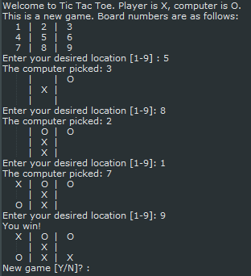

# General problem set: Programming and algorithmic thinking practice

This is a general purpose problem set for practicing and developing your programming and algorithmic thinking skills.

It is intended for those who have completed the basic programming tutorials and problem sets, and are ready for something a little more challenging that will force you to think your way through various problems. I would typically expect this to suit thoses who have been programming for at least 6 months already.

This list will be added to over time. If you come across a problem that you think would be worth adding, please let me know!

## Caesars cipher

Julius Caesar created one of the first own encryption algorithms. It used a substitution method where each letter was replaced by another a fixed number of letters across from the original.

For example: with a cipher key of 1, each letter shifts up one position as shown:

> `plaintext:     defend the east wall of the castle`
> `ciphertext:    efgfoe uif fbtu xbmm pg uif dbtumf`

Create pseudo code that replicates the Caesar Cipher algorithm. Swap and test your neighbours algorithm with a trace table.

Only once your trace table verifies your algorithm (and you have shown it to me), may you proceed with attempting it in code.

## Vigenère cipher

Earlier, we designed and coded a Caesar cipher. Unfortunately they’re very easy to crack. How about trying a Vigenère cipher or a Rail fence cipher?

For a full explination of the Vigenère, [read this](https://pages.mtu.edu/~shene/NSF-4/Tutorial/VIG/Vig-Base.html)

While the normal way of learning the Vigenère relies on a 26x26 lookup table, it actually isn't necessary. The trick to the Vigenère over the Ceasar is that you use a word as your cipher key instead of a single value letter or number. You iterate through the value positions of each letter of your key word, and then resetting to the start again when you need more values.  The following illustration shows how to encode the message "ATTACK THE ENEMY" using the cipher key of "SECRET". 


See how you go at building a Vigenère encoder and decoder. Some examples...

| clear_text | key_word | Expected result |
| ---------- | -------- | --------------- |
| "attack" | "secret" | "sxvrgd" |
| "defend at all costs" | "secret" | "vihvrw sx ccp vgwvj" |
| "defend at all costs" | "abcdefg" | "dfhhri gt bno gtytt" |


## Rail fence cipher

To quote from the wikipedia article on the Rail Fence cipher:

In the rail fence cipher, the plain text is written downwards and diagonally on successive "rails" of an imaginary fence, then moving up when the bottom rail is reached. When the top rail is reached, the message is written downwards again until the whole plaintext is written out. The message is then read off in rows. For example, if 3 "rails" and the message 'WE ARE DISCOVERED. FLEE AT ONCE' is used, the cipherer writes out:

```
W . . . E . . . C . . . R . . . L . . . T . . . E
. E . R . D . S . O . E . E . F . E . A . O . C .
. . A . . . I . . . V . . . D . . . E . . . N . .
```

Then reads off to get the ciphertext:

```
WECRLTEERDSOEEFEAOCAIVDEN
```

Note that this particular example does NOT use spaces separating the words. The decipherer will need to add them based on context. If spaces are shown in the ciphertext, then they must be included in the count of letters to determine the width of the solution grid.

Keys can also be used in this cipher eg In this example shown above have Key=3 which means there is three rails, or three lines of text.

More info: [https://en.wikipedia.org/wiki/Rail_fence_cipher](https://en.wikipedia.org/wiki/Rail_fence_cipher)

## Closest pair problem

The closest pair problem is a "classic" algorithm for beginning coders. (The closest pair of points problem or closest pair problem is a problem of computational geometry: given n points in metric space, find a pair of points with the smallest distance between them). It has real life significance in many applications. Consider: where are the closest shops? where is the closest hospital?

Your task:

* Derive an algorithm based on the Haversine formula (use your 7 step process). 
* Use the your algorithm to find the distance from our classroom to each city. 
* Generate a list in sorted order of every location, from closest to most distant.

Assumptions provided:

* The radius of the earth is 6373 km.
* The coordinates of my classroom @ ISL are: `{"lat": 46.542816, "lng":6.637191}`

Location data: Use any of the following...

* [City information dataset 1](https://github.com/paulbaumgarten/data-sets) - 660 records (good starting point)
* [City information dataset 2](https://github.com/bahar/WorldCityLocations) - ~10 thousand records
* [City information dataset 3](https://github.com/lutangar/cities.json) - ~4 million records!

You will likely need to check the documentation for the math functionality you will require for your programming language:

* [Javascript Math library reference](https://developer.mozilla.org/en-US/docs/Web/JavaScript/Reference/Global_Objects/Math)
* [Python Math library reference](https://docs.python.org/3/library/math.html)
* [Java Math library reference](https://docs.oracle.com/javase/8/docs/api/java/lang/Math.html)

The haversine formula determines the great-circle distance between two points on a sphere given their longitudes and latitudes.

It holds that where:

* `d` -  the distance between the two points (along the surface of the sphere),
* `r` -  the radius of the sphere,
* `φ1` - latitude of point 1 
* `φ2` - latitude of point 2,
* `λ1` - longitude of point 1,
* `λ2` - longitude of point 2.

then d =


## Tic-tac-toe

Mastering the art and skill of programming requires good problem solving skills. This exercise requires you to read input in from a user, perform some logic on it, and spit out some new information back to the user. You need to understand how to keep repeating a loop until a goal is met. You also need to understand how to make the program make decisions, as this will be a game of player verses computer. Once you complete this you'll feel accomplished and ready to take on a more complicated project. 

Here's the project goal:
1.	Assume the user (player) is an X and the computer is a O
2.	Ask the player where they want to place their X
3.	The computer places an O
4.	Output the 9 tiles showing where each player went
5.	Ask the player where they want to place their X
6.	Repeat until a winner is determined

Sound pretty simple? Go and make it! Then play it. Try and break it. Put an X where an O is. See what happens when there is a "Cat" game (no winner). Here's what I am suggesting for the final product:



## Hang-person

Use files and randomness to create a simple text-based hangman game!

* Download a list of dictionary words from my [data sets collection](https://github.com/paulbaumgarten/data-sets)
* Download [hangmanpictures.py](https://github.com/paulbaumgarten/paulbaumgarten/igcse-compsci/distribute/hangmanpictures.py)

To build this exercise, you will need to successfully complete the following:

* Load the words text file into a Python list
* Use the random number generator to randomly select one item from the list as the secret word
* Reveal the secret word hiding the letters not yet guessed (see below for sample code on this)
* Use a while loop to keep asking the player to guess a new letter
* If a guessed letter is not in the secret word, increase their wrong guesses count and draw the new hangman.
* If a guessed letter is in the word, add it to your list of correct guesses.

To help you get started, the following function will return a string that can be used to show the length of the secret word and the correct guesses.

```python
def getSecretWordHint( secretWord, lettersGuessed ):
    hint = ""
    for letter in secretWord:
        if letter in lettersGuessed:
            hint = hint + letter
        else:
            hint = hint + "_"
    return hint
```

## Blackjack

This "simple" card game requires you to:

 * Maintain a list/array of cards
 * Using a random number generator to shuffle the cards
 * Keep track of which cards have been issued to a player and which are still in the deck (avoiding duplicates)
 * Intelligently determine the value of the cards each player holds, remembering that cards such as the Ace might be worth different points in different circumstances
 * Use a text based or graphical based interface at your choosing

## Change calculator

Given an amount of money (expressed as an integer as the total number of cents, one dollar being equal to 100 cents) and the list of denominations of coins (similarly expressed as cents), create and return a list of coins that add up to amount using the greedy approach where you use as many of the highest denomination coins when possible before moving on to the next lower denomination. The list of coin denominations is guaranteed to given in sorted order, as should your result also be.

| amount | coins | Expected result |
| ----- | ------ | ------ | 
| 64 | [50, 25, 10, 5, 1] | [50, 10, 1, 1, 1, 1] |
| 123 | [100, 25, 10, 5, 1] | [100, 10, 10, 1, 1, 1] |
| 100 | [42, 17, 11, 6, 1] | [42, 42, 11, 1, 1, 1, 1, 1] |

This particular problem happens to be a classic when modified so that you must minimize the total number of coins given back. The greedy approach will no longer produce the optimal result for all possible coin denominations. For example, for simple coin denominations of [4, 3, 1] zorkmids and the amount to change of 6, the greedy solution [4, 1, 1] needs three coins, whereas the actual optimal solution [3, 3] uses only two. A more advanced dynamic programming algorithm is needed to execute a branching "take it or leave it" recursion without blowing up the running time exponentially.

## Luhn algorithm

The Luhn algorithm or Luhn formula, also known as the “modulus 10” or “mod 10” algorithm, is a simple checksum formula used to validate a variety of identification numbers, such as credit card numbers, IMEI numbers, National Provider Identifier numbers (wikipedia).

The Luhn test is used by some credit card companies to distinguish valid credit card numbers from what could be a random selection of digits.

Those companies using credit card numbers that can be validated by the Luhn test have numbers that pass the following test:

* Reverse the order of the digits in the number.
* Take the first, third, ... and every other odd digit in the reversed digits and sum them to form the partial sum s1
* Taking the second, fourth ... and every other even digit in the reversed digits:
* Multiply each digit by two and sum the digits if the answer is greater than nine to form partial sums for the even digits
* Sum the partial sums of the even digits to form s2
* If s1 + s2 ends in zero then the original number is in the form of a valid credit card number as verified by the Luhn test.

Some fake credit card numbers you can use for testing purposes...

| VISA | MasterCard | American Express (AMEX) |
| ---- | ---------- | ----------------------- |
| 4916832471406208    |  5408608073972181 | 349916382888946 |
| 4539515831865208      |  5448131672611698 | 379279126081887 |
| 4556019822708469278   |  5345203118153280 | 372209733301573 |

# Chroma-key (green screen) effect

1. Research into the PIL Python Image Library
2. Using the two provided jpg photos linked below, see if you can figure out how to create the merged photo effect.

* Official docs for PIL: [https://pillow.readthedocs.io](https://pillow.readthedocs.io/en/stable/)
* Source photo 1 .... coming soon
* Source photo 2 .... coming soon

