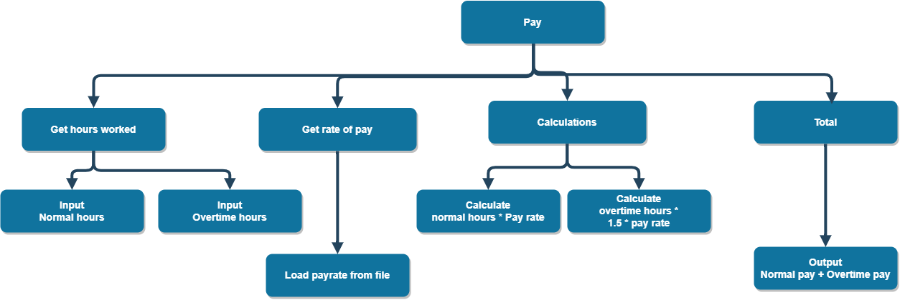
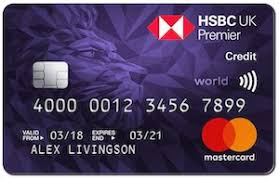
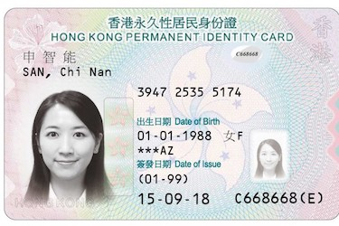
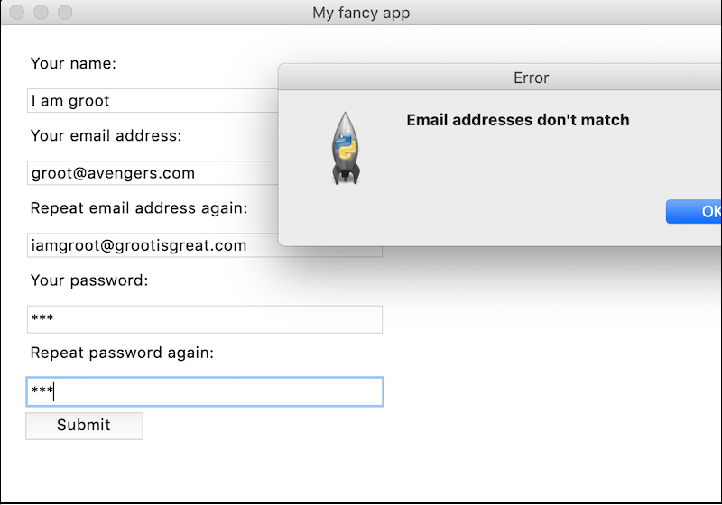

# Unit 2 Algorithms

This unit aligns to the syllabus and textbook as follows:

* Syllabus: 2.1.1 Problem solving & design; 2.1.2 Pseudocode & flowcharts
* Textbook: Chapter 9: Problem solving and design; Chapter 10: Pseudo code and flowcharts

## 01: Computational thinking

> Computational thinking is strictly not in the iGCSE syllabus. However, it is actually very helpful for beginner programmers to consider the thinking skills assocated with computational problem solving. Don't learn these four skills because you think they'll be in the test. Learn them because they'll help make you a better programmer.

Computational thinking is what allows us to go from the quick and simple little programs we've been writing, to solving more meaningful problems.

There are commonly four thinking skills associated with this.

1. Decomposition - Can I divide this into sub-problems?
2. Pattern recognition - Can I find repeating patterns?
3. Abstraction - Can generalise this to make an overall rule?
4. Algorithm design - Can I document the programming steps for any of this?

For a walk through on using these thinking skills, make use of:

* [My introductory video on Computational thinking](https://youtu.be/2bvt6PCBVPo)
* [My introductory slides on Computational thinking](unit-2-computational-thinking-slides.pdf)

Some other general advice I would give to new programmers is:

* Just start - A blank screen can be overwhelming
* Don’t start at the start - Programs are not novels, you read and write a program by jumping around
* Start with something you know - Build the user interface and work back from there
* Don’t be afraid to Google - Prioritise results from forums such as stackoverflow
* Test & print a lot

### Problems

Once you've digested the slides or video, have a go at a couple of problems of your own:

* Problem 1: Create an age calculator. Prompt the user for (1) their birthdate and (2) the current date, calculate their age, checking whether they have had their birthday yet or not.

* Problem 2: Create a money change calculator. Given a set of possible coins available to the shop attendant, and an amount of change they must provide the customer, calculate how many of each coin they should give the customer. For example if a country has 1cent, 5cent, 10cent, & 50cent coins and you need to provide 67cents of change, the clerk would give 1x50cent, 1x10cent, 1x5cent, and 2x1cent coins. 

* Additional problems: Try one of my general [programming problems](programming-problems.md).

## 02: Systems & algorithms

* Read 9.1 Introduction and 9.2 Algorithms

### Top-down design

As indicated in the previous lesson, the iGCSE course does not strictly discuss the idea of computational thinking (even though I think it should). The closest it gets is to discuss the idea of top-down design. This is roughly analogous to the process of decomposition. To quote from the textbook, "each computer system can be divided up into a set of sub-systems. Each sub-system can be further divided into sub-systems and so on until each sub-system just performs a single action" (p115).

This idea of dividing a system into its **sub-systems** is known to as **top-down design**, where at the apex you have your overall project or system, and then you create a hierarchical tree of sub-systems from that.

This hierarchy can be drawn into a chart, which is known as a **structure diagram**. An example is provided below. There is also an example for an alarm app is provided in the textbook on page 116. 



The main question that might arise is "how to I know when I need to divide a system into new sub-systems"? For the purposes of this course, it is fairly safe to think of each box as a function. If it makes sense to write new functions, you are creating new sub-systems.

### Documenting algorithms

**Algorithm**: "a sequence of instructions, typically to solve a class of problems or perform a computation" (wikipedia). So, it is just a technical term for a set of steps or instructions. It is analogous to a recipe for cooking.

So, once we know what an algorithm is, the next question is how to write one. Writing computer code is an act of writing an algorithm. You are creating a series of steps for that programming language's compiler or interpreter to follow. It is also very useful to be able to write algorithms for other computer scientists to understand, even if they aren't a specialist in the same programming language you use. A couple of commonly used tools for this are **flowcharts** and **pseudocode**.

You've probably encountered flowcharts before. They form part of this course, so we will get more familiar with them over the coming lessons. For now, look at the simple example on page 115.

Pseudo-code is a term used for a "structured English" that looks like and takes on the shape of a programming language, but where the instructions are written in English. Again, check the simple example on page 115 but we will discuss it more in lessons to come.

The overall idea here is that through a combination of an overall structure diagram, and then creating either pseudo-code or flowcharts for each sub-system identified, we can fully document the design of any project.

### Problems

* Complete Activity 9.2 (don't bother with 9.3, it's a bit lame)
* Draw a structure diagram for the sort algorithm we discussed in the computational thinking lesson. ([example solution](img/structure-diagram-sort.png))
* Draw a structure diagram for the age calculator or change calculator from the previous lesson.
* Working with a partner, pick one of the problems from my [Programming problems](programming-problems.md) page (such as Hang-person or Tic-tac-toe) and identify the sub-systems that would be involved. Draw a structure diagram for that problem.
* For one of the above, experiment with what you think the flowchart to document each identified sub-system might look like.

## 03: Testing algorithms

* Read 9.3 Test data

As our programs become more complicated, having a proper testing regieme becomes increasingly important. It is no longer good enough to run our program with a "typical" value, get the expected result and consider it "working".

A well designed testing regieme will consider four different types of input data:

* Normal data: This is the data you have intended for your program to encounter.
* Erroneous & abnormal data: Data your program should not receive as an input.
* Extreme data: The extreme values of what is possible to receive as an input.
* Boundary data: Data on the edge of what your program may receive as inputs.

Example: An alarm app that requires you to enter a time for the alarm in 24 hour format.

| ----------- | ----------- |
| Normal data | 06:30, 07:00, 16:00 |
| Erroneous data | 09:00am, Seven, -17:00, 4 o'clock, 25:00, 8:75, 5pm |
| Extreme data | 00:00, 23:59 |
| Boundary data | 00:00, 23:59, 24:00, 05:60 |

(Of course, you could modify the app's requirements so that it can correctly interpret some of the "erroneous data" so it can become "normal data")

The question then becomes: how do you want your app to respond to the various types of data? And does it respond in the manner you intend? This is what is required of a proper testing regieme.

It may also be necessary to state some assumptions when devising your test data if the problem scenario is not sufficiently clear.

### Problems

* Activity 9.5, 9.6, 9.7, 9.8 (Textbook pages 119, 120).
* Create a table and generate the four types of test data for the following problems:
   * Currency input for a currency conversion app that will convert HKD to EUR.
   * Date input for a date reminder app that will accept dates (in the style of dd/mm/yyyy, or an alternative you may prefer).
   * Hong kong mobile phone number input for an authentication app that will send SMS messages (hint: check [wikipedia](https://en.wikipedia.org/wiki/Telephone_numbers_in_Hong_Kong) for the rules of what constitutes valid mobile phone numbers in HK) 
   * Email address input
   * Postal address input

Example table

| Test data | Exam average calculator | Currency conversion | Date reminder | Phone number authenticator | 
| --------------- | ----------------------- | ------------------- | ------------- | -------------------------- |
| Normal data       | 45, 82  |   |   |   |
| Erroneous         | -13, 500, 76%, 50.1, eighty  |   |   |   |
| Extreme           |  0987409234097234092340922 |   |   |   |
| Boundary          | -1, 0, 99, 100    |   |   |   |

## 04: Validation checks

* Read 9.4 Validation and verification

Validation checks are the process of programmatically checking the input given to your program to ensure it meets basic criteria. This would form the basis of code that helps ensure your software will detect and behave accordingly to any erroneous data such as discussed above.

Some of the typical checks involved are:

* Range checks - Is the input value within the permitted minimum and maximum range?
* Length checks - Is the input value within the permitted size length? eg: perhaps you only allow up to 30 characters for an email address. You will have encountered these kinds of limits on apps and websites many times, why do they exist? Typically it's because these systems save their data into a database, and databases require you to specify the size of each field so it can allocate the appropriate amount of disk space.
* Type checks - Is the input value of the correct type? ie: if you ask for an integer, but are given a string or a float.
* Character checks - Does the input value only contain permitted characters? Sometimes special punctuation symbols can cause problems.
* Format checks - Is the style of the input value according to expected rules? eg: dd/mm/yyyy format for a date.
* Presence checks - Has the input been provided if it is required? eg: not left blank.

### Problems

For each of the apps in the previous lesson, identify the appropriate checks required for each.

| Checks required | Exam average calculator | Currency conversion | Date reminder | Phone number authenticator | 
| --------------- | ----------------------- | ------------------- | ------------- | -------------------------- |
| Range checks      | `n >= 0 and n <= 100`  |   |   |   |
| Length checks     | `len(n) > 0 and len(n) <= 3`    |   |   |   |
| Type checks       | `n.isnumeric()`    |   |   |   |
| Character checks  |     |   |   |   |
| Format checks     |   |   |   |   |
| Presence checks   |   |   |   |   |

If you have time, start writing the Python functions that could be used to validate each of these different inputs.


## 05: Validation checks (2)

Our world seems to revolve around numbers. As useful as numbers are, humans are rather error-prone when recording them. This is because there aren't set rules for noticing when you have incorrectly written a number like a spelling error would make obvious for written words. To overcome this, computer engineers frequently add an additional digit to important numbers which can be used to help validate the input.

This **check digit** can be automatically calculated from the rest of the number. If the calculation works, then there is a much greater likelihood that the number has been correctly entered (though mistakes can still occur).

### ISBN


One common example referred to in the textbook is the ISBN. Refer to page 122 to see how it works.

### LUHN




The **luhn algorithm** is another check digit algorithm. It is used by Mastercard and Visa. The last digit is calculated based on a formula that uses all the other digits as the input. I've written about the luhn algorithm [here](https://pbaumgarten.com/igcse-compsci/programming-problems.html#luhn-algorithm).

### HKID



The Hong Kong ID number is another check digit algorithm. The algorithm is documented [here](https://access-excel.tips/hkid-check-digit/)

### Problem

Working in pairs or individually, select one of the problems: ISBN, LUHN or HKID.

1. Create a table to devise test data (normal, erroneous, extreme, boundary)
2. Create a table to decide on the input checks you will use (range, length, type, character, format, presence)
3. Use computational thinking to decide how you will calculate the check digit (decomposition, abstraction, pattern recognition, algorithm design)
4. Code it in Python
5. Use your test data - do your checks behave as they should?

Submit your written work (tests and checks) and Python programming.

## 06: Validation checks (3)

Activity 9.9 through 9.13 (textbook pages 123-124)

If you have time remaining, and haven't completed any of the previous testing and validation coding exerciese, complete those now as well.

## 07: Verification checks

Data verification is a way of ensuring the user types in what he or she intends, in other words, to make sure the user does not make a mistake when inputting data.

Data validation has nothing to do with what the user wants to input. Validation is about checking the input data to ensure it conforms with the data requirements of the system to avoid data errors.

The above definitions come from [mytutor.co.uk](https://www.mytutor.co.uk/answers/3636/GCSE/Computing/What-is-the-difference-between-data-verification-and-data-validation/) and describe the difference better than the book. To be really honest, this is not how the terms are really distinguished in industry, but it is the definitions you need to know for this course. As wikipedia puts it so well, "In practice... the definitions of verification and validation can be inconsistent. Sometimes they are even used interchangeably".

That all said, given verification is (for our purposes), about ensuring the user has typed what they intended to type, some common strategies used by software to achieve this are:

* Double entry
* Screen/visual check
* Parity check
* Check digit (notice this can be used for validation and verification)

### Problem

PART ONE

Design a simple Python program that validates and verifies an email address. Some points to consider:

* What testing data should be used (normal, erronous, extreme, boundary)?
* What validation checks are required for an email address (range, length, character, type, format, presense)?
* What verification checks are best required for an email address?

PART TWO

Not one to pass up the opportunity to do some real programming, and to teach you something new at the same time, here is a basic GUI screen in Python. It uses the Tkinter library which allows you to create graphical user interfaces. Writing Python GUI's are not part of the course syllabus but they are useful and likely something you are interested in knowing how to do. If it is something you wish learn more about, I do have some notes on my Python website, called "GUI with TKinter". [https://pbaumgarten.com/python/](https://pbaumgarten.com/python/) ‐ I'm happy to create additional resources for this if you are interested please let me know.

Modify the `clicked()` function to implement your tests indicated above.



* [Tkinter verification demo app](distribute/unit-2-tkinter-verification-demo-app.pdf)

## 08: Trace tables

* Read 9.5 Using trace tables and 9.6 Identifying and correcting errors

Trace tables are a manual tool for testing and correcting an algorithm.

They are a table where you manually walk through each line of your algorithm, calculating the value of each variable as you go. Every varible gets it's own column, and you add a new row for every new step of program execution.

### Problems

Activity 9.14 through 9.17 (textbook 127-129)

## 09: Reading pseudo code

* Read 9.7
* Read all of chapter 10

What is pseudo code?

"Pseudo" is defined as "not actually but having the appearance of; pretended; false or spurious; sham; almost, approaching, or trying to be." ([reference](https://www.dictionary.com/browse/pseudo)).

So pseudo-code is pretend-code. It is not a geunine, real programming language. The intent behind the idea is that it is a generic, language agnostic tool that can be used to communicate algorithms between programmers regardless of what language they may be specialists in. That is, something that can be read and understood by all programmers because it is so clear and simple.

The following is an example of pseudo-code you will see in this course. You should be able to read it, understand what it is conveying and convert it into your own programming language without difficulty.

```txt
PRINT "I can count! What number should I count up to?"
INPUT Target
N ← 1
WHILE N < Target
   PRINT N
   N ← N + 1
PRINT "Told you I could do it!"
```

A note about pseudo code: What it is supposed to be verses what it is in the iGCSE course... While the idea of pseudo-code is supposed to be a language-agnostic, generic undefined tool for documenting algorithms, that is not compatible with the notion of exam marking schemes. As a result, pseudo code for our course is actually quite perscriptively defined. While you don't have to be syntatically perfect, you are expected to write pseudocode that is very clear and to the same level of detail as defined within the syllabus. In otherwords, while not a real programming language, you do need to learn it and practice it for it will appear in your exams.

### Read & note

Syntax of pseudo code for the iGCSE course:

* Chapter 10, page 134-139 of the textbook.

## 10: Tracing pseudo code

Practice your knowledge of trace tables and pseudo code.

Problem 1.

Create a trace table for the following algorithm to determine it's purpose.

```text
OUTPUT "Enter the first integer: "
INPUT x
OUTPUT "Enter the second integer: "
INPUT y
z ← 0
WHILE x > 0
    IF x mod 2 = 1 THEN
        z ← z + y
    ENDIF
    x ← x div 2
    y ← y * 2
ENDWHILE
OUTPUT "Answer =", z
```

Problem 2.

A doctor records a patient’s temperature once an hour for six hours. Any time the temperature is > 37C, an incidence of fever is recorded.  The average of all temperatures taken is calculated at the end. 

```text
temp ← 0
fever ← 0
total ← 0
hour ← 1
WHILE hour < 7 THEN
    OUTPUT "Enter temperature: "
    INPUT temp
    IF temp > 37 THEN
        fever ← fever + 1
    END IF
    total = total + temp
    hour = hour + 1
ENDWHILE
average ← ROUND(total/hour,1) # round to 1 decimal place
OUTPUT "Average temperature:", average
OUTPUT "Incidents of fever:", fever
```

Problem 3.

Complete a trace table to determine the final state of the variables in this algorithm.

```text
sum ← 0
N ← 10
WHILE N < 40
   sum ← sum + N
   OUTPUT N, SUM
   N ← N + 5
END WHILE
```

Problem 4.

Use a trace table to determine what is printed by the following when N = 5.

```text
IF (N = 1) OR (N = 2) THEN
   H ← 1
ELSE
   F ← 1
   G ← 1
   FOR J ← 1 TO N-1 DO
      H ← F + G
      F ← G
      G ← H
      OUTPUT H
   END FOR
END IF
OUTPUT F, G
```

Problem 5.

Use a trace table to determine what is printed by the following.

```text
Sum ← 0
N ← 20
WHILE N < 30
    Sum ← Sum + N
    OUTPUT N, SUM
    N ← N + 3
END WHILE
```

Problem 6.

Use a trace table to determine what is printed by the following.

```text
Count ← 1
X ← 2
WHILE Count < 25
    X ← X + 2
    OUTPUT Count, X
    Count ← Count + 5
END WHILE
```

Problem 7.

Complete a trace table for the following given that the input will be 6.

```text
INPUT X
FOR M = 1 TO X
    Y ← X - M
    Z ← 5 * Y - M
END FOR
OUTPUT Z
```

Credits: [Problem 1 & 2](https://www.tes.com/teaching-resource/trace-table-activities-for-gcse-computer-science-11782527)), [problem 3 onwards](https://retrosnob.files.wordpress.com/2013/11/trace-tables-chapter.pdf)

## 11: Writing pseudo code

Time to practice writing some of your own pseudo code.

1. User inputs the volume of sphere, the program outputs the radius.
2. User inputs two numbers, A and B, the program will output all the powers of A, e.g. A*1, A*A, A*A*A, up to the value of B. B can't be less than 2.
3. User inputs two positive numbers, the program counts up from the smaller of these numbers to the larger, outputting the numbers as it counts up.
4. User inputs a number between 1 and 99. Program counts from 1 to the input number in word form (eg: one, two, three, four...).

## 12: Flowchart syntax

Just like pseudo-code, flowcharts are intended to be a language-agnostic way of communicating algorithms from one programmer to another. Also just like pseudo-code, the course syllabus has mandated a set of symbols for you to learn.

Syntax of flowcharts for the iGCSE course:

* Chapter 10, page 142 of the textbook.

### Problems

1. Draw a flowchart that inputs 20 numbers and outputs the range between the highest and lowest number (without using `min()` or `max()`).
2. Draw a flowchart that inputs 10 numbers and calculates the average of those that were between 0 and 100.
3. Draw a flowchart that inputs the names of 10 people, and prints the name of the person with the longest name.

## 13: Ethical considerations

Video: [The Consequences of Your Code by Tom Scott](https://www.youtube.com/watch?v=LZM9YdO_QKk) (6:15m)

There are real-world impacts on human lives by the software we create. We have an ethical and moral responsibility to take care with the projects we create to minimise potential harm.

Chapter 8.9 and 8.10

As programmers, we have responsibilities to be ethical in

* The software we create
* The software we use
* The use of existing code bases in our software
* Respecting the licenses of code we include

What are some of the common licensing options available to us as a programmer?

* Properitory
* Open source (GPL, MIT, Apache, Creative commons)
* Freeware
* Shareware

**At a minimum** it is expected that code you source through independent research is properly attributed. This should take the form of a url provided as an in-code comment. I will mark you down for code that is clearly not your own that is not attributed. Where necessary it may also be referred for academic dishonesty.

For example, here is some code I wrote to calculate the amplitude (volume) of an audio stream feed from a microphone. Notice there are three references provided. Those references don't just ensure fair attribution of other people's work, they also help provide documentation links that I can return to when if I need to re-learn how the algorthm works.

```python
def get_amplitude_from_stream(data_stream):
    """
    Calculate the amplitude of sound in decimals from a pyaudio data stream.

    Based on https://stackoverflow.com/questions/51431859/how-do-i-get-the-frequency-and-amplitude-of-audio-thats-being-recorded-in-pytho
    """
    # Step 1. Convert to numpy array
    # Switched from fromstring to frombuffer thanks to https://stackoverflow.com/questions/24974032/reading-realtime-audio-data-into-numpy-array
    narr = numpy.frombuffer(data_stream, dtype=numpy.int16)
    
    # Step 2. Convert numpy array from int16 to int32 for error free calculations when squaring
    narr = narr.astype(numpy.int32, copy=False)
    
    # Step 3. Calculate the rootMeanSquare of the samples
    # https://en.wikipedia.org/wiki/Amplitude#Root_mean_square_amplitude
    rootMeanSquare = numpy.sqrt(numpy.mean(narr**2))
    
    if rootMeanSquare > 0:
        # Convert root mean square of raw power to a decibel scale
        return 20 * math.log10(rootMeanSquare)
    else:
        return 0
    # end of function
```

### Problems

1. What is a distinguishing characteristic that differentiates between each of properitary, open source, share-ware and free-ware software?
2. Activity 8.3: A software company offers a range of office software under a share-ware license. What benefits exist to the (a) company and the (b) customer for this?
3. A freelance programmer is doing paid work for a client. The programmer used code found on the internet without the original authors permission. What would be the potential consequences of this action? In what way would the original license of the original software potentially affect the consequence? 

## 14,15,16: Unit review exercises

* Chapter 9 review questions: Page 132-133.
* Chapter 10 review questions: Page 144-145.
* [70 pseudocode practice questions](distribute/pseudocode-70-questions.pdf) (I have the solutions for these for you to self-check)

Let me know once you have completed those. I am happy to create additional review questions as needed.

## Unit terminology check

* System design: Structure diagram, top-down, system, sub-system
* Test data: Normal data, abnormal data, erroronous data, extreme data, boundary data
* Validation check: Range check, length check, type check, character check, pattern check, format check, presence check, check digit
* Verification check: double check, screen/visual check, parity check, check digit
* Trace table: 
* Pseudo code: 
* Flow chart: decision, loop
* Ethics: software licenses, proprietary, open source, freeware, shareware

## 17: Unit test

The unit test will assess you on:

* Structure charts for top-down design of sub-systems
* Creating & using test data
* Validation and verification of input
* Trace tables
* Pseudo code
* Flow charts
* Ethical considerations

