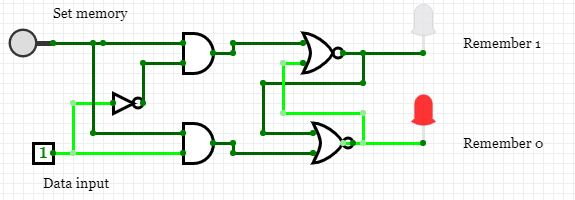

# Unit 3: Data and logic

This unit aligns to the syllabus and textbook as follows:

* Syllabus: 1.1.1, 1.1.2, 1.3.1
* Textbook: Chapter 1 "Binary systems and hexadecimal" and chapter 3 "Logic gates and logic circuits"

## 01: Introductory activity

Build your own logic gates

* [unit-3-intro-activity](unit-3-intro-activity)

## 02: What is data?

* What does data reduce to at it's simplest level?
* How does a transistor produce logic gates?

### What is data?

Ultimately everything in a computer is reduced to either the presence or absence of an electrical charge. This electrical charge inside transistors is scaled up to form basic circuits that can be used to remember information (ie: act as memory) and perform calculations.

At the heart of it all is the transistor which is a simple electrical switch that can be turned on or off via an electrical signal. A modern Intel CPU has about 1.75 billion transistors in a piece of silicon the size of a fingernail, or 17.185 million transistors per square millimetre. (1)

### Transistors to logic gates

We mentioned before that at the most simple level, everything inside a microprocessor is reduced to transistors. But what exactly is a transistor? how does it function? How can such a simple device create the seeming complexity of modern computers?

A transistor is a switch that controls another switch. For a great introduction to how transistors can be combined to create interesting functionality, watch this brief video...

* Relays and Logic Gates - How to Make a Computer: Part I (6:30) - [https://www.youtube.com/watch?v=fB85NrUBBhQ](https://www.youtube.com/watch?v=fB85NrUBBhQ)

This video introduced you to logic gates. This is the level of complexity from the transistor. We use multiple transistors to build logic gates. Multiple logic gates can then be used in clever patterns to create memory and perform calculations. Once we have the ability to store values in memory, and to be able to perform calculations on those values, we then have the basic building blocks of every computer.

There are 6 logic gates we will study in this course.

* NOT gate
* AND gate
* OR gate
* NAND gate
* NOR gate
* XOR gate

These gates are effectively switches, where the state of the output (whether it is on or off) is determined by the combination of the inputs and the rule of the gate.

* The NOT gate has one input and one output. If the input is on, the output is off. If the input is off, the output will be on.
* The AND gate has two inputs and one output. If both inputs are on, the output will be on. In all other cases, the output is off.
* The OR gate has two inputs and one output. If either one of the inputs is on, the output will be on. If both inputs are off, the output will be off.
* The NAND gate is a concatenation of an AND gate where the output goes through a NOT gate. This means if both inputs are on, the output will be off. In all other cases, the output is on.
* The NOR gate is a concatenation of an OR gate where the output goes through a NOT gate. This means if either input is on, the output will be off. If both inputs are off, the output will be on.
* The XOR gate is known as the eXclusive OR gate. With this gate if one of the inputs are on, the output is on. However, if both inputs are on, the output remains off. Likewise if both inputs are off, the output remains off.

*Clarification: While it is possible to have 3 input AND and OR gates, the iGCSE course is limited to gates of 2 inputs*

### Logic gates to circuits

We will use combinations of these logic gates to create logic circuits. To enable us to do this easily each gate has a symbol by which it can be represented in a diagram, and there is also a couple of notations available to represent them in the form of written equations. 

The logic gate symbols are shown below and are also in page 26 of your text (the XNOR gate is not part of your course but it should be an intuitive extension to determine what it is...?)


As you can also see, we can simplify our understanding of rules for each gate by using a table, known as a truth table, to document the circumstances in which a gate is on or off. Rather than using the "on" and "off" terminology, we use binary where 0 represents off and 1 represents on.

### Logic circuits to truth tables (execises)

Logic gates are combined together to form logic circuits. To gain an understanding of what an individual circuit may do, we create truth tables for them as well.

* Complete the walk through example, converting a logic diagram to a truth table, as a class (3.5.1 on page 29/30).
* Individually produce the truth tables for the logic diagram questions in activity 3.2 on page 32.
* Complete these additional practice questions: [Logic equations to circuits](https://pbaumgarten.com/igcse-compsci/distribute/Logic-equation-to-circuits.pdf)

---

## 03: Produce circuits from equations

Any logic circuit can be expressed as a diagram or as an equation. You need to be able to convert one to the other.

If we review this table again, we'll see that there were arithmetic symbols provided for gate operation.


This means instead of having to draw a circuit, we can write an equation that represents a circuit.

For instance:

* to have an `AND` gate with inputs `A` and `B` that outputs to `X`, we could write this as either `X = A AND B`, or even just `X = AB`.
* to have an `OR` gate with inputs `A` and `B` that outputs to `X`, we could write this as either `X = A OR B`, or `X = A + B`.
* to have a `NOT` gate with input `A` and output `X`, that could be written as `X = NOT A`, or `X = !A`, or `X = Ā` (notice the line over the A).

Once we start writing equations, one small but crucial detail to known is the *order of precedence*. Intuitively from maths we may understand that backets are resolved first, but what about other situations? For instance given X = NOT A AND B... is it (NOT A) AND B.... or is it NOT (A AND B)... ? The order of precedencee is 1st parenthesis, 2nd NOT, 3rd AND, 4th OR.

Let's do some questions...

Creating circuit diagrams from these logic equations, then produce the truth tables.


Check your answers at [http://sandbox.mc.edu/~bennet/cs110/boolalg/gate.html](http://sandbox.mc.edu/~bennet/cs110/boolalg/gate.html)

Now go direct from logic equation to truth table without the circuit diagram step.


Check your answers at [http://sandbox.mc.edu/~bennet/cs110/boolalg/truthtab.html](http://sandbox.mc.edu/~bennet/cs110/boolalg/truthtab.html)

---

## 04: Written scenarios

You may be presented with a written scenario from which you need to discern the equation and logic circuit.

* Complete the walk through example as a class 3.5.3 on page 35.
* Individually complete the practice question in activity 3.4 on page 38.
* Complete the remaining activities in chapter 3.

## Use of logic circuits

So we've been building these things called logic circuits. So what do they have to do with computers?

The internal operations of your CPU is reduced down to transistors that form logic gates that form logic circuits.

For an example, this is a circuit known as a d-latch. It will "store" one bit of "memory". What ever value is on the data wire when the set wire is activated, will be "remembered" until the next time you activate the set wire.



## Optional exercise: NandGame

To demonstrate just how an entire computer system is built from nothing but logic gates, this website allows you to build a virtual computer beginning from nothing but a NAND gate.

[http://nandgame.com/](http://nandgame.com/)

Complete at least the first 6 levels, then go as far as you wish beyond that.

* Invert (not)
* And
* Or
* Xor
* Half Adder
* Full Adder

---

## 05: Bits and bytes

This presence of absence of electricity needs to be simplified for computer scientists to effectively scale it to the complexity of modern computers. For this reason we think of it as `True` and `False` which is then further simplified into `1` and `0`.

This most simple form of data, that is a `1` or `0` is known as a bit.

Again, dealing with thousands of bits at a time isn't practical, so we scale again. The first level of complexity introduced is to group 8 bits together into a `byte`.

If a bit has two possible values, 0 and 1, and a byte consists of 8 bits, how many possible values does a byte have?

The answer, of course, is 256. But did you get there the easy way or the hard way? How long until you worked out the pattern?

| Number of bits | All possible values | Total possiblities | Also known as |
| -------------- | --------------- | ------------------ | ------------- |
| 1              | 0, 1             | 2                  | 2^1           |
| 2              | 00, 01, 10, 11     | 4                  | 2^2           |
| 3              | 000, 001, 010, 011, 100, 101, 110, 111 | 8  | 2^3           |
| 4  | 0000, 0001, 0010, 0011, 0100, 0101, 0110, 0111, 1000, 1001, 1010, 1011, 1100, 1101, 1110, 1111 | 16 | 2^4 |

### Counting in binary

To count up in binary, works the same as counting in decimal except we only have two values for each column. So, starting from zero, it would look like...

```text
  0
  1
 10
 11
100
101
110
111
```

For each column, we start from zero, count up until we have hit the highest possible value, in this case 1, and in add a new significant figure.

* If I wanted to add binary 100 and binary 1000, what would it be?
* If I wanted to add binary 100 and binary 1100, what would it be?

### Binary sizes

| Memory size | Number of bits | Equivilent denary value | Memory size | Number of bits | Equivilent denary value |
| ----------- | -------------- | ----------------------- | ----------- | -------------- | ----------------------- |
| Kilobyte (kB)   | 10^3 | 1,000                 | Kibibyte (KiB)    | 2^10  | 1,024  |
| Megabyte (MB)   | 10^6 | 1,000,000             | Mebibyte (MiB)    | 2^20  | 1,048,576  |
| Gigabyte (GB)   | 10^9 | 1,000,000,000         | Gibibyte (GiB)    | 2^30  | 1,073,741,824  |
| Terabyte (TB)  | 10^12 | 1,000,000,000,000     | Tebibyte (TiB)    | 2^40  | 1,099,511,627,776  |
| Petabyte (PB)  | 10^15 | 1,000,000,000,000,000 | Pebibyte (PiB)    | 2^50  | 1,125,899,906,842,624  |

### Uses of binary numbers

#### The integer

```python
for n in range(256):
    b = bin(n)
    print(f" Decimal { n :3}, in binary is { b :>10}")
```

#### Floating point numbers

How are floating point numbers stored internally? By storing two integers, one representing the significant figures, the other representing the exponent for the number. In this way we can store very large and very small numbers but with a limited degree of accuracy.

In the same way that we might think of the the speed of light in decimal notation as being represented by the number 3 and 8.... to represent 3 x 10^8, floating point numbers use the same approach.

The 64 bit floating point number uses 1 bit for the sign (positive/negative), 8 bits for the exponent, and 55 bits for the significant number.

Everything is stored in binary rather than decimal. For the significant figures portion, this means the first bit represents 1/2, the second bit represnts 1/4, the third will represent 1/8 and so forth. This poses some challenges for seemingly common numbers.

For instance, look at the following output from Python

```python
>>> 0.3
0.3
>>> 0.1
0.1
>>> 0.1 + 0.1 + 0.1
0.30000000000000004
>>> 
```

The number 0.1 in binary is actually an infinitely recurring decimal, so when we add several together we are getting a rounding effect occurring. This is analogus to adding 0.3333333 (recurring) several times.

It is important to remember that floating point numbers are useful, but they are not designed for highlevel precision after multiple mathematical operations. They were designed for scientific applications, not financial.

* Floating point calculator... [https://www.h-schmidt.net/FloatConverter/IEEE754.html](https://www.h-schmidt.net/FloatConverter/IEEE754.html)

#### Registers

A register is a collection of bits within the CPU with a designated purpose. They may be a temporary holding area for an instruction about to be executed, or a value that is about to be used. They are the very short term working memory of the CPU for the exact job it is doing at that moment.

You have probably heard the phrase 32 bit computing or 64 bit computing. This refers to, amongst other things, the size of the registers within the CPU. If a CPU has 32 bit registers, then it can cope with, at most 2^32 memory locations in RAM (about 4GB), and calculations on numbers of up to 4 billion. Modern computers are now 64 bit.

Another example of using registers is to control the outputs of a computer system. The textbook contains an example of a computer controlling motors through setting the bits within a register.

Read section 1.4, complete activity 1.3

---

## 06: Converting between denary and binary

Lesson intro: Watch video Binary - How to Make a Computer: Part II (7:15)

* [https://www.youtube.com/watch?v=NRKORzi5tnM](https://www.youtube.com/watch?v=NRKORzi5tnM)

Lesson outline:

* Converting binary to decimal
* Converting decimal to binary

Practice questions:

* Deciaml 98 is what in binary?
* Deciaml 195 is what in binary?
* Deciaml 156 is what in binary?
* Deciaml 245 is what in binary?
* Deciaml 116 is what in binary?

* Binary 00000100 is what in decimal?
* Binary 11001100 is what in decimal?
* Binary 01110001 is what in decimal?
* Binary 00101001 is what in decimal?
* Binary 01110101 is what in decimal?


---

## L6,7: Hexadecimal numbers

Reasoning for hex notation

```python
for n in range(256):
    b = bin(n)
    h = hex(n)
    print(f" Decimal { n :3}, in binary { b :>10}, in hex { h :>4}")
```

## Common uses of hex in computing

### HTML colours

### MAC addresses

```python
import uuid
print( hex(uuid.getnode()) )
```

### Assembly languages

### Debugging


## Convert hex and denary

* Manually
* Programmatically

## Convert hex and binary

* Manually
* Programmatically


---

## References

1. https://www.quora.com/How-many-transistors-are-in-i3-i5-and-i7-processors
2. https://www.includehelp.com/python/binary-numbers-representation.aspx
3. https://pythonspot.com/binary-numbers-and-logical-operators/

