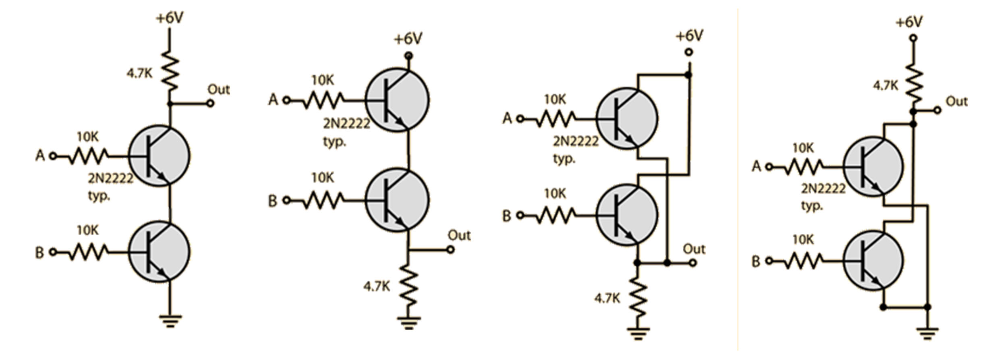

# Activity: Build your own logic gates

Computers are built out of transistors. A transistor is effectively a simple switch. How is it possible to build something as seemingly complex as a computer out of on/off switches? Hopefully this activity will give you a small window into how...

We are going to see how logic gates can be physically constructed from simple transitors.

To do this we are going to use a breadboard which is a simple device that allows us to connect the wires (terminals) of various electronic components together in a simple fashion without having to bother with soldering.

The lines marked above show you how the pin holes on the breadboard are interconnected. This means we can put two pins in the same center row and they will become electrically connected.  This allows us to combine components together to make a circuit as the following demonstrates.

Follow the light green shading on the above. That is the path the electricity is travelling. Following the positive charge, you can see it:

* Leaves the battery terminal and passes through the breadboard to the push button switch.
* From the other side of the push button switch, it connects to the resistor, after which which the charge then flows to the LED.
* From the LED, the charge connects to the ground terminal of the battery.

Before going any further you should build the simple push-button and LED scenario sketched out above to test your understanding of how the breadboard functions. Once you have completed the LED/button exericse, it is time to attempt to wire up some logic gates.

We will be using NPN transistors for our exercise. The NPN transistor is designed to pass electrons from the emitter to the collector (so conventional current flows from collector to emitter). The emitter "emits" electrons into the base, which controls the number of electrons the emitter emits. ... The transistor is kind of like an electron valve. (explaination from https://learn.sparkfun.com/tutorials/transistors/all)

The following shows you how the diagram symbol for an NPN transistor correlates to it's physical appearance. You will need to get the order of the pins correct for your circuit to function.

The following are the electrical wiring diagrams for four "logic gates": We have the AND, OR, NAND and NOR gate represented here. Can you tell which is which yet?

To understand these diagrams...

* the zig-zag lines... represent your resistors.
* The "funnel" made out of three lines at the bottom... represents the ground or negative end of the power supply.
* The "A" and "B" points should be coming out from push buttons. The other end of those push buttons should connect to your positive power.
* The "6V" is your positive power (6 volts in this case).
* The "Out" should connect to the positive end of an LED. The other pin of the LED should run into your Ground / Negative. (Note: On the LED one pin is longer than the other. The long one is the positive end.)

Partner up with someone, roll up your sleeves, and see what you can make!

