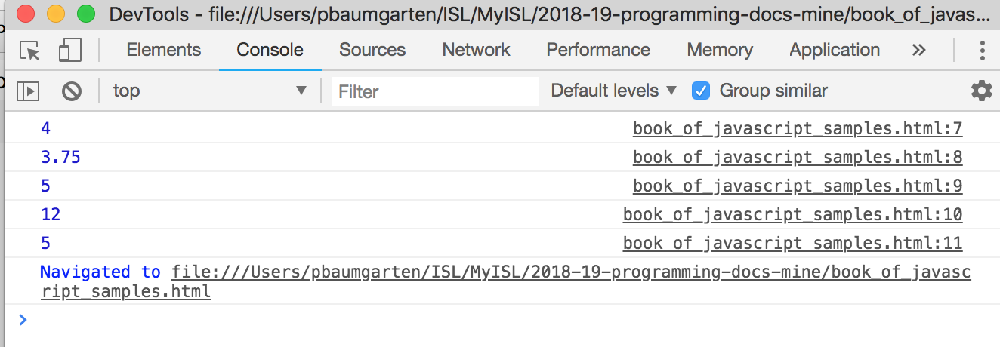

# 1.1 - Numeric calculations

The first thing we are going to learn with programming is to do something very familiar to us all... simple mathematical calculations! While I promise I won't get too mathy on you, I will say that mathematical calculations are an essential part of successful programming so being comfortable with the basics is a good idea.

Let's use Javascript as a calculator! Try the following commands. Hopefully they are all quite intuitive as to what they will do.

Save as `numbers-1.html`:

```html
<html>
    <body>
    </body>
    <script type="application/javascript">
    "use strict";

console.log( 2 + 2 );
console.log( 1.5 + 2.25 );
console.log( 7 - 2 );
console.log( 3 * 4 );
console.log( 10 / 2 );

    </script>
</html>
```

Open it in your web browser, and you'll get just a blank screen. Where is your output? Don't panic! Open the Chrome DevTools, and select the `Console` tab. You will see your output there. For most of this section of the book, this is where you will find the output of our programs. To make it appear in the main browser window properly will wait until we start digging into the HTML.



You will see I gave you the full content of the file in the previous example. To save space in the book, from here on I'll only list the Javascript content but **ensure you remember to include the HTML wrapping** as shown. So, the above would now be provided as follows:

```javascript
console.log( 2 + 2 );
console.log( 1.5 + 2.25 );
console.log( 7 - 2 );
console.log( 3 * 4 );
console.log( 10 / 2 );
```

Ok? We good to proceed?

Let's move on to some more calculations. In addition to the simple arithmetic of the previous, we can also use powers (also known as exponents) through the use of a double star symbol. Try adding these to your previous file:

```javascript
console.log( 4 ** 2 );			// What is 4 to the power of 2? (ie: 4 squared?)
console.log( 4 ** 3 );			// What is 4 to the power of 3? (ie: 4 cubed?)
```

Notice the `//` in the above lines? They tell Javascript that whatever follows is a comment for the programmers benefit and can be safely ignored. Good programmers quickly develop the habit of documenting their code with comments to make it easier to maintain later, so you'll see the `//` scattered through many Javascript programs. It is also possible to write multi-line comments by starting the comment with `/*` and then terminating it with `*/`. I've included an example of a multi-line comment in the next code block.

Add the following to your previous file:

```javascript
/* 
Let's try some division and other tricks
Notice this is a multi-line comment by the way?
I hope you are practicing writing the comments as well!
*/
console.log( 13 / 5 );
console.log( Math.trunc( 13 / -5 ) );
console.log( 13 % 5 );
```

What are these doing?

* The first one, `13 / 5`, is the classic division we get using a calculator.  13 divided by 5 is 2.6. This is known as "floating point division".
* The second one is still `13 / 5` but we used a mathemtical function known as `trunc()` which "truncates" the decimal portion away.  This is the division you learnt in primary school. Think of it as asking "how many times does 5 go into 13?" The answer, of course, is 2. In programming land this is known as "integer division".
* The third one, `13 % 5`, is the companion question to the second one: "If 13 goes into 5 twice, how much is left over?" 5 goes into 13 twice which makes 10 with 3 left over. So 13 % 5 will tell us 3. This is known as the "modulus" or the remainder.

Try changing up the numbers and test it works as you'd expect.

By the way, your HTML file should now look like this if you've been following along properly:

```html
<html>
    <body>
    </body>
    <script type="application/javascript">
    "use strict";

console.log( 2 + 2 );
console.log( 1.5 + 2.25 );
console.log( 7 - 2 );
console.log( 3 * 4 );
console.log( 10 / 2 );
console.log( 4 ** 2 );			// What is 4 to the power of 2? (ie: 4 squared?)
console.log( 4 ** 3 );			// What is 4 to the power of 3? (ie: 4 cubed?)
/* 
Let's try some division and other tricks
Notice this is a multi-line comment by the way?
I hope you are practicing writing the comments as well!
*/
console.log( 13 / 5 );
console.log( Math.trunc( 13 / -5 ) );
console.log( 13 % 5 );

    </script>
</html>
```

---
