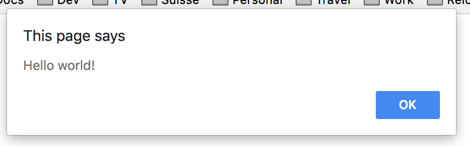
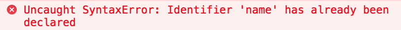
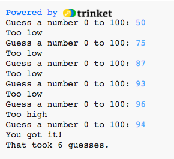

<div>&nbsp;</div>
<div>&nbsp;</div>
<div>&nbsp;</div>
<div>&nbsp;</div>
<div>&nbsp;</div>
<div>&nbsp;</div>
<div>&nbsp;</div>
<div>&nbsp;</div>
<div>&nbsp;</div>
<div>&nbsp;</div>
<div>&nbsp;</div>
<div>&nbsp;</div>
<div>&nbsp;</div>
<div>&nbsp;</div>
<div>&nbsp;</div>
<div>&nbsp;</div>
<div>&nbsp;</div>
<div>&nbsp;</div>
<div>&nbsp;</div>
<div>&nbsp;</div>
<div>&nbsp;</div>
<div>&nbsp;</div>
<div>&nbsp;</div>
<div>&nbsp;</div>
<div>&nbsp;</div>
<div>&nbsp;</div>
<h1>Book of Javascript</h1>
<div>&nbsp;</div>
<div>&nbsp;</div>
<div>&nbsp;</div>
<div>&nbsp;</div>
<div>&nbsp;</div>
<div>&nbsp;</div>
<div>&nbsp;</div>
<div>&nbsp;</div>
<div>&nbsp;</div>
<div>&nbsp;</div>
<div>&nbsp;</div>
<div>&nbsp;</div>
<div>&nbsp;</div>
<div>&nbsp;</div>
<div>&nbsp;</div>
<div>&nbsp;</div>
<div>&nbsp;</div>
<div>&nbsp;</div>
<div>&nbsp;</div>
<div>&nbsp;</div>
<div>&nbsp;</div>
<div>&nbsp;</div>
<div>&nbsp;</div>
<div>&nbsp;</div>
<div>&nbsp;</div>
<div>&nbsp;</div>
<div>&nbsp;</div>
<div>&nbsp;</div>
<div>&nbsp;</div>
<div>&nbsp;</div>
Paul Baumgarten

2018  
(Updated with corrections as of 16.11.2018)

<div class="page"/>

<div>&nbsp;</div>
<div>&nbsp;</div>
<div>&nbsp;</div>
<div>&nbsp;</div>
<div>&nbsp;</div>
<div>&nbsp;</div>
<div>&nbsp;</div>
<div>&nbsp;</div>
<div>&nbsp;</div>
<div>&nbsp;</div>
<div>&nbsp;</div>
<div>&nbsp;</div>
<div>&nbsp;</div>
<div>&nbsp;</div>
<div>&nbsp;</div>
<div>&nbsp;</div>
<div>&nbsp;</div>
<div>&nbsp;</div>
<div>&nbsp;</div>
<div>&nbsp;</div>
<div>&nbsp;</div>
<div>&nbsp;</div>
<div>&nbsp;</div>
<div>&nbsp;</div>
<div>&nbsp;</div>
<div>&nbsp;</div>
<div>&nbsp;</div>
<div>&nbsp;</div>
<div>&nbsp;</div>
<div>&nbsp;</div>
<div>&nbsp;</div>
<div>&nbsp;</div>
<div>&nbsp;</div>
<div>&nbsp;</div>
<div>&nbsp;</div>
<div>&nbsp;</div>
<div>&nbsp;</div>
<div>&nbsp;</div>
<div>&nbsp;</div>
<div>&nbsp;</div>
<div>&nbsp;</div>
<div>&nbsp;</div>
<div>&nbsp;</div>
The lessons in this book have been tested with Chrome on Microsoft Windows 10 and Mac OSX 10.13 environments. Generally I have assumed ECMAScript 6 as a compatiblity baseline which means there would be some issues with older browsers such as Internet Explorer, but seriously, it's 2018 now.

Front cover: Unofficial JS logo by Chris Williams [Public domain], via Wikimedia Commons. Accessed 19.09.2018

Copyright © 2018 by Paul Baumgarten  

All rights reserved. This book or any portion thereof may not be reproduced or used in any manner whatsoever without the express written permission of the publisher except for the use of brief quotations in a book review or scholarly journal.  

First Printing: 2018  

Published by Paul Baumgarten  
pbaumgarten.com   

<div class="page"/>

# Table of contents

Chapter 1 - Introduction to Javascript  

* 1.1 - Numeric calculations
* 1.2 - Numeric variables
* 1.3 - String variables
* 1.4 - User input
* 1.5 - Converting between numbers and strings
* 1.6 - Comparing values
* 1.7 - Making decisions with "if"
* 1.8 - Repeating instructions with "while"
* 1.9 - Making a list
* 1.10 - Looping through a list
* 1.11 - Other list functionality
* 1.12 - Dates and times
* 1.13 - Functions
* 1.14 - Callbacks
* 1.15 - JSON
* 1.16 - Promises and using fetch
* 1.17 - Classes

Chapter 2 - HTML

* 2.1 - Introduction to HTML
* 2.2 - A tags
* 2.3 - DIV, SPAN tags
* 2.4 - IMG, VIDEO, AUDIO tags
* 2.5 - FORM tags
* 2.6 - Lists
* 2.7 - Tables

Chapter 3 - CSS

* 3.1 - Selectors
* 3.2 - Boiler plate
* 3.3 - Basic styling
* 3.4 - Showing/hiding items
* 3.5 - Grid layout
* 3.6 - Drop down menus
* 3.7 - Styling form elements
* 3.8 - Icons
* 3.9 - Styling tables

Chapter 4 - Javascript exercises with HTML & CSS

* 4.1 - Document object model functions & properties
* 4.2 - Event handlers
* 4.3 - Basic form tasks (validation, send)
* 4.4 - Uploading files
* 4.5 - Local storage

Chapter 5 - Firebase

* 5.1 - Firebase authentication
* 5.2 - Firebase database
* 5.3 - Firebase file storage

Chapter 6 - The Canvas

* For graphics, animations and games with Javascript.

<div class="page"/>

# 1 - Introduction to Javascript

This book has been written as a supplemental resource to the classroom based lessons I teach, or to accompany my introduction to programming with Javascript videos on Youtube. It contains all the demonstrated programming on the videos, summaries of the explanations given in those videos, and a set of practice exercises for students to complete for each skill. This book has not been written to be used as a stand alone resoure for learning programming without a teacher or tutor.  The written explainations have been deliberately kept short, intended to be more of a "reminder/prompt" of an idea rather than a full introduction to an idea.

As a teacher of secondary school students, and the fact that I wrote this book in the process of preparing resources to use for my own lessons, the book is largely pitched at the 12-17 age range.

I have videos on my YouTube channel that parallel many of the concepts and exercises in this book. I encourage you to check them out to help you along your programming adventures.  Additionally any files you may need to complete exercises, any corrections to errors that went to print, along with guides to other useful Python tricks that may not have made it into the book, can all be found at my website.

* [https://pbaumgarten.com/python](https://pbaumgarten.com/python)
* [https://youtube.com/pbaumgarten](https://youtube.com/pbaumgarten)

## Getting Javascript

One easy thing about Javascript is you already have it on your computer without perhaps realising it. It is built into your favourite web browser.

That said, to actually write Javascript it would be helpful to have an editor that is a little more intelligent than, say, Notepad. There are several very good free text editors designed for programmers and I recommend you downloading and installing one of these (if you are a student of mine, you likely already have a suitable editor on your school computer):

* [Visual Studio Code @ https://code.visualstudio.com/](https://code.visualstudio.com/)
* [Atom @ https://atom.io/](https://atom.io/)
* [Brackets @ http://brackets.io/](http://brackets.io/)

The other thing you will want is the development tools for your web browser. I will focus on the Chrome web browser in this book, but Firefox has equally good tools you can use as well. To access the Chrome DevTools, simply right click anywhere on a website and choose *Inspect*.

If you are stuck with getting an editor and/or the Chrome development tools installed and working, watch the first video in my Learning Javascript series.

Enough jibber jabber... time to get underway!

Have fun programming!

Mr Baumgarten.

<div class="page"/>

## Let's get started!

Given Javascript runs in the web browser, that means it works very closely with HTML and CSS which are a couple of other web based languages you will need to gain some familiarity with. The fact you need to gain familarily with more than one language at once is probably the biggest downside of using Javascript as your first programming language. To that end, I'm going to be keeping the HTML/CSS fairly simple at the start, section 1 is "just" Javacript. We do, however, need a HTML page that contains enough information to tell the browser to execute our Javascript, so I'll just give it to you here. Type it into your text editor, and then save and forget for now. I'll explain the HTML when we get to part 2.

Save as `firstprogram.html`:

```html
<html>
    <body>
    </body>
    <script type="application/javascript">
    "use strict";

    alert("Hello world!");
    </script>
</html>
```

Once you've saved in your text editor, locate the file in Windows or Mac Finder and double click to open it in your web browser. If you get a pop-up like the below then congratulations, you have successfully got your first program up and running!



From here on, you will need to copy and paste (or re-type) all except the `alert("Hello world!");` and re-use it for any new programs we make. The line starting with the `alert` is the only actual Javascript programming code we have provided, the rest is the template content you "just need".  As previously said, don't worry too much about it now, the HTML will be explained in part 2.

<div class="page"/>

# 1.1 - Numeric calculations

The first thing we are going to learn with programming is to do something very familiar to us all... simple mathematical calculations! While I promise I won't get too mathy on you, I will say that mathematical calculations are an essential part of successful programming so being comfortable with the basics is a good idea.

Let's use Javascript as a calculator! Try the following commands. Hopefully they are all quite intuitive as to what they will do.

Save as `numbers-1.html`:

```html
<html>
    <body>
    </body>
    <script type="application/javascript">
    "use strict";

console.log( 2 + 2 );
console.log( 1.5 + 2.25 );
console.log( 7 - 2 );
console.log( 3 * 4 );
console.log( 10 / 2 );

    </script>
</html>
```

Open it in your web browser, and you'll get just a blank screen. Where is your output? Don't panic! Open the Chrome DevTools, and select the `Console` tab. You will see your output there. For most of this section of the book, this is where you will find the output of our programs. To make it appear in the main browser window properly will wait until we start digging into the HTML.


You will see I gave you the full content of the file in the previous example. To save space in the book, from here on I'll only list the Javascript content but **ensure you remember to include the HTML wrapping** as shown. So, the above would now be provided as follows:

```javascript
console.log( 2 + 2 );
console.log( 1.5 + 2.25 );
console.log( 7 - 2 );
console.log( 3 * 4 );
console.log( 10 / 2 );
```

Ok? We good to proceed?

Let's move on to some more calculations. In addition to the simple arithmetic of the previous, we can also use powers (also known as exponents) through the use of a double star symbol. Try adding these to your previous file:

```javascript
console.log( 4 ** 2 );			// What is 4 to the power of 2? (ie: 4 squared?)
console.log( 4 ** 3 );			// What is 4 to the power of 3? (ie: 4 cubed?)
```

Notice the `//` in the above lines? They tell Javascript that whatever follows is a comment for the programmers benefit and can be safely ignored. Good programmers quickly develop the habit of documenting their code with comments to make it easier to maintain later, so you'll see the `//` scattered through many Javascript programs. It is also possible to write multi-line comments by starting the comment with `/*` and then terminating it with `*/`. I've included an example of a multi-line comment in the next code block.

Add the following to your previous file:

```javascript
/* 
Let's try some division and other tricks
Notice this is a multi-line comment by the way?
I hope you are practicing writing the comments as well!
*/
console.log( 13 / 5 );
console.log( Math.trunc( 13 / -5 ) );
console.log( 13 % 5 );
```

What are these doing?

* The first one, `13 / 5`, is the classic division we get using a calculator.  13 divided by 5 is 2.6. This is known as "floating point division".
* The second one is still `13 / 5` but we used a mathemtical function known as `trunc()` which "truncates" the decimal portion away.  This is the division you learnt in primary school. Think of it as asking "how many times does 5 go into 13?" The answer, of course, is 2. In programming land this is known as "integer division".
* The third one, `13 % 5`, is the companion question to the second one: "If 13 goes into 5 twice, how much is left over?" 5 goes into 13 twice which makes 10 with 3 left over. So 13 % 5 will tell us 3. This is known as the "modulus" or the remainder.

Try changing up the numbers and test it works as you'd expect.

By the way, your HTML file should now look like this if you've been following along properly:

```html
<html>
    <body>
    </body>
    <script type="application/javascript">
    "use strict";

console.log( 2 + 2 );
console.log( 1.5 + 2.25 );
console.log( 7 - 2 );
console.log( 3 * 4 );
console.log( 10 / 2 );
console.log( 4 ** 2 );			// What is 4 to the power of 2? (ie: 4 squared?)
console.log( 4 ** 3 );			// What is 4 to the power of 3? (ie: 4 cubed?)
/* 
Let's try some division and other tricks
Notice this is a multi-line comment by the way?
I hope you are practicing writing the comments as well!
*/
console.log( 13 / 5 );
console.log( Math.trunc( 13 / -5 ) );
console.log( 13 % 5 );

    </script>
</html>
```

<div class="page"/>

# 1.2 -  Numeric variables

What is a variable? A variable is just a name we assign to a piece of memory on the computer. The is similar to the memory button you are used to on the calculator, except we can have as many variables (memory locations) as we want, and we can give them names.

In a new file (perhaps named `numbers-2.html`, we are going to create a variable called "x" and give it a value of 5:

```javascript
let n = 4;
```

The keyword `let` tells Javascript you are about to create a variable. You can read that line of code as "let the variable n be assigned to the value of 4".

Ok, one last time because I"m so good to you, I'll give you the full HTML just to make sure you get the idea:

```html
<html>
    <body>
    </body>
    <script type="application/javascript">
    "use strict";

let n = 4;

    </script>
</html>
```

## A common mistake: Case sensitivity

Javascript is case-sensitive when it comes to variable names. Upper case `N` is treated as a different name to lower case `n`. This is important to remember as one of the most common mistakes students make is changing the spelling of their variable names and wondering why it doesn't work.

It's easy enough to demonstrate this through the following code:

```javascript
let n = 4;
let N = 15;
console.log( n );
console.log( N );
```

You'll notice one has not affected the other, they are treated as two seperate distinct memory locations. Please don't get your variable names mixed up!

## Using variable names in my calculations

The same way we did math before by typing in the actual numbers, we can do the same thing by substituting a number with a variable name. Javascript will automatically look up the variable's value and use it in the calculation.

```javascript
let x = 4;
console.log( 2 * x );
console.log( x - 5 );
```

What names can we use for variables?

* Anything alpha-numeric – which is to say any combination of letters and numbers.
* The only punctuation allowed is the underscore _
* The name must start with a letter or an underscore _ (not a number)
* Spaces and other symbols are not allowed

What will Javascript print in the last line of this example?

```javascript
let eggs_per_cake = 3;
let number_of_cakes = 10;
let total_eggs = eggs_per_cake * number_of_cakes;
console.log( total_eggs );
```

<div class="page"/>

## A common mistake: Incorrectly writing calculations

When doing a calculation to save the result in a variable the rule is that the value or calculation goes on the right of the assignment sign (what you think of as the "equal sign"), the name of the variable we want to save the answer to goes on the left of the assignment sign. ie:

```javascript
let save_to_me = use_my_value + some_other_value;
```

## Exercises

Some practice exercise with doing simple calculations and variables:

1. Write a program that for any set number, will print out what the number before it was and the number after it. For example, if given the number 179, the output would be: `180` and `178`.

2. Write a program that for any number of seconds, will let you know how many hours, minutes and seconds this converts to. For example `4030` would output `1` for hours, `7` for minutes and `10` for seconds.

3. Write a program that will extract the 10s digit from a number. For example, the tens digit in 1234 is `3`.

<div class="page"/>

# 1.3 - String variables (text)

Suppose we want to print some kind of text message to the user? We can print text very easily, just start and end the text with a set of quotations. You already saw this in our very first program:

(oh, time for a new file. Call this `strings-1.html` or similar)

```javascript
console.log( "Hello world");
```

Just as we can use variables to store numbers, we can also use them to store text. We enclose the contents of our text in a set of double quotes " as shown:

```javascript
let name = "Mr Baumgarten";
console.log( name );
```

Also just as we can add numbers together, we can "add" these text variables together too! Obviously there is no calculation involved, instead what happens is it joins the two bits of text together.

```javascript
let person = "Mr Baumgarten";
let message = "Hello ";          // Notice: the space at the end before the closing quote.
console.log( message + person );
```

If we change the value of the text variables, Javascript will reflect the change next time you perform the calculation.

```javascript
let person = "Mr Baumgarten";
let message = "Hello ";
console.log( message + person );
person = "Luke Skywalker";        // Notice: why no "let" ???
console.log( message + person );
```

We only use `let` when we are telling Javascript that we are creating a **new** variable. When we just want to modify an existing one, we don't use `let`. If we had included the `let` keyword, we would have received an error in the console like the one below, advising us we are trying to create a new variable with a name that has already been used.



Variables that contain a bit of text for their value are known in the programming world as **strings**.

## Getting the length of a string

It can be handy to get the length of a string. Javascript gives us a very useful tool for this called `.length`. The `.length` property will give us a number indicating how many characters are in our text string.

```javascript
let person = "Mr Baumgarten";
let len = person.length;
console.log( len );
person = "Mr B";
console.log( person.length );
```

<div class="page"/>

## Extracting sub strings

Because strings are just text, they can get quite long. We might want to separate it into parts to be more useful. For instance, what happens if a string contains both the first and family names of someone? Or if a string contains someones date of birth and we need to calculate their age? How can we split it up into parts?

To extract parts of a string we use the `slice()` function after our variable name.

```javascript
let person = "Luke Skywalker";
console.log( person.slice(5) );
console.log( person.slice(5,8) );
console.log( person.slice(0,4) );
```

What are these doing?

* `person.slice(5)` means get from after the 5th character up to the end
* `person.slice(5,8)` means get from after the 5th character up to the 8th character
* `person.slice(0,4)` means get from the beginning, up to the 4th character

The general rule is:

```javascript
let new_string = old_string.slice( after_this_position , up_to_this_position );
```

Another example: What will each of the following print?

```javascript
let s = "To infinity and beyond!";
console.log( s.slice(3,11) );
console.log( s.slice(0,5) );
console.log( s.slice(5) );
console.log( s.slice(-7) );     // what does the negative do?? try it and see!
```

## Searching strings

What if we want Javascript to automatically split a string containing a name into the given name and family name? While the above method will allow us to get parts of a string, we need a way to find where the space is before we can automate it.

To do this, Javascript gives us the `.indexOf()` command. To search for a space, we'd use it like this:

```javascript
let person = "Luke Skywalker";
let space = person.indexOf(" ")
console.log( "The space is located at:",space );
```

What value will be printed from the above?

Notice that it didn't give you the number 5 which is what you might have expected. It actually gives you the number of characters that appear before what you have searched for. (It's actually a bit more technical than that, but not relevant for you at this beginning stage)

Regardless, we now have a numeric variable that tells us the location of the space. We can combine that with the square bracket notation to isolate the parts of the string that contain the given name and family name.

See if this example makes sense:

```javascript
let person = "Luke Skywalker";
let space = person.indexOf(" ");
let given_name = person.slice(0,space);
let family_name = person.slice(space+1);
console.log("Your given name is "+given_name);
console.log("Your family name is "+family_name);
```

## Exercise

* For any string that consists of exactly two words with one space separating them, swap the two words around. For example: If the string `s="Hello world!"`, have the program print `world! Hello`.

<div class="page"/>

## Other string functions

Some of the other cool things you can do with strings...

Replacing parts of a string

```javascript
let s = "To infinity and beyond!";
console.log( s.replace(" ", "+") );   // To+infinity+and+beyond!
```

Changing case of text

```javascript
let s = "May the force be with you!";
console.log( s.toLowerCase() );			// may the force be with you!
console.log( s.toUpperCase() );			// MAY THE FORCE BE WITH YOU!
```

Query content of a string

```javascript
let s = "To infinity and beyond!";
console.log( isNaN(s) );       // Returns true if content is Not A Number
```

<div class="page"/>

# 1.4 - User input

Our programs have been all well and good so far, but they have been quite limited because the user doesn't really interact with them in any way. Most real programs require some action from the user. It's time to start asking our user to answer questions!

The way we will take user inputs for this part of the book is by using the `prompt()` function. When we get to part two and start building web-forms in HTML, we'll take user input through the usual text box in the browser as well as outputting back to the browser.

For now, be patient though as you'll have to flick between the "empty" browser which is where the prompt box will appear, and the console in DevTools which is where your output will appear.

```javascript
let person = prompt("What is your name?");
console.log("Hello, "+person);
```

How do we combine the above last few features to automatically ask what the persons name is, find the space, and use it's value to split the name into firstname and familyname?

```javascript
let person = prompt( "Type your full name:" );
let space = person.indexOf(" ");
let given_name = person.slice(0, space);
let family_name = person.slice(space+1);
console.log( "Your first name is: "+given_name )
console.log( "Your family name is: "+family_name )
```

## Exercise

* Create a Javascript program that asks a persons name and their favourite food, and then prints a message saying hello to them with their name, and that it's your favourite too. 

<div class="page"/>

# 1.5 - Converting between numbers and strings

Converting between strings and numbers is particularly useful if we want to use `prompt()` to get a number from the user. Without this step `prompt()` genreally assumes what it receives is text rather than a number, and just because we ask the user to type a number doesn't mean they will, so it always pays to double check the content of a variable we have reeived from a user rather than just assuming it to be valid.

We can convert from text strings to numbers, and then back again for printing purposes.

Converting a string to a number

```javascript
let s = prompt("Type an integer:");
let n = Number(s);             // n is a number you can perform calculations on
console.log( 2 * n );
```

Converting a number to a string

```javascript
let a = 4;
let s = a.toString();
console.log("Your number is " + s);
console.log( a + a );
console.log( s + s );     // Notice the differnece in output these two sets of additions give
```

Example:

```javascript
let number_text = prompt("Type an integer:");
let n = Number( number_text );
let answer = n * 2;
console.log("Double your number is: "+answer);
```

## Exercise

Create a program that asks for two numbers, and then prints out:

* The addition of those two numbers
* The subtraction of the first number minus the second
* The multiplication of the two numbers
* The division of the first number divided by the second. Example screen of the expected result:

<div class="page"/>

# 1.6 - Comparing values

The power of programming comes from letting the computer do work for us. To do that it needs to make decisions. Javascript can make decisions on the basis of comparing one value to another.

For instance, check to see what Javascript will print for the following statements:

```javascript
console.log( 1 === 1 );
console.log( 1 === 0 );
console.log( "a" === "a" );
console.log( "a" === "A" );
console.log( "a" !== "z" );
console.log( 1 > 0 );
console.log( -1 > 0 );
console.log( 2 >= 3 );
console.log( -3 < -1 );
console.log( 3 < 1 );
console.log( 2 <= 3 );
console.log( 2 === 2 && 3 === 3 );
console.log( 4 === "4" );   // What's the difference with the triple and double equality sign?
console.log( 4 == "4" );
```

As a summary of the different symbols and what they mean:

* `a === b` ... is equal to
* `a !== b` ... is not equal to
* `a > b` ... greater than
* `a >= b` ... greater than or equal to
* `a < b` ... less than
* `a <= b` ... less than or equal to
* `a === 0 && b === 0` ... both are true
* `a === 0 || b === 0` ... either are true

## Common mistake: Assignment or comparison?

Take careful note of the difference in punctuation between setting a value to a variable, and comparing two values! Setting a variable to a given value uses the single equal sign `=` whereas comparing two values or variables uses the triple equal sign `===`. (You may see some Javascript documents suggest using the double equal sign for comparison purposes, until you've been programming long enough to understand the technical risk involved, stick with the triple, it's "safer").

## Exercises

What would this do?

```javascript
let response = prompt("Type a number: ");
let n = Number(response);
console.log( "Is your number bigger than 10?" );
let result = n > 10;
console.log( result );
```

How is this one different?

```javascript
let response = prompt("Type a number: ");
let n = Number(response);
let result = n > 10 && n < 100;
console.log( result );
```

Here is an example checking to see if one string appears inside another:

```javascript
let secret = "abracadabra";
let letter = prompt("Guess a letter: ");
console.log( "Is your letter inside the secret word? " );
let answer = secret.indexOf(letter) >= 0;
console.log( answer );
```

<div class="page"/>

# 1.7 - Making decisions using "if"

We get Javascript to make decisions about what code to run on the basis of the `true` or `false` comparisons we were creating above. The "if" statement allows us to say to Javascript "if the answer to the comparison is `true`, then run this optional code".

Here's an example:

```javascript
let sister_age = 15;
let brother_age = 12;
if (sister_age > brother_age) {
   console.log("Sister is older");
}
```

We can also tell Javascript to run some alternative code if the comparison was not true. That would look like:

```javascript
let sister_age = 15;
let brother_age = 12;
if (sister_age > brother_age) {
   console.log("Sister is older");
} else {
   console.log("Brother is older");
}
```

Let's take a moment to look at the syntax and styling of these "if" statements as there are a few things that have been introduced:
* The parenthesis `(` and `)` are used to enclose the query we are wanting Javascript to run.
* The curly braces `{` and `}` are used to denote which commands should be executed as a result of the condition being true.
* The intendation is not a "mandatory" requirement of Javascript, but is for me (ie: if you are a student of mine wanting a good mark!). Intendation is used by programmers to visually organise their code into logical blocks. It makes programming code a lot easier to maintain and is a very good habbit to get into.

Using the above example, what happens if they are the same age? 

Change the above to make the brothers age also 15. What will it print? The problem is in the way we framed the options we gave Javascript. We only gave it two options to choose from. If the sister is older than the brother, it will print "Sister is older" and in every other circumstance it will print "Brother is older". If they are both 15, however, what we really want is for Javascript to tell us they are both the same age. To do this we can introduce another leg to the "if" statement.

Try this:

```javascript
let sister_age = 15;
let brother_age = 15;
if (sister_age > brother_age) {
   console.log("Sister is older");
} else if (sister_age === brother_age) {
   console.log("Ages are the same! They might be twins!");
} else {
   console.log("Brother is older");
}
```

We are now giving Javascript a series of questions to run through. The work flow looks like this:

* If the sisters age is greater than the brothers age, print "Sister is older" then skip the rest of the "if" stuff
* Otherwise, if the sister age is the same as the brothers age, print "Ages are the same" and then skip the rest of the "if" stuff.
* Otherwise, if nothing has been true yet, print "Brother is older"

The general rule is:

```javascript
if (comparison_is_true) {
    do_something;
} else if (alternative_comparison_is_true) {
    do_this_instead;
} else {
    do_this_if_nothing_has_been_true;
}
carry_on_with_other_stuff;
```

<div class="page"/>

Important notes:

* The "do_something" bits can be one line or 100 lines of code.
* You can have an "if" inside an "if" inside an "if" etc!
* You can have as many "else if" blocks as you like
* Please keep the level of indentation consistent throughout!

## Common mistake: Mis-matched parenthesis and braces!

Javascript uses the parenthesis and braces to tell where to start and stop evaluating your code for different uses. One of the most common errors I find when helping a student debug (error-correct) their code is they have missed a closing parenthesis or brace. If your code is not working, if in doubt, count the number of opening parenthesis/braces and check you have the right number of closing ones where you expect them to be!

## Multiple "else if"s

Here's another example that shows you can have an unending number of else if questions in your "if" statement.

(don't worry about the first two lines. As you can probably work out, they are Javascript code that accesses the date and stores the current day of the week as a number between 0 and 6)

```javascript
let today = new Date();
let day_of_week = today.getDay();
if (day_of_week === 0) {
    console.log("Today is Sunday")
} else if (day_of_week === 1) {
    console.log("Today is Monday")
} else if (day_of_week === 2) {
    console.log("Today is Tuesday")
} else if (day_of_week === 3) {
    console.log("Today is Wednesday")
} else if (day_of_week === 4) {
    console.log("Today is Thursday")
} else if (day_of_week === 5) {
    console.log("Today is Friday")
} else {
    console.log("Today is Saturday")
}
```

## Exercise: Which number is bigger?

How could we create a program that asked for two numbers and gave one of three different answers?

* The first number is bigger
* The second number is bigger
* The numbers are the same

Hint: The start of it is...

```javascript
let num1 = Number( prompt("Type a number: ") );
let num2 = Number( prompt("Type another number: ") );
if (num1 === num2) {
    console.log("The numbers are the same")
}
```

## Exercise: Too hot or too cold?

Suppose you ask the user what the temperature is. Create a program that will respond as follows:
* If the temperature is between 20 and 27, say that it is "Just right"
* If the temperature is below 20, say that it is "too cold"
* If the temperature is above 27, say that it is "too hot"

<div class="page"/>

## Exercise: Age calculator

I previously got you to use some Javascript date code to find the day of the week. This exercise will give you the current day, month and year so you can use it to calculate someone's age.

* Can you get it to work?
* Can you add code to wish the user a Happy Birthday if it is their birthday?

```javascript
let today = new Date();
let today_day = today.getDate();
let today_month = today.getMonth() + 1;  // see note below
let today_year = today.getFullYear();

let birthdate = prompt("Enter your date of birth as dd.mm.yyyy >");
let dot1_position = birthdate.indexOf("."); 
let dot2_position = birthdate.lastIndexOf(".");         // New function for you :-)
let my_day = Number( birthdate.slice(0, dot1_position ));
let my_month = Number( birthdate.slice( dot1_position + 1, dot2_position ) );
let my_year = Number( birthdate.slice( dot2_position + 1 ));

console.log("Today is ",today_day,"/",today_month,"/",today_year);
console.log("Your date of birth is ",my_day,"/",my_month,"/",my_year);

let age = today_year - my_year;
if (my_month > today_month) {
    age = age - 1;      // We haven't had our birthday yet, so subtract one
} else if (my_month === today_month && my_day > today_day) {
    age = age - 1;      // Correct month, but still haven't had our birthday yet
}

console.log("You are ",age," years old!");
```

So what is going on with the `today.getMonth() + 1`? It's due to a quirk in Javascript where (for some inexplicable reason), it returns a number between 0 and 11 to represent the month, so for human purposes we always need to add one before displaying it, and then subtract one before taking a human provided value and using it to create a date object. urgh!

<div class="page"/>

# 1.8 - Repeating instructions using "while"

The while loop works very similar to the if statement. The difference being that so long as something is true, it will keep running the same indented section of code. An example:

```javascript
console.log("I will count from 1 to 10");
let num = 1;
while (num <= 10) {
   console.log( num );
   num = num + 1;
}
console.log("The end!");
```

## Exercise: Guessing game

Another new trick is to get the computer to pick a random number for us. The two lines of the code below will pick a random number between 0 and 100.

```javascript
let r = Math.trunc( Math.random() * 100 );
```

Using this random number generating trick, create a little program where:

* The computer picks a random number and stores it as a secret number
* Ask the user to guess the number
* If the guess is higher than the secret number, print the message "too high"
* If the guess is lower than the secret number, print the message "too low"
* If the guess is correct, print the message "you are correct!"
* To use a while loop to keep the game going until the correct guess has been made
* Bonus points: Can you keep count of the number of guesses it takes the player to get it correct?

Screen shot of the finished product:



## Exercise: Fibonacci

The fibonacci sequence is created by summing the two previous numbers together. The first 10 numbers in the sequence are 1, 1, 2, 3, 5, 8, 13, 21, 34, 55.

Use a `while()` loop to create a program that will calculate the n-th number of the sequence. For instance, if asked for the 8th number, it should provide the answer of 21.

<div class="page"/>

# 1.9 - Making a list/array

So far we've talked about numbers, strings and booleans where each variable just stores one thing at a time. What happens if we want to manage a shopping list, or a list of students in my class... and I want to be able to manage that entire list of things together? Javascript allows us to create lists, which in programmer-speak are called arrays.

Here are three arrays:

```javascript
let primes = [1, 2, 3, 5, 7, 11, 13, 17, 19, 23];
let vowels = ["A", "E", "I", "O", "U"];
let starwars = ["Luke", "Han", "Leah", "Obi-wan", "Yoda", "Rey", "Finn"];
```

The two key tips to making an array:
* Javascript knows it is a list because of the square brackets!
* Items in a list are separated by commas!

See if you can intuitively work out how the following various commands behave, and then code them up to check.

```javascript
let starwars = ["Luke", "Han", "Leah", "Obi-wan", "Yoda", "Rey", "Finn"];
console.log( starwars.length );
console.log( starwars[0] );
console.log( starwars[1] );
console.log( starwars[2] );
console.log( starwars[-1] );
console.log( starwars );
```

After doing the above, can you guess what this will do?

```javascript
let starwars = ["Luke", "Han", "Leah", "Obi-wan", "Yoda", "Rey", "Finn"];
starwars.push("Darth Vader")
console.log( starwars.length );
console.log( starwars[ starwars.length - 1 ] );
console.log( starwars );
```

We can also use the `indexOf()` comparison test we used for strings with arrays.

```javascript
console.log( starwars.indexOf("r2d2") );
console.log( starwars.indexOf("Leah") );
```

Just like strings, we also have a `.slice()` function available for arrays.

What would these do?

```javascript
console.log( starwars.slice(0,2) );
console.log( starwars.slice(1,3) );
console.log( starwars.slice(0,3) );
console.log( starwars.slice(3) );
```

How will this behave?

```javascript
starwars.sort();
console.log( starwars );
```

<div class="page"/>

# 1.10 - Looping through a list/array

So we have these things called arrays... what if we want to run some code on every item in an array? Would I be asking the question if it couldn't be done?! :-p

In the same way we test to see if a value exists inside a list, we can use the for statement to allow us to run code for each value in that list.  There are two different

```javascript
let starwars = ["Luke", "Han", "Leah", "Obi-wan", "Yoda", "Rey", "Finn"];
for (let person of starwars) {          // person is the elements value
    console.log( "Hello "+person );
}
for (let index in starwars) {           // index is the elements index
    console.log( "Hello person "+index+" is "+starwars[index] );
}
```

Note: There is a subtle difference between the two `for ()` loops shown above. The first uses a keyword of `of` and the second uses the keyword `in`. The two loops print different output. Each one is useful in it's own way, so be aware of the two different types and the different results given. 

We can combine the `for` loops with `if` statements to start making more complex code.  Example:

```javascript
let starwars = ["Luke", "Han", "Leah", "Obi-wan", "Yoda", "Rey", "Finn"];
let skywalkers = ["Luke", "Leah"];
for (let person of starwars) {
    if (skywalkers.indexOf( person ) >= 0) {
        console.log( person+" is a Skywalker");
    } else {
        console.log( person+" is not a Skywalker");
    } 
}
console.log("all done!");
```

Notice the additional levels of indentation each time a new code block is opened.

## Exercise 1

Can you figure out how to do the following?

* Create a list with the names of everyone in your class in a mixed up order.
* Have Javascript automatically alphabetize the list
* Print out the names and say whether or not their name starts with a vowel.

## Exercise 2

Can you figure out how to do the following?

* Create a list with the names of everyone in your class in a mixed up order.
* Print out the names and say whether or not each name is alphabetically higher than the name before.

<div class="page"/>

# 1.11 - Other list/array functionality

## Splitting a string into an array of strings

We split strings the hard way before because we hadn't learnt about lists, but now we can use the easy method known as the `split()` function.

```javascript
let birthday = prompt("Please enter your date of birth as dd/mm/yyyy : ");
let parts = birthday.split("/");
console.log("Your day of birth is ", parts[0]);
console.log("Your month of birth is ", parts[1]);
console.log("Your year of birth is ", parts[2]);
```

## Joining a list together

Just as we can split a string into a list, we can join it back together again too.

```javascript
let addressList = ["Chemin de la Grangette 2","1052 Le Mont-sur-Lausanne","Switzerland"];
let newAddress = addressList.join(", ");
console.log(newAddress);
```

## Appending an item to a list

```javascript
let beatlesMembers = ["John", "Paul", "George"]
let beatlesMembers.push("Ringo")
```

## Deleting items from a list based on it's value

```javascript
let beatlesMembers = ["John", "Paul", "George", "Ringo"];
console.log(beatlesMembers);

let deleteThis = "Ringo";
let position = beatlesMembers.indexOf( deleteThis );
while (position >= 0) {
    beatlesMembers.splice(position, 1);
    position = beatlesMembers.indexOf( deleteThis );
}

console.log(beatlesMembers);
```

## Delete an item using it's index number.

```javascript
let days = ["Sunday", "Monday", "Tuesday", "Wednesday", "Thursday", "Friday", "Saturday"];
days.splice(4 ,2);    // will remove 2 items from after the 4th value
console.log(days);    // let's have a 3 day week by deleting Thursdays and Fridays!
```

<div class="page"/>

# 1.12 - Dates and times

We've used code that used date and time functionality in a couple of exercises already. Working with dates and times is a fairly common task for a program and there are a bunch of useful Javascript commands we can use for this.

```javascript
let today = new Date();

console.log("The date is",today.toLocaleDateString());
console.log("The time is",today.toLocaleTimeString());

let epoch = today.getTime() / 1000;
console.log("The number of seconds since midnight 01/01/1970 is",epoch)
/*
Computer programs internally use this unit of time for a lot of purposes, you will see it come up again and again. It is useful for you to understand that the number of seconds since 01/01/1970 is significant as you will see it again and again. Curiously, in the case of Javascript, the getTime() function provides the epoch as milliseconds, hence the division by 1000. There is also a corresponding setTime() function you can use as shown below.
*/
```

When we create a new date variable (more technically the Date is known as an object, a distinction we'll worry about later), there are a few different ways we can instantiate it (create it).

* `let today = new Date();` - this is the most basic and you've already seen it several times. It will set the current date and time into the object called 'today'. Note: The time doesn't continue updating as the program continues running, it is what the time was at the moment that line of code executed.
* `let solstice = new Date( 1561118400000 );` - this creates a date/time object where the inputting value represents the number of milliseconds since midnight 1/1/1970 (see the note about the significance of that above).
* `let solstice = new Date( 2019, 5, 21 );` - this creates an object set to the 21st of June 2019. Two things to note: The order of the parameters is from largest chunk of time to smallest (year, month, day), and the month needs to always be one value lower than the number the human calendar associates with the month because this is one truly sucky thing about Javascript (ie: 0=January, 1=February, ... 11=December). So... yup.
*  `let my_birthday = new Date( 2019, 6, 29, 19, 20, 0 );` - this initialises a date and time value, again based on order of values being from largest chunk of time to smallest (year, month, day, hour, minute, second). Also, again, the month must be one value lower than intended.

So, let's practice creating datetime objects that aren't just the current date. For instance, do you know what day of the week your birthday was? Let's find out!

```javascript
let birthday_text = prompt("What is your birthday (write it as dd/mm/yyyy) ?")
let parts = birthday_text.split("/");
let birthday_date = new Date(parts[2], parts[1]-1, parts[0]);  // year, month-1, day, hours, minutes, seconds
let days = ["Sunday", "Monday", "Tuesday", "Wednesday", "Thursday", "Friday", "Saturday"];
console.log("I understood that as",birthday_date.toLocaleDateString());
console.log("Which was, by the way, a", days[ birthday_date.getDay() ] );
```

## Differences between dates

```javascript
let birthday_text = prompt("What is your birthday (write it as dd/mm/yyyy) ?")
let parts = birthday_text.split("/");
let birthday_date = new Date(parts[2], parts[1]-1, parts[0]);  // year, month-1, day, hours, minutes, seconds
let today = new Date();
let milliseconds_per_day = 24 * 60 * 60 * 1000;
let difference = today - birthday_date;
let days_old = Math.trunc( difference / milliseconds_per_day );
console.log("You are ",days_old," days old!")

let five_thousand = new Date(birthday_date.getTime() + milliseconds_per_day*5000);
let ten_thousand = new Date(birthday_date.getTime() + milliseconds_per_day*10000);

if (five_thousand < today) {
   console.log("Did you know your 5'000th day was",five_thousand.toLocaleDateString());
} else {
   console.log("Did you know your 5'000th day will be",five_thousand.toLocaleDateString());
}
if (ten_thousand < today) {
   console.log("Did you know your 10'000th day was",ten_thousand.toLocaleDateString());
} else {
   console.log("Did you know your 10'000th day will be",ten_thousand.toLocaleDateString());
}
```

## Numeric values from dates and times

In addition to working with converting dates to strings, we can also extract the numeric values for each component of a date or time.

```javascript
let birthday_text = prompt("What is your birthday (dd/mm/yyyy)?");
let parts = birthday_text.split("/");
let dob = new Date(parts[2], parts[1]-1, parts[0]);
let today = new Date();
let this_year_bday = new Date(today.getFullYear( ), dob.getMonth(), dob.getDay());
let age_this_year = today.getFullYear() - dob.getFullYear();
let diff = (today - this_year_bday) / (24*60*60*1000);
if (diff > 0) {
    console.log("Your most recent birthday was ",diff," days ago. You turned ",age_this_year);
} else if (diff < 0) {
    console.log("Your next birthday is ",diff," days ago. You will turn ",age_this_year);
} else {
    console.log("It's your birthday! Happy birthday! You are ",age_this_year);
}
```

For the record, the following are the key functions for the date object you should have in your repertoire, assuming a date object called `today`:

Setting date/time values

* `today.setFullYear( 2018 );`
* `today.setMonth( 0 );` - remember to subtract 1, so 0 = January
* `today.setDate( 1 );`
* `today.setHours( 23 );` - 24 hour clock
* `today.setMinutes( 59 );`
* `today.setSeconds( 59 );`
* `today.setTime( 1561118400000 );` - milliseconds since 1/1/1970

Getting date/time values

* `let y = today.getFullYear();`
* `let m = today.getMonth() + 1;` - remember to add 1
* `let d = today.getDate();`
* `let dayOfWeek = today.getDay();`
* `let h = today.getHours();`
* `let m = today.getMinutes();`
* `let s = today.getSeconds();`
* `let t = today.getTime();` - milliseconds since 1/1/1970
* `let tz = today.getTimezoneOffset();` - local timezone difference from UTC in number of minutes

Getting date/time strings

* `today.toDateString()` - returns a string in the form of "Wed Jul 28 1993"
* `today.toISOString()` - returns a string using offical ISO format eg "2011-10-05T14:48:00.000Z"
* `today.toLocaleDateString()` - returns a date where the layout will vary depending on the local system (eg: mm/dd/yyyy for US, dd/mm/yyyy for UK)
* `today.toLocaleTimeString()` - returns a time where the layout will vary depending on the local system

<div class="page"/>

# 1.13 - Functions

Functions are blocks of code that you give a name to that can then be easily run as a whole whenever you need that task performed. They can receive additional information to help with their task, and can return a result containing the information they generate. Writing functions is as if we can create our own Javascript commands that we can then use else where in our programs.

The easiest way to get an idea of functions is through a couple of simple examples. You are probably familiar with the concept of functions in math, so lets return to how we started this entire handbook by doing a little math (only a little I promise).

Hopefully you are comfortable with the following two math formulas:

* Area of a circle: `A = π r^2`
* Circumference of a circle: `C = 2 π r`

Obviously these are fairly simple formula such that you may not bother making functions for them, but it will allow the point to be demonstrated nicely.

```javascript
function area(radius) {
    let area = 2 * Math.PI * radius ** 2;
    return area;
}

function circumference(radius) {
    let circ = 2 * Math.PI * radius;
    return circ;
}

let r = Number(prompt("What is the radius of your circle?"))
let a = area(r);
let c = circumference(r);
console.log("The area of your circle is: ",a);
console.log("The circumference of your circle is: ",c);
```

A few things to point out:

* Function declarations start with the key word `function`. You then give your function a name, followed by any inputs it requires in parenthesis, followed by a set of braces.
* You must have the parenthesis after the function name. If no inputs are required, just leave it empty.
* Just like "if", "while" and "for" you use indenting to show which code belongs to the function.
* The return at the end of the function is optional. If there is no result to pass back to the code that called it, you can skip it.

Functions are very useful for separating common tasks out from your main code. It allows you to avoid repeating yourself all the time which makes your code easier to maintain. Tasks like reading from a file, saving to a file, etc are all ideally suited to being chopped off into a separate function.

Side bar: `You will quickly discover when you start searching sample code online that Javascript, rather confusingly, has at least 6 different syntax for writing functions! This can make things rather confusing for a new programmer looking to understand code you are reading on stackoverflow. For now, I will only use the one method of writing functions in this book and encourage you to practice with that method first. Later in the book as things get more complex it may become more efficient to use an alternative syntax at which point I will (hopefully remember to) discuss the change. If you want to read all about the 6 different syntax, take a look at this good summary https://dmitripavlutin.com/6-ways-to-declare-javascript-functions/`

<div class="page"/>

## Optional parameters

The other important thing to appreciate with functions is that you can decide that some parameters are optional, and work with a default value for them if they aren't provided. The following example will make family_name an optional parameter.

```javascript
function greetings( given_name, family_name="" ) {
    if (family_name.length > 0) {
        console.log("Hello "+given_name+" "+family_name)
    } else {
        console.log("Hello "+given_name)
    }
}

// We can provide 1 or 2 parameters to the function

greetings("Jane", "Doe");
greetings("Jane");
```

Functions are very useful things to learn familiarity with. Have a go at making other simple geometry based functions for now such as calculating the surface area or volume of different shapes.

<div class="page"/>

# 1.14 - Callbacks

Promises and callbacks are technical terms used for a couple of very commonly used tools in the Javascript language. They enable you to write code that will respond to a task when it is completed. That way you your program can carry on doing other things, and then that other code will get executed in the future whenever the conditions you have specified occur.

A very common example we will use in part 2 is to request the web-browser to load a document from a web-server. Because of the nature of the internet, this could take some time (perhaps noticeable seconds), so we don't want our entire program to halt while this happens. Instead, we can write a function that will be automatically executed when the file has loaded, and have it process the content of the file for us.

Another common example is the idea of an "event handler" where we can write code to respond to certain events occuring such as a mouse click on a button.

Callbacks and promises are two different ways that Javascript can achieve this. Callbacks are older way but you will still see them in use a lot. Promises have been built in to Javascript for several years now though as well. It'll be important to be familiar with the basic structure of both.

Let's start by looking at callbacks. One way we might use a call back is through setting up clock timers. Javascript has built in functions for this that work with the concept of callbacks called `setTimeout()` and `setInterval()`. Lets take a look:

The `setInterval()` function below, will call the `tickTock()` function once a second (every 1000 milliseconds)

```javascript
function tickTock() {
    count = count + 1;
    console.log( count + " seconds have lapsed since this started.");
}

let count = 0;
setInterval( tickTock, 1000 );
```

The `setTimeout()` function is slightly different in that it will only execute one instead of continually like the `setInterval()` one.

```javascript
function reply() {
    console.log( "Oh sorry, were you talking to me?" );
}

console.log("Hello are you there?");
setTimeout( reply, 5000 );     // 5 second delay
```

The `setInterval()` can be stopped by saving a value it provides when you start it running and supplying it to `clearInterval()` as shown below.

```javascript
function tickTock() {
    count = count + 1;
    console.log( count + " seconds have lapsed since this started.");
    if (count >= 10) {
        console.log("I'm pretty tired. I think I'll go home now.");
        clearInterval( interval_key );
    }
}

let count = 0;
let interval_key = setInterval( tickTock, 1000 );
```

Exercise: Can you make a program that will act as a count-down timer?  Have it ask the user how many seconds they want to count down, and then give a running countdown until zero at which point it gives an `alert("Times up!");` and then stops the countdown.

<div class="page"/>

# 1.15 - JSON

JSON (Java-Script Object Notation), is a commonly used format to exchange data on the internet. It includes the Javascript arrays we've already seen, but it also includes a method to store what's known as "key-value" pairs.

Examples:

Create an empty dictionary (see adding below to add items to an empty dictionary)

```javascript
let person = { };
```

Creating a json object with initial data

```javascript
let person = {"givenName" : "Paul", "familyName" : "Baumgarten"};
```

Getting elements from the json object

```javascript
// Method 1
console.log( person["givenName"] );
console.log( person["familyName"] );
// Method 2
console.log( person.givenName );
console.log( person.familyName );
```

* Note regarding the above: Method 2 looks nicer so, when would you bother with method 1? Primarily if you are using a variable to provide the name of the field you want to manipulate in the JSON. For instance, if you had `let field = "givenName";` you could then use `person[field]` to access `person["givenName"]`. You would not be able to do `person.field`, that won't work as it will try to find a field called field.

Adding / modifying elements in the json object

```javascript
person["email"] = "pbaumgarten@isl.ch";
person["website"] = "https://pbaumgarten.com";
```

Remove an element from the dictionary

```javacsript
delete person["website"];
```

Loop through all the elements of the dictionary

```javascript
for (let key in person) {
    if (person.hasOwnProperty(key)) {
        console.log("field "+key+" has value "+person[key]);
    }
}
```

<div class="page"/>

## Bigger example

We can bring it all together with arrays as well.  For instance

```javascript
let people = [
    { "name": "Harry Potter", "house": "Gryffindor" },
    { "name": "Draco Malfoy", "house": "Slytherin" },
    { "name": "Newt Scamander", "house": "Hufflepuff" },
    { "name": "Ron Weasley", "house": "Gryffindor" },
    { "name": "Nymphadora Tonks", "house": "Hufflepuff" },
    { "name": "Luna Lovegood", "house": "Ravenclaw" },
    { "name": "Cedric Diggory", "house": "Hufflepuff" },
    { "name": "Filius Flitwick", "house": "Ravenclaw" },
    { "name": "Gilderoy Lockhard", "house": "Ravenclaw" },
    { "name": "Hermione Grander", "house": "Gryffindor" },
    { "name": "Severus Snape", "house": "Slytherin" },
    { "name": "Lord Voldemort", "house": "Slytherin" },
];

// Print a list of members
for (let person of people) {
    console.log("Did you know that "+person.name+" is in house "+person.house+"?");
}

/*
 Sort the array into house order

 (don't worry too much about the syntax of this, except to note that to use it with your own array of json objects, just replace the "a.house" and "b.house" with whichever field it is you are wanting to sort by)
*/
people.sort( function(a,b) { if (a.house < b.house) { return -1; } else { return 1; } } );

// Print a list of members again... notice the sort?
for (let person of people) {
    console.log("Did you know that "+person.name+" is in house "+person.house+"?");
}

// We could also just print the house name once, followed by a list of members
let currentHouse = "";
for (let person of people) {
    if (person.house != currentHouse) {
        console.log("Members of "+person.house+" are:");
        currentHouse = person.house;
    }
    console.log(" * "+person.name);
}

```

## Serialising & deserialising JSON

Serialising and deserialising are just fancy names for converting the data to a string, and then back again. The main reason we might want to do this is if we are exchanging data over the internet where strings are better "understood".

Here are some functions that are useful for getting started with JSON:

To convert a json object & array structure to a string:

```javascript
let str = JSON.stringify( obj );
```

To convert a string representation of objects & arrays back into a json object:

```javascript
let obj = JSON.parse( str );
```

<div class="page"/>

# 1.16 - Promises and fetch

Let's introduce the 'promises' method of delayed execution by doing something such as loading interesting content from another website.  We use the `fetch()` function to do this.

```javascript
let url = "https://08ad1pao69.execute-api.us-east-1.amazonaws.com/dev/random_joke";
let settings = { mode: 'cors' };

function readJoke( joke ) {
    console.log( joke.setup );
    console.log( "..." );
    console.log( joke.punchline );
}

function receiveJoke( received ) {
    if (received.ok) {
        return received.json();
    }
}

function oops(err) {
    console.log("Something went wrong, hopefully the error message explains it.");
    console.log(err);
}

fetch( url, settings )
    .then(receiveJoke)
    .then(readJoke)
    .catch(oops);
```

Ok, let's try to break this down for you:

* We create three functions, `readJoke()` and `receiveJoke()` and `opps()`.
* `readJoke()` simply accepts a json object as it's parameter, and prints two values from that object to the console. Easy.
* `receiveJoke()` will receive the reply from the website as it's parameter. As part of that reply will be a time consuming `.json()` function. We want `receiveJoke` to call that `.json()` function and return the reply from it, so the joke can ultimately be read to us.
* `fetch()` is where the program starts. We fetch content from the web-address in the `url` parameter and use the settings provided in the json object `settings`. I'll get to all the different settings later. For now, just know we are loading content from the website. You can put that address into your browser and see what it responses with if you wish.
* After `fetch()` has received something, it will ask "what then do I do with this?". That's what the `.then()` function tells it. Once it has received a reply, **then** run the `receiveJoke()` function with the content of the reply.
* Once `receiveJoke()` has finished it's processing (remember it's running that slow .json() function), **then** forward the response from `receiveJoke()` onto the `readJoke()` function.
* Finally, if any errors happen along the way, the `.catch()` will execute the `opps()` function for us.

Whew! It's a bit of a complex thing to get your head around at first. Hopefully it will come with practice, but if not, for now get used to using the above template as a structure for obtaining data from websites.  Let's do a couple of other examples.

```javascript
let url = "https://geocode.xyz/Lausanne?json=1";
let settings = { mode: 'cors' };

function printCityInfo( city ) {
    console.log("Your city, "+city.standard.city+" in "+city.standard.countryname+", is located at longitude "+city.longt+" and latitude "+city.latt);
}

function response( received ) {
    if (received.ok) {
        return received.json();
    }
}

fetch( url, settings )
    .then(response)
    .then(printCityInfo);
```

In this one, the only thing that has changed is the `readJoke()` has been replaced by `printCityInfo()`.

By the way, knowing what the different json object structure looks like (such as, how did I know to call it "city.standard.city") is a case of (1) reading the documentation provided by the website you are getting the information from and (2) looking at sample json data by running the url in the normal browser.

Now, one thing that more experienced programmers will dislike is that I am creating named functions for all these things. I am spelling everything out in more detail like this as I think it makes it easier to understand what is going on when you are learning, but if you were to see an equivilant of the above on stackoverflow or a programmer blog, it would probably look like this:

```javascript
let url = "https://geocode.xyz/Lausanne?json=1";
let settings = { mode: 'cors' };

fetch( url, settings )
    .then(function(received) {
        if (received.ok) {
            return received.json()
        }
    })
    .then(function(info) {
        console.log("Your city, "+info.standard.city+" in "+info.standard.countryname+", is located at longitude "+info.longt+" and latitude "+info.latt);
    });
```

What's going on here is we are now using unnamed or anonymous functions, and coding them straight into the function parameter spaces, rather than passing the function name as a parameter. The workflow is still the same however: fetch() goes and requests a webpage, **then** when it receives a response, it'll run the first `.then()` and the response is provided as the first parameter to the function. When that function finishes it's reply as dictated by the `return` statement is **then** passed as the first parameter to the second `.then()` function as `info`.

Got it? hmmmmm. Let's do one more...

```javascript
let url = "https://api.spacexdata.com/v2/launches/next";
let settings = { mode: 'cors' };

fetch( url, settings )
    .then(function(received) {
        if (received.ok) {
            return received.json()
        }
    })
    .then(function(info) {
        let dt = new Date(Number(info.launch_date_unix)*1000);
        console.log("The next SpaceX mission is "+info.mission_name );
        console.log( "It will launch at "+ dt.toDateString() + " " + dt.toLocaleTimeString() + " (your time)");
        console.log( "The rocket will be a "+ info.rocket.rocket_name );
        console.log( "It will launch from " + info.launch_site.site_name_long );
    })
    .catch(function(err) {
        console.log("Opps... an error!");
        console.log(err);
    });
```

<div class="page"/>

## Sending query information

Sometimes you'll have to send additional information with your fetch request, such as an API KEY. An API KEY is simply a passcode issued to you by the website in question (typically you have to sign up with their site to obtain it). You then send this API KEY everytime you are requesting information so they know it is from a valid account. Many websites will allow you to sign up for API KEYs for free. They require the accounts to ensure their systems are not misused/abused by people making 1000s of fetch requests a day.

For an example of this, I've created an account with [http://omdbapi.com/](http://omdbapi.com/).

```javascript
// Our secret key
let apikey = "---get-your-own---"; // sign up to www.omdbapi.com to get your own 

// Ask the user for a movie
let movie = prompt("What movie would you like to know information about?");

// Set up our fetch request
let url = new URL("https://www.omdbapi.com/");
let parameters = {"apikey" : apikey, "t" : movie};
let settings = { "mode": 'cors' };
url.search = new URLSearchParams( parameters );

// Execute our fetch
fetch( url, settings )
    .then(function(received) {
        if (received.ok) {
            return received.json()
        }
    })
    .then(function(info) {
        console.log( "Movie title: " + info.Title );
        console.log( "Year released: " + info.Released );
        console.log( "Rating: " + info.Rated );
        console.log( "Runtime: " + info.Runtime );
        console.log( "Genre: " + info.Genre );
        console.log( "Director: " + info.Director );
        console.log( "Actors: " + info.Actors );
        console.log( "Plot: " + info.Plot );
        console.log( "Box office takings: " + info.BoxOffice );
    })
    .catch(function(err) {
        console.log("Opps... an error!");
        console.log(err);
    });
```

## Exercise: Try one of your own!

The following website lists over a hundred interesting sets of data that are freely available to the public.  Some of them, you will have to sign up for a free account before being able to use their data. If the `Auth` column says `OAuth` it means you will have to login with a Google or Facebook account to access their data. If `Auth` says `apiKey`, it means you sign up to the website and obtain a passcode that you send as part of your fetch request (similar to the previous demo task)

* https://github.com/toddmotto/public-apis

<div class="page"/>

## Exercise: Hangman game

Use file functionality to create a simple text-based hangman game!

Source for hangman words: https://raw.githubusercontent.com/Xethron/Hangman/master/words.txt

As a reminder, the following will generate a random number from 0 to 100.

```javascript
let r = Math.random() * 100;
```

To build this exercise, you will need to successfully complete the following:

* Fetch the words list into a Javascript array.
* Use the random number generator to randomly select one item from the list as the secret word
* Reveal the secret word hiding the letters not yet guessed (see below for sample code on this)
* Use a while loop to keep asking the player to guess a new letter
* If a guessed letter is not in the secret word, increase their wrong guesses count and draw the new hangman. (To make it simpler, I suggest that instead of drawing a hangman in the console, you simply print a statement such as `Incorrect guess number 1 of 7` etc)
* If a guessed letter is in the word, add it to your list of correct guesses.

```javascript
// To help you get started, the following function will return a string that can be used to show the length of the secret word and the correct guesses.

function getSecretWordHint( secretWord, lettersGuessed ) {
    let hint = ""
    for (let letter of secretWord) {
        if (lettersGuessed.indexOf(letter) >=0 ) {
            hint = hint + letter;
        } else {
            hint = hint + "_";
        }
    }
    return hint
}

// Example usage

let guesses = ["A","B","C","D","E"];
let hint = getSecretWordHint("SECRET", guesses);
console.log( hint );    // outputs _EC_E_
```

Have fun and good luck!

<div class="page"/>

# 1.17 - Classes

**Feel free to skip this for now and return to it when you eventually discover your need for it**

Classes are a core part of a computer programming philosophy known as Object Orientated Programming. I am not going to dig into that now! In fact, I'm not going to explain it at all, I'm simply going to provide a demo that shows how it works in Javascript if you happen to need it. The intended audience of this handbook is unlikely to need it, and if you do, I'll happily sit with you to help you get it working. The above is a long way of saying you should probably skip this section.

The ES6 version of Javascript has finally introduced a proper looking class syntax. I include this here largely as a reminder prompt for myself as to the syntax!

```javascript
class Shape {
    constructor (id, x, y) {
        this.id = id;
        this.move(x, y);
    }
    move (x, y) {
        this.x = x;
        this.y = y;
    }
    pos () {
        return {"x":this.x, "y":this.y};
    }
}

// Inheritance

class Rectangle extends Shape {
    constructor (id, x, y, width, height) {
        super(id, x, y);
        this.width  = width;
        this.height = height;
    }
    area () {
        return this.width * this.height;
    }
}
class Circle extends Shape {
    constructor (id, x, y, radius) {
        super(id, x, y);
        this.radius = radius;
    }
    area () {
        return Math.PI * this.radius * this.radius;
    }
}

// Instantiation

let rect = new Rectangle("rect-1", 0, 0, 200, 500);
console.log("The area is ",rect.area());
console.log("The coordinates are ",rect.pos());

let circle = new Circle("circle-1", 150, 30, 40);
console.log("The area is ",circle.area());
console.log("The coordinates are ",circle.pos());
```

<div class="page"/>

# 2 - HTML

The following is far from an exhaustive listing of HTML tags and attributes. It is only intended as an introduction for beginners!

HTML, CSS and Javascipt all play vital and different roles in the modern web.

* HTML: The glue that brings the various pieces together. It is the HTML that loads the CSS and Javascript. HTML is the structure content of your webpage.
* CSS: Is all about making it look pretty. Most of the work for the layout and styling should be in the CSS.
* Javascript: Is where the action is. It brings the interactivity to your website.

The basic structure of a HTML document is:

```html
<!doctype html>
<html>
    <head>
        <title>{{project.title}}</title>
        <meta charset="utf-8">
        <meta http-equiv="x-ua-compatible" content="ie=edge">
        <meta name="description" content="{{project.title}}">
        <meta name="viewport" content="width=device-width, initial-scale=1.0"/>
        <link rel="stylesheet" href="my-project.css">
        <script type="text/javascript" src="my-project.js"></script>
    </head>
    <body>
        <!-- insert your HTML content here -->
    </body>
</html>
```

In this above example, the HTML for your page/project goes within the `<body>`...`</body>` tags.

Your javascript would be in a seperate file called `my-project.js` as denoted by the `<script>` tag `src=` property.

Your CSS would be in a seperate file called `my-project.css` as denoted by the `<link>` tag `href=` property.

HTML is a "tag" based language. The tags are instructions about the content of a webapge, enclosed in triangle brackets. For instance, these are some tags:

* `<h1>This is a heading of level 1</h1>`
* `<h2>This is a subheading, level 2</h2>`
* `<p>This is a paragraph</p>`

Tags can also contain attributes, which contain information relevant to the content the tag is about. For example:

* `` is an image tag, it will load the filename.jpg file from your website and display it.

Two crucially important attributes are `id` and `class`. These are what you will predominately use in your Javascript and CSS to access/modify your HTML. An `id` must be unique to the entire HTML document (ie: can not appear more than once), where as `class` is designed to be used multiple times, it can represent a group of things that are similar. For example:

```html
<input type="text" id="firstName" class="input">
<input type="text" id="familyName" class="input">
<input type="text" id="email" class="input">
```

The rest of this chapter is a reference guide for some of the key "tags" in HTML you should be familiar with. 

<div class="page"/>

# 2.2 - HTML A tags

An 'anchor' tag is the name given to links in the web - those bits of blue text with the underline that you can click on. Generally, they are used to redirect the user to a new page, based on the address you indicate in the `href` attribute.

```html
<a href="https://some-website.com/page/document">Description of link</a>
```

Attributes for an `<a>` tag:

* `href` : destination for the hyperlink
* `target` : choice of _blank | _parent | _self | _top

# 2.3 - HTML DIV, SPAN tags

`<div>` and `<span>` are generic tags that can be used to divide your content into logical sections. They are useful for CSS purposes as you can "group" different elements together, so these can be used to create layout blocks etc. By default `<div>` will behave like a `<p>` and include a "new line" after it, where as `<span>` doesn't.

```html
<div>This will behave like a paragraph</div>
<span>This will behave just as text within an existing line</span>
```

They don't really have any special attributes, though you would usually have `id` and/or `class` specified with these.

These tags might not seem like much, but `<div>` and `<span>` become incredibly important once you start adding CSS and Javascript into the mix. Because they are "generic" in nature, it means they can be used to organise page content into sections - either for styling with CSS or for attaching interactive programming through Javascript. As a result, you'll see these tags used a lot in later examples.

<div class="page"/>

# 2.4 - HTML media tags

## Images

```html

```

Attributes for an `` tag:

* `alt` - The 'alternative text' description to display if the image can't be shown (also used by reader apps for visually impaired)
* `src` - URL to the image file to load

## Video

```html
<video poster="video-poster.jpg" src="my-video.mp4" controls autoplay>
```

Attributes for a `<video>` tag:

* `poster` - URL of an image to show while waiting for the video to load, or before play is pressed
* `autoplay` - Turn on autoplay
* `controls` - Display controls such as play/stop buttons
* `loop` - Keep looping after finishing if this is present
* `src` - URL of the video file

## Audio

```html
<audio src="my-video.mp3" controls autoplay>
```

Attributes for a `<audio>` tag:

* `autoplay` - Turn on autoplay
* `controls` - Display controls such as play/stop buttons
* `loop` - Keep looping after finishing if this is present
* `src` - URL of the audio file

<div class="page"/>

# 2.5 - HTML Forms

A "typical form" demonstrating a variety of common input types and their related attributes.

HTML

```html
<form id="signupForm" enctype='multipart/form-data'>
    <div>
        <label for="givenName">Given name:</label>
        <input type="text" id="givenName" name="givenName">
    </div><div>
        <label for="familyName">Family name:</label>
        <input type="text" id="familyName" name="familyName">
    </div><div>
        <label for="email">Email address:</label>
        <input type="email" id="email" name="email">
    </div><div>
        <label for="dateOfBirth">Date of birth:</label>
        <input type="date" id="dateOfBirth" name="dateOfBirth">
    </div><div>
        <label for="phoneNumber">Phone number:</label>
        <input type="tel" id="phoneNumber" name="phoneNumber">
    </div><div>
        <label for="photo">Photo:</label>
        <input type="file" id="photo" name="photo" accept="image/*">
    </div><div>
        <label for="password">Password:</label>
        <input type="text" id="password" name="password">
    </div><div>
        <label for="siblings">Number of siblings:</label>
        <input type="number" id="siblings" name="siblings">
    </div><div>
        <label for="animal">What type of person are you?</label>
        <input type="radio" name="animal" value="cat">Cats
        <input type="radio" name="animal" value="dog">Dogs
        <input type="radio" name="animal" value="neither">Neither
    </div><div>
        <label for="location">Prefer?</label>
        <select id="location" name="location">
            <option value="beach">Beach</option>
            <option value="beach">Ski fields</option>
            <option value="country">Countryside</option>
            <option value="ski">Ski fields</option>
            <option value="space">Space</option>
        </select>
    </div><div>
        <label for="hundredwords">Describe yourself in 100 words or less</label>
        <textarea cols="60" rows="5" name="hundredwords" id="hundredwords"></textarea>
    </div><div>
        <label for="agree">Agreement:</label>
        <input type="checkbox" id="agree" name="agree">I agree to the terms and conditions.
    </div><div>
        <input type="button" id="submit" name="submit" value="Sign up!">
    </div>
</form>
```

If you typed the above, I would recommend adding the following CSS to fix the layout. It will work without it though, and you should refer to the CSS chapter for more detail.

```css
label {
    display: inline-block;
    width: 25vw;
}
```

<div class="page"/>

## 'form' tag

The `<form> ... </form>` tag is used to enclose the fields for the form. On submission of the form, it is the `<input>` tags inside the `<form>` opening and closing tag that will be automatically collected. In this way, you could theoretically have more than one form on the same page.

Forms can be used to send the information in their fields straight to your website, without needing any Javascript. In this instance, your webapge would change as well, to the output generated by the web-server in response to what you send from the form. For this to work, there are a couple of attributes you require in the form tag. Only add these if you don't want to process your form using Javascript.

* `method` - Generally should be set to `POST`. Can also use `GET` but it is less secure.
* `action` - The URL you want to send the form data to, and the page that will be loaded into the browser to replace the current page containing the form.

Other important attributes:

* `enctype` - For modern purposes, it's probably easier to just always have it set to `multipart/form-data`. This particular setting is essential when your form includes any `<input type="file">` elements.

## 'label' tag

The `<label> ... </label>` tag is used to provide a descriptive label to the user, and is always linked to a specific `<input>` tag through the use of the `for=` attribute and a corresponding `name=` attribute in the input tag.  If the user clicks on the text of the label description, it will place their cursor/pointer inside the relevant input text box.

Attributes:

* `for` - the content of this should match a `name` tag for a given `<input>`.

## 'input' tag

The `<input>` tag is the actual area where user input is received. This is used to generate the textboxes, tickboxes, multi-choice options etc for the user to enter. The key determining what the input will be is the `type=` attribute as discussed further below.

### 'input' attributes:

* `type` - The most important. Determines what type of data will be expected. The values are: hidden | text | search | tel | url | email | password | datetime | date | month | week | time | datetime-local | number | range | color | checkbox | radio | file | submit | image | reset | button
* `value` - The starting/default value of the input, before the user has entered a value of their own.
* `disabled` - Will lock the input, letting the user see the value but prevented from editing it.
* `readonly` - See disabled
* `required` - When submitting the form via HTML directly without Javascript, this will prevent the form from being submitted if this input has not been set by the user.
* `name` - The name of the field. This is what will be used as the field name if the form is sent via HTML instead of Javascript. Also used to pair up with the label tags.
* `autofocus` - If present, this field will automatically receive the text-typing cursor inside it when the page has loaded.

### 'input' attributes for type=text

* `maxlength` - maximum number of characters that may be input by the user.
* `pattern` - A regular expression to validate the content of what the user enters. Will activate the `:valid` and `:invalid` CSS properties respectively. For instance, the following is the recommended setting to validate an email address:

```js
pattern=/^[a-zA-Z0-9.!#$%&'*+\/=?^_`{|}~-]+@[a-zA-Z0-9](?:[a-zA-Z0-9-]{0,61}
  [a-zA-Z0-9])?(?:\.[a-zA-Z0-9](?:[a-zA-Z0-9-]{0,61}[a-zA-Z0-9])?)*$/
```

* `placeholder` - Hint text to appear inside the input box when it is empty. Eg: `placeholder="Enter your phone number"`
* `size` - Size of the input box in respect to number of visible characters
* `width` - Size of the input box in respect to pixels

<div class="page"/>

### 'input' attributes for type=image

* `src` - The source URL of the image to be shown. Will turn the `input` into an image displaying button.

### 'input' attributes for a textbox with a pop-up list of hints

* `list` - match with the `id` attribute of a `<datalist>` somewhere in your document, whose options you wish to use. The following example illustrates:

```html
<input type="text" size="40" id="country" list="country_list">

<datalist id="country_list">
  <option value="Afghanistan">
  <option value="Albania">
  <option value="Algeria">
  <option value="American Samoa">
  <option value="Andorra">
  <option value="Angola">
</datalist>
```

### 'input' attributes for type=checkbox

* `checked` - The tickbox will be checked by default if this is present

### 'input' attributes for type=number

* `min` - Minimum value acceptable
* `max` - Maximum value acceptable

## 'select' and 'option' tags

The `<select>` tag and the `<option>` tag work together to create a drop down list of values the user selects from.

```html
<select id="location" name="location">
    <option value="beach">Beach</option>
    <option value="country">Countryside</option>
    <option value="ski">Ski fields</option>
    <option value="space">Space</option>
</select>
```

Attributes for select:

* `autofocus` - Gives the list focus when the page loads
* `disabled` - Prevents the user from selecting the list
* `size` - The number of options to show to the user

Attributes for option:

* `label` - provides a label for the option
* `selected` - Indicates this option should be the default
* `value` - The value to send the webserver when this option is selected 

## 'textarea' tag

Displays a "paragraph" sized large text box.

```html
<textarea cols="60" rows="5" name="hundredwords" id="hundredwords"></textarea>
```

Attributes for text area:

* `autofocus` - Gives focus when the page loads
* `cols` - Number of characters wide to display the textarea
* `rows` - Number of lines to display the textarea
* `disabled` - Prevents user entry of text
* `placeholder` - Hint text to display prior to user entry
* `maxlength` - Maximum number of characters permitted to be entered

<div class="page"/>

# 2.6 - HTML Lists

Unordered lists

```html
<ul>
    <li>Item 1</li>
    <li>Item 2</li>
    <li>Item 3</li>
    <li>Item 4</li>
</ul>
```


Ordered lists

```html
<ol>
    <li>Item 1</li>
    <li>Item 2</li>
    <li>Item 3</li>
    <li>Item 4</li>
</ol>
```


It is worth mentioning that unordered lists are also used a lot as containers for a navigation system. For instance, you will notice that chapter 3.6 "CSS Drop down menus" uses unordered lists combined with CSS rules to make cool looking pop down menus. 

<div class="page"/>

# 2.7 - HTML Reference: Tables

The general structure of a HTML table would look lile:

```html
<table id="people">
    <caption>Guardians of the galaxy</caption>
    <theader>
        <tr>
            <th>Name</th><th>Email</th>
        </tr>
    </thead>
    <tbody>
        <tr>
            <td>Peter Quill</td><td>starlord@gotg.com</td>
        </tr>
        <tr>
            <td>Gamora</td><td>gamora@gota.com</td>
        </tr>
        <tr>
            <td>Groot</td><td>iamgroot@gotg.com</td>
        </tr>
        <tr>
            <td>Drax</td><td>drax@gotg.com</td>
        </tr>
        <tr>
            <td>Rocket</td><td>rocket@gotg.com</td>
        </tr>
        <tr>
            <td>Mantis</td><td>mantis@gotg.com</td>
        </tr>
    </tbody>
<table>
```


<div class="page"/>

# 3 - CSS

CSS (cascading style sheets) are used to define rules that determine the appearance/style of elements, or sub-sets of elements.  

CSS is a **huge** learning curve in it's own right. I'll be honest, it took me many years to get comfortable with it. There is simply not the time or space to go into the detail of it here. I really don't want to devote more than a few pages to it, so I'll provide a bunch of sample code illustrating some of the most common "tricks" or features you are likely to want. After that, I recommend finding good tutorials for CSS online, or simply doing a Google search with the key term "CSS" in it and finding a StackOverflow response that helps.  At the end of the day, CSS is all about making your app look good. You can still make an app fully functional without it, it just won't look as nice. Since the focus of this book is Javascript and learning programming that *does stuff*, I'll give you the accompanying CSS for all the projects rather than expecting you to create your own.

# 3.1 - CSS Selectors

You define a CSS rule by specifying a 'selector' that indicates either a tag, an id, a class, or a combination of those that you want to apply a set of style rules to.  For example:

```css
div {
    border: 1px solid black;
}

#password {
    background-color: #808080;
}

.fields {
    font-size: 12pt;
}
```

The above rules are:

* For all `<div>` tags, apply a border of 1px wide, with a solid black line.
* For the element that has attribute `id="password"`, set the background colour to grey.
* For all elements that have attribute `class="fields"`, set the font size to 12pt.

You can mix and match, so the following would be a valid selector:

```css
div.fields {
    color: yellow;
}
```

This would set the foreground color to yellow for all `<div>` tags with the attribute `class="fields"`.

<div class="page"/>

# 3.2 - CSS Boiler plate

The following is the kind of structure I tent to use to start my project's CSS file with:

```css
html, body {
    padding: 0 0 0 0;
    margin: 0 0 0 0;
    background: #ffffff;
    font-family: "Roboto", "Helvetica", "Arial", sans-serif;
    --button-primary: #0078e7;
    --button-secondary: #42b8dd;
    --button-success: #1cb841;
    --button-error: #ca3c3c;
    --button-warning: #df7513;
    --layout-primary: #475bbd;
    --layout-secondary: #ff498c;
    --footer-background: #efefef;
}
```

The above sets the padding and margins between all elements to zero, sets the background color to white, sets the default font as 'Roberto' (with the others as fallbacks if the first font is unavailable), and then creates a set of variables for the main colours that I want my site to be based on. By using variables for colours, it means I can just change the value here once, and it will auto change where-ever i've used that variable name later in the CSS.

<div class="page"/>

# 3.3 - CSS Basic styling

## Units

There are a lot of options available for you in specifying units for sizing and positoning. So many it can be quite confusing. I'll mention a few of the more common ones here. For a full list and explaination please visit [http://devdocs.io/css/length](http://devdocs.io/css/length).

* `px` - Pixels (be aware of the problems this can cause when using screens of different sizes)
* `%` - Percentage of the enclosing element
* `vh` - Each unit equals 1 % of the height of the viewport (window of the browser)
* `vw` - Each unit equals 1 % of the width of the viewport (window of the browser)
* `em` - Each unit equals the height of the current font size. Eg: 1.5em is equivilant to one and a half line spacing.
* `pt` - Points, the unit in which font sizes have been traditionally measured.

## Spacing and borders

The box model forms the basis of all the spacing around your text, both within and outside of any border and background area.


* `padding: top right bottom left;`
* `margin: top right bottom left;`
* `background-color: #rrggbb;`
* `border: 1px solid #000000;`

Replace the `top`, `right`, `bottom`, `left` with sizes and units.  For example:

```css
p {
    border: 1px solid #000000;
    padding: 5px 20px 5px 20px;
    margin: 10px 10px 10px 10px;
}
```

<div class="page"/>

## Text properties

These CSS rules can generally be applied to any "tag" that contains text, whether it be `<p>`, `<div>`, `<span>`, `<a>`, `<li>`, or any of a host of others.

* `color: #rrggbb;` - A six character colour code to set the font text to. Eg: `color: #f49242` is a shade of orange. Google for an `rgb colour picker` to find a site that will give you the colour codes for any colour you desire.
* `text-align:` - Can be set to `left;`, `center;`, `right;` or `justify;`.
* `text-decoration: none;` - Will remove the underline from links
* `font-size: 10pt;`
* `line-height: 1.5em;` - 1.5 line spacing

## Sizing

* `width:`
* `min-width:`
* `max-width:`
* `height:`
* `min-height:`
* `max-height:`

Exanples:

```css
p {
    line-height: 1.5em;
    width: 80%;
    font-size: 2vh;
}
```

## Positioning

Use the same unit types available to you in sizing above.

* `position:` - options are: static, relative, fixed, absolute. Please see [http://devdocs.io/css/position](http://devdocs.io/css/position) for detailed examples and explaination.  Some tips:
  * `absolute` maintains position within the scroll bar flow of your document. `fixed` locks in to a position on your screen/window. These are probably the only two times you'd need to use `position`, otherwise the grid should suit your purposes.
* `top:`
  * When position is set to absolute or fixed, the top property specifies the distance between the element's top edge and the top edge of its containing block. (Containing block needs to have property position: relative )
  * When position is set to relative, the top property specifies the distance the element's top edge is moved below its normal position.
  * When position is set to sticky, the top property behaves like its position is relative when the element is inside the viewport, and like its position is fixed when it is outside.
  * When position is set to static, the top property has no effect.
* `left:`
* `bottom:`
* `right:`

Sourced from http://devdocs.io/css/position, and http://devdocs.io/css/top

Example usage:

```css
/* Will position a footer bar, one line above from the bottom of the screen */
.footer {
    position: absolute;
    top: -1em;
}
```

**It is highly recommended that you use the grid layout instead of trying to do manual positioning**.  It tends to cause unforeseeing problems. If you must use it, be sure to test your code on multiple web browsers (Chrome, Firefox, Safari) and operating systems (Windows, Mac, Android, iPhone, iPad).


<div class="page"/>

# 3.4 - CSS Showing/hiding items

* `display: none;` will prevent an object from being visible on screen.
* To make an object visible again, you need to know what the original display mode was. You might want to save the display setting via javascript before changing it to 'none'. There are a variety of different display modes that have different effects.

Most common display modes you'll probably want:

* `display: inline;` - Displays as an inline element such as `<span>`
* `display: block;` - Displays as a block of text, such as `<p>`
* `display: grid;` - Displays child elements in a grid format (see relevant section)
* `display: initial;` - Sets to this elements default value
* `display: none;` - Hide the element and all it's child elements

One useful example that I commonly use is a class `dont-print` with the following CSS rule which I will use to make the document more "printer-friendly" by removing some elements that would clutter the document if it is being printed (for instance, the menu side bar could be hidden as it has no use on a printed document)

```css
@media only print {
    .dont-print               { display: none; }
}
```

<div class="page"/>

# 3.5 - CSS Grid layout

The CSS grid is a comparatively new way of structuring your layout. It is by far the easiest, best and only method you should bother learning. Anytime you want to design a layout, include the terms `css grid` as part of your google query. A couple of useful sites:

* A series of grid layout examples of common uses - https://gridbyexample.com/examples/
* An online grid layout generator that will create the CSS for you - https://www.layoutit.com/grid

## Exercise: The classic header, sidebar and main body layout


This layout is intended to be mobile phone friendly. If the viewing screen is less than 900px wide, it will convert to one a column stack as shown. Try resizing your browser window and watch it change!


The key to making the grid layout work is the `grid-template-areas` property attached to the wrapper element of your grid. Use one string per vertical section, and spaces within each string to denote each horizontal section. Ensure you have a matching number of rows and columns throughout. Name each section corresponding to the spaces you want within the grid (the names can double-up to allow a "space" to take multiple cells). 

In the example below you can see that the grid is 3x3, with the "header" running across the entire top row; the middle is split with a "sidebar" space on the left, and the middle two sections being for the "content", and then a "footer" runs across the bottom row.

CSS in `my-project.css`:

```css
    /* Default layout for mobile devices */
    #layout_wrapper {
        display: grid;
        grid-gap: 1em;
        grid-template-areas:
        "header"
        "sidebar"
        "content"
        "footer"
    }

    /* Layout for greater than 600 pixel wide devices */
    @media only screen and (min-width: 900px)   {
        #layout_wrapper {
            grid-gap: 20px;
            grid-template-columns: 120px auto 120px;
            grid-template-areas:
            "header  header  header"
            "sidebar content content"
            "footer  footer  footer";
        }
    }

    #layout_header {    grid-area: header;  }
    #layout_sidebar {   grid-area: sidebar; }
    #layout_content {   grid-area: content; }
    #layout_footer {    grid-area: footer;  }

    /* Optional styling code just to help illustrate the grid effect */
    .style_wrapper {
        background-color: #fff;
        color: #444;
    }

    /* Optional styling code just to help illustrate the grid effect */
    .style_box {
        background-color: #444;
        color: #fff;
        border-radius: 5px;
        padding: 10px;
        font-size: 150%;
    }

```

HTML:

```html
<!doctype html>
<html>
    <head>
        <title>{{project.title}}</title>
        <meta charset="utf-8">
        <meta http-equiv="x-ua-compatible" content="ie=edge">
        <meta name="description" content="{{project.title}}">
        <meta name="viewport" content="width=device-width, initial-scale=1.0"/>
        <link rel="stylesheet" href="my-project.css">
        <script type="text/javascript" src="my-project.js"></script>
    </head>
    <body>
        <div id="layout_wrapper" class="style_wrapper">
            <div id="layout_header" class="style_box">
                Header
            </div>
            <div id="layout_sidebar"  class="style_box">
                Sidebar
            </div>
            <div id="layout_content"  class="style_box">
                Main content area
            </div>
            <div id="layout_footer"  class="style_box">
                Footer
            </div>
        </div>
    </body>
</html>
```

<div class="page"/>

# 3.6 - CSS Drop down menus

One very commonly sought trick is how to make the classic 'drop down menu'. The following is a slight modification of that from the excellent tutorial *"Solved with CSS! Dropdown Menus (Kravets, Una) 2018"* available at [https://css-tricks.com/solved-with-css-dropdown-menus/](https://css-tricks.com/solved-with-css-dropdown-menus/)

Demo:


HTML:

```html
<nav class="drop-down-menu" role="navigation">
  <ul>
    <li><a href="#">One</a></li>
    <li><a href="#">Two</a>
    <ul class="dropdown">
        <li><a href="#">Sub-1</a></li>
        <li><a href="#">Sub-2</a></li>
        <li><a href="#">Sub-3</a></li>
    </ul>
    </li>
    <li><a href="#">Three</a></li>
  </ul>
</nav>
```

CSS:

```css
nav.drop-down-menu  {
    font-family: monospace; /* Change this to suit your needs */
}

nav.drop-down-menu a {
    text-decoration: none;
}

nav.drop-down-menu ul {
    background: darkorange; /* Change this to suit your needs */
    list-style: none;
    margin: 0;
    padding-left: 0;
}

nav.drop-down-menu li {
    color: #fff;            /* Change this to suit your needs */
    background: darkorange; /* Change this to suit your needs */
    display: block;
    float: left;
    padding: 1rem;
    position: relative;
    text-decoration: none;
    transition-duration: 0.5s;
}
  
nav.drop-down-menu li a {
    color: #fff;            /* Change this to suit your needs */
}

nav.drop-down-menu li:hover,
nav.drop-down-menu li:focus-within {
    background: red;        /* Change this to suit your needs */
    cursor: pointer;
}

nav.drop-down-menu li:focus-within a {
    outline: none;
}

nav.drop-down-menu ul li ul {
    background: orange;     /* Change this to suit your needs */
    visibility: hidden;
    opacity: 0;
    min-width: 5rem;
    position: absolute;
    transition: all 0.5s ease;
    margin-top: 1rem;
    left: 0;
    display: none;
}

nav.drop-down-menu ul li:hover > ul,
nav.drop-down-menu ul li:focus-within > ul,
nav.drop-down-menu ul li ul:hover,
nav.drop-down-menu ul li ul:focus {
    visibility: visible;
    opacity: 1;
    display: block
}

nav.drop-down-menu ul li ul li {
    clear: both;
    width: 100%;
}
```

<div class="page"/>

# 3.7 - CSS Stlying form elements

## Input textbox

Use padding to add space within your text box so they aren't so squashed.

```css
input[type=text] {
    width: 100%;
    padding: 12px 20px;
    margin: 8px 0;
    box-sizing: border-box;
}
```

Add a border

```css
input[type=text] {
    border: 2px solid red;
    border-radius: 4px;
}
```

Add an icon or image inside the textbox

```css
input[type=text] {
    background-color: white;
    background-image: url('searchicon.png');
    background-position: 10px 10px; 
    background-repeat: no-repeat;
    padding-left: 40px;
}
```

This section from https://www.w3schools.com/css/css_form.asp

## Input buttons

```css
input[type=button], input[type=submit], input[type=reset] {
    background-color: #4CAF50;
    border: none;
    color: white;
    padding: 16px 32px;
    text-decoration: none;
    margin: 4px 2px;
    cursor: pointer;
    /* Tip: use width: 100% for full-width buttons */
}
```

## Textarea

To fix the textarea appearing to "rise above" the associated line of text containing it.

```css
textarea {
  vertical-align: top;
}
```

<div class="page"/>

## Checkbox

To give your checkbox the 'toggle switch' look that is common on mobile phones.


```html
<label class="switch">
  <input type="checkbox">
  <span class="slider round"></span>
</label>
```

```css
/* The switch - the box around the slider */
.switch {
  position: relative;
  display: inline-block;
  width: 60px;
  height: 34px;
}

/* Hide default HTML checkbox */
.switch input {display:none;}

/* The slider */
.slider {
  position: absolute;
  cursor: pointer;
  top: 0; 
  left: 0;
  right: 0; 
  bottom: 0;
  background-color: #ccc;
  -webkit-transition: .4s;
  transition: .4s;
}

.slider:before {
  position: absolute;
  content: "";
  height: 26px;
  width: 26px;
  left: 4px;
  bottom: 4px;
  background-color: white;
  -webkit-transition: .4s;
  transition: .4s;
}

input:checked + .slider {
  background-color: #2196F3;
}

input:focus + .slider { box-shadow: 0 0 1px #2196F3;
}

input:checked + .slider:before {
  -webkit-transform: translateX(26px);
  -ms-transform: translateX(26px);
  transform: translateX(26px);
}

.slider.round {         border-radius: 34px; }

.slider.round:before {  border-radius: 50%; }
```
From https://www.w3schools.com/howto/howto_css_switch.asp

<div class="page"/>

# 3.8 - CSS Icons

One of the more commonly used libraries of icons is 'Font Awesome'.

To see their set of free-to-use icons, goto https://fontawesome.com/cheatsheet

To use the Font Awesome icons, add the following line inside the `<head>` section of your HTML page:

<link rel="stylesheet" href="https://use.fontawesome.com/releases/v5.2.0/css/all.css" integrity="sha384-hWVjflwFxL6sNzntih27bfxkr27PmbbK/iSvJ+a4+0owXq79v+lsFkW54bOGbiDQ" crossorigin="anonymous">

Then, to display an icon in HTML, simply use the `<i class="fa fa-icon-code">` tag. See example below.

Example:

```html
<!DOCTYPE html>
<html>
    <head>
        <link rel="stylesheet" href="https://use.fontawesome.com/releases/v5.2.0/css/all.css" integrity="sha384-hWVjflwFxL6sNzntih27bfxkr27PmbbK/iSvJ+a4+0owXq79v+lsFkW54bOGbiDQ" crossorigin="anonymous">
    </head>
    <body>
        <i class="fa fa-cloud"></i>
        <i class="fa fa-heart"></i>
        <i class="fa fa-car"></i>
        <i class="fa fa-file"></i>
        <i class="fa fa-bars"></i>
    </body>
</html>
```


<div class="page"/>

# 3.9 - CSS Styling tables

One way to improve the readability of large tables is to color alternating rows. For example, the table below has a light gray background for the even rows and white for the odd ones. The rules for that are extremely simple:

```css
tr:nth-child(even) {background: #CCC}
tr:nth-child(odd) {background: #FFF}
```

From: https://www.w3.org/Style/Examples/007/evenodd.en.html


<div class="page"/>

# 4 - Javascript: Manipulating the HTML and CSS

# 4.1 - Document object model functions & properties

This section will briefly mention some of the key functions and properties Javascript makes available for you to use to manipulate the HTML document.

## Document functions

### querySelector()

Usage:

```
let element = document.querySelector( selector_string );
```

Returns a variable containing a reference to the first matching location within your HTML document as determined by your `selector_string`. The `selector_string` works the same as CSS selectors. Some examples:

For HTML `<div id="text" class="person" data-example="nothing much">`, the following selectors would work:

  * `#text` would select based on `id="text"`
  * `.person` would select based on `class="person"`
  * `div[data-example]` would select based on being a `div` with a `data-example` attribute
  * `div[data-example="nothing much"]` would select based on being a `div` with a `data-example` attribute that is set to `"nothing much"`

### querySelectorAll()

Usage:

```javascript
let elements = document.querySelectorAll( selector_string );
```

Returns an "array-like" list of elements. I say "array-like" as it is not a true Javascript array which can be a little frustrating to get your head around at first.

An example to iterate over this list:

```javascript
let elements = document.querySelectorAll("div"); // select all div tags
for (let element of elements) {
    element.innerHTML = "boo!";
}
```

<div class="page"/>

## Element functions

The examples below presume the following HTML:

```html
<div id="person" class="info_box">
    <p>The person is <span id="person_name">Black widow</span></p>
</div>
```

### element.setAttribute()

```javascript
element.setAttribute( attribute_name, new_value );
```

`document.querySelector("#person").setAttribute( "class", "not_info");` would change the class for the `<div>` from `info_box` to `not_info`.

### element.removeAttribute()

```javascript
element.removeAttribute( attribute_name );
```

`document.querySelector("#person").removeAttribute( "class" );` would remove the class attribute all together for the `<div>`.

### element.getAttribute()

```javascript
let attr = element.getAttribute( attribute_name );
```

`let attr = document.querySelector("#person").getAttribute( "class" );` would put the value `info_box` into the `attr` variable.

### element.hasAttribute()

```javascript
let result = element.hasAttribute( attribute_name );
```

`let result = document.querySelector("#person").hasAttribute( "class" );` would return `true`.

### element.addEventListener()

```javascript
element.addEventListener( event_code, function_to_call );
```

See *4.2 - Javascript event handlers* for a list of event_codes and some examples.

`document.querySelector("#person").addEventListener( "click", hello );` would run the function `hello()` if you clicked on the text inside the `<div>`.

### element.removeEventListener()

```javascript
element.removeEventListener( event_code, function_to_call );
```

Will remove event listeners when both the event_code and the function_to_call match an event that was created. See *4.2 - Javascript event handlers* for a list of event_codes and some examples.

<div class="page"/>

## Element properties

Element properties are like variables. They are generally named items that you can read/write to like a variable that allow you to read/change the HTML element in question somehow.

### element.value

Use to get/set the string value of a HTML element. Typically used with the `<input>` form items.  eg:

If the HTML contains `<input type="text" id="name_textbox">`, then the Javascript might have

```javascript
let name_element = document.querySelector("#name_textbox");
console.log( name_element.value );      // Will print the value in the text box
```

### element.innerHTML

Use to get/set a string of the HTML inside the element. eg:

If the HTML contains...

```html
<div id="demo"><p>Hello there</p></div>
```

Then this Javascript...

```javascript
let demo = document.querySelector("#demo");
console.log( demo.innerHTML );
```

Would print...

```text
<p>Hello there</p>
```

### element.classList

Contains a Javascript array of the classes in the class attribute (it's an array as it is possible for multiple classes to be specified within a tag. For instance you could use one for layout, one for visual styling, another for javascript event hooks etc).

```html
<div id="menuItem1" class="sidebar menu clickevent">Something</div>
```

```javascript
let classes = document.querySelector("#menuItem1").classList;
for (let individualclass of classes) {
    console.log(individualClass);
}
```

### element.id

Use to get/set the id attribute of an element.

```javascript
let inputs = document.querySelector("input");
console.log("The id's of all the <input> elements are:");
for (let aninput of inputs) {
    console.log( aninput.id );
}
```

### element.name

Use to get/set the `name` attribute of an element. The `name` attribute is used by `input` and `label` elements.

### element.tagName

Use to get the name of the HTML element. For example, `div` or `span` or `input`.

### element.dataset

A JSON object of the `data-*` attributes. These are special attributes that browsers will ignore, they are designated as available for programmers to use to store extra information that their application needs in the element without affecting how the web browser behaves. Any attribute name starting with `data-` is a custom attribute. For example:

```html
<div id="menuItem1" class="clickevent" data-goto="page1.html">Open page 1</div>
```

```javascript
function clicked(event) {
    let goto_location = this.dataset.goto;
    window.location = goto_location;    // Will redirect the web browser to load this address
}

function main() {
    let elements = document.querySelectorAll(".clickevent");
    for (let element in elements) {
        element.addEventListener("click", clicked);
    }
}

window.onload=main;
```

<div class="page"/>

## Javascript: First exercise manipulating the HTML

Hopefully a simple program to begin our journey with manipulating the HTML: Some text, a input textbox, and a button. Type your name into the textbox, click the button, and your name will appear in the greeting header.

<hr/>


```html
<!doctype html>
<html>
    <head>
        <title>{{project.title}}</title>
        <meta charset="utf-8">
        <meta http-equiv="x-ua-compatible" content="ie=edge">
        <meta name="description" content="{{project.title}}">
        <meta name="viewport" content="width=device-width, initial-scale=1.0"/>
        <link rel="stylesheet" href="my-project.css">
        <script type="text/javascript" src="my-project.js"></script>
    </head>
    <body>
        <!-- insert your HTML content here -->
        <h1>Hello <span id="name_span">everyone</span>!</h1>
        <p>What is your name?</p>
        <input type="text" id="name_textbox"><input type="button" id="set_button" value="Set">
        <!-- end of HTML content area -->
    </body>
</html>
```

Javascript file: `my-project.js`:

```javascript
"use strict";

function setName(e) {
    let personName = document.querySelector("#name_textbox").value;
    document.querySelector("#name_span").innerHTML = personName;
}

function main() {
    document.querySelector("#set_button").addEventListener("click", setName);
}

window.onload=main;
```

The `window.onload=main;` is quite important. This will result in our javascript only starting to execute once the web browser has finished loading everything into the window. If we allowed our program to start before this point, very often your code might try to access an element in the HTML that hasn't loaded yet, and you can lose hours trying to figure out why your code is generating errors! Learn from others who have gone before you, put your "starting code" in a function such as `main`, and use the `window.onload=main;` method to have it run.

The function `addEventListener()` is described in the next section.

<div class="page"/>

# 4.2 - Javascript: Event handlers

Javascript functions:

* `.addEventListener( eventToWatch, functionToCall );`
* `.removeEventListener( eventToWatch, functionToCall );`
* `.dispatchEvent( eventToWatch, functionToCall );` - Trigger the event handler as if the event occurred

Most common form events:

* `change` - Fired at controls when the user commits a value change 
* `input` - Fired at controls when the user changes the value (could still be in the midst of typing more changes)

General events:

* `click` - Fired if element is clicked the the mouse. Useful for menus, buttons etc
* `load` - Fired when the element has loaded (eg: image, video, file) 
* `focus` - Fired if the element gains focus (obtains the cursor)
* `submit` - Fired if the `<input type="submit">` element is triggered

Available generally, but particularly useful for the canvas:

* keydown -  - `event.key` and `event.keyCode` contain the key that is down.
* keypress - `event.key` and `event.keyCode` contain the key that was pressed.
* keyup - `event.key` and `event.keyCode` contain the key that was released.
* mouseover - `event.pos` contains the x,y coordinators of the mouse.
* mousemove - `event.pos` contains the x,y coordinators of the mouse.
* mousedown - `event.pos` contains the x,y coordinators of the mouse, `event.button` contains the button that was pressed. ????? CHECK
* mouseup - `event.pos` contains the x,y coordinators of the mouse.

## Exercise: Javascript events 1

A basic demo showing how capturing the click event can be captured programmatically.

In a new HTML, make the content of the `<body>` area the following:

```html
    <div id="main">
        <p id="para-1">This is the first paragraph</p>
        <p id="para-2">Paragraph 2</p>
    </div>
```

Javascript file:

```js
function notify(event) {
    alert( "You triggered the event on "+ this.id +" by clicking on "+ event.target.id );
}

let elements = document.querySelectorAll("div");
for (let i=0; i<elements.length; i++) {
    elements[i].addEventListener( "click", notify );
}
```

You should have the console print out the `this` object that is automatically created in an event handling function, along with the content of the `event` parameter to study the different data they provide you. While often similar/identical there are useful times they are different. For example if the below was our HTML for the above javascript:

If you were to have clicked on the actual text of one of the paragraphs, the outputs could have been *You triggered the event on main by clicking on para-1*. In other words, `this` will be the element you attached the event to (in this case the 'div'), where as the parameter variable `event` will contain the child element that actually got clicked.

<div class="page"/>

## Exercise: Javascript events 2

A pretty basic non-useful app that demonstrates the click, input and change events.

HTML:

```html
<!doctype html>
<html>
    <head>
        <script type="text/javascript" src="my-project.js"></script>
    </head>
    <body>
        <h1 id="title">Events demo</h1>
        <p>The most recent event was <span id="most_recent_event">none</span></p>
        <p>The responsible item was <span id="most_recent_item">none</span></p>
        <hr>
        <input type="text" id="demo_text" placeholder="Type some text here...">
        <input type="button" id="demo_set" value="Set">
        <hr>    
        <h2>Change some colours?</h2>
        <input type="button" id="color_red" value="Red">
        <input type="button" id="color_blue" value="Blue">
        <input type="button" id="color_green" value="Green">
        <input type="button" id="color_white" value="White">
    </body>
</html>
```

Javascript in `my-project.js`:

```javascript
"use strict";

function setEventDetail( event, item ) {
    document.querySelector("#most_recent_event").innerHTML = event;
    document.querySelector("#most_recent_item").innerHTML = item;
}

function setText(e) {
    setEventDetail( "click", this.id );
    let textvalue = document.querySelector("#demo_text").value;
    document.querySelector("#title").innerHTML = textvalue;
}

function setColor(e) {
    setEventDetail( "click", this.id );
    if (this.id == "color_red") {
        document.querySelector("body").style.backgroundColor = "red";
    } else if (this.id == "color_green") {
        document.querySelector("body").style.backgroundColor = "green";
    } else if (this.id == "color_blue") {
        document.querySelector("body").style.backgroundColor = "blue";
    } else if (this.id == "color_white") {
        document.querySelector("body").style.backgroundColor = "white";
    }
}

function textChanged(e) {
    setEventDetail("change", this.id);
}

function textInputted(e) {
    setEventDetail("input", this.id);
}

function main() {
    document.querySelector("#demo_text").addEventListener("change", textChanged);
    document.querySelector("#demo_text").addEventListener("input", textInputted);
    document.querySelector("#demo_set").addEventListener("click", setText);
    document.querySelector("#color_red").addEventListener("click", setColor);
    document.querySelector("#color_green").addEventListener("click", setColor);
    document.querySelector("#color_blue").addEventListener("click", setColor);
    document.querySelector("#color_white").addEventListener("click", setColor);
}

window.onload=main;
```

<div class="page"/>

## Exercise: Show/hide items 1

The CSS display style is commonly used to create HTML that "contains" more than one screen worth of content within it, and hiding all screens but the one you want shown at that time.

To set the display attribute via javascript, use the `.style.display` property:

The following is a relatively simple example exercise showing how the hide/initial functionality could work.


HTML

```html
<!doctype html>
<html>
    <head>
        <title>{{project.title}}</title>
        <link rel="stylesheet" href="my-project.css">
        <script type="text/javascript" src="my-project.js"></script>
    </head>
    <body>
        <div id="wrapper">
            <div id="sidebar">
                <ul>
                    <li><a href="#" class="click_me" data-show="page1">Page 1</a></li>
                    <li><a href="#" class="click_me" data-show="page2">Page 2</a></li>
                    <li><a href="#" class="click_me" data-show="page3">Page 3</a></li>
                    <li><a href="#" class="click_me" data-show="page4">Page 4</a></li>
                </ul>
            </div>
            <div id="content">
                <div class="page" id="page1">
                    <h1>Page 1</h1>
                    <p>Hello world!</p>
                </div>
                <div class="page" id="page2">
                    <h1>Page 2</h1>
                    <p>How you doing?</p>
                </div>
                <div class="page" id="page3">
                    <h1>Page 3</h1>
                    <p>Now you see me...</p>
                </div>
                <div class="page" id="page4">
                    <h1>Page 4</h1>
                    <p>Now you don't</p>
                </div>
            </div>
        </div>
    </body>
</html>
```

<div class="page"/>

CSS `my-project.css`:

```css
html, body {
    padding: 0 0 0 0;
    margin: 0 0 0 0;
    background: #fff;
    font-family: "Roboto", "Helvetica", "Arial", sans-serif;
}

.page {
    display: none;
}

#wrapper {
    display: grid;
    grid-gap: 1em;
    grid-template-columns: 120px auto;
    grid-template-areas:
    "sidebar content"
}

#content { grid-area: content;  }
#sidebar { 
    grid-area: sidebar; 
    background-color: #e0e0a0;
    height: 100vh;
}
```

Javascript `my-project.js`:

```javascript
"use strict;"

function showPage( page_id ) {
    // Hide all the pages
    let selector = ".page";
    let elements = document.querySelectorAll( selector );
    for (let i=0; i < elements.length; i++) {
        elements[i].style.display = "none";
    }
    // Show the page requested
    console.log("displaying "+page_id);
    let page_div = document.querySelector( "#"+page_id );
    page_div.style.display = "block";
}

function menuItemClicked(e) {
    // Determine the page we want
    let page_id = this.dataset.show;
    // Run our showPage function asking for that page to be visible
    showPage( page_id );
}

function main() {
    // Add the `click` event listener to all menu items with class == `click_me`
    let selector = ".click_me";              
    let elements = document.querySelectorAll( selector );
    for (let i=0; i < elements.length; i++) {
        console.log("Adding event listener to "+elements[i]);
        elements[i].addEventListener("click", menuItemClicked);
    }
    // Show the first page by default
    showPage("page1");
}

// Once we have finished loading the page, run the `main` function.
window.onload = main;
```

<div class="page"/>

## Exercise: Show/hide items 2

This is another show/hide exercise that simulates a "pop up login dialog".


HTML:

```html
<!doctype html>
<html
    <head>
        <title>{{project.title}}</title>
        <link rel="stylesheet" href="my-project.css">
        <script type="text/javascript" src="my-project.js"></script>
    </head>
    <body>
        <h1 id="title">My special website</h1>
        <input type="button" value="Show login" id="show_login_button">
        <div id="login_form" style="display:none">
            <div class="modal_background"></div>
            <div class="modal_window">
                <h2>Please login to continue</h2>
                <form id="signupForm" enctype='multipart/form-data'>
                    <div>
                        <label for="username">Username:</label>
                        <input type="text" id="username" name="username">
                    </div><div>
                        <label for="password">Password:</label>
                        <input type="password" id="password" name="password">
                    </div><div>
                        <input type="button" value="Login" id="login_button">
                    </div>
                </form>
            </div>
        </div>
    </body>
</html>
```

<div class="page"/>

CSS file `my-project.css`:

```css
html, body {
    padding: 0 0 0 0;
    margin: 0 0 0 0;
    background: #ffffff;
    font-family: "Roboto", "Helvetica", "Arial", sans-serif;
}

input[type=button] {
    background-color: #3333dd;
    color: white;
    border: none;
    border-radius: 10px;
    padding: 16px 32px 16px 32px;
    margin: 4px 2px 4px 2px;
    cursor: pointer;
}

input[type=button]:hover {
    background-color: #5555ff;
    box-shadow: 0px 5px 10px 1px #a0a0a0;
}

input[type=text], input[type=password] {
    width: 50%;
    padding: 12px 20px;
    margin: 8px 0;
    box-sizing: border-box;
    border: 2px solid #808080;
    border-radius: 4px;
    font-size: 12pt;
}

.modal_background {
    position: fixed;
    top: 0;
    bottom: 0;
    left: 0;
    right: 0;
    background-color: #a0a0a0;
    opacity: 0.5;
}

.modal_window {
    position: fixed;
    padding: 20px 20px 20px 20px;
    top: 25vh;
    left: 30vw;
    width: 40vw;
    height: 40vh;
    background-color: #ffffff;
    border: 2px solid #3333dd;
    border-radius: 10px;
}

label {
    display: inline-block;
    width: 140px;
    text-align: left;
}
```

<div class="page"/>

Javascript file `my-project.js`:

```javascript
"use strict";

function showHideModal(e) {
    let modal = document.querySelector("#login_form");
    if (modal.style.display == "block") {
        modal.style.display = "none";
    } else {
        modal.style.display = "block";
    }
}

function shake( selector ) {
    /*  A little bit of Javascript + CSS fun: 
        Make your login window do a crazy shake if the username/password is wrong 

    Credits:
        Originally inspired by https://stackoverflow.com/a/33213841 
        Use of .getBoundingClientRect() thanks to https://stackoverflow.com/a/11396681 
    */

    let originalLeft = document.querySelector( selector ).getBoundingClientRect().left;
    let shakeMaximumDistance = 10;
    let shakeDirection = 3;
    let shakeTimes = 30;
    let clock = setInterval(doTheShake, 5);

    function doTheShake() {
        shakeTimes--;
        if (shakeTimes <= 0) {
            clearInterval(clock);
            document.querySelector( selector ).style.left = originalLeft + "px"; 
        } else {
            let currentLeft = document.querySelector( selector ).getBoundingClientRect().left;
            let newLeft = currentLeft + shakeDirection;
            if (newLeft >= originalLeft+shakeMaximumDistance || newLeft<= originalLeft-shakeMaximumDistance) {
                shakeDirection = -shakeDirection;
            }
            document.querySelector( selector ).style.left = newLeft + "px"; 
        }
    }
}

function login(e) {
    let username = document.querySelector("#username").value;
    let password = document.querySelector("#password").value;

    /* 
    If you ever do this to check a username/password I will disown you! This is a DEMO!
    For starters, *anything* in your javascript can be read by others
    "password" is never a suitable password
    You should never hardcode your credentials, always look them up from an external secure source
    And a 1000 other things.... 
    */

    if (username == "boss" && password == "password") {
        showHideModal(e);
    } else {
        shake(".modal_window");
    }
}

function main() {
    document.querySelector("#show_login_button").addEventListener("click", showHideModal);
    document.querySelector("#login_button").addEventListener("click", login);
}

window.onload=main;
```

<div class="page"/>

# 4.3 - Javascript: Basic form tasks

## Exercise 1

This is a little gimmiky but will get you to practice numerous functions we have looked at so far. It's a "two page" app that will prompt the user for information, and then display the results in a second "page" as per the below.


<div class="page"/>

```html
<!doctype html>
<html>
    <head>
        <title>{{project.title}}</title>
        <link rel="stylesheet" href="my-project.css">
        <script type="text/javascript" src="my-project.js"></script>
    </head>
    <body>
        <div id="wrapper">
            <div class="page" id="page1">
                <h1>Welcome!</h1>
                <p>Tell me a little about you, and I'll tell you a little about you too!</p>
                <form id="about_you" enctype="multipart/form-data" onsubmit="">
                    <div>
                        <label for="givenName">Given name</label>
                        <input type="text" id="givenName" name="givenName" required>
                    </div>
                    <div>
                        <label for="familyName">Family name</label>
                        <input type="text" id="familyName" name="familyName" required>
                    </div>
                    <div>
                        <label for="dob">Date of birth</label>
                        <input type="date" id="dob" name="dob" required>
                    </div>
                    <div>
                        <label for="country">Country</label>
                        <input type="text" id="country" name="country" list="country_list" required>
                    </div>
                    <div>
                        <label for="go"></label>
                        <input type="submit" id="go" name="go" value="Go">
                    </div>
                </form>
            </div>
            <div class="page" id="page2" style="display:none">
                <h1>About <span id="displayName"></span></h1>
                <p>You are <span class="interesting" id="days_old"></span> days old!</p>
                <p>You were born on a <span class="interesting" id="day_of_week"></span>.</p>
                <p>There are <span class="interesting" id="days_until_birthday"></span> days until your next birthday.</p>
                <p><span class="interesting" id="happy_birthday"></span></p>
                <p><span id="flag"></span></p>
            </div>
        </div>
        <datalist id="country_list">
            <!-- Rather than manually entering a long list of countries, we'll use Javascript to automatically do this! -->
        </datalist>
    </body>
</html>
```


<div class="page"/>

```javascript
"use strict;"

let days_of_week_list = ["Sunday", "Monday", "Tuesday", "Wednesday", "Thursday", "Friday", "Saturday"];

let countries = [];

function processForm(e) {
    let givenName = e.target.elements.givenName.value;
    let familyName = e.target.elements.familyName.value;
    let dob_text = e.target.elements.dob.value;
    let country = e.target.elements.country.value;
    // Hide current page, show results page
    document.querySelector("#page1").style.display = "none";
    document.querySelector("#page2").style.display = "block";
    // Create date objects
    let dob_parts = dob_text.split("-");
    let dob_date = new Date( dob_parts[0], dob_parts[1]-1, dob_parts[2] );
    let today = new Date();
    // How many days old are you?
    let milliseconds_per_day = 24 * 60 * 60 * 1000;
    let days_old = Math.trunc( (today - dob_date ) / milliseconds_per_day );
    // What day of the week were you born?
    let dob_day_of_week_number = dob_date.getDay();
    let dob_day_of_week = days_of_week_list[ dob_day_of_week_number ];
    // Have you had this years birthday already?
    let had_birthday_yet = false;
    if (dob_date.getMonth() < today.getMonth()) {
        had_birthday_yet = true;
    } else if (dob_date.getMonth() == today.getMonth() &&  dob_date.getDate < today.getDate() ) {
        had_birthday_yet = true;
    }
    // How many days until your next birthday?
    let next_birthday = new Date( today.getFullYear(), dob_date.getMonth(), dob_date.getDate() );
    if (had_birthday_yet) { // Already had this years birthday, find next years.
        next_birthday = new Date( today.getFullYear() + 1, dob_date.getMonth(), dob_date.getDate() );
    }
    let days_to_next_birthday = Math.trunc( (next_birthday - today) / milliseconds_per_day );
    let happy_birthday = days_to_next_birthday==0 ? true : false;
    // Display the results
    document.querySelector("#displayName").innerHTML = givenName;
    document.querySelector("#days_old").innerHTML = days_old;
    document.querySelector("#day_of_week").innerHTML = dob_day_of_week;
    document.querySelector("#days_until_birthday").innerHTML = days_to_next_birthday;
    if (happy_birthday) {
        document.querySelector("#happy_birthday").innerHTML = "HAPPY BIRTHDAY !!!";
    }
    get_flag(country);
    e.preventDefault(); // To stop the "usual" behavior of the submit button, allowing us to override it.
}

function get_flag( country ) {
    // Look up the country name for it's country code
    for (obj of countries) {
        if (obj["en"].toLowerCase() == country.toLowerCase()) {
            // We have a match
            let countryCode = obj["code"];
            let url = "https://www.countryflags.io/"+ countryCode +"/shiny/64.png";
            let html = "";
            document.querySelector("#flag").innerHTML = html;
        }
    }
}

function get_countries_list() {
    // Load countries list
    let url = "https://raw.githubusercontent.com/raramuridesign/mysql-country-list/master/json-country-list.json";
    let settings = { mode: 'cors' };
    fetch( url, settings )
    .then(function(received) {
        if (received.ok) {
            return (received.json());
        }
    })
    .then(function(data) {
        console.log(data);
        countries = data;
        // We've got a list of countries, let's add it to our HTML
        let options = "";
        for ( item of data ) {
            options = options + "<option value='" + item["en"] + "'>\n";
        }
        document.querySelector("#country_list").innerHTML = options;
    });
}

function main() {
    // Set action for the submit button
    document.querySelector("#about_you").addEventListener("submit", processForm);
    get_countries_list();
}

// Once we have finished loading the page, run the `main` function.
window.onload = main;
```

```css
html, body {
    padding: 0 0 0 0;
    margin: 0 0 0 0;
    background: #fff;
    font-family: "Roboto", "Helvetica", "Arial", sans-serif;
}

label {
    display: inline-block;
    width: 150px;
    line-height: 2.5em;
}

input[type="text"], input[type="date"] {
    font-size: 12pt;
    padding: 3px;
    border-radius: 3px;
    border: 2px solid #c0c0c0;
}

input[type="button"], input[type="submit"] {
    font-size: 12pt;
    padding: 5px 20px 5px 20px;
    border-radius: 10px;
    color: white;
    border: 2px solid #c0c0c0;
    background-color: #4040f0;
}

#wrapper {
    margin: 10vh 10vw 10vh 10vw;
    padding: 10vh 10vw 10vh 10vw;
    border: 3px solid #4040f0;
    border-radius: 10px;
}

.interesting {
    font-size: 16pt;
    color: red;
    font-weight: bold;
}
```

<div class="page"/>

# 4.4 - Javascript: Uploading files

## Exercise: Upload and display photos

This demo will provide the functionality to upload a photo into your program, and display it back to the user in the browser. It does not save or upload the photo anywhere, as you need to setup a server-based storage location before you can do that. That means as soon as you reload or move off the page, the uploaded images will be lost from memory. 

HTML:

```html
<!doctype html>
<html>
    <head>
        <title>{{project.title}}</title>
        <link rel="stylesheet" href="my-project.css">
        <script type="text/javascript" src="my-project.js"></script>
    </head>
    <body>
        <div id="layout_wrapper">
            <h1 id="layout_header">Photo upload demo</h1>
            <div id="layout_upload">

                <div id="photo_wrapper">
                    <label id="photo_label" for="photo_input">
                        boo <!--  -->
                    </label>
                    <!-- 
                    <input type="file" capture="camera" accept="image/*" id="photo_input" name="photo_button" value="Upload photo">
                    -->
                    <input type="file" id="photo_input" name="photo_button" value="Upload photo">
                </div>

            </div>
            <div class="photoGrid" id="layout_photogrid">

            </div><!-- .page -->
        </div><!-- .wrapper -->
    </body>
</html>
```

CSS:

This CSS will hide the ugly-by-default file upload button that web browsers provide. Instead of making the upload button visible, we take advantage of the fact that clicking on the accompanying label element, also activates the input element. So we will stylise and use the label element as our "button". We're using opacity:0 instead of display:none so that accessibility aids (e-readers for visually impaired people etc) will still be able to work properly.

```css
html, body {
    padding: 0 0 0 0;
    margin: 0 0 0 0;
    background: #ff8;
    font-family: "Roboto", "Helvetica", "Arial", sans-serif;
}

#photo_input {
    opacity: 0;
    z-index: -1;
}
```

Javascript:

```javascript
"use strict;"

window.URL = window.URL || window.webkitURL;

function uploadPhoto(e) {
    let f = document.querySelector("input#photo_input").files[0]; // we're only going to bother with the first file
    console.log("[uploadPhoto] uploading "+f.name);
    // Display the file contents as an image in the HTML
    let container = document.querySelector(".photoGrid");
    var img = document.createElement("img");
    img.src = window.URL.createObjectURL(f);
    img.height = 100;
    img.className = "photoElement"
    img.onload = function() {
        window.URL.revokeObjectURL(this.src);
    }
    container.appendChild(img);
}

function main() {
    let uploadPhotoButton = document.querySelector("input#photo_input");
    uploadPhotoButton.addEventListener("change", uploadPhoto);
}

// Once we have finished loading the page, run the `main` function.
window.onload = main;
```

You won't be able to use the following alternative code without a web server to "upload" your files to, but given that it is such a common use-case, I include the example code below for whenever that need arises. I include it here for completeness sake, but without a web server expecting the file it won't be any use to you.

```javascript
function uploadPhotoToServer(e) {
    let f = document.querySelector("input#photo_input").files[0]; // we're only going to bother with the first file
    console.log("[uploadPhoto] uploading "+f.name);
    // Upload the file
    let url = "http://your-web-server-somewhere.com"; // location accepting your file upload
    let formData = new FormData();
    formData.append("file", f, f.name );
    fetch( url, { method: "POST", body: formData } ); 
}

```

Note: fetch will automatically add a Content-Type: multipart/form-data. Do not manually set a Content-Type (even to the correct one) or you will break the upload. See https://stanko.github.io/uploading-files-using-fetch-multipart-form-data/ for more information.


<div class="page"/>

# 4.5 - Javascript: local storage

Local storage are key-value strings that are stored in the web browser of individual computers that access your webapp.

To save information to local storage:

```js
localStorage.myinfo = "Info I want saved";
```

To retrieve from local storage:

```js
let myinfo = localStorage.myinfo;
```

Remember, localStorage will only store strings so if you want to save/retrieve a json data object, you'll need to use `JSON.stringify()` and `JSON.parse()`.

A couple of other notes:

* localStorage data will be visible to all pages running from the same origin. Eg: www.mywebsite.com/page1 and images.mywebsite.com/page2 won't be able to see the same localStorage, but www.mywebsite.com/page1 and www.mywebsite.com/images/page2 would be able to see the same localStorage.
* localStorage data is saved even when the browser is closed, so it will be present when the user returns to your webapp.
* localStorage data is lost if the user clears their browser cache.

## Exercise

A simple demo that illustrates that data can be saved for recall after closing and reopening the browser.


```javascript
"use strict;"

function save(e) {
    let data = {};
    data.name = document.querySelector("#yourName").value;
    data.age = document.querySelector("#yourAge").value;
    data.bio = document.querySelector("#yourBio").value;
    localStorage.demo = JSON.stringify(data);
    alert("Saved! You can close this screen and return to find the data still there");
}

function main() {
    // Load any information in the local storage and display it
    let demoData = localStorage.demo;
    if (demoData !== null) {
        let demoObject = JSON.parse(demoData);
        document.querySelector("#theirName").innerHTML = demoObject.name;
        document.querySelector("#theirAge").innerHTML = demoObject.age;
        document.querySelector("#theirBio").innerHTML = demoObject.bio;
    }
    document.querySelector("#set").addEventListener("click", save); // Set event handler
}

window.onload = main;
```

<div class="page"/>

```html
<!doctype html>
<html>
    <head>
        <title>{{project.title}}</title>
        <link rel="stylesheet" href="my-project.css">
        <script type="text/javascript" src="my-project.js"></script>
    </head>
    <body>
        <div class="grid">
            <div class="left">
                <h1>What do you want to save?</h1>
                <div>
                    <label for="yourName">What's your name?</label>
                    <input type="text" id="yourName">
                </div>
                <div>
                    <label for="yourAge">Age?</label>
                    <input type="text" id="yourAge">
                </div>
                <div>
                    <label for="yourBio">A short bio?</label>
                    <textarea type="text" id="yourBio"></textarea>
                </div>

                <input id="set" type="button" value="Set">
            </div>
            <div class="right">
                <h1>The last person said:</h1>
                <div>Their name:</div>
                <div id="theirName"></div>
                <div>Their age:</div>
                <div id="theirAge"></div>
                <div>Their bio:</div>
                <div id="theirBio"></div>
            </div>
        </div>
    </body>
</html>
```

```css
html, body {
    padding: 0 0 0 0;
    margin: 0 0 0 0;
    background: #fff;
    font-family: "Roboto", "Helvetica", "Arial", sans-serif;
}
label { 
    float: left; 
    width: 200px; 
}
.grid {
    display: grid;
    grid-gap: 20px;
    grid-template-columns: 1fr 1fr;
    grid-template-areas:
    "header header"
    "left right"
}

.header {    grid-area: header;  }
.left {   grid-area: left; }
.right {   grid-area: right; }
```

<div class="page"/>

# 4.6 - Javascript: Hang-person again

Let's convert one of our 'console and prompt' based exercises into one that uses HTML form inputs and which outputs the results back into the HTML (so we can stop using the dreaded console). Time for "Hang-person verison 2".


HTML:

```html
<!doctype html>
<html>
    <head>
        <title>{{project.title}}</title>
        <link rel="stylesheet" href="my-project.css">
        <script type="text/javascript" src="my-project.js"></script>
    </head>
    <body>
        <div class="grid">
            <div class="header">
                <h1 class="header">Hangperson!</h1>
            </div>
            <canvas id="drawing" width="300" height="300" class="left"></canvas>
            <div class="right">
                <h2>Incorrect guesses</h2>
                <div id="incorrect"></div>
                <h2>Correct guesses</h2>
                <div id="correct"></div>
                <h2>Letters remaining</h2>
                <div id="remaining"></div>
            </div>
        </div>
    </body>
</html>
```

<div class="page"/>

```javascript
"use strict;"

let word_list_url = "https://raw.githubusercontent.com/Xethron/Hangman/master/words.txt";
let remaining = "abcdefghijklmnopqrstuvwxyz";
let secret_word = "";
let correct = "";
let incorrect = "";
let gameOver = false;

function printUpdatedHangperson() {
    // Print correct guesses
    let html = "";
    let letters_remaining = false;
    for (let i=0; i<secret_word.length; i++) {
        let letter = secret_word.charAt(i);
        if (correct.indexOf(letter) >= 0) {
            html += letter+" ";
        } else {
            html += "_ ";
            letters_remaining = true;
        }
    }
    document.querySelector("#correct").innerHTML = html;
    // Print incorrect guesses
    html = "&nbsp;";
    for (let i=0; i<incorrect.length; i++) {
        html += incorrect.charAt(i)+" ";
    }
    document.querySelector("#incorrect").innerHTML = html;
    // Draw hangman
    if (! letters_remaining) {
        drawYouWon("#drawing");
    } else {
        drawHangperson("#drawing", incorrect.length);
    }
}

function drawHangperson( selector, level ) {
    function drawLine( x1, y1, x2, y2 ) {
        ctx.beginPath();
        ctx.moveTo(x1,y1);
        ctx.lineTo(x2,y2);
        ctx.stroke();
        }
    let ctx = document.querySelector(selector).getContext("2d");
    ctx.strokeStyle = "black";
    ctx.lineWidth = 4;
    drawLine(0,290,300,290);
    drawLine(30,290,30,30);
    drawLine(30,30,150,30);
    drawLine(150,30,150,60);
    if (level >= 1) { // Head
        ctx.beginPath();
        ctx.ellipse( 150, 90, 30, 30, 0, 0, 2*Math.PI);
        ctx.stroke();
    }
    if (level >= 2) { drawLine(150,120,150,220); }  // Torso
    if (level >= 3) { drawLine(150,220,100,270); }  // Right leg
    if (level >= 4) { drawLine(150,220,200,270); }  // Left leg
    if (level >= 5) { drawLine(150,150,100,200); }  // Right arm
    if (level >= 6) { drawLine(150,150,200,200); }  // Left arm
    if (level >= 7) { // Game over
        ctx.font = "36pt sans-serif";
        ctx.fillStyle = "red";
        ctx.fillText( "Game over!", 50, 150 );
        gameOver = true;
    }
}

function drawYouWon(selector) {
    let ctx = document.querySelector(selector).getContext("2d");
    ctx.font = "36pt sans-serif";
    ctx.fillStyle = "green";
    ctx.fillText( "You won!", 50, 150 );
    gameOver = true;
}


function getWordsList(url) {
    let settings = { mode: 'cors' };
    fetch( url, settings )
    .then(function(received) {
        if (received.ok) {
            return received.text();
        }
    }).then(function(words_blob) {
        let words = words_blob.split("\n");
        let r = Math.round(Math.random() * (words.length -1));
        secret_word = words[r].toLowerCase();
        console.log("Hint! The secret word is "+secret_word);
        printUpdatedHangperson();
    });
}

function makeGuess(e) {
    if (! gameOver) {
        let guess = e.target.value;
        console.log("You guessed the letter "+guess);
        let letterNumber = remaining.indexOf(guess);
        if (secret_word.indexOf(guess)>=0) {
            correct += guess;
        } else {
            incorrect += guess;
        }
        remaining = remaining.substring(0, letterNumber) + remaining.substring(letterNumber+1);
        printRemaining();
        printUpdatedHangperson();
    }
}

function printRemaining() {
    let html = "";
    for (let i=0; i<remaining.length; i++) {
        let letter = remaining.charAt(i);
        html += "<input type='button' class='guess' value='"+letter+"'>";
    }
    document.querySelector("#remaining").innerHTML = html;
    let letterButtons = document.querySelectorAll(".guess");
    for (let button of letterButtons) {
        button.addEventListener("click", makeGuess);
    }
}

function main() {
    getWordsList(word_list_url);
    printRemaining();
}

window.onload = main;
```

<div class="page"/>

CSS: 

```css
html, body {
    padding: 0 0 0 0;
    margin: 0 0 0 0;
    background: #fff;
    font-family: "Roboto", "Helvetica", "Arial", sans-serif;
}

input[type=button] {
    font-size: 18pt;
    padding: 10px;
    margin: 5px;
    background-color: gold;
    color: black;
}

.grid {
    display: grid;
    grid-gap: 20px;
    grid-template-columns: 1fr 1fr;
    grid-template-areas:
    "header header"
    "left right"
}

.header {    grid-area: header;  }
.left {   grid-area: left; }
.right {   grid-area: right; }
```

<div class="page"/>

# 5 - Google Firebase

Google Firebase is one of a number of tools that Google makes available for developers. It is quite handy as a "proof of concept" tool that minimises the need for you to create your own "back end" server.

Firebase can be used to provide:

* Authentication of users against their pre-existing Google credentials.
* Store/retrieve application data in JSON format
* Upload/download files for storage 

Firebase provides a "free tier" of use that makes it especially handy for use in class with students. That said, "real world" project really should be moved off firebase to your own backend system prior to lauch, as case studies show it can very quickly get considerably more expensive to use Firebase when compared to maintaining your own infrastructure.

There are also other solutions available that provide a similar service to Firebase. Some of the more common ones include Parse (a Facebook product), MongoDB (a commerial no-sql database that is also available on an open-source license), CouchDB+PouchDB (an open source product led by the Apache foundation), and Kinto (another open source product with it's own foundation). 

To illustrate how Firebase works, we'll create a couple of demo projects.

* **Authdemo** - will walk you through creating your first Firebase project, and to get it working with the authentication system - something that basically any other Firebase project will require. You will re-use 99% of this code in the later projects so I would encourage you to do this without skipping. An online demo of this is available at [https://authdemo.jigsawapps.net](https://authdemo.jigsawapps.net).

* **Notekeeper without attachments** - A simple notes app where the user logs in with their Google account and can read/write notes that are private to them. This will explain how to use the Firebase database.

* **Notekeeper full** - We extend the previous Notekeeper app to include uploading of attachment files to individual notes. An online demo of this is available at [https://notekeeper.jigsawapps.net](https://notekeeper.jigsawapps.net).

These notes have been prepared and tested on Firebase v5.4.1. Firebase changes it's SDK libraries frequently, often in ways that "break" old code. If you are using a version newer than this (particularly if it is v6 or higher) it is likely some of these instructions will be out of date.

<div class="page"/>

# 5.1 - Firebase authentication

See a demo of this project running at [https://authdemo.jigsawapps.net/](https://authdemo.jigsawapps.net/)

## Start a Firebase project

* Create a new Firebase project @ https://console.firebase.google.com
* Goto Develop / Authentication / Users / Setup sign-in method
* Scroll to "Google" and turn on "enable"
  * Make note of your project public-facing name: eg `project-0000000000`
  * Provide a project support email.
  * Make note of your Web SKD configuration. You need your web client ID (eg `00000000000-abcdefghijklmnopqrstuvwxyz.apps.googleusercontent.com`) and web client secret (eg `Ab1Cd2Ef4Gh5Ij6Kl7`).
* Scroll to Authorised domains
  * Add the domain that you will be hosting your project from eg: `mysuperproject.com` (you can add this later if you are not sure what it will be at the start)
* On the main sidebar, click on "Project Overview". On the "Get started by adding Firebase to your app" page, click on the `</>` icon and copy the code section that appears into your HTML header as shown in the HTML code sample on the next page in the section labelled `<-- Initialise Firebase -->`.

## Run a webserver on localhost

You will need a "webserver" to run on your computer. This will allow you to open your project files using "http://localhost" or similar in your webbrowser, as if it was on a real website.

Check my website for the current suggested solution to this at https://pbaumgarten.com/javascript

The rest of this exercise assumes you have a webserver running on localhost.

## The demo explained

The HTML is relatively straight forward. In the header we are loading the various scripts that provide Firebase functionality, and providing our individualised configuration settings. Within the body, there are three main `<div>` tags, of `unknown`, `signed-out` and `signed-in`. Each of these will turn green when they represent the current state of authentication.

The Javascript code is based upon the sample provided in the Firebase documents, but I've modified it slightly to make it simpler for students to "drop into" their projects. It has been written in such as way as you can copy-and-paste the `toggleSignIn()` and `requireSignIn()` functions into any project and, subject to the conditions below, it will "just work".  Those conditions are:

* `toggleSignIn()` should be run anytime you want to initiate a log-in or log-out with the users Google account. Typically this means you would use a "sign in/out button" event handler to call it. You can see this occurring in the last line of `main()`.
* `window.onload = requireSignIn;` will obtain the current sign-in/out status prior to running any other Javascript. It does not restrict your page doing other things, but this should always be the first function run. You still put your program code in `main()`.
* There must be a `main()` function that accepts two parameters. In the demo, you will see I called them `status` and `userData`. The `requireSignIn()` function will execute `main()` everytime the sign-in/out status changes.  There are three possible status values: `unknown`, `signed-in` and `signed-out`. You should run your program checking these and behaving accordingly (as seen in the `if` statement within `main()`).
* When the status is set to `signed-in`, the second parameter (`userData` in the example) will contain a JSON object with information about the person who has signed in. These properties are: `.displayName`, `.email`, `.emailVerified`, `.photoURL`, `.isAnonymous`, `.uid`, and `.providerData`.

The intention behind structuring these functions this way is so you can create your app based on your `main()` function and simply check the status and userData variables to decide what to do and are able to trust that the authentication is all working.


<div class="page"/>

```html
<!doctype html>
<html>
    <head>
        <title>Notekeeper</title>
        <link rel="stylesheet" href="my-project.css">

        <!-- Firebase App is always required and must be first -->
        <script src="https://www.gstatic.com/firebasejs/5.4.1/firebase-app.js"></script>
        <script src="https://www.gstatic.com/firebasejs/5.4.1/firebase-auth.js"></script>
        <script src="https://www.gstatic.com/firebasejs/5.4.1/firebase-database.js"></script>
        <script src="https://www.gstatic.com/firebasejs/5.4.1/firebase-storage.js"></script>

        <!-- Initialize Firebase -->
        <script>
        var config = {
            apiKey: "---your apikey goes here---",
            authDomain: "---your auth domain goes here---",
            databaseURL: "---your database url goes here---",
            projectId: "---your project id goes here---",
            storageBucket: "---your storage bucket goes here---",
            messagingSenderId: "---your messaging sender id goes here---"
        };
        firebase.initializeApp(config);
        </script>

        <!-- Your project code -->
        <script type="text/javascript" src="my-project.js"></script>
    </head>
    <body>
        <div >
            <h1>Authentication Demo</h1>
            <p>This demo uses <a href="https://firebase.google.com">Google Firebase</a> version 5.4.1</p>
        </div>
        <div id="unknown">
            <p>Sign in status is unknown / being determined</p>
        </div>
        <div id="signed-out">
            <p>You must be signed in with your Google account to use this app.</p>
        </div>
        <div id="signed-in">
            <p>You are successfully signed in!</p>
            <p>Display name: <span id="display-name"></span></p>
            <p>Email address: <span id="email"></span></p>
            <p>Photo: </span></p>
        </div>
        <div>
            <p><input type="button" id="sign-in-button" value="Sign in/out with Google"></p>
        </div>
    </body>
</html>
```

<div class="page"/>

```js
"use strict;"

function toggleSignIn() {
    if (!firebase.auth().currentUser) {
        let provider = new firebase.auth.GoogleAuthProvider();
        provider.addScope('email');
        firebase.auth().signInWithRedirect(provider);
    } else {
        firebase.auth().signOut();
    }
}

function requireSignIn() {
    let account = {};
    firebase.auth().getRedirectResult().then(function(result) {
        if (result.credential) {
            account.token = result.credential.accessToken;
            console.log("[requireSignIn] token = ",token)
        }
        let user = result.user;
    }).catch(function(error) {
        let errorCode = error.code;
        let errorMessage = error.message;
        let email = error.email;
        let credential = error.credential;
        console.log("[requireSignIn] error = ",error);
        if (errorCode === 'auth/account-exists-with-different-credential') {
            alert('You have already signed up with a different auth provider for that email.');
        }
    });
    firebase.auth().onAuthStateChanged(function(user) {
        if (user) {
            // User is signed in.
            console.log("[requireSignIn] user = ", user);
            account.displayName = user.displayName; 
            account.email = user.email; 
            account.emailVerified = user.emailVerifiedl; 
            account.photoURL = user.photoURL; 
            account.isAnonymous = user.isAnonymous;
            account.uid = user.uid;
            account.providerData = user.providerData;
            main("signed-in", account);
        } else {
            // User is signed out.
            main("signed-out", null);
        }
    });
    main("unknown", null);
}

function main(status, userData) {
    console.log(status, userData);
    if (status === "unknown") {
        document.querySelector("#unknown").className = "active";
        document.querySelector("#signed-in").className = "inactive";
        document.querySelector("#signed-out").className = "inactive";
    } else if (status === "signed-out") {
        document.querySelector("#unknown").className = "inactive";
        document.querySelector("#signed-in").className = "inactive";
        document.querySelector("#signed-out").className = "active";
    } else if (status === "signed-in") {
        document.querySelector("#unknown").className = "inactive";
        document.querySelector("#signed-in").className = "active";
        document.querySelector("#signed-out").className = "inactive";
        // Display user information
        document.querySelector("#display-name").innerHTML = userData.displayName;
        document.querySelector("#email").innerHTML = userData.email;
        document.querySelector("#photo").src = userData.photoURL;
    }
    document.querySelector("#sign-in-button").addEventListener("click", toggleSignIn);
}

window.onload = requireSignIn;
```

<div class="page"/>

# 5.2 - Firebase database

See a demo of this project running at [https://notekeeper.jigsawapps.net/](https://notekeeper.jigsawapps.net/)

The final Notekeeper app looks like this. In this exercise we will create the first part which only lacks the file attachment section (we will had that in the next part).


Functionally, the app behaves as:

* Require the user to sign in with a Google account
* New notes can be created by clicking new note.
* Changes are automatically saved to the Firebase database
* Updates to the database should automatically update the list of notes available in the sidebar

To build this:

* Take a copy of the HTML you used for `AuthDemo`, and replace the contents of `<body>` with that shown below. You'll notice the HTML isn't too fancy, just a bunch of div's being used for layout and styling purposes, and a few text boxes and buttons.
* For the Javascript, again start with a copy of the file you used in `AuthDemo`. Add the new functions and replace the `main()` with those provided.
* Make sure you get the CSS from section 5.4 (I will have a copy of the this CSS file available at [pbaumgarten.com/javascript](https://pbaumgarten.com/javascript) so you don't have to write it all out).

<div class="page"/>

## Understanding the Firebase database

The following outlines how the Firebase database is used in this project.

Note that `account.uid` is just a string that has been provided to us by the authentication system in Firebase. It is a code that we can treat as unique to an individual user, as a way of identifying them.

### Saving to the database

```javascript
firebase.database().ref( "/users/" + account.uid + "/" + _id).set( note );
```

The key to understanding this line are parameters given in the `ref()` and `set()` functions. To re-work it as a generic command, it might look like:  

```javascript
firebase.database().ref( database_location ).set( data_to_save );
``` 

... where `database_location` is a string and `data_to_save` is any Javascript variable including JSON objects or arrays.

Database locations are stored as a tree, with each branch denoted by a forward slash `/`. So, replacing variables for raw strings, the following are some valid examples:

```javascript
firebase.database().ref( "/contacts/john_doe" ).set( { "email": "john@doe.com" } );
firebase.database().ref( "/riddle/1" ).set( "The rain in Spain falls mainly in the plains." );
```

Importantly, `set()` will overwrite any existing data at that location. There is an `update()` function available, or you can retrieve a copy of the data at that location first, manipulate it how you want, and then save back over the top.

### Reading from the database

```javascript
firebase.database().ref( "/users/" + account.uid ).on("value", function(data) {
    if (data.val() != null) {
        // .... etc ....
    }
});
```

Like the function that saved to the database, this starts off the same by requesting a reference to a location in the Firebase database via the `ref()` function and the parameter provided. Instead of invoking `set()`, however, we initialise an event handler named `on()`.

The `on()` event handler will execute the callback function in it's second parameter when it receives data from the database.

One really nice thing about the `on()` function is that it will re-execute anytime new data is available at the reference location. This means your program can automatically process any updates. This is useful for things like chat applications where multiple users might be storing/changing data at a time - it can allow you to have a "live feed" of changes occuring.

If you only want the data to be retrieved once and don't care about updates, you can replace the `on()` function with the `once()` function.

The reason for the if statement checking `if (data.val() != null)` is to catch if nothing currently exists at the location we asked for. Typically, this might mean we want an `else` that will provide the default values to our program if the data doesn't exist.

### Deleting from the database

```javascript
firebase.database().ref( "/users/" + account.uid + "/" + _id).remove();
```

By now this should hopefully be familiar. This function obtains a reference to a location in the Firebase database, and simply runs the `remove()` function to delete the data.

<div class="page"/>

```html
<!doctype html>
<body>
    <div id="sign-in-unknown" class="modal">
        <p>Verifying your account status...</p>
    </div>
    <div id="sign-in-required" class="modal">
        <p>You must be signed in with your Google account to use this app.</p>
        <p><input type="button" id="sign-in-button" value="Sign in with Google"></p>
    </div>
    <div id="sign-in-ok" class="layout_wrapper style_wrapper" style="display:none">
        <div class="layout_header style_box">
            <span>Notes for <span id="user_display_name"></span></span>
            <span class="right"><input type="image" id="user_pic" src="">
                <div id="signOutInfoBox">Click to sign out</div>
            </span>
        </div>
        <div class="layout_pages style_box nav">
            <ul id="notelist">
            </ul>
            <input type="button" id="newnote" value="New note">
        </div>
        <div class="layout_note style_box">
            <div>
                <input type="text" id="notetitle" maxlength="30" placeholder="Note title...">
                <input type="hidden" id="noteid" value="0">
            </div>
            <div><textarea id="notecontent" rows="20" placeholder="Note content..."></textarea></div>
            <div id="noteattachments"><p>Attachments:</p><span id="attachments_list"></span><span><input type="file" id="add_attachments" value="Add file(s)"></span></div>
        </div>
        <div class="layout_footer">
            <p><span id="savestatus">Not saved</span> Last updated: <span id="lastupdated">n/a</span> <input type="button" id="deletenote" value="Delete note"></p>
        </div>
    </div><!-- .wrapper -->
</body>
```

<div class="page" />

```js
function uuid4(){
    // Function to generate a randomised number that is compliant with the UUID4 format 
    // (refer to https://en.wikipedia.org/wiki/Universally_unique_identifier)
    var dt = new Date().getTime();
    var uuid = 'xxxxxxxx-xxxx-4xxx-yxxx-xxxxxxxxxxxx'.replace(/[xy]/g, function(c) {
        var r = (dt + Math.random()*16)%16 | 0;
        dt = Math.floor(dt/16);
        return (c=='x' ? r :(r&0x3|0x8)).toString(16);
    });
    return uuid;
}

function newNote(e) {
    // Generate a random ID for this note
    let _id = uuid4();
    // Display the note on screen
    document.querySelector("#noteid").value = _id;
    document.querySelector("#notetitle").value = "";
    document.querySelector("#notecontent").value = "";
    document.querySelector("#notetitle").style.display = "initial";
    document.querySelector("#notecontent").style.display = "initial";
}

function saveNote(e) {
    let _id = document.querySelector("#noteid").value;
    let note = {
        "content": document.querySelector("#notecontent").value,
        "title": document.querySelector("#notetitle").value,
        "_id": _id
    };
    console.log("[saveNote] putting ",note);
    firebase.database().ref("/users/" + account.uid + "/" + _id).set( note );
}

function noteChanged(e) {
    document.querySelector("#savestatus").className = "unhealthy";
    document.querySelector("#savestatus").innerHTML = "Changes not saved";
}

function deleteNote(e) {
    if (window.confirm("Delete note?")) {
        let _id = document.querySelector("#noteid").value;
        // Delete note from server
        firebase.database().ref( "/users/" + account.uid + "/" + _id).remove();
        // Clear the note content from screen
        document.querySelector("#notetitle").style.display = "none";
        document.querySelector("#notecontent").style.display = "none";
    }
}

function displayNote(e) {
    let _id = e.target.dataset.noteid;
    // Ensure the note fields are visible
    document.querySelector("#notetitle").style.display = "initial";
    document.querySelector("#notecontent").style.display = "initial";
    // Set the content of the note
    document.querySelector("#notetitle").value = notes[_id].title;
    document.querySelector("#notecontent").value = notes[_id].content;
    document.querySelector("#noteid").value = _id;
}

function displayNotesList(notes) {
    let html = "";
    for (let i in notes) {
        html = html + "<li class='displayNoteLink' data-noteid='"+notes[i]._id+"'>"+notes[i].title+"&nbsp;</li>\n";
    }
    document.querySelector("#notelist").innerHTML = html;
    let elements = document.querySelectorAll(".displayNoteLink");
    for (let element of elements) {
        element.addEventListener("click", displayNote);
    }
}

function getNotesFromStorage() {
    firebase.database().ref( "/users/" + account.uid ).on("value", function(data) {
        console.log("[getNotesFromStorage] received = ",data.val());
        if (data.val() != null) {
            notes = data.val();
            displayNotesList(notes);
        }
        document.querySelector("#savestatus").className = "healthy";
        document.querySelector("#savestatus").innerHTML = "All saved";
    });
}

function toggleSignOutInfoBox(e) {
    if (e.type=="mouseover") {
        document.querySelector("#signOutInfoBox").style.display = "block";
    } else {
        document.querySelector("#signOutInfoBox").style.display = "none";
    }
}

function main(status, userInfoProvided) {
    if (status === "unknown") {
        document.querySelector("#sign-in-unknown").style.display = "block";
        document.querySelector("#sign-in-ok").style.display = "none";
        document.querySelector("#sign-in-required").style.display = "none";
    } else if (status === "signed-out") {
        document.querySelector("#sign-in-unknown").style.display = "none";
        document.querySelector("#sign-in-ok").style.display = "none";
        document.querySelector("#sign-in-required").style.display = "block";
        document.querySelector("#sign-in-button").addEventListener("click", toggleSignIn);
    } else if (status === "signed-in") {
        account = userInfoProvided;
        document.querySelector("#sign-in-unknown").style.display = "none";
        document.querySelector("#sign-in-ok").style.display = "grid";
        document.querySelector("#sign-in-required").style.display = "none";
        // Load existing notes (if any)
        getNotesFromStorage();
        // Event handlers
        document.querySelector("#newnote").addEventListener("click", newNote);
        document.querySelector("#deletenote").addEventListener("click", deleteNote);
        document.querySelector("#notetitle").addEventListener("change", saveNote);
        document.querySelector("#notecontent").addEventListener("change", saveNote);
        document.querySelector("#notetitle").addEventListener("input", noteChanged);
        document.querySelector("#notecontent").addEventListener("input", noteChanged);
        document.querySelector("#user_pic").addEventListener("click", toggleSignIn);
        document.querySelector("#user_pic").addEventListener("mouseover", toggleSignOutInfoBox);
        document.querySelector("#user_pic").addEventListener("mouseout", toggleSignOutInfoBox);
        // Hide the note title and content until either a new note is requested, or an existing is requested for loading.
        document.querySelector("#notetitle").style.display = "none";
        document.querySelector("#notecontent").style.display = "none";
        // Display user information
        document.querySelector("#user_pic").src = account.photoURL;
        document.querySelector("#user_display_name").innerHTML = account.displayName + " ("+account.email+")";
    }
}
```

<div class="page"/>

# 5.3 - Firebase file storage

## Understanding Firebase file storage

### Uploading a file

```javascript
let reference = firebase.storage().ref().child( account.uid + "/" + f.name );
reference.put( f ).then(function(snapshot) {
    console.log("User "+account.uid+" ("+account.email+") has uploaded file "+f.name);
}
```

While the syntax initially looks similar to using the Firebase database there are crucial differences to note. For instance, the folder+file location is being provided as a parameter to the `child()` function rather than `ref()`.  Similar to the database, however, this is a slash separated folder and file location. For instance `.child( "myfolder/myfile.jpg" )` would be valid. 

Then to upload, you call the `put()` function attached to the reference variable you just created, passing the file object as the parameter. For more information on creating those file objects, check the earlier section for uploading a file with a form. As a quick recap, you can create a file upload in HTML and Javascript using the following.

```html
<input type="file" id="file_upload_button">
```

```javascript
document.querySelector("#file_upload_button").addEventListener("change", uploadFile);

function uploadFile(e) {
    let file_to_put = this.files[0];
    // I can now use firebase's "put( file_to_put )"
}
```

### Downloading a file

```javascript
let reference = firebase.storage().ref().child( account.uid + "/" + item );
reference.getDownloadURL().then(function (url) {
    span.innerHTML += "<a href='"+url+"' target='_blank'>"+item+"</a><br>\n";
});
```

### Obtaining a list of files

Nup. Can't do it. Firebase doesn't have a function to give you a list of the files you've uploaded. Because of this, it is generally a good idea to record the names of uploaded files in your database somewhere, so you can extract them later. That's what the `filesList` is doing in the attachment functions below.

<div class="page"/>

## Finishing the Notekeeper project

```js
function displayNote(e) {
    /**
     * .... all code unchanged
     * .... add the following at the end of the function
     */ 

    // Show attachments list
    document.querySelector("#noteattachments").style.display = "initial"; // < ------ INSERT
    attachmentsDisplay();       // < ------- INSERT
}

function attachmentUpload(e) {
    // Get the file information from the <input type='file'> element
    let f = this.files[0];
    console.log("[attachmentUpload] uploading "+f.name);
    // Upload the file
    let reference = firebase.storage().ref().child( account.uid + "/" + f.name );
    // This line does the actual upload
    reference.put( f ).then(function(snapshot) {
        console.log("User "+account.uid+" ("+account.email+") has uploaded file "+f.name);
        /* 
        While the file is now uploaded, Firebase does not provide us a list of all our files. 
        We have to maintain our own list in the database, hence the following code fragment. 
        */
        let _id = document.querySelector("#noteid").value;
        // Retrieve list of files already attached to this note
        let filesList = firebase.database().ref("/users/" + account.uid + "/" + _id + "/files");
        // Once we receive the list of files,
        filesList.once("value").then(function(data) {
            // Save a reference to the file in the database so we can access it later
            list = data.val() || [];// if no currently no files, set list to an empty array
            list.push( f.name );    // Add our filename to the list of files
            filesList.set( list );  // Save the list to firebase database
            attachmentsDisplay();   // Update the visible list of attachments
        });
    });
}

function attachmentsDisplay() {
    let _id = document.querySelector("#noteid").value;
    let span = document.querySelector("#attachments_list");
    span.innerHTML = "";
    // Get the list of files
    let filesList = firebase.database().ref("/users/" + account.uid + "/" + _id + "/files");
    filesList.once("value").then(function(data) {
        list = data.val() || [];// if no currently no files, set list to an empty array
        for (let item of list) {
            let reference = firebase.storage().ref().child( account.uid + "/" + item );
            reference.getDownloadURL().then(function (url){
                span.innerHTML += "<a href='"+url+"' target='_blank'>"+item+"</a><br>\n";
            });
        }
    });
}

function main(status, userInfoProvided) {
    /**
     * .... all this code unchanged
     */ 
    } else if (status === "signed-in") {
    /**
     * .... all code unchanged
     * .... add the following within this 'else if' block
     */ 

        // Add attachments items
        document.querySelector("#noteattachments").style.display = "none";
        document.querySelector("#add_attachments").addEventListener("change", attachmentUpload);
        attachmentsDisplay();
    }
}

window.onload = requireSignIn;
```

<div class="page"/>

Find the `<div class="layout_note style_box">` section of your **Notekeeper** HTML and modify it to add the `<div>` with `id=noteattachments` and it's contents:

```html
    <div class="layout_note style_box">
        <div>
            <input type="text" id="notetitle" maxlength="30" placeholder="Note title...">
            <input type="hidden" id="noteid" value="0">
        </div>
        <div><textarea id="notecontent" rows="20" placeholder="Note content..."></textarea></div>
        <div id="noteattachments">
            <p>Attachments:</p>
            <span id="attachments_list"></span>
            <span><input type="file" id="add_attachments" value="Add file(s)"></span>
        </div>
    </div>
```

<div class="page"/>

# 5.4 - CSS for Firebase projects

All projects in this chapter use the following CSS in `my-project.css`:

```css
html, body {
    padding: 0 0 0 0;
    margin: 0 0 0 0;
    background: #fff;
    font-family: "Roboto", "Helvetica", "Arial", sans-serif;
}

/* Default layout for mobile devices */
.layout_wrapper {
    display: grid;
    grid-gap: 10px;
    grid-template-areas:
    "header"
    "pages"
    "note"
    "footer"
}

/* Layout for greater than 900 pixel wide devices */
@media only screen and (min-width: 900px) and (orientation:landscape)  {
    .layout_wrapper {
        grid-gap: 10px;
        grid-template-columns: 200px auto;
        grid-template-areas:
        "header header"
        "pages note"
        "pages footer";
    }
}

.layout_header {    grid-area: header;  }
.layout_pages {     grid-area: pages;  }
.layout_note {      grid-area: note;  }
.layout_footer {    grid-area: footer;  }

/* Optional styling code just to help illustrate the grid effect */
.style_wrapper {
    background-color: #fff;
    color: #444;
    margin: 10px;
}

/* Optional styling code just to help illustrate the grid effect */
.style_box {
    background-color: #d0d0d0;
    color: #000000;
    border-radius: 5px;
    padding: 10px;
}

input[type=text],input[type=password] {
    width: 90%;
    padding: 2%;
    margin: 2%;
    font-size: 12pt;
    box-sizing: border-box;
    border: 2px solid #b0b0b0;
    border-radius: 4px;
}

#layout_note {
    min-height: 400px;
}

textarea#notecontent {
    width: 90%;
    height: 90%;
    padding: 2%;
    margin: 2%;
    font-size: 12pt;
    box-sizing: border-box;
    border: 2px solid #b0b0b0;
    border-radius: 4px;
}

.nav ul {
    list-style: none;
    margin: 0;
    padding-left: 0;
}

.nav li {
    display: block;
    position: relative;
    text-decoration: none;
    transition-duration: 0.5s;
    border: 1px solid #808080;
    border-radius: 3px;
    margin: 5px;
    background-color: #d0d0d0;
}

.nav li:hover {
    background-color: #a0a0a0;
    cursor: pointer;
}

.nav a {
    text-decoration: none;
    color: #000000;
    padding: 2px;
    border: 1px solid #c0c0c0;
    border-radius: 3px;
}

input[type=button],input[type=file] {
    padding: 10px;
    border-radius: 10px;
    margin: 3px;
    background-color: #0000ff;
    color: #ffffff;
    font-size: 12pt;
}

input[type=button]:hover, input[type=file]:hover {
    background-color: #000080;
}

.unhealthy {
    font-weight: bold;
    color: #a00000;
}

.healthy {
    font-weight: bold;
    color: #00a000;
}

.modal {
    position: fixed;
    padding: 20px 20px 20px 20px;
    top: 25vh;
    left: 30vw;
    width: 40vw;
    height: 40vh;
    background-color: #ffffff;
    border: 2px solid #3333dd;
    border-radius: 10px;
}

#user_pic {
    max-width: 48px;
    max-height: 48px;
    border-radius: 24px;
}

.right {
    float: right;
}

#signOutInfoBox {
    position: absolute;
    z-index: 2;
    border: 1px solid black;
    background-color: red;
    color: white;
    border-radius: 5px;
    padding: 5px;
    display: none;

.active {
    padding: 20px 20px 20px 20px;
    width: 400px;
    background-color: #c0ffc0;
    border: 5px solid #008000;
    border-radius: 10px;
}

.inactive {
    padding: 20px 20px 20px 20px;
    width: 400px;
    background-color: #ffc0c0;
    border: 5px solid #800000;
    border-radius: 10px;
}

#photo {
    max-width: 96px;
    max-height: 96px;
    border-radius: 48px;
}

}
```

<div class="page"/>

# 6 - The HTML Canvas

# 6.1 - Coordinate system

The HTML canvas is a graphics system that you can program with Javascript. The element is divided into pixels. You use sets of pixel coordinates to tell Javascript where to draw shapes, place text or images etc.

Coordinates start with the top-left of the screen being (x=0,y=0).

The x-axis increases as you move to the right.

The y-axis increases as you move down – this is different to the way you do it in Maths so be aware of that!


# 6.2 - Hello canvas!

HTML:

```html
<canvas id="canvas" width="500" height="500"></canvas>
```  

Javascript:

```javascript
let ctx = document.querySelector("#canvas").getContext("2d");
let w = ctx.canvas.width;
let h = ctx.canvas.height;

// Various properties
ctx.strokeStyle 	= "pink";
ctx.fillStyle 		= "green";
ctx.lineWidth 		= 4;
ctx.font 			= "36pt sans-serif";
ctx.textAlign 		= "left";   // center / right
ctx.textBaseline 	= "bottom"; // middle / top

// Do something
ctx.fillText( "Hello canvas!", 20, 50 );
```

<div class="page"/>

# 6.3 - Drawing basic shapes

Draw a line

```js
ctx.beginPath();
ctx.moveTo(50,50);      // Starting coordinates of the line
ctx.lineTo(450,50);     // Ending coordinates of the line
ctx.stroke();
```

Draw a rectangle

`fillRect( starting-x, starting-y, change-of-x, change-of-y );`   

```js
ctx.clearRect( 10, 100, 480, 50 );
ctx.fillRect( 10, 100, 480, 50 );
ctx.strokeRect( 10, 100, 480, 50 );
```

Draw an ellipse

`ellipse( x-centre, y-centre, x-radius, y-radius, angle-of-rotation, start-angle, end-angle);`   

```js
ctx.beginPath();
ctx.ellipse( 100, 200, 40, 40, 0, 0, 2*Math.PI);
ctx.stroke();
```

Write text

```js
ctx.fillText( message, 250, 20 );
```

# 6.4 - Using colour

```js
ctx.strokeStyle 	= "pink";
ctx.fillStyle 		= "green";
```

# 6.5 - Displaying text

To set the style of your text, there are various attributes you can set in the canvas context:

```js
ctx.font 			= "18pt sans-serif";
ctx.textAlign 		= "left";    // center / right
ctx.textBaseline 	= "bottom";  // middle / top
```

Note: The font must be installed on the **users** computer for it to work. You may want to look at loading an external Google font here [https://github.com/typekit/webfontloader](https://github.com/typekit/webfontloader)

To display text, use the filltext function attached to the context.

```js
ctx.fillText( message, 250, 20 );
```

<div class="page"/>

# 6.6 - Keyboard events


Keyboard codes:

| Key      | Code      | Key      | Code      | Key      | Code      |
|----------|-----------|----------|-----------|----------|-----------|
| Left     | 37        | Up       | 38        | Right    | 39        |
| Down     | 40        | Delete   | 8         | Tab      | 9         |
| Enter    | 13        | Shift    | 16        | Ctrl     | 17        |
| Alt      | 18        | Esc      | 27        | Space    | 32        |

Three main types of keyboard events to listen for:

* The KeyDown event is triggered when the user presses a Key.

```js
document.addEventListener( "keydown", eventHandler );
```

* The KeyUp event is triggered when the user releases a Key.

```js
document.addEventListener( "keyup", eventHandler );
```

* The KeyPress event is triggered when the user presses & releases a Key. (onKeyDown followed by onKeyUp)

```js
document.addEventListener( "keypress", keyPress );
```

The handlers would look at the keyCode property as follows:

```js
function eventHandler(e) {
   let lastKeyPressed = e.keyCode;
}
```

# 6.7 - Mouse events

Add mouse events to an element (eg button)

`document.querySelector("#go").addEventListener("click",addText);` ... or ...     
`document.querySelector("#go").onclick = addText;`

Other useful events: submit, input, change, focus

Add mouse events anywhere in the doc

```js
document.addEventListener("mousemove", moveFunction );
document.addEventListener("click", goFunction );
document.addEventListener("mousedown", downFunction );
document.addEventListener("mouseup", upFunction );
```

Add mouse events to a canvas

```js
ctx.canvas.addEventListener( ...etc );
```

Common properties in the function parameter

```js
e.target.value
e.offsetX // releative to the target element
e.offsetY // releative to the target element
```

<div class="page"/>

# 6.8 - Drawing an image

`canvas.drawImage( imageObject, xposition, yposition, width, height);`   

**Method 1 - Insert an image from your existing HTML, into the canvas**

HTML:

```html

```

Javascript:

```js
let pic = document.querySelector("#photo");
canvas.drawImage( pic, 50, 200, 150, 150 );
```

**Method 2 - Insert an image from a url source**

```js
let pic = new Image();
pic.src = "http://www.com/path/to/image.jpg";
pic.onload = function() {
    canvas.drawImage( pic, 50, 200, 150, 150 );
};
```

# 6.9 - Playing a sound

```js
function soundChomp() {
    let music = document.createElement('audio');
    music.src = "https://pbaumgarten.cs.isl.ch//dist/pacman/pacman_chomp.mp3";
    music.loop = false;
    music.play();
}
```

# 6.10 - Detecting collisions

Unlike the Python Pygame graphhics library, the HTML Canvas does not have any convieniant method of detecting collisions between your shapes drawn. You have to create your own. There is a good explaination of the process and functioning demonstration at:

* [https://developer.mozilla.org/en-US/docs/Games/Techniques/2D_collision_detection](https://developer.mozilla.org/en-US/docs/Games/Techniques/2D_collision_detection)

