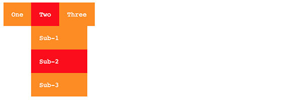
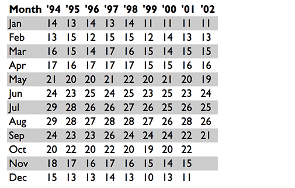

# 3 - CSS

CSS (cascading style sheets) are used to define rules that determine the appearance/style of elements, or sub-sets of elements.  

CSS is a **huge** learning curve in it's own right. I'll be honest, it took me many years to get comfortable with it. There is simply not the time or space to go into the detail of it here. I really don't want to devote more than a few pages to it, so I'll provide a bunch of sample code illustrating some of the most common "tricks" or features you are likely to want. After that, I recommend finding good tutorials for CSS online, or simply doing a Google search with the key term "CSS" in it and finding a StackOverflow response that helps.  At the end of the day, CSS is all about making your app look good. You can still make an app fully functional without it, it just won't look as nice. Since the focus of this book is Javascript and learning programming that *does stuff*, I'll give you the accompanying CSS for all the projects rather than expecting you to create your own.

# 3.1 - CSS Selectors

You define a CSS rule by specifying a 'selector' that indicates either a tag, an id, a class, or a combination of those that you want to apply a set of style rules to.  For example:

```css
div {
    border: 1px solid black;
}

#password {
    background-color: #808080;
}

.fields {
    font-size: 12pt;
}
```

The above rules are:

* For all `<div>` tags, apply a border of 1px wide, with a solid black line.
* For the element that has attribute `id="password"`, set the background colour to grey.
* For all elements that have attribute `class="fields"`, set the font size to 12pt.

You can mix and match, so the following would be a valid selector:

```css
div.fields {
    color: yellow;
}
```

This would set the foreground color to yellow for all `<div>` tags with the attribute `class="fields"`.

<div class="page"/>

# 3.2 - CSS Boiler plate

The following is the kind of structure I tent to use to start my project's CSS file with:

```css
html, body {
    padding: 0 0 0 0;
    margin: 0 0 0 0;
    background: #ffffff;
    font-family: "Roboto", "Helvetica", "Arial", sans-serif;
    --button-primary: #0078e7;
    --button-secondary: #42b8dd;
    --button-success: #1cb841;
    --button-error: #ca3c3c;
    --button-warning: #df7513;
    --layout-primary: #475bbd;
    --layout-secondary: #ff498c;
    --footer-background: #efefef;
}
```

The above sets the padding and margins between all elements to zero, sets the background color to white, sets the default font as 'Roberto' (with the others as fallbacks if the first font is unavailable), and then creates a set of variables for the main colours that I want my site to be based on. By using variables for colours, it means I can just change the value here once, and it will auto change where-ever i've used that variable name later in the CSS.

<div class="page"/>

# 3.3 - CSS Basic styling

## Units

There are a lot of options available for you in specifying units for sizing and positoning. So many it can be quite confusing. I'll mention a few of the more common ones here. For a full list and explaination please visit [http://devdocs.io/css/length](http://devdocs.io/css/length).

* `px` - Pixels (be aware of the problems this can cause when using screens of different sizes)
* `%` - Percentage of the enclosing element
* `vh` - Each unit equals 1 % of the height of the viewport (window of the browser)
* `vw` - Each unit equals 1 % of the width of the viewport (window of the browser)
* `em` - Each unit equals the height of the current font size. Eg: 1.5em is equivilant to one and a half line spacing.
* `pt` - Points, the unit in which font sizes have been traditionally measured.

## Spacing and borders

The box model forms the basis of all the spacing around your text, both within and outside of any border and background area.


* `padding: top right bottom left;`
* `margin: top right bottom left;`
* `background-color: #rrggbb;`
* `border: 1px solid #000000;`

Replace the `top`, `right`, `bottom`, `left` with sizes and units.  For example:

```css
p {
    border: 1px solid #000000;
    padding: 5px 20px 5px 20px;
    margin: 10px 10px 10px 10px;
}
```

<div class="page"/>

## Text properties

These CSS rules can generally be applied to any "tag" that contains text, whether it be `<p>`, `<div>`, `<span>`, `<a>`, `<li>`, or any of a host of others.

* `color: #rrggbb;` - A six character colour code to set the font text to. Eg: `color: #f49242` is a shade of orange. Google for an `rgb colour picker` to find a site that will give you the colour codes for any colour you desire.
* `text-align:` - Can be set to `left;`, `center;`, `right;` or `justify;`.
* `text-decoration: none;` - Will remove the underline from links
* `font-size: 10pt;`
* `line-height: 1.5em;` - 1.5 line spacing

## Sizing

* `width:`
* `min-width:`
* `max-width:`
* `height:`
* `min-height:`
* `max-height:`

Exanples:

```css
p {
    line-height: 1.5em;
    width: 80%;
    font-size: 2vh;
}
```

## Positioning

Use the same unit types available to you in sizing above.

* `position:` - options are: static, relative, fixed, absolute. Please see [http://devdocs.io/css/position](http://devdocs.io/css/position) for detailed examples and explaination.  Some tips:
  * `absolute` maintains position within the scroll bar flow of your document. `fixed` locks in to a position on your screen/window. These are probably the only two times you'd need to use `position`, otherwise the grid should suit your purposes.
* `top:`
  * When position is set to absolute or fixed, the top property specifies the distance between the element's top edge and the top edge of its containing block. (Containing block needs to have property position: relative )
  * When position is set to relative, the top property specifies the distance the element's top edge is moved below its normal position.
  * When position is set to sticky, the top property behaves like its position is relative when the element is inside the viewport, and like its position is fixed when it is outside.
  * When position is set to static, the top property has no effect.
* `left:`
* `bottom:`
* `right:`

Sourced from http://devdocs.io/css/position, and http://devdocs.io/css/top

Example usage:

```css
/* Will position a footer bar, one line above from the bottom of the screen */
.footer {
    position: absolute;
    top: -1em;
}
```

**It is highly recommended that you use the grid layout instead of trying to do manual positioning**.  It tends to cause unforeseeing problems. If you must use it, be sure to test your code on multiple web browsers (Chrome, Firefox, Safari) and operating systems (Windows, Mac, Android, iPhone, iPad).


<div class="page"/>

# 3.4 - CSS Showing/hiding items

* `display: none;` will prevent an object from being visible on screen.
* To make an object visible again, you need to know what the original display mode was. You might want to save the display setting via javascript before changing it to 'none'. There are a variety of different display modes that have different effects.

Most common display modes you'll probably want:

* `display: inline;` - Displays as an inline element such as `<span>`
* `display: block;` - Displays as a block of text, such as `<p>`
* `display: grid;` - Displays child elements in a grid format (see relevant section)
* `display: initial;` - Sets to this elements default value
* `display: none;` - Hide the element and all it's child elements

One useful example that I commonly use is a class `dont-print` with the following CSS rule which I will use to make the document more "printer-friendly" by removing some elements that would clutter the document if it is being printed (for instance, the menu side bar could be hidden as it has no use on a printed document)

```css
@media only print {
    .dont-print               { display: none; }
}
```

<div class="page"/>

# 3.5 - CSS Grid layout

The CSS grid is a comparatively new way of structuring your layout. It is by far the easiest, best and only method you should bother learning. Anytime you want to design a layout, include the terms `css grid` as part of your google query. A couple of useful sites:

* A series of grid layout examples of common uses - https://gridbyexample.com/examples/
* An online grid layout generator that will create the CSS for you - https://www.layoutit.com/grid

## Exercise: The classic header, sidebar and main body layout


This layout is intended to be mobile phone friendly. If the viewing screen is less than 900px wide, it will convert to one a column stack as shown. Try resizing your browser window and watch it change!


The key to making the grid layout work is the `grid-template-areas` property attached to the wrapper element of your grid. Use one string per vertical section, and spaces within each string to denote each horizontal section. Ensure you have a matching number of rows and columns throughout. Name each section corresponding to the spaces you want within the grid (the names can double-up to allow a "space" to take multiple cells). 

In the example below you can see that the grid is 3x3, with the "header" running across the entire top row; the middle is split with a "sidebar" space on the left, and the middle two sections being for the "content", and then a "footer" runs across the bottom row.

CSS in `my-project.css`:

```css
    /* Default layout for mobile devices */
    #layout_wrapper {
        display: grid;
        grid-gap: 1em;
        grid-template-areas:
        "header"
        "sidebar"
        "content"
        "footer"
    }

    /* Layout for greater than 600 pixel wide devices */
    @media only screen and (min-width: 900px)   {
        #layout_wrapper {
            grid-gap: 20px;
            grid-template-columns: 120px auto 120px;
            grid-template-areas:
            "header  header  header"
            "sidebar content content"
            "footer  footer  footer";
        }
    }

    #layout_header {    grid-area: header;  }
    #layout_sidebar {   grid-area: sidebar; }
    #layout_content {   grid-area: content; }
    #layout_footer {    grid-area: footer;  }

    /* Optional styling code just to help illustrate the grid effect */
    .style_wrapper {
        background-color: #fff;
        color: #444;
    }

    /* Optional styling code just to help illustrate the grid effect */
    .style_box {
        background-color: #444;
        color: #fff;
        border-radius: 5px;
        padding: 10px;
        font-size: 150%;
    }

```

HTML:

```html
<!doctype html>
<html>
    <head>
        <title>{{project.title}}</title>
        <meta charset="utf-8">
        <meta http-equiv="x-ua-compatible" content="ie=edge">
        <meta name="description" content="{{project.title}}">
        <meta name="viewport" content="width=device-width, initial-scale=1.0"/>
        <link rel="stylesheet" href="my-project.css">
        <script type="text/javascript" src="my-project.js"></script>
    </head>
    <body>
        <div id="layout_wrapper" class="style_wrapper">
            <div id="layout_header" class="style_box">
                Header
            </div>
            <div id="layout_sidebar"  class="style_box">
                Sidebar
            </div>
            <div id="layout_content"  class="style_box">
                Main content area
            </div>
            <div id="layout_footer"  class="style_box">
                Footer
            </div>
        </div>
    </body>
</html>
```

<div class="page"/>

# 3.6 - CSS Drop down menus

One very commonly sought trick is how to make the classic 'drop down menu'. The following is a slight modification of that from the excellent tutorial *"Solved with CSS! Dropdown Menus (Kravets, Una) 2018"* available at [https://css-tricks.com/solved-with-css-dropdown-menus/](https://css-tricks.com/solved-with-css-dropdown-menus/)

Demo:



HTML:

```html
<nav class="drop-down-menu" role="navigation">
  <ul>
    <li><a href="#">One</a></li>
    <li><a href="#">Two</a>
    <ul class="dropdown">
        <li><a href="#">Sub-1</a></li>
        <li><a href="#">Sub-2</a></li>
        <li><a href="#">Sub-3</a></li>
    </ul>
    </li>
    <li><a href="#">Three</a></li>
  </ul>
</nav>
```

CSS:

```css
nav.drop-down-menu  {
    font-family: monospace; /* Change this to suit your needs */
}

nav.drop-down-menu a {
    text-decoration: none;
}

nav.drop-down-menu ul {
    background: darkorange; /* Change this to suit your needs */
    list-style: none;
    margin: 0;
    padding-left: 0;
}

nav.drop-down-menu li {
    color: #fff;            /* Change this to suit your needs */
    background: darkorange; /* Change this to suit your needs */
    display: block;
    float: left;
    padding: 1rem;
    position: relative;
    text-decoration: none;
    transition-duration: 0.5s;
}
  
nav.drop-down-menu li a {
    color: #fff;            /* Change this to suit your needs */
}

nav.drop-down-menu li:hover,
nav.drop-down-menu li:focus-within {
    background: red;        /* Change this to suit your needs */
    cursor: pointer;
}

nav.drop-down-menu li:focus-within a {
    outline: none;
}

nav.drop-down-menu ul li ul {
    background: orange;     /* Change this to suit your needs */
    visibility: hidden;
    opacity: 0;
    min-width: 5rem;
    position: absolute;
    transition: all 0.5s ease;
    margin-top: 1rem;
    left: 0;
    display: none;
}

nav.drop-down-menu ul li:hover > ul,
nav.drop-down-menu ul li:focus-within > ul,
nav.drop-down-menu ul li ul:hover,
nav.drop-down-menu ul li ul:focus {
    visibility: visible;
    opacity: 1;
    display: block
}

nav.drop-down-menu ul li ul li {
    clear: both;
    width: 100%;
}
```

<div class="page"/>

# 3.7 - CSS Stlying form elements

## Input textbox

Use padding to add space within your text box so they aren't so squashed.

```css
input[type=text] {
    width: 100%;
    padding: 12px 20px;
    margin: 8px 0;
    box-sizing: border-box;
}
```

Add a border

```css
input[type=text] {
    border: 2px solid red;
    border-radius: 4px;
}
```

Add an icon or image inside the textbox

```css
input[type=text] {
    background-color: white;
    background-image: url('searchicon.png');
    background-position: 10px 10px; 
    background-repeat: no-repeat;
    padding-left: 40px;
}
```

This section from https://www.w3schools.com/css/css_form.asp

## Input buttons

```css
input[type=button], input[type=submit], input[type=reset] {
    background-color: #4CAF50;
    border: none;
    color: white;
    padding: 16px 32px;
    text-decoration: none;
    margin: 4px 2px;
    cursor: pointer;
    /* Tip: use width: 100% for full-width buttons */
}
```

## Textarea

To fix the textarea appearing to "rise above" the associated line of text containing it.

```css
textarea {
  vertical-align: top;
}
```

<div class="page"/>

## Checkbox

To give your checkbox the 'toggle switch' look that is common on mobile phones.


```html
<label class="switch">
  <input type="checkbox">
  <span class="slider round"></span>
</label>
```

```css
/* The switch - the box around the slider */
.switch {
  position: relative;
  display: inline-block;
  width: 60px;
  height: 34px;
}

/* Hide default HTML checkbox */
.switch input {display:none;}

/* The slider */
.slider {
  position: absolute;
  cursor: pointer;
  top: 0; 
  left: 0;
  right: 0; 
  bottom: 0;
  background-color: #ccc;
  -webkit-transition: .4s;
  transition: .4s;
}

.slider:before {
  position: absolute;
  content: "";
  height: 26px;
  width: 26px;
  left: 4px;
  bottom: 4px;
  background-color: white;
  -webkit-transition: .4s;
  transition: .4s;
}

input:checked + .slider {
  background-color: #2196F3;
}

input:focus + .slider { box-shadow: 0 0 1px #2196F3;
}

input:checked + .slider:before {
  -webkit-transform: translateX(26px);
  -ms-transform: translateX(26px);
  transform: translateX(26px);
}

.slider.round {         border-radius: 34px; }

.slider.round:before {  border-radius: 50%; }
```
From https://www.w3schools.com/howto/howto_css_switch.asp

<div class="page"/>

# 3.8 - CSS Icons

One of the more commonly used libraries of icons is 'Font Awesome'.

To see their set of free-to-use icons, goto https://fontawesome.com/cheatsheet

To use the Font Awesome icons, add the following line inside the `<head>` section of your HTML page:

<link rel="stylesheet" href="https://use.fontawesome.com/releases/v5.2.0/css/all.css" integrity="sha384-hWVjflwFxL6sNzntih27bfxkr27PmbbK/iSvJ+a4+0owXq79v+lsFkW54bOGbiDQ" crossorigin="anonymous">

Then, to display an icon in HTML, simply use the `<i class="fa fa-icon-code">` tag. See example below.

Example:

```html
<!DOCTYPE html>
<html>
    <head>
        <link rel="stylesheet" href="https://use.fontawesome.com/releases/v5.2.0/css/all.css" integrity="sha384-hWVjflwFxL6sNzntih27bfxkr27PmbbK/iSvJ+a4+0owXq79v+lsFkW54bOGbiDQ" crossorigin="anonymous">
    </head>
    <body>
        <i class="fa fa-cloud"></i>
        <i class="fa fa-heart"></i>
        <i class="fa fa-car"></i>
        <i class="fa fa-file"></i>
        <i class="fa fa-bars"></i>
    </body>
</html>
```


<div class="page"/>

# 3.9 - CSS Styling tables

One way to improve the readability of large tables is to color alternating rows. For example, the table below has a light gray background for the even rows and white for the odd ones. The rules for that are extremely simple:

```css
tr:nth-child(even) {background: #CCC}
tr:nth-child(odd) {background: #FFF}
```

From: https://www.w3.org/Style/Examples/007/evenodd.en.html



<div class="page"/>
