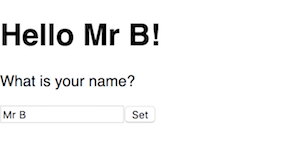
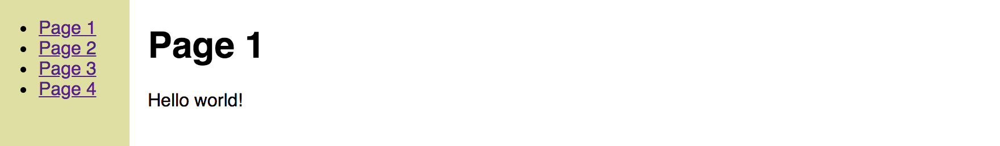
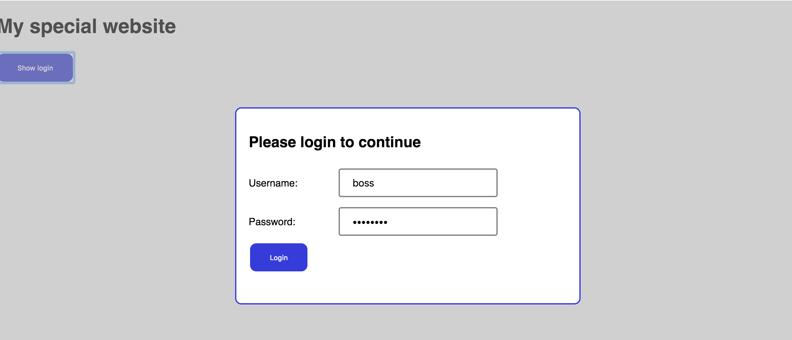
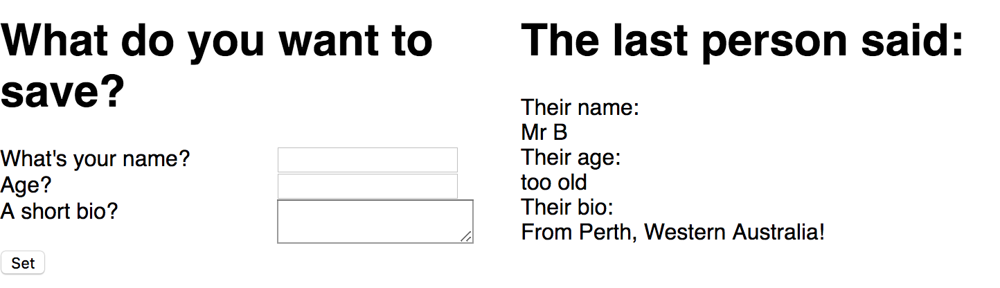
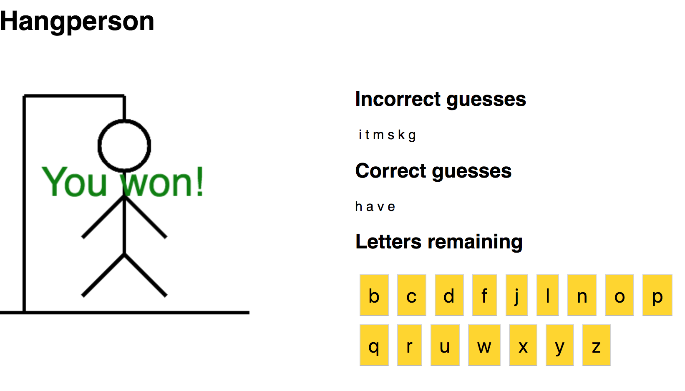

# 4 - Javascript: Manipulating the HTML and CSS

# 4.1 - Document object model functions & properties

This section will briefly mention some of the key functions and properties Javascript makes available for you to use to manipulate the HTML document.

## Document functions

### querySelector()

Usage:

```
let element = document.querySelector( selector_string );
```

Returns a variable containing a reference to the first matching location within your HTML document as determined by your `selector_string`. The `selector_string` works the same as CSS selectors. Some examples:

For HTML `<div id="text" class="person" data-example="nothing much">`, the following selectors would work:

  * `#text` would select based on `id="text"`
  * `.person` would select based on `class="person"`
  * `div[data-example]` would select based on being a `div` with a `data-example` attribute
  * `div[data-example="nothing much"]` would select based on being a `div` with a `data-example` attribute that is set to `"nothing much"`

### querySelectorAll()

Usage:

```javascript
let elements = document.querySelectorAll( selector_string );
```

Returns an "array-like" list of elements. I say "array-like" as it is not a true Javascript array which can be a little frustrating to get your head around at first.

An example to iterate over this list:

```javascript
let elements = document.querySelectorAll("div"); // select all div tags
for (let element of elements) {
    element.innerHTML = "boo!";
}
```

<div class="page"/>

## Element functions

The examples below presume the following HTML:

```html
<div id="person" class="info_box">
    <p>The person is <span id="person_name">Black widow</span></p>
</div>
```

### element.setAttribute()

```javascript
element.setAttribute( attribute_name, new_value );
```

`document.querySelector("#person").setAttribute( "class", "not_info");` would change the class for the `<div>` from `info_box` to `not_info`.

### element.removeAttribute()

```javascript
element.removeAttribute( attribute_name );
```

`document.querySelector("#person").removeAttribute( "class" );` would remove the class attribute all together for the `<div>`.

### element.getAttribute()

```javascript
let attr = element.getAttribute( attribute_name );
```

`let attr = document.querySelector("#person").getAttribute( "class" );` would put the value `info_box` into the `attr` variable.

### element.hasAttribute()

```javascript
let result = element.hasAttribute( attribute_name );
```

`let result = document.querySelector("#person").hasAttribute( "class" );` would return `true`.

### element.addEventListener()

```javascript
element.addEventListener( event_code, function_to_call );
```

See *4.2 - Javascript event handlers* for a list of event_codes and some examples.

`document.querySelector("#person").addEventListener( "click", hello );` would run the function `hello()` if you clicked on the text inside the `<div>`.

### element.removeEventListener()

```javascript
element.removeEventListener( event_code, function_to_call );
```

Will remove event listeners when both the event_code and the function_to_call match an event that was created. See *4.2 - Javascript event handlers* for a list of event_codes and some examples.

<div class="page"/>

## Element properties

Element properties are like variables. They are generally named items that you can read/write to like a variable that allow you to read/change the HTML element in question somehow.

### element.value

Use to get/set the string value of a HTML element. Typically used with the `<input>` form items.  eg:

If the HTML contains `<input type="text" id="name_textbox">`, then the Javascript might have

```javascript
let name_element = document.querySelector("#name_textbox");
console.log( name_element.value );      // Will print the value in the text box
```

### element.innerHTML

Use to get/set a string of the HTML inside the element. eg:

If the HTML contains...

```html
<div id="demo"><p>Hello there</p></div>
```

Then this Javascript...

```javascript
let demo = document.querySelector("#demo");
console.log( demo.innerHTML );
```

Would print...

```text
<p>Hello there</p>
```

### element.classList

Contains a Javascript array of the classes in the class attribute (it's an array as it is possible for multiple classes to be specified within a tag. For instance you could use one for layout, one for visual styling, another for javascript event hooks etc).

```html
<div id="menuItem1" class="sidebar menu clickevent">Something</div>
```

```javascript
let classes = document.querySelector("#menuItem1").classList;
for (let individualclass of classes) {
    console.log(individualClass);
}
```

### element.id

Use to get/set the id attribute of an element.

```javascript
let inputs = document.querySelector("input");
console.log("The id's of all the <input> elements are:");
for (let aninput of inputs) {
    console.log( aninput.id );
}
```

### element.name

Use to get/set the `name` attribute of an element. The `name` attribute is used by `input` and `label` elements.

### element.tagName

Use to get the name of the HTML element. For example, `div` or `span` or `input`.

### element.dataset

A JSON object of the `data-*` attributes. These are special attributes that browsers will ignore, they are designated as available for programmers to use to store extra information that their application needs in the element without affecting how the web browser behaves. Any attribute name starting with `data-` is a custom attribute. For example:

```html
<div id="menuItem1" class="clickevent" data-goto="page1.html">Open page 1</div>
```

```javascript
function clicked(event) {
    let goto_location = this.dataset.goto;
    window.location = goto_location;    // Will redirect the web browser to load this address
}

function main() {
    let elements = document.querySelectorAll(".clickevent");
    for (let element in elements) {
        element.addEventListener("click", clicked);
    }
}

window.onload=main;
```

<div class="page"/>

## Javascript: First exercise manipulating the HTML

Hopefully a simple program to begin our journey with manipulating the HTML: Some text, a input textbox, and a button. Type your name into the textbox, click the button, and your name will appear in the greeting header.

<hr/>



```html
<!doctype html>
<html>
    <head>
        <title>{{project.title}}</title>
        <meta charset="utf-8">
        <meta http-equiv="x-ua-compatible" content="ie=edge">
        <meta name="description" content="{{project.title}}">
        <meta name="viewport" content="width=device-width, initial-scale=1.0"/>
        <link rel="stylesheet" href="my-project.css">
        <script type="text/javascript" src="my-project.js"></script>
    </head>
    <body>
        <!-- insert your HTML content here -->
        <h1>Hello <span id="name_span">everyone</span>!</h1>
        <p>What is your name?</p>
        <input type="text" id="name_textbox"><input type="button" id="set_button" value="Set">
        <!-- end of HTML content area -->
    </body>
</html>
```

Javascript file: `my-project.js`:

```javascript
"use strict";

function setName(e) {
    let personName = document.querySelector("#name_textbox").value;
    document.querySelector("#name_span").innerHTML = personName;
}

function main() {
    document.querySelector("#set_button").addEventListener("click", setName);
}

window.onload=main;
```

The `window.onload=main;` is quite important. This will result in our javascript only starting to execute once the web browser has finished loading everything into the window. If we allowed our program to start before this point, very often your code might try to access an element in the HTML that hasn't loaded yet, and you can lose hours trying to figure out why your code is generating errors! Learn from others who have gone before you, put your "starting code" in a function such as `main`, and use the `window.onload=main;` method to have it run.

The function `addEventListener()` is described in the next section.

<div class="page"/>

# 4.2 - Javascript: Event handlers

Javascript functions:

* `.addEventListener( eventToWatch, functionToCall );`
* `.removeEventListener( eventToWatch, functionToCall );`
* `.dispatchEvent( eventToWatch, functionToCall );` - Trigger the event handler as if the event occurred

Most common form events:

* `change` - Fired at controls when the user commits a value change 
* `input` - Fired at controls when the user changes the value (could still be in the midst of typing more changes)

General events:

* `click` - Fired if element is clicked the the mouse. Useful for menus, buttons etc
* `load` - Fired when the element has loaded (eg: image, video, file) 
* `focus` - Fired if the element gains focus (obtains the cursor)
* `submit` - Fired if the `<input type="submit">` element is triggered

Available generally, but particularly useful for the canvas:

* keydown -  - `event.key` and `event.keyCode` contain the key that is down.
* keypress - `event.key` and `event.keyCode` contain the key that was pressed.
* keyup - `event.key` and `event.keyCode` contain the key that was released.
* mouseover - `event.pos` contains the x,y coordinators of the mouse.
* mousemove - `event.pos` contains the x,y coordinators of the mouse.
* mousedown - `event.pos` contains the x,y coordinators of the mouse, `event.button` contains the button that was pressed. ????? CHECK
* mouseup - `event.pos` contains the x,y coordinators of the mouse.

## Exercise: Javascript events 1

A basic demo showing how capturing the click event can be captured programmatically.

In a new HTML, make the content of the `<body>` area the following:

```html
    <div id="main">
        <p id="para-1">This is the first paragraph</p>
        <p id="para-2">Paragraph 2</p>
    </div>
```

Javascript file:

```js
function notify(event) {
    alert( "You triggered the event on "+ this.id +" by clicking on "+ event.target.id );
}

let elements = document.querySelectorAll("div");
for (let i=0; i<elements.length; i++) {
    elements[i].addEventListener( "click", notify );
}
```

You should have the console print out the `this` object that is automatically created in an event handling function, along with the content of the `event` parameter to study the different data they provide you. While often similar/identical there are useful times they are different. For example if the below was our HTML for the above javascript:

If you were to have clicked on the actual text of one of the paragraphs, the outputs could have been *You triggered the event on main by clicking on para-1*. In other words, `this` will be the element you attached the event to (in this case the 'div'), where as the parameter variable `event` will contain the child element that actually got clicked.

<div class="page"/>

## Exercise: Javascript events 2

A pretty basic non-useful app that demonstrates the click, input and change events.

HTML:

```html
<!doctype html>
<html>
    <head>
        <script type="text/javascript" src="my-project.js"></script>
    </head>
    <body>
        <h1 id="title">Events demo</h1>
        <p>The most recent event was <span id="most_recent_event">none</span></p>
        <p>The responsible item was <span id="most_recent_item">none</span></p>
        <hr>
        <input type="text" id="demo_text" placeholder="Type some text here...">
        <input type="button" id="demo_set" value="Set">
        <hr>    
        <h2>Change some colours?</h2>
        <input type="button" id="color_red" value="Red">
        <input type="button" id="color_blue" value="Blue">
        <input type="button" id="color_green" value="Green">
        <input type="button" id="color_white" value="White">
    </body>
</html>
```

Javascript in `my-project.js`:

```javascript
"use strict";

function setEventDetail( event, item ) {
    document.querySelector("#most_recent_event").innerHTML = event;
    document.querySelector("#most_recent_item").innerHTML = item;
}

function setText(e) {
    setEventDetail( "click", this.id );
    let textvalue = document.querySelector("#demo_text").value;
    document.querySelector("#title").innerHTML = textvalue;
}

function setColor(e) {
    setEventDetail( "click", this.id );
    if (this.id == "color_red") {
        document.querySelector("body").style.backgroundColor = "red";
    } else if (this.id == "color_green") {
        document.querySelector("body").style.backgroundColor = "green";
    } else if (this.id == "color_blue") {
        document.querySelector("body").style.backgroundColor = "blue";
    } else if (this.id == "color_white") {
        document.querySelector("body").style.backgroundColor = "white";
    }
}

function textChanged(e) {
    setEventDetail("change", this.id);
}

function textInputted(e) {
    setEventDetail("input", this.id);
}

function main() {
    document.querySelector("#demo_text").addEventListener("change", textChanged);
    document.querySelector("#demo_text").addEventListener("input", textInputted);
    document.querySelector("#demo_set").addEventListener("click", setText);
    document.querySelector("#color_red").addEventListener("click", setColor);
    document.querySelector("#color_green").addEventListener("click", setColor);
    document.querySelector("#color_blue").addEventListener("click", setColor);
    document.querySelector("#color_white").addEventListener("click", setColor);
}

window.onload=main;
```

<div class="page"/>

## Exercise: Show/hide items 1

The CSS display style is commonly used to create HTML that "contains" more than one screen worth of content within it, and hiding all screens but the one you want shown at that time.

To set the display attribute via javascript, use the `.style.display` property:

The following is a relatively simple example exercise showing how the hide/initial functionality could work.



HTML

```html
<!doctype html>
<html>
    <head>
        <title>{{project.title}}</title>
        <link rel="stylesheet" href="my-project.css">
        <script type="text/javascript" src="my-project.js"></script>
    </head>
    <body>
        <div id="wrapper">
            <div id="sidebar">
                <ul>
                    <li><a href="#" class="click_me" data-show="page1">Page 1</a></li>
                    <li><a href="#" class="click_me" data-show="page2">Page 2</a></li>
                    <li><a href="#" class="click_me" data-show="page3">Page 3</a></li>
                    <li><a href="#" class="click_me" data-show="page4">Page 4</a></li>
                </ul>
            </div>
            <div id="content">
                <div class="page" id="page1">
                    <h1>Page 1</h1>
                    <p>Hello world!</p>
                </div>
                <div class="page" id="page2">
                    <h1>Page 2</h1>
                    <p>How you doing?</p>
                </div>
                <div class="page" id="page3">
                    <h1>Page 3</h1>
                    <p>Now you see me...</p>
                </div>
                <div class="page" id="page4">
                    <h1>Page 4</h1>
                    <p>Now you don't</p>
                </div>
            </div>
        </div>
    </body>
</html>
```

<div class="page"/>

CSS `my-project.css`:

```css
html, body {
    padding: 0 0 0 0;
    margin: 0 0 0 0;
    background: #fff;
    font-family: "Roboto", "Helvetica", "Arial", sans-serif;
}

.page {
    display: none;
}

#wrapper {
    display: grid;
    grid-gap: 1em;
    grid-template-columns: 120px auto;
    grid-template-areas:
    "sidebar content"
}

#content { grid-area: content;  }
#sidebar { 
    grid-area: sidebar; 
    background-color: #e0e0a0;
    height: 100vh;
}
```

Javascript `my-project.js`:

```javascript
"use strict;"

function showPage( page_id ) {
    // Hide all the pages
    let selector = ".page";
    let elements = document.querySelectorAll( selector );
    for (let i=0; i < elements.length; i++) {
        elements[i].style.display = "none";
    }
    // Show the page requested
    console.log("displaying "+page_id);
    let page_div = document.querySelector( "#"+page_id );
    page_div.style.display = "block";
}

function menuItemClicked(e) {
    // Determine the page we want
    let page_id = this.dataset.show;
    // Run our showPage function asking for that page to be visible
    showPage( page_id );
}

function main() {
    // Add the `click` event listener to all menu items with class == `click_me`
    let selector = ".click_me";              
    let elements = document.querySelectorAll( selector );
    for (let i=0; i < elements.length; i++) {
        console.log("Adding event listener to "+elements[i]);
        elements[i].addEventListener("click", menuItemClicked);
    }
    // Show the first page by default
    showPage("page1");
}

// Once we have finished loading the page, run the `main` function.
window.onload = main;
```

<div class="page"/>

## Exercise: Show/hide items 2

This is another show/hide exercise that simulates a "pop up login dialog".



HTML:

```html
<!doctype html>
<html>
    <head>
        <title>{{project.title}}</title>
        <link rel="stylesheet" href="my-project.css">
        <script type="text/javascript" src="my-project.js"></script>
    </head>
    <body>
        <h1 id="title">My special website</h1>
        <input type="button" value="Show login" id="show_login_button">
        <div id="login_form" style="display:none">
            <div class="modal_background"></div>
            <div class="modal_window">
                <h2>Please login to continue</h2>
                <form id="signupForm" enctype='multipart/form-data'>
                    <div>
                        <label for="username">Username:</label>
                        <input type="text" id="username" name="username">
                    </div><div>
                        <label for="password">Password:</label>
                        <input type="password" id="password" name="password">
                    </div><div>
                        <input type="button" value="Login" id="login_button">
                    </div>
                </form>
            </div>
        </div>
    </body>
</html>
```

<div class="page"/>

CSS file `my-project.css`:

```css
html, body {
    padding: 0 0 0 0;
    margin: 0 0 0 0;
    background: #ffffff;
    font-family: "Roboto", "Helvetica", "Arial", sans-serif;
}

input[type=button] {
    background-color: #3333dd;
    color: white;
    border: none;
    border-radius: 10px;
    padding: 16px 32px 16px 32px;
    margin: 4px 2px 4px 2px;
    cursor: pointer;
}

input[type=button]:hover {
    background-color: #5555ff;
    box-shadow: 0px 5px 10px 1px #a0a0a0;
}

input[type=text], input[type=password] {
    width: 50%;
    padding: 12px 20px;
    margin: 8px 0;
    box-sizing: border-box;
    border: 2px solid #808080;
    border-radius: 4px;
    font-size: 12pt;
}

.modal_background {
    position: fixed;
    top: 0;
    bottom: 0;
    left: 0;
    right: 0;
    background-color: #a0a0a0;
    opacity: 0.5;
}

.modal_window {
    position: fixed;
    padding: 20px 20px 20px 20px;
    top: 25vh;
    left: 30vw;
    width: 40vw;
    height: 40vh;
    background-color: #ffffff;
    border: 2px solid #3333dd;
    border-radius: 10px;
}

label {
    display: inline-block;
    width: 140px;
    text-align: left;
}
```

<div class="page"/>

Javascript file `my-project.js`:

```javascript
"use strict";

function showHideModal(e) {
    let modal = document.querySelector("#login_form");
    if (modal.style.display == "block") {
        modal.style.display = "none";
    } else {
        modal.style.display = "block";
    }
}

function shake( selector ) {
    /*  A little bit of Javascript + CSS fun: 
        Make your login window do a crazy shake if the username/password is wrong 

    Credits:
        Originally inspired by https://stackoverflow.com/a/33213841 
        Use of .getBoundingClientRect() thanks to https://stackoverflow.com/a/11396681 
    */

    let originalLeft = document.querySelector( selector ).getBoundingClientRect().left;
    let shakeMaximumDistance = 10;
    let shakeDirection = 3;
    let shakeTimes = 30;
    let clock = setInterval(doTheShake, 5);

    function doTheShake() {
        shakeTimes--;
        if (shakeTimes <= 0) {
            clearInterval(clock);
            document.querySelector( selector ).style.left = originalLeft + "px"; 
        } else {
            let currentLeft = document.querySelector( selector ).getBoundingClientRect().left;
            let newLeft = currentLeft + shakeDirection;
            if (newLeft >= originalLeft+shakeMaximumDistance || newLeft<= originalLeft-shakeMaximumDistance) {
                shakeDirection = -shakeDirection;
            }
            document.querySelector( selector ).style.left = newLeft + "px"; 
        }
    }
}

function login(e) {
    let username = document.querySelector("#username").value;
    let password = document.querySelector("#password").value;

    /* 
    If you ever do this to check a username/password I will disown you! This is a DEMO!
    For starters, *anything* in your javascript can be read by others
    "password" is never a suitable password
    You should never hardcode your credentials, always look them up from an external secure source
    And a 1000 other things.... 
    */

    if (username == "boss" && password == "password") {
        showHideModal(e);
    } else {
        shake(".modal_window");
    }
}

function main() {
    document.querySelector("#show_login_button").addEventListener("click", showHideModal);
    document.querySelector("#login_button").addEventListener("click", login);
}

window.onload=main;
```

<div class="page"/>

# 4.3 - Javascript: Basic form tasks

## Exercise 1

This is a little gimmiky but will get you to practice numerous functions we have looked at so far. It's a "two page" app that will prompt the user for information, and then display the results in a second "page" as per the below.


<div class="page"/>

```html
<!doctype html>
<html>
    <head>
        <title>{{project.title}}</title>
        <link rel="stylesheet" href="my-project.css">
        <script type="text/javascript" src="my-project.js"></script>
    </head>
    <body>
        <div id="wrapper">
            <div class="page" id="page1">
                <h1>Welcome!</h1>
                <p>Tell me a little about you, and I'll tell you a little about you too!</p>
                <form id="about_you" enctype="multipart/form-data" onsubmit="">
                    <div>
                        <label for="givenName">Given name</label>
                        <input type="text" id="givenName" name="givenName" required>
                    </div>
                    <div>
                        <label for="familyName">Family name</label>
                        <input type="text" id="familyName" name="familyName" required>
                    </div>
                    <div>
                        <label for="dob">Date of birth</label>
                        <input type="date" id="dob" name="dob" required>
                    </div>
                    <div>
                        <label for="country">Country</label>
                        <input type="text" id="country" name="country" list="country_list" required>
                    </div>
                    <div>
                        <label for="go"></label>
                        <input type="submit" id="go" name="go" value="Go">
                    </div>
                </form>
            </div>
            <div class="page" id="page2" style="display:none">
                <h1>About <span id="displayName"></span></h1>
                <p>You are <span class="interesting" id="days_old"></span> days old!</p>
                <p>You were born on a <span class="interesting" id="day_of_week"></span>.</p>
                <p>There are <span class="interesting" id="days_until_birthday"></span> days until your next birthday.</p>
                <p><span class="interesting" id="happy_birthday"></span></p>
                <p><span id="flag"></span></p>
            </div>
        </div>
        <datalist id="country_list">
            <!-- Rather than manually entering a long list of countries, we'll use Javascript to automatically do this! -->
        </datalist>
    </body>
</html>
```


<div class="page"/>

```javascript
"use strict;"

let days_of_week_list = ["Sunday", "Monday", "Tuesday", "Wednesday", "Thursday", "Friday", "Saturday"];

let countries = [];

function processForm(e) {
    let givenName = e.target.elements.givenName.value;
    let familyName = e.target.elements.familyName.value;
    let dob_text = e.target.elements.dob.value;
    let country = e.target.elements.country.value;
    // Hide current page, show results page
    document.querySelector("#page1").style.display = "none";
    document.querySelector("#page2").style.display = "block";
    // Create date objects
    let dob_parts = dob_text.split("-");
    let dob_date = new Date( dob_parts[0], dob_parts[1]-1, dob_parts[2] );
    let today = new Date();
    // How many days old are you?
    let milliseconds_per_day = 24 * 60 * 60 * 1000;
    let days_old = Math.trunc( (today - dob_date ) / milliseconds_per_day );
    // What day of the week were you born?
    let dob_day_of_week_number = dob_date.getDay();
    let dob_day_of_week = days_of_week_list[ dob_day_of_week_number ];
    // Have you had this years birthday already?
    let had_birthday_yet = false;
    if (dob_date.getMonth() < today.getMonth()) {
        had_birthday_yet = true;
    } else if (dob_date.getMonth() == today.getMonth() &&  dob_date.getDate < today.getDate() ) {
        had_birthday_yet = true;
    }
    // How many days until your next birthday?
    let next_birthday = new Date( today.getFullYear(), dob_date.getMonth(), dob_date.getDate() );
    if (had_birthday_yet) { // Already had this years birthday, find next years.
        next_birthday = new Date( today.getFullYear() + 1, dob_date.getMonth(), dob_date.getDate() );
    }
    let days_to_next_birthday = Math.trunc( (next_birthday - today) / milliseconds_per_day );
    let happy_birthday = days_to_next_birthday==0 ? true : false;
    // Display the results
    document.querySelector("#displayName").innerHTML = givenName;
    document.querySelector("#days_old").innerHTML = days_old;
    document.querySelector("#day_of_week").innerHTML = dob_day_of_week;
    document.querySelector("#days_until_birthday").innerHTML = days_to_next_birthday;
    if (happy_birthday) {
        document.querySelector("#happy_birthday").innerHTML = "HAPPY BIRTHDAY !!!";
    }
    get_flag(country);
    e.preventDefault(); // To stop the "usual" behavior of the submit button, allowing us to override it.
}

function get_flag( country ) {
    // Look up the country name for it's country code
    for (obj of countries) {
        if (obj["en"].toLowerCase() == country.toLowerCase()) {
            // We have a match
            let countryCode = obj["code"];
            let url = "https://www.countryflags.io/"+ countryCode +"/shiny/64.png";
            let html = "";
            document.querySelector("#flag").innerHTML = html;
        }
    }
}

function get_countries_list() {
    // Load countries list
    let url = "https://raw.githubusercontent.com/raramuridesign/mysql-country-list/master/json-country-list.json";
    let settings = { mode: 'cors' };
    fetch( url, settings )
    .then(function(received) {
        if (received.ok) {
            return (received.json());
        }
    })
    .then(function(data) {
        console.log(data);
        countries = data;
        // We've got a list of countries, let's add it to our HTML
        let options = "";
        for ( item of data ) {
            options = options + "<option value='" + item["en"] + "'>\n";
        }
        document.querySelector("#country_list").innerHTML = options;
    });
}

function main() {
    // Set action for the submit button
    document.querySelector("#about_you").addEventListener("submit", processForm);
    get_countries_list();
}

// Once we have finished loading the page, run the `main` function.
window.onload = main;
```

```css
html, body {
    padding: 0 0 0 0;
    margin: 0 0 0 0;
    background: #fff;
    font-family: "Roboto", "Helvetica", "Arial", sans-serif;
}

label {
    display: inline-block;
    width: 150px;
    line-height: 2.5em;
}

input[type="text"], input[type="date"] {
    font-size: 12pt;
    padding: 3px;
    border-radius: 3px;
    border: 2px solid #c0c0c0;
}

input[type="button"], input[type="submit"] {
    font-size: 12pt;
    padding: 5px 20px 5px 20px;
    border-radius: 10px;
    color: white;
    border: 2px solid #c0c0c0;
    background-color: #4040f0;
}

#wrapper {
    margin: 10vh 10vw 10vh 10vw;
    padding: 10vh 10vw 10vh 10vw;
    border: 3px solid #4040f0;
    border-radius: 10px;
}

.interesting {
    font-size: 16pt;
    color: red;
    font-weight: bold;
}
```

<div class="page"/>

# 4.4 - Javascript: Uploading files

## Exercise: Upload and display photos

This demo will provide the functionality to upload a photo into your program, and display it back to the user in the browser. It does not save or upload the photo anywhere, as you need to setup a server-based storage location before you can do that. That means as soon as you reload or move off the page, the uploaded images will be lost from memory. 

HTML:

```html
<!doctype html>
<html>
    <head>
        <title>{{project.title}}</title>
        <link rel="stylesheet" href="my-project.css">
        <script type="text/javascript" src="my-project.js"></script>
    </head>
    <body>
        <div id="layout_wrapper">
            <h1 id="layout_header">Photo upload demo</h1>
            <div id="layout_upload">

                <div id="photo_wrapper">
                    <label id="photo_label" for="photo_input">
                        boo <!--  -->
                    </label>
                    <!-- 
                    <input type="file" capture="camera" accept="image/*" id="photo_input" name="photo_button" value="Upload photo">
                    -->
                    <input type="file" id="photo_input" name="photo_button" value="Upload photo">
                </div>

            </div>
            <div class="photoGrid" id="layout_photogrid">

            </div><!-- .page -->
        </div><!-- .wrapper -->
    </body>
</html>
```

CSS:

This CSS will hide the ugly-by-default file upload button that web browsers provide. Instead of making the upload button visible, we take advantage of the fact that clicking on the accompanying label element, also activates the input element. So we will stylise and use the label element as our "button". We're using opacity:0 instead of display:none so that accessibility aids (e-readers for visually impaired people etc) will still be able to work properly.

```css
html, body {
    padding: 0 0 0 0;
    margin: 0 0 0 0;
    background: #ff8;
    font-family: "Roboto", "Helvetica", "Arial", sans-serif;
}

#photo_input {
    opacity: 0;
    z-index: -1;
}
```

Javascript:

```javascript
"use strict;"

window.URL = window.URL || window.webkitURL;

function uploadPhoto(e) {
    let f = document.querySelector("input#photo_input").files[0]; // we're only going to bother with the first file
    console.log("[uploadPhoto] uploading "+f.name);
    // Display the file contents as an image in the HTML
    let container = document.querySelector(".photoGrid");
    var img = document.createElement("img");
    img.src = window.URL.createObjectURL(f);
    img.height = 100;
    img.className = "photoElement"
    img.onload = function() {
        window.URL.revokeObjectURL(this.src);
    }
    container.appendChild(img);
}

function main() {
    let uploadPhotoButton = document.querySelector("input#photo_input");
    uploadPhotoButton.addEventListener("change", uploadPhoto);
}

// Once we have finished loading the page, run the `main` function.
window.onload = main;
```

You won't be able to use the following alternative code without a web server to "upload" your files to, but given that it is such a common use-case, I include the example code below for whenever that need arises. I include it here for completeness sake, but without a web server expecting the file it won't be any use to you.

```javascript
function uploadPhotoToServer(e) {
    let f = document.querySelector("input#photo_input").files[0]; // we're only going to bother with the first file
    console.log("[uploadPhoto] uploading "+f.name);
    // Upload the file
    let url = "http://your-web-server-somewhere.com"; // location accepting your file upload
    let formData = new FormData();
    formData.append("file", f, f.name );
    fetch( url, { method: "POST", body: formData } ); 
}

```

Note: fetch will automatically add a Content-Type: multipart/form-data. Do not manually set a Content-Type (even to the correct one) or you will break the upload. See https://stanko.github.io/uploading-files-using-fetch-multipart-form-data/ for more information.


<div class="page"/>

# 4.5 - Javascript: local storage

Local storage are key-value strings that are stored in the web browser of individual computers that access your webapp.

To save information to local storage:

```js
localStorage.myinfo = "Info I want saved";
```

To retrieve from local storage:

```js
let myinfo = localStorage.myinfo;
```

Remember, localStorage will only store strings so if you want to save/retrieve a json data object, you'll need to use `JSON.stringify()` and `JSON.parse()`.

A couple of other notes:

* localStorage data will be visible to all pages running from the same origin. Eg: www.mywebsite.com/page1 and images.mywebsite.com/page2 won't be able to see the same localStorage, but www.mywebsite.com/page1 and www.mywebsite.com/images/page2 would be able to see the same localStorage.
* localStorage data is saved even when the browser is closed, so it will be present when the user returns to your webapp.
* localStorage data is lost if the user clears their browser cache.

## Exercise

A simple demo that illustrates that data can be saved for recall after closing and reopening the browser.



```javascript
"use strict;"

function save(e) {
    let data = {};
    data.name = document.querySelector("#yourName").value;
    data.age = document.querySelector("#yourAge").value;
    data.bio = document.querySelector("#yourBio").value;
    localStorage.demo = JSON.stringify(data);
    alert("Saved! You can close this screen and return to find the data still there");
}

function main() {
    // Load any information in the local storage and display it
    let demoData = localStorage.demo;
    if (demoData !== null) {
        let demoObject = JSON.parse(demoData);
        document.querySelector("#theirName").innerHTML = demoObject.name;
        document.querySelector("#theirAge").innerHTML = demoObject.age;
        document.querySelector("#theirBio").innerHTML = demoObject.bio;
    }
    document.querySelector("#set").addEventListener("click", save); // Set event handler
}

window.onload = main;
```

<div class="page"/>

```html
<!doctype html>
<html>
    <head>
        <title>{{project.title}}</title>
        <link rel="stylesheet" href="my-project.css">
        <script type="text/javascript" src="my-project.js"></script>
    </head>
    <body>
        <div class="grid">
            <div class="left">
                <h1>What do you want to save?</h1>
                <div>
                    <label for="yourName">What's your name?</label>
                    <input type="text" id="yourName">
                </div>
                <div>
                    <label for="yourAge">Age?</label>
                    <input type="text" id="yourAge">
                </div>
                <div>
                    <label for="yourBio">A short bio?</label>
                    <textarea type="text" id="yourBio"></textarea>
                </div>

                <input id="set" type="button" value="Set">
            </div>
            <div class="right">
                <h1>The last person said:</h1>
                <div>Their name:</div>
                <div id="theirName"></div>
                <div>Their age:</div>
                <div id="theirAge"></div>
                <div>Their bio:</div>
                <div id="theirBio"></div>
            </div>
        </div>
    </body>
</html>
```

```css
html, body {
    padding: 0 0 0 0;
    margin: 0 0 0 0;
    background: #fff;
    font-family: "Roboto", "Helvetica", "Arial", sans-serif;
}
label { 
    float: left; 
    width: 200px; 
}
.grid {
    display: grid;
    grid-gap: 20px;
    grid-template-columns: 1fr 1fr;
    grid-template-areas:
    "header header"
    "left right"
}

.header {    grid-area: header;  }
.left {   grid-area: left; }
.right {   grid-area: right; }
```

<div class="page"/>

# 4.6 - Javascript: Hang-person again

Let's convert one of our 'console and prompt' based exercises into one that uses HTML form inputs and which outputs the results back into the HTML (so we can stop using the dreaded console). Time for "Hang-person verison 2".



HTML:

```html
<!doctype html>
<html>
    <head>
        <title>{{project.title}}</title>
        <link rel="stylesheet" href="my-project.css">
        <script type="text/javascript" src="my-project.js"></script>
    </head>
    <body>
        <div class="grid">
            <div class="header">
                <h1 class="header">Hangperson!</h1>
            </div>
            <canvas id="drawing" width="300" height="300" class="left"></canvas>
            <div class="right">
                <h2>Incorrect guesses</h2>
                <div id="incorrect"></div>
                <h2>Correct guesses</h2>
                <div id="correct"></div>
                <h2>Letters remaining</h2>
                <div id="remaining"></div>
            </div>
        </div>
    </body>
</html>
```

<div class="page"/>

```javascript
"use strict;"

let word_list_url = "https://raw.githubusercontent.com/Xethron/Hangman/master/words.txt";
let remaining = "abcdefghijklmnopqrstuvwxyz";
let secret_word = "";
let correct = "";
let incorrect = "";
let gameOver = false;

function printUpdatedHangperson() {
    // Print correct guesses
    let html = "";
    let letters_remaining = false;
    for (let i=0; i<secret_word.length; i++) {
        let letter = secret_word.charAt(i);
        if (correct.indexOf(letter) >= 0) {
            html += letter+" ";
        } else {
            html += "_ ";
            letters_remaining = true;
        }
    }
    document.querySelector("#correct").innerHTML = html;
    // Print incorrect guesses
    html = "&nbsp;";
    for (let i=0; i<incorrect.length; i++) {
        html += incorrect.charAt(i)+" ";
    }
    document.querySelector("#incorrect").innerHTML = html;
    // Draw hangman
    if (! letters_remaining) {
        drawYouWon("#drawing");
    } else {
        drawHangperson("#drawing", incorrect.length);
    }
}

function drawHangperson( selector, level ) {
    function drawLine( x1, y1, x2, y2 ) {
        ctx.beginPath();
        ctx.moveTo(x1,y1);
        ctx.lineTo(x2,y2);
        ctx.stroke();
        }
    let ctx = document.querySelector(selector).getContext("2d");
    ctx.strokeStyle = "black";
    ctx.lineWidth = 4;
    drawLine(0,290,300,290);
    drawLine(30,290,30,30);
    drawLine(30,30,150,30);
    drawLine(150,30,150,60);
    if (level >= 1) { // Head
        ctx.beginPath();
        ctx.ellipse( 150, 90, 30, 30, 0, 0, 2*Math.PI);
        ctx.stroke();
    }
    if (level >= 2) { drawLine(150,120,150,220); }  // Torso
    if (level >= 3) { drawLine(150,220,100,270); }  // Right leg
    if (level >= 4) { drawLine(150,220,200,270); }  // Left leg
    if (level >= 5) { drawLine(150,150,100,200); }  // Right arm
    if (level >= 6) { drawLine(150,150,200,200); }  // Left arm
    if (level >= 7) { // Game over
        ctx.font = "36pt sans-serif";
        ctx.fillStyle = "red";
        ctx.fillText( "Game over!", 50, 150 );
        gameOver = true;
    }
}

function drawYouWon(selector) {
    let ctx = document.querySelector(selector).getContext("2d");
    ctx.font = "36pt sans-serif";
    ctx.fillStyle = "green";
    ctx.fillText( "You won!", 50, 150 );
    gameOver = true;
}


function getWordsList(url) {
    let settings = { mode: 'cors' };
    fetch( url, settings )
    .then(function(received) {
        if (received.ok) {
            return received.text();
        }
    }).then(function(words_blob) {
        let words = words_blob.split("\n");
        let r = Math.round(Math.random() * (words.length -1));
        secret_word = words[r].toLowerCase();
        console.log("Hint! The secret word is "+secret_word);
        printUpdatedHangperson();
    });
}

function makeGuess(e) {
    if (! gameOver) {
        let guess = e.target.value;
        console.log("You guessed the letter "+guess);
        let letterNumber = remaining.indexOf(guess);
        if (secret_word.indexOf(guess)>=0) {
            correct += guess;
        } else {
            incorrect += guess;
        }
        remaining = remaining.substring(0, letterNumber) + remaining.substring(letterNumber+1);
        printRemaining();
        printUpdatedHangperson();
    }
}

function printRemaining() {
    let html = "";
    for (let i=0; i<remaining.length; i++) {
        let letter = remaining.charAt(i);
        html += "<input type='button' class='guess' value='"+letter+"'>";
    }
    document.querySelector("#remaining").innerHTML = html;
    let letterButtons = document.querySelectorAll(".guess");
    for (let button of letterButtons) {
        button.addEventListener("click", makeGuess);
    }
}

function main() {
    getWordsList(word_list_url);
    printRemaining();
}

window.onload = main;
```

<div class="page"/>

CSS: 

```css
html, body {
    padding: 0 0 0 0;
    margin: 0 0 0 0;
    background: #fff;
    font-family: "Roboto", "Helvetica", "Arial", sans-serif;
}

input[type=button] {
    font-size: 18pt;
    padding: 10px;
    margin: 5px;
    background-color: gold;
    color: black;
}

.grid {
    display: grid;
    grid-gap: 20px;
    grid-template-columns: 1fr 1fr;
    grid-template-areas:
    "header header"
    "left right"
}

.header {    grid-area: header;  }
.left {   grid-area: left; }
.right {   grid-area: right; }
```
