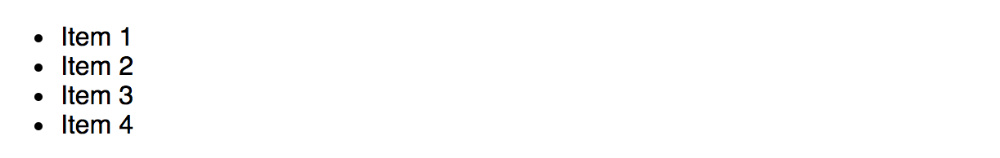
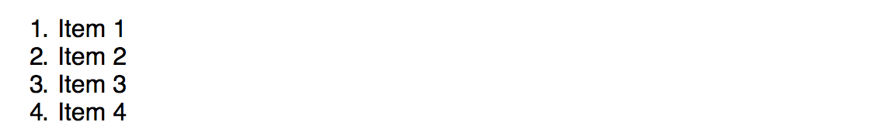
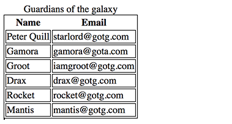

# HTML

The following is far from an exhaustive listing of HTML tags and attributes. It is only intended as an introduction for beginners!

HTML, CSS and Javascipt all play vital and different roles in the modern web.

* HTML: The glue that brings the various pieces together. It is the HTML that loads the CSS and Javascript. HTML is the structure content of your webpage.
* CSS: Is all about making it look pretty. Most of the work for the layout and styling should be in the CSS.
* Javascript: Is where the action is. It brings the interactivity to your website.

The basic structure of a HTML document is:

```html
<!doctype html>
<html>
    <head>
        <title>{{project.title}}</title>
        <meta charset="utf-8">
        <meta http-equiv="x-ua-compatible" content="ie=edge">
        <meta name="description" content="{{project.title}}">
        <meta name="viewport" content="width=device-width, initial-scale=1.0"/>
        <link rel="stylesheet" href="my-project.css">
        <script type="text/javascript" src="my-project.js"></script>
    </head>
    <body>
        <!-- insert your HTML content here -->
    </body>
</html>
```

In this above example, the HTML for your page/project goes within the `<body>`...`</body>` tags.

Your javascript would be in a seperate file called `my-project.js` as denoted by the `<script>` tag `src=` property.

Your CSS would be in a seperate file called `my-project.css` as denoted by the `<link>` tag `href=` property.

HTML is a "tag" based language. The tags are instructions about the content of a webapge, enclosed in triangle brackets. For instance, these are some tags:

* `<h1>This is a heading of level 1</h1>`
* `<h2>This is a subheading, level 2</h2>`
* `<p>This is a paragraph</p>`

Tags can also contain attributes, which contain information relevant to the content the tag is about. For example:

* `` is an image tag, it will load the filename.jpg file from your website and display it.

Two crucially important attributes are `id` and `class`. These are what you will predominately use in your Javascript and CSS to access/modify your HTML. An `id` must be unique to the entire HTML document (ie: can not appear more than once), where as `class` is designed to be used multiple times, it can represent a group of things that are similar. For example:

```html
<input type="text" id="firstName" class="input">
<input type="text" id="familyName" class="input">
<input type="text" id="email" class="input">
```

The rest of this chapter is a reference guide for some of the key "tags" in HTML you should be familiar with. 

# A elements

An 'anchor' tag is the name given to links in the web - those bits of blue text with the underline that you can click on. Generally, they are used to redirect the user to a new page, based on the address you indicate in the `href` attribute.

```html
<a href="https://some-website.com/page/document">Description of link</a>
```

Attributes for an `<a>` tag:

* `href` : destination for the hyperlink
* `target` : choice of _blank | _parent | _self | _top

# DIV & SPAN elements

`<div>` and `<span>` are generic tags that can be used to divide your content into logical sections. They are useful for CSS purposes as you can "group" different elements together, so these can be used to create layout blocks etc. By default `<div>` will behave like a `<p>` and include a "new line" after it, where as `<span>` doesn't.

```html
<div>This will behave like a paragraph</div>
<span>This will behave just as text within an existing line</span>
```

They don't really have any special attributes, though you would usually have `id` and/or `class` specified with these.

These tags might not seem like much, but `<div>` and `<span>` become incredibly important once you start adding CSS and Javascript into the mix. Because they are "generic" in nature, it means they can be used to organise page content into sections - either for styling with CSS or for attaching interactive programming through Javascript. As a result, you'll see these tags used a lot in later examples.

<div class="page"/>

# Media elements

## Images

```html

```

Attributes for an `` tag:

* `alt` - The 'alternative text' description to display if the image can't be shown (also used by reader apps for visually impaired)
* `src` - URL to the image file to load

## Video

```html
<video poster="video-poster.jpg" src="my-video.mp4" controls autoplay>
```

Attributes for a `<video>` tag:

* `poster` - URL of an image to show while waiting for the video to load, or before play is pressed
* `autoplay` - Turn on autoplay
* `controls` - Display controls such as play/stop buttons
* `loop` - Keep looping after finishing if this is present
* `src` - URL of the video file

## Audio

```html
<audio src="my-video.mp3" controls autoplay>
```

Attributes for a `<audio>` tag:

* `autoplay` - Turn on autoplay
* `controls` - Display controls such as play/stop buttons
* `loop` - Keep looping after finishing if this is present
* `src` - URL of the audio file

<div class="page"/>

# Forms & input elements

A "typical form" demonstrating a variety of common input types and their related attributes.

HTML

```html
<form id="signupForm" enctype='multipart/form-data'>
    <div>
        <label for="givenName">Given name:</label>
        <input type="text" id="givenName" name="givenName">
    </div><div>
        <label for="familyName">Family name:</label>
        <input type="text" id="familyName" name="familyName">
    </div><div>
        <label for="email">Email address:</label>
        <input type="email" id="email" name="email">
    </div><div>
        <label for="dateOfBirth">Date of birth:</label>
        <input type="date" id="dateOfBirth" name="dateOfBirth">
    </div><div>
        <label for="phoneNumber">Phone number:</label>
        <input type="tel" id="phoneNumber" name="phoneNumber">
    </div><div>
        <label for="photo">Photo:</label>
        <input type="file" id="photo" name="photo" accept="image/*">
    </div><div>
        <label for="password">Password:</label>
        <input type="text" id="password" name="password">
    </div><div>
        <label for="siblings">Number of siblings:</label>
        <input type="number" id="siblings" name="siblings">
    </div><div>
        <label for="animal">What type of person are you?</label>
        <input type="radio" name="animal" value="cat">Cats
        <input type="radio" name="animal" value="dog">Dogs
        <input type="radio" name="animal" value="neither">Neither
    </div><div>
        <label for="location">Prefer?</label>
        <select id="location" name="location">
            <option value="beach">Beach</option>
            <option value="beach">Ski fields</option>
            <option value="country">Countryside</option>
            <option value="ski">Ski fields</option>
            <option value="space">Space</option>
        </select>
    </div><div>
        <label for="hundredwords">Describe yourself in 100 words or less</label>
        <textarea cols="60" rows="5" name="hundredwords" id="hundredwords"></textarea>
    </div><div>
        <label for="agree">Agreement:</label>
        <input type="checkbox" id="agree" name="agree">I agree to the terms and conditions.
    </div><div>
        <input type="button" id="submit" name="submit" value="Sign up!">
    </div>
</form>
```

If you typed the above, I would recommend adding the following CSS to fix the layout. It will work without it though, and you should refer to the CSS chapter for more detail.

```css
label {
    display: inline-block;
    width: 25vw;
}
```

<div class="page"/>

## 'form' tag

The `<form> ... </form>` tag is used to enclose the fields for the form. On submission of the form, it is the `<input>` tags inside the `<form>` opening and closing tag that will be automatically collected. In this way, you could theoretically have more than one form on the same page.

Forms can be used to send the information in their fields straight to your website, without needing any Javascript. In this instance, your webapge would change as well, to the output generated by the web-server in response to what you send from the form. For this to work, there are a couple of attributes you require in the form tag. Only add these if you don't want to process your form using Javascript.

* `method` - Generally should be set to `POST`. Can also use `GET` but it is less secure.
* `action` - The URL you want to send the form data to, and the page that will be loaded into the browser to replace the current page containing the form.

Other important attributes:

* `enctype` - For modern purposes, it's probably easier to just always have it set to `multipart/form-data`. This particular setting is essential when your form includes any `<input type="file">` elements.

## 'label' tag

The `<label> ... </label>` tag is used to provide a descriptive label to the user, and is always linked to a specific `<input>` tag through the use of the `for=` attribute and a corresponding `name=` attribute in the input tag.  If the user clicks on the text of the label description, it will place their cursor/pointer inside the relevant input text box.

Attributes:

* `for` - the content of this should match a `name` tag for a given `<input>`.

## 'input' tag

The `<input>` tag is the actual area where user input is received. This is used to generate the textboxes, tickboxes, multi-choice options etc for the user to enter. The key determining what the input will be is the `type=` attribute as discussed further below.

### 'input' attributes:

* `type` - The most important. Determines what type of data will be expected. The values are: hidden | text | search | tel | url | email | password | datetime | date | month | week | time | datetime-local | number | range | color | checkbox | radio | file | submit | image | reset | button
* `value` - The starting/default value of the input, before the user has entered a value of their own.
* `disabled` - Will lock the input, letting the user see the value but prevented from editing it.
* `readonly` - See disabled
* `required` - When submitting the form via HTML directly without Javascript, this will prevent the form from being submitted if this input has not been set by the user.
* `name` - The name of the field. This is what will be used as the field name if the form is sent via HTML instead of Javascript. Also used to pair up with the label tags.
* `autofocus` - If present, this field will automatically receive the text-typing cursor inside it when the page has loaded.

### 'input' attributes for type=text

* `maxlength` - maximum number of characters that may be input by the user.
* `pattern` - A regular expression to validate the content of what the user enters. Will activate the `:valid` and `:invalid` CSS properties respectively. For instance, the following is the recommended setting to validate an email address:

```js
pattern=/^[a-zA-Z0-9.!#$%&'*+\/=?^_`{|}~-]+@[a-zA-Z0-9](?:[a-zA-Z0-9-]{0,61}
  [a-zA-Z0-9])?(?:\.[a-zA-Z0-9](?:[a-zA-Z0-9-]{0,61}[a-zA-Z0-9])?)*$/
```

* `placeholder` - Hint text to appear inside the input box when it is empty. Eg: `placeholder="Enter your phone number"`
* `size` - Size of the input box in respect to number of visible characters
* `width` - Size of the input box in respect to pixels

<div class="page"/>

### 'input' attributes for type=image

* `src` - The source URL of the image to be shown. Will turn the `input` into an image displaying button.

### 'input' attributes for a textbox with a pop-up list of hints

* `list` - match with the `id` attribute of a `<datalist>` somewhere in your document, whose options you wish to use. The following example illustrates:

```html
<input type="text" size="40" id="country" list="country_list">

<datalist id="country_list">
  <option value="Afghanistan">
  <option value="Albania">
  <option value="Algeria">
  <option value="American Samoa">
  <option value="Andorra">
  <option value="Angola">
</datalist>
```

### 'input' attributes for type=checkbox

* `checked` - The tickbox will be checked by default if this is present

### 'input' attributes for type=number

* `min` - Minimum value acceptable
* `max` - Maximum value acceptable

## 'select' and 'option' tags

The `<select>` tag and the `<option>` tag work together to create a drop down list of values the user selects from.

```html
<select id="location" name="location">
    <option value="beach">Beach</option>
    <option value="country">Countryside</option>
    <option value="ski">Ski fields</option>
    <option value="space">Space</option>
</select>
```

Attributes for select:

* `autofocus` - Gives the list focus when the page loads
* `disabled` - Prevents the user from selecting the list
* `size` - The number of options to show to the user

Attributes for option:

* `label` - provides a label for the option
* `selected` - Indicates this option should be the default
* `value` - The value to send the webserver when this option is selected 

## 'textarea' tag

Displays a "paragraph" sized large text box.

```html
<textarea cols="60" rows="5" name="hundredwords" id="hundredwords"></textarea>
```

Attributes for text area:

* `autofocus` - Gives focus when the page loads
* `cols` - Number of characters wide to display the textarea
* `rows` - Number of lines to display the textarea
* `disabled` - Prevents user entry of text
* `placeholder` - Hint text to display prior to user entry
* `maxlength` - Maximum number of characters permitted to be entered

<div class="page"/>

# Lists

Unordered lists

```html
<ul>
    <li>Item 1</li>
    <li>Item 2</li>
    <li>Item 3</li>
    <li>Item 4</li>
</ul>
```



Ordered lists

```html
<ol>
    <li>Item 1</li>
    <li>Item 2</li>
    <li>Item 3</li>
    <li>Item 4</li>
</ol>
```



It is worth mentioning that unordered lists are also used a lot as containers for a navigation system. For instance, you will notice that chapter 3.6 "CSS Drop down menus" uses unordered lists combined with CSS rules to make cool looking pop down menus. 

<div class="page"/>

# Tables

The general structure of a HTML table would look lile:

```html
<table id="people">
    <caption>Guardians of the galaxy</caption>
    <theader>
        <tr>
            <th>Name</th><th>Email</th>
        </tr>
    </thead>
    <tbody>
        <tr>
            <td>Peter Quill</td><td>starlord@gotg.com</td>
        </tr>
        <tr>
            <td>Gamora</td><td>gamora@gota.com</td>
        </tr>
        <tr>
            <td>Groot</td><td>iamgroot@gotg.com</td>
        </tr>
        <tr>
            <td>Drax</td><td>drax@gotg.com</td>
        </tr>
        <tr>
            <td>Rocket</td><td>rocket@gotg.com</td>
        </tr>
        <tr>
            <td>Mantis</td><td>mantis@gotg.com</td>
        </tr>
    </tbody>
<table>
```



