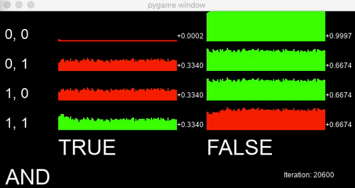
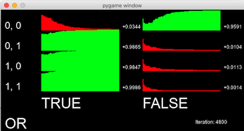

# Machine Learning notes

> Work in progress

There are three common types of machine learning:

* Supervised Learning — A strategy that involves a teacher that is smarter than the network itself. In this situation, the network is trained by providing a set of inputs, and the correct response that should be provided for each input. The network then adjusts it's prediction matrix based on how correct/incorrect it was.

* Unsupervised Learning — Required when there isn’t an example data set with known answers. In this situation the network is attempting to identify patterns on its own through clustering, i.e. dividing a set of elements into groups according to some unknown pattern.

* Reinforcement learning - A strategy built on observation. Where supervised learning aims to teach the network through lots of examples, reinforcement learning aims to teach the network through experience. It involves having the network attempt a solution and then obtain feedback (a reward score) that indicates how successful it was.

## Understanding and building a neural network

We will start by taking a look at using a neural network for supervised learning.

When you search terms such as "how to build your own neural network in Python" you will find a lot of articles similar to Andrew Trask's [A Neural Network in 11 lines of Python](http://iamtrask.github.io/2015/07/12/basic-python-network/). While these are useful, I think the authors make a mistake and are conflating the idea of "few lines of code" with "easy to understand". The reality is those articles make heavy reliance on libraries such as numpy to perform mathematical operations on matrices without ensuring the programmer understands what is happening under the hood. For this reason, I wanted to build a neural network without any libraries, not even numpy... I only wanted to use standard arrays and perform all the calculations in my own code. It will be a lot more code, and the network will run a lot slower, but it will also be far more instructive as to what is going on "under the hood".

Before attempting to build a neural network, I think it is instructive to manually walk through the training process step by step to fully appreciate how it works. You can't debug a program if you don't understand what it is supposed to be doing afterall! There are some articles that attempt to do this and provide illustrations of the network graph ([this one by Steven Miller being the best I found](https://stevenmiller888.github.io/mind-how-to-build-a-neural-network/)), but I couldn't find one that also showed how the data should be represented in a matrix for coding into arrays. So, I have written my own step-by-step guide to the process. If this is your first time looking at a neural network, I encouage you to walk through it.

* [Neural network walk through](nn-walkthrough.pdf)

After understanding the above, it's time for you to have a go at coding one yourself. For reference I provide my own simple neural network, along with Daniel Shiffman's, which may come in useful when you get stuck. Remember though, the best way of learning is to figure it out for yourself so I urge you to resist just blindly copying either of these.

* [My "simple" neural network](simplenn.pdf) (Python)
* [Daniel Shiffman's "toy" neural network](https://github.com/CodingTrain/Toy-Neural-Network-JS) (Javascript)

## Using our simple NN for logic gates

To test my neural network, I implemented a few simple logic gates. As you can see in the animations, the XOR and AND gates took a little while but it figured out the OR gate almost immediately.

## Introducing Tensorflow2

* What is tensorflow

* Why use tensorflow instead of our own class

* Reproducing the XOR gate with TF2

## Using TF2 with MNIST

[Animation source](https://github.com/lexfridman/mit-deep-learning/blob/master/tutorial_deep_learning_basics/deep_learning_basics.ipynb)

One "classic" introductory project using a CNN is to use the "MNIST" dataset. The MNIST dataset containss 70,000 grayscale images of handwritten digits at a resolution of 28 by 28 pixels. The task is to take one of these images as input and predict the most likely digit contained in the image (along with a relative confidence in this prediction).

A couple of good introductary videos on how a neural network can solve the problem of identifying handwritten digits.

* [But what *is* a Neural Network? | Deep learning, chapter 1 (19 min)](https://www.youtube.com/watch?v=aircAruvnKk)
* [Gradient descent, how neural networks learn | Deep learning, chapter 2 (21 min)](https://www.youtube.com/watch?v=IHZwWFHWa-w)

## Using TF2 for Image classification

Cats v Dogs?

Object detection?

## Reinforcement learning

<iframe width="560" height="315" src="https://www.youtube.com/embed/6lp-LPc3LGI" frameborder="0" allow="accelerometer; autoplay; encrypted-media; gyroscope; picture-in-picture" allowfullscreen></iframe>

Reinforcement learning is about learning through trial and error of **experience**. This is in contrast to supervised learning which occurs through providing **examples**.

Reinforcement learning teaches an agent how to act in the world in a way that maximizes reward. When the learning is done by a neural network, we refer to it as Deep Reinforcement Learning (Deep RL). Deep RL allows us to apply neural networks in simulated or real-world environments when sequences of decisions need to be made. This includes game playing, robotics , neural architecture search, and much more. [source](https://medium.com/tensorflow/mit-deep-learning-basics-introduction-and-overview-with-tensorflow-355bcd26baf0)

When discussing reinforcement learning, it is important to fully appreciate the terminology being used. Here are some definitions. ([source](https://towardsdatascience.com/reinforcement-learning-with-python-8ef0242a2fa2))

* States: The state is a complete description of the world, they don’t hide any pieces of information that is present in the world. It can be a position, a constant or a dynamic. We mostly record these states in arrays, matrices or higher order tensors.
* Action: Action is usually based on the environment, different environments lead to different actions based on the agent. Set of valid actions for an agent are recorded in a space called an action space. These are usually finite in number.
* Environment: This is the place where the agent lives and interacts with. For different types of environments, we use different rewards, policies, etc.
* Reward and Return: The reward function R is the one which must be kept tracked all-time in reinforcement learning. It plays a vital role in tuning, optimizing the algorithm and stop training the algorithm. It depends on the current state of the world, the action just taken, and the next state of the world.
* Policies: Policy is a rule used by an agent for choosing the next action, these are also called as agents brains.

The most commonly used algorithm for reinforcement learning is known as q-learning.

* Step 1: Initialize the Q-Table with all zeros and Q-Values to arbitrary constants.
* Step 2: Let the agent react to the environment and explore the actions. For each change in state, select any one among all possible actions for the current state (S).
* Step 3: Travel to the next state (S’) as a result of that action (a).
* Step 4: For all possible actions from the state (S’) select the one with the highest Q-value.
* Step 5: Update Q-table values using the equation.
* Stap 6: Change the next state as the current state.
* Step 7: If goal state is reached, then end and repeat the process.

## Q-learning with Flappy bird

Uses Q-learning using only native Python (no libraries):

https://github.com/chncyhn/flappybird-qlearning-bot

## Q-learning with Tic tac toe

Uses Q-learning using only native Python (no libraries):

https://github.com/mihaibivol/Q-learning-tic-tac-toe

* https://github.com/jbradberry/ultimate_tictactoe/blob/master/t3/board.py
* https://mathwithbaddrawings.com/2013/06/16/ultimate-tic-tac-toe/

## Q-learning with Connect 4

* https://github.com/jbradberry/connect-four/blob/master/connect_four/connectfour.py

## Q-learning with Deep Traffic

<video width="640" height="360" controls>
    <source src="deeptraffic-visualization-example-compressed.mp4" type="video/mp4" />
</video>
[animation source](https://selfdrivingcars.mit.edu/deeptraffic-visualization/)

* [MIT 6.S091: Introduction to Deep Reinforcement Learning (Deep RL)](https://www.youtube.com/watch?v=zR11FLZ-O9M&list=PLrAXtmErZgOeiKm4sgNOknGvNjby9efdf)
* [DeepTraffic @ Selfdrivingcars.mit.edu](https://selfdrivingcars.mit.edu/deeptraffic/)

## Library?

* Gym?

* [pyqlearning](https://pypi.org/project/pyqlearning/) is Python library to implement Reinforcement Learning and Deep Reinforcement Learning, especially for Q-Learning, Deep Q-Network, and Multi-agent Deep Q-Network which can be optimized by Annealing models such as Simulated Annealing, Adaptive Simulated Annealing, and Quantum Monte Carlo Method.

## Genetic algorithm

A genetic algorithm is an optimization technique inspired by the process of natural selection and genetics. It uses the same combination of selection, crossover and mutation to evolve initial random population.

Example projects:

* [Genetic algorithm learns flappy bird 1](https://www.askforgametask.com/tutorial/machine-learning-algorithm-flappy-bird/)
* [Genetic algorithm learns flappy bird 2](https://github.com/ssusnic/Machine-Learning-Flappy-Bird)
* [Genetic algorithm learns Snake](https://github.com/Code-Bullet/SnakeFusion/tree/master/SmartSnakesCombine)

## Appendix: Datasets

AI engineers love data! We devour it to train our networks. Here are some excellent links to various datasets and pre-trained models.

* [Datasets curated by DeepLearning](http://deeplearning.net/datasets/)
* [Datasets curated by Kaggle](https://www.kaggle.com/datasets)
* [Datasets curated by Wikipedia](https://en.wikipedia.org/wiki/List_of_datasets_for_machine-learning_research#Handwriting_and_character_recognition)
* [Discover open source deep learning code and pretrained models @ ModelZoo](https://modelzoo.co/)
* [Easy to use and pre-trained machine learning models @ ModelDepot](https://modeldepot.io/)
* [A topic-centric list of HQ open datasets in public domains @ awesomedata on github](https://github.com/awesomedata/awesome-public-datasets)

## Appendix: Further research

Valuable resources I highly recommend:

* [MIT Deep Learning](https://www.youtube.com/playlist?list=PLrAXtmErZgOeiKm4sgNOknGvNjby9efdf): The collection of MIT lectures on deep learning, deep reinforcement learning, and artificial intelligence taught by Lex Fridman.
* [Nature of code, Chapter 10, Neural networks](https://www.youtube.com/watch?v=XJ7HLz9VYz0&list=PLRqwX-V7Uu6aCibgK1PTWWu9by6XFdCfh): By Daniel Shiffman, Coding Train
* [Reinforcement Learning: An Introduction](http://incompleteideas.net/book/bookdraft2018jan1.pdf) by Sutton & Barto, 2018. (PDF book, 444 pages)
* [UCL Course on RL](http://www0.cs.ucl.ac.uk/staff/d.silver/web/Teaching.html)
* [dennybritz @ github](https://github.com/dennybritz/reinforcement-learning): This repository provides code, exercises and solutions for popular Reinforcement Learning algorithms
* [RL in common games](http://www0.cs.ucl.ac.uk/staff/d.silver/web/Teaching_files/games.pdf) by D.Silver

