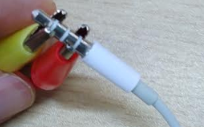

# Microbit lesson 5: Lists with music

## Video

* [Microbit lesson 5 video](https://youtu.be/A7VEjGua82I)

## Lesson overview

This lesson:

* Creating a list
* Selecting individual items from a list
* Programming the Neopixels
* Playing music

## Lists

Lists are an important and very useful tool in programming. They are a variable that can store more than one value, and are used when we have lots of values that we want to treat in a similar manner.

A simple example on the Microbit is a list of different items to show on the display:

```python
from microbit import *

items = ["H", "E", "L", "L", "O", Image.HAPPY, " ", "B", "Y", "E", Image.SAD]
for letter in items:
    display.show(letter)
    sleep(500)
```

Rather than writing lots of `display.show()` lines, we were able to just use a single list of items. The magic happens with the `for` command. This will look at the first item inside `items`, put it in `letter` and run the indented lines. Once reaching the end, it will look at the `items` list and put the value of the second item into the variable `letter` and re-run the indentded lines. It will keep repeating this process until it reaches the end of the `items` list. 

Another example would be to use a list to act as a calculator and total a set of numbers.

```python
from microbit import *

numbers = [5, 7, 10, 15, 42]
total = 0
for number in numbers:
    display.scroll("+")
    display.scroll(number)
    total = total + number
display.scroll("=")
display.scroll(total)
```

We will practice lists by using them to play music on the microbit!

To do so, we will create a list of musical notes we want the microbit to play.

To wire the Microbit directly to a set of earphones, you want to use clips connected to PIN0 and GND, where the other end looks like this...



For instance, the tune for "Happy Birthday" looks like...

```python
from microbit import *

music.set_tempo(bpm=240)
song = [
    "C", "C", "D", "C", "F", "E:8", "r", 
    "C", "C", "D", "C", "G", "F:8", "r", 
    "C", "C", "C5", "A", "F", "E", "D", "r", 
    "A#", "A#", "A", "F", "G", "F:8"
    ]
for note in song:
    display.show(note[0], wait=False, delay=0)
    music.play(note)
```

So for the musically inclined amongst you who wish to experiment with this, allow me to explain the method of detailing individual notes...

* Simple notes in octave 4, to play for the duration of a standard note can be represented with just the letter of the note: "C", "C#", "D", "D#", "E", "F", "F#", "G", "G#", "A", "A#", "B". Also the sharp notes can also be written with their flat equivilent for instance "C#" could also be written as "Db".
* If you wish to change the octave, the number of the octave should appear after the note letter. So to play "C" in the 5th octave, write it as "C5", or To play "D#" in the 3rd octave would be "D#3".
* Finally, to change the timing, add a colon and a length in numbers. The standard note length is 4, so this is what is used if you do not specify. In other words, to play "C" for half a standard length, would be "C:2", or to play "F" for twice the standard leangth would be "F:8".
* Finally, the use of "r" is for a rest period (ie: silence).

For a more complete example, here is a meme song for you...

```python
from microbit import *
import music

music.set_tempo(bpm=168)
take_on_me = [
    "f#:2", "f#:4", "d", "b3", "r:2", "b3:4", "r:2", "e4:2", "r:2", "e:2", "r:2",
    "e:2", "r:2", "g#:2", "g#:4", "a", "b", "a:2", "a:2", "a:2", "e:4", "d", 
    "f#:2", "r:2", "f#:2", "r:2", "f#:2", "e:4", "e", "f#", "e",
    # Repeat the same 3 lines (just do a copy-and-paste)
    "f#:2", "f#:4", "d", "b3", "r:2", "b3:4", "r:2", "e4:2", "r:2", "e:2", "r:2",
    "e:2", "r:2", "g#:2", "g#:4", "a", "b", "a:2", "a:2", "a:2", "e:4", "d", 
    "f#:2", "r:2", "f#:2", "r:2", "f#:2", "e:4", "e", "f#", "e",
]

display.scroll("Take on me!", delay=70)
for note in take_on_me:
    display.show(note[0], wait=False, delay=0)
    music.play(note)
```

## Activity


1. Find a song you want your microbit to play, and have a go at making it work.

* [Despacito](https://easy-letter-notes.com/despacito-piano-song/)
* [Star wars](https://easy-letter-notes.com/star-wars/)
* [List of songs with letter notes](https://easy-letter-notes.com/category/letter-notes/) (good for those who can't read music)
* [Piano Licks & Riffs](https://www.8notes.com/piano/licks_and_riffs/)

Note: That the colour of the note on the `easy-letter-notes.com` website indicates the octave.

* Yellow = octave 2
* Red = octave 3
* Black = octave 4 (default)
* Green = octave 5
* Blue = octave 6

2. Learn how the Neopixels work, and combine your song with a custom light show!

## Sources

* [Happy birthday](https://easy-letter-notes.com/happy-birthday-piano-letters/)
* Axel-F notes from: https://pianoletternotes.blogspot.com/2017/10/crazy-frog-by-axel-f.html#quickg
* Take on me from: (find the youtube vid I used...)

