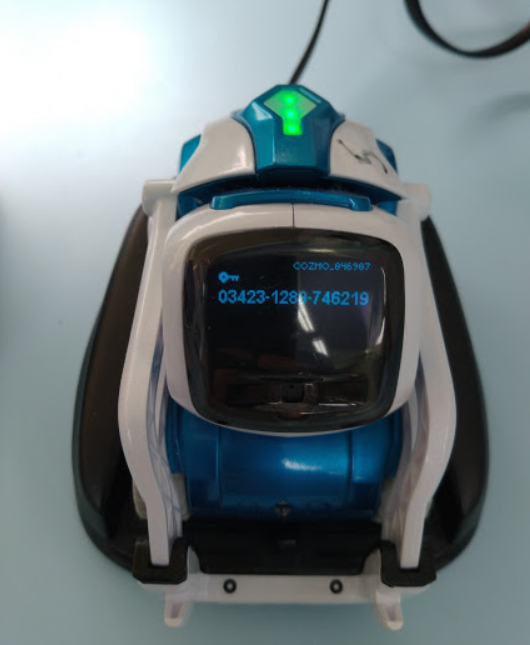

# Unit: Cozmo Robotics

## Summary

Learn to program the Anki Cozmo robot with Python!

**Note: It is highly recommended to have a printed or saved copy of this tutorial available before you start. Using the Cozmo requires you to connect to it over wifi, meaning your computer will no longer have access to the internet through your usual network connection.**

Students of mine will be given this as a print out. You should check my website for any updates/changes @ [https://pbaumgarten.com/myp-design/cozmo/](https://pbaumgarten.com/myp-design/cozmo/)

This unit assumes some existing knowledge of Python basics.

Last updated: 02/01/2020

## Unit information

| MYP item | This unit |
| ---- | ---- |
| Statement of inquiry | Robotic systems are a technical innovation where computers are capable of functioning in and adapting to a variety of physical environments. |
| Key concept | Systems |
| Related concepts | Function, Adaptation |
| Global context | Scientific and technical innovation |
| Assessment objectives | A (inquiring & analysing), B (devising ideas), D (evaluating) |

## Lesson overviews

12 lessons as follows:

* Lesson 1. Connect to Cozmo
* Lesson 2. Basic movement
* Lesson 3. Detect cliff edge, drive around a tabletop
* Lesson 4. Take photo, save photo
* Lesson 5. Detect ArUcode markers
* Lesson 6. Take action based on ArUcode markers
* Lesson 7. Design your own obstacle course
* Lesson 8,9,10. Build & program your obstacle course
* Lesson 11. Evaluate your obstacle course

# 0. Prequisites

## Python installed

This assumes you have a recent version of Python installed, typically at least version 3.6

If you don't have it, go to [https://wwww.python.org](https://wwww.python.org) and download it.

When running the installer, make sure you turn on the option to "Add Python to PATH"

## Libraries required

Once you have Python installed, open the command prompt and run the following

```text
pip install pycozmo Pillow ImageToolsMadeEasy
```

## Basic Python knowledge

This guide assumes a basic familiarity with Python. I have written a quick recap designed for a one hour lesson should you need it. It is available at:

* [https://pbaumgarten.com/python/recap/](https://pbaumgarten.com/python/recap/)

If you need a more detailed introduction to Python I have a set of detailed tutorials on my website. Each lesson contains detailed notes, videos and practice exercises. Each lesson is roughly an hour in length with 9 lessons in "the basics" (though only the first 5 are required for this tutorial).

* [https://pbaumgarten.com/python/](https://pbaumgarten.com/python/)

# 1. Connect to Cozmo



* Sit the Cozmo on it's charger unit which must be powered on (it doesn't have to be connected to your computer, just usb power).
* On the front screen, Cozmo will display a code similar to the one displayed. 
* Open your computer network settings and search for the wifi connection with Cozmo's name in it. Connect to the Cozmo wifi using the code on the Cozmo's front screen as the password.


* Open `VS Code` or your preferred Python editor. The following is a simple program to test your connection is working properly. It will cause the backlight on the cozmo to turn green for 1 second, then red for 1 second, then off.

```python
# You will require these import statements for all Cozmo programs
import time
import math
import pycozmo
from PIL import Image
import ImageTools

# Connect to Cozmo
cozmo = pycozmo.Client()
cozmo.start()
cozmo.connect()
cozmo.wait_for_robot()
# Do something simple
cozmo.set_all_backpack_lights(pycozmo.lights.green_light)
time.sleep(1)
cozmo.set_all_backpack_lights(pycozmo.lights.red_light)
time.sleep(1)
cozmo.set_all_backpack_lights(pycozmo.lights.off_light)
# Disconnect from Cozmo
cozmo.disconnect()
cozmo.stop()
```

## Your task/s

* Install Python and VS Code if you don't already have it
* Install the `ImageTools` and `pycozmo` libraries
* Connect to your Cozmo over wifi
* Get the sample test code above working to prove you can connect and control your Cozmo
* Start experimenting with other code

# 2. Basic movement

The following demonstrate some of the commands you can use to control different features of the Cozmo.

LED commands

```python
# The multicolor LED on the back of the Cozmo
cozmo.set_all_backpack_lights(pycozmo.lights.red_light)
cozmo.set_all_backpack_lights(pycozmo.lights.green_light)
cozmo.set_all_backpack_lights(pycozmo.lights.blue_light)
cozmo.set_all_backpack_lights(pycozmo.lights.white_light)
cozmo.set_all_backpack_lights(pycozmo.lights.off_light)

# Front facing head light
cozmo.set_head_light(True)    # Turn on
cozmo.set_head_light(False)   # Turn off
```

Driving commands

```python
# Drive forward at speed 50
cozmo.drive_wheels(lwheel_speed=50.0, rwheel_speed=50.0)

# Drive forward at speed 50 for 5 seconds then stop
cozmo.drive_wheels(lwheel_speed=50.0, rwheel_speed=50.0, duration=5.0)

# Drive the right wheel (making the robot veer left)
# for 2.5 seconds
cozmo.drive_wheels(rwheel_speed=50.0, duration=2.5)

# Drive the left wheel forward, right wheel in reverse
# (making the robot veer right) ... notice the minus sign!
cozmo.drive_wheels(lwheel_forward=50.0, rwheel_speed=-50.0)

# Drive in reverse at speed 50 (notice the minus signs!)
cozmo.drive_wheels(lwheel_speed=-50.0, rwheel_speed=-50.0)

# All stop
cozmo.stop_all_motors()
```

Tilt head up/down

```python
# === Move Cozmo's head ===
# Cozmo's head should move in a range from -25 degrees (facing down) to +44 degrees (up). 
# Python expects the angle to be in radians so it needs converting from degrees.
# The angle can be provided as a variable or a number.
angle = 0
cozmo.set_head_angle(radians(angle)) 
```

Raise/lower lifting arm

```python
# === Move Cozmo's lifting arm ===
# Cozmo's lifting arm can move in a range from 32mm (fully lowered) to 92mm (fully raised)
# Height can be provided as a variable or a number.
height = 90
cozmo.set_lift_height(height)
```

## Your task/s

Using a combination of the above commands, can you make your Cozmo...

* Drive in a perfect square of sides 1 meter in length, and sharp 90 degree turns? It should stop at the spot it started, facing the same way when done.
* Go in a perfect circle (diameter at least 50cm), stopping and starting at the same point.

# 3. Detect cliff edge

Cozmo has sensors built in through which it can detect different situations and events. The following command `add_handler` tells Cozmo that if a particular event occurs, there is a function we have written to handle it. In this case, the event is if a cliff edge is detected, and the handling function is specified in the 2nd parameter as being called `on_cliff_detected`.

```python
cozmo.add_handler(pycozmo.event.EvtCliffDetectedChange, on_cliff_detected)
```

... which could look like this when added to a full program ...

```python
# ... remmeber to add your import statements first ...

# Connect to Cozmo
cozmo = pycozmo.Client()
cozmo.start()
cozmo.connect()
cozmo.wait_for_robot()
# Add cliff detection
cozmo.add_handler(pycozmo.event.EvtCliffDetectedChange, on_cliff_detected)
# Start moving
cozmo.drive_wheels(lwheel_speed=50.0, rwheel_speed=50.0)
# Run for 60 seconds
for second in range(60):
    time.sleep(1)
# Disconnect from Cozmo
cozmo.disconnect()
cozmo.stop()
```

So if our main section is going to tell Cozmo to run the `on_cliff_detected` function, we need to ensure it actually exists. Here is an example of what it could look like. You can modify yours to do something different.

```python
def on_cliff_detected(cozmo, state):
    if state:
        print("Cliff detected.")
        # Reverse straight back
        cozmo.drive_wheels(lwheel_speed=-50.0, rwheel_speed=-50.0, duration=1.0)
        # Reversing turn
        cozmo.drive_wheels(lwheel_speed=0.0, rwheel_speed=-50.0, duration=2.8)
        # Drive forward
        cozmo.drive_wheels(lwheel_speed=50.0, rwheel_speed=50.0)
```

---

There are other handlers you should know about. In addition to detecting a cliff edge, the Cozmo can also detect when the button on it's top is pressed, or when you pick it up. Examples of how these work follow...

Detect pressing the button on top of Cozmo...

```python
# This handler will trigger when the button on top of Cozmo is pressed
cozmo.conn.add_handler(pycozmo.protocol_encoder.ButtonPressed, on_button_pressed)

# Example handler function for button press
def on_button_pressed(cozmo, state):
    if state.pressed:
        print("Button pressed.")
        cozmo.drive_wheels(lwheel_speed=50.0, rwheel_speed=50.0)
```

Detect when Cozmo is picked up...

```python
# This handler will trigger when the robot is picked up
cozmo.add_handler(pycozmo.event.EvtRobotPickedUpChange, on_robot_picked_up)

# Example handler function for picked up
def on_robot_picked_up(cozmo, state):
    if state: ## state is set to True if picked up
        print("Picked up.")
        cozmo.stop_all_motors()
```

## Your task/s

* a) Can you make a Cozmo drive around a table top without falling off?
* b) Make the colour of the light on Cozmo change to indicate if it is going forward, turning, or in reverse.
* c) Make it so Cozmo keeps driving around the table top until you press the button on the top.

# 4. Take photo, save photo

Your Cozmo has a camera. Admittedly the resolution isn't great, but at least getting it to work is easy enough. After we enable the camera, we then create another event handler to process the content of the image we receive.

```python
# Setup the camera
cozmo.conn.send(pycozmo.protocol_encoder.EnableCamera(enable=True))
cozmo.conn.send(pycozmo.protocol_encoder.EnableColorImages(enable=True))
# Instruct the camera to take a photo
cozmo.add_handler(pycozmo.event.EvtNewRawCameraImage, process_photo, one_shot=True)
```

An example event handling function could look like...

```python
def process_photo(cozmo, image):
    import uuid                             # additional import required
    filename = str(uuid.uuid1()) + ".jpg"   # generate a unique filename
    image.save(filename, "JPG")             # save the image as JPG to your project folder 
    image.show()                            # open the image to view on screen
```

* This will create a filename based on the current time so you can save multiple images without them overwriting with each other. 
* Notice the `cozmo.add_handler()` has a `one_shot=True` parameter. When set to `True` it will trigger the camera to take just one photo. When set to `False` it will take photos continually (about 15 per second)
* The `cozmo.add_handler()` command does not have to appear with the camera setup commands. It could be placed in the function that handles another event such as a cliff or the button.

## Your task/s

* Modify your table-top driving program so every time it reaches a cliff, the Cozmo takes a photo of the wonderful view. Upload your code and an example photo to your portfolio.

# 5. Detect ArUco markers

While the view from the Cozmo camera might be nice, it also has a practical purpose. We can use vision recognition systems to recognise what the Cozmo can see and behave accordingly.


For this exercise we are going to keep it simple and use some ArUco Markers. Think of ArUco as mini-QR-codes. They are a 2D black and white block code that are very easy for the vision system to recognise and decode. There are a couple of different versions, but the one we are using will create 4x4 blakc and white grids that Python will recognise as being a number between 0 and 999. This ArUco represents the number 50. 

You will need to print your own ArUco labels. You can generate them from this website [http://chev.me/arucogen/](http://chev.me/arucogen/) (keep the "dictionary" setting on 4x4). From my trials a marker of 50mm was detectable by the Cozmo at a distance of approximately 50cm. You will have to experiment with the sizes you need based on the range you want it to recognise the code.

```python
def process_photo(cozmo, image):
    # Use the ImageTools.get_aruco() function to decode any arUco markers in the image
    markers = ImageTools.get_aruco(image)
    if 70 in markers:
        print("I saw ArUco marker 70")
    if 71 in markers:
        print("I saw ArUco marker 71")
    if 72 in markers:
        print("I saw ArUco marker 72")

cozmo = pycozmo.Client()
cozmo.start()
cozmo.connect()
cozmo.wait_for_robot()
# Look straight ahead
cozmo.set_head_angle(0.0)
# Take photos continually. Run the process_photo() function on each image.
cozmo.conn.send(pycozmo.protocol_encoder.EnableCamera(enable=True))
cozmo.conn.send(pycozmo.protocol_encoder.EnableColorImages(enable=True))
cozmo.add_handler(pycozmo.event.EvtNewRawCameraImage, process_photo, one_shot=False)
# Loop for 60 seconds
stop_at = time.time() + 60
while time.time() < stop_at:
    time.sleep(0.1)
print("Time's up, quitting...")
cozmo.disconnect()
cozmo.stop()
```

## Your task/s

* Print a few different ArUco markers of different sizes. Experiment with under what circumstances Cozmo can read them (angle, lighting, what if something partially obscures the code?)

# 6. Take action based on ArUcode markers

Make a new copy of your table-top driving code. We're going to experiment with using Cozmo to detect ArUco markers that change it's behaviour.

* a) Start simple: make Cozmo start the table-top program when shown one ArUco marker, and stop when it sees a different ArUco marker.
* b) Attach an ArUco to an object. Have the Cozmo detect the object and drive around it.
* c) Attach ArUco markers to two objects, one to trigger a turn left behaviour, the other to trigger a turn right behaviour.
* d) What else can you think of to try with the markers?

# 7. Design your own obstacle course

By now you have experimented with quite a few features of the Cozmo. Design an obstacle course that you will build for the Cozmo to self navigate from point A to point B.

## Your task/s

Create planning drawings for your obstacle course and include those in your portfolio for lesson 7.

# 8,9,10. Build your own obstacle course

Create your obstacle course (1 lesson) and program your Cozmo to complete it (2 lessons).

How long does it take your cozmo to capture the flag?

## Your task/s

* a) Submit a photo of your final obstacle course into your portfolio.
* b) Submit your Python code into your portfolio.

# 11. Evaluate your own obstacle course

## Your task/s

Make a video recording demonstrating the success (complete or partial) of your Cozmo robot...

* a) Introduce the obstacle course, outline the different features and what you wanted the Cozmo to do at each.
* b) Show the Cozmo attempting your obstacle course
* c) Discuss your level of success. What parts worked well? what did not? What changes would you make if given more time?

Upload your video to your portfolio.

# Resources & references

The PyCozmo module website is [https://github.com/zayfod/pycozmo](https://github.com/zayfod/pycozmo)

To install packages from IDLE, use the following two lines....

```python
from pip._internal import main as pipmain
pipmain(['install', 'pycozmo', 'ImageTools'])
```

