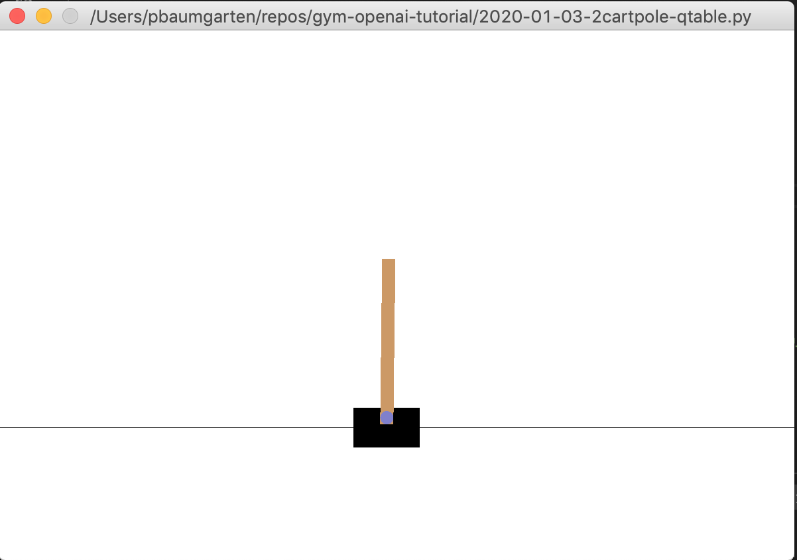
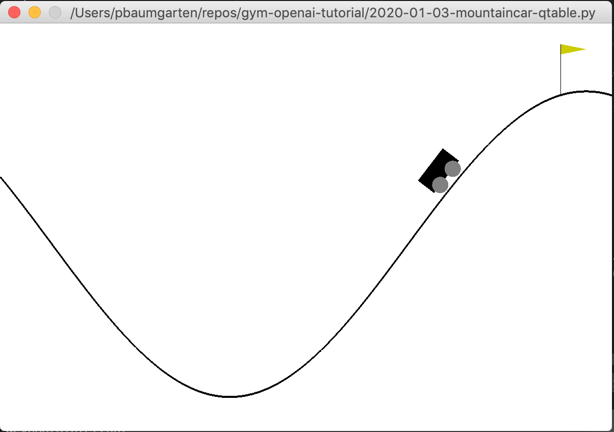

# Introduction to artificial intelligence

## Summary

Artificial intelligence is experiencing a massive boom in interest and investment. The FAANG companies (Facebook, Amazon, Apple, Netflix, Google) along with others such as Microsoft, Uber, Airbnb, Snap, universities, militaries and so forth are spending billions of dollars on the field. Get a tase of what all the fuss is about with this introduction to the ideas of AI. 

## Unit information

| MYP item | This unit |
| ---- | ---- |
| Key concept | tba |
| Related concepts | tba |
| Global context | Scientific and technical innovation |
| Statement of inquiry | tba | 
| Assessment objectives | A (inquiring & analysing), D (evaluating) |

## Lesson overviews

12 lessons as follows:

1. Install tools, understand basic ideas of AI
2. The CartPole problem - with a random agent
3. The CartPole problem - with simple logic
4. Intro to ML theory
5. The CartPole problem - with a neural network
6. The Mountain Car problem - converting continuous to discrete actions
7. Simple game - complete demo
8. Simple game - training
9. Simple game - tweak and retrain
10. Analysis

## Website

The website for this unit is [https://pbaumgarten.com/myp-design/intro-to-ai/](https://pbaumgarten.com/myp-design/intro-to-ai/)

# 0. Prequisites

## Python installed

This assumes you have a recent version of Python installed, typically at least version 3.6

If you don't have it, go to [https://wwww.python.org](https://wwww.python.org) and download it.

When running the installer, make sure you turn on the option to "Add Python to PATH"

I have a video walk through of the process for installing Python and VS Code at 
* [https://pbaumgarten.com/python/install/](https://pbaumgarten.com/python/install/), or 
* [https://youtu.be/-R6HFLp7tTs](https://youtu.be/-R6HFLp7tTs)

## Libraries required

Once you have Python installed, open the command prompt and run the following

```text
pip install gym numpy gym[box2d]
```

If you get a permissions error with the above, try it again with the `--user` switch as follows

```text
pip install --user gym numpy gym[box2d]
```

## Comfortable Python knowledge

This guide assumes a comfortable familiarity with Python. I have written a quick recap designed for a one hour lesson should you need it. It is available at:

* [https://pbaumgarten.com/python/recap/](https://pbaumgarten.com/python/recap/)

If you need a more detailed introduction to Python I have a set of detailed tutorials on my website. Each lesson contains detailed notes, videos and practice exercises. Each lesson is roughly an hour in length with 9 lessons in "the basics" (though only the first 5 are required for this tutorial).

* [https://pbaumgarten.com/python/](https://pbaumgarten.com/python/)


# 1. Basics of AI

Lets start with a video...

* How Machines Learn by CGP Grey (9min) - [https://www.youtube.com/watch?v=R9OHn5ZF4Uo](https://www.youtube.com/watch?v=R9OHn5ZF4Uo)

## What is artificial intelligence?

Artificial intelligence (AI) is an area of computer science that involves the creation of machines that work and react like humans.

Some of the human activities that are commonly being programmed using artificial intelligence include:

* Computer vision: ability of computers to identify objects, scenes, and activities in images
* Natural Language Processing: ability of computers to understand meaning from text or generating text that is readable
* Speech Processing: automatically transcribing human speech or generating speech from the corresponding text

For instance,

* Google Maps uses AI to update addresses and street names based on street view pictures.
* Facebook uses AI to analyze text posted by users and better suggest ads they may need or be interested in. It also uses AI to analyse photos and identify faces.
* Amazon & Netflix uses AI in its recommendation engine.

AI is rapidly moving from the laboratory towards business and consumer application for 3 big reasons:

* Big Data: Live, interactive, automatically generated, and often self-correcting data that fuels real-time decisions and real-time responses.
* Cheaper Computing: Cloud computing, massively parallel processing and new CPUs are powering AI techniques that simply weren’t practical before.
* Better Algorithms: AI techniques have existed for decades but there is a surge in innovation and performance with the rapid growth in computational infrastructure, data and sensors.

What is machine learning? How is it different to artificial intelligence?

Broadly speaking, you can consider machine learning to be a sub-set of the broader field of artificial intelligence. Where AI is simply about creating intelligent machines and programs, ML refers to systems that can learn from experience.

For example, say you provide machine learning program with lots of images of skin conditions along with the what do those conditions mean. The algorithm can mine this image data and help to analyze skin condition in the future. The algorithm examines images and identifies patterns that exist between these images that have similar conditions.

When the algorithm is given a new skin image (whose condition is unknown) in the future, it will compare the pattern that is present in the current image with the pattern it learned from analyzing all the past pictures and be able to able to predict what kind of skin condition it is.

If there are new skin conditions or if the existing patterns of the skin conditions changes, the algorithm will not predict those conditions correctly. One has to feed in all the new data to the algorithm for it to learn to predict based on new skin conditions.

On the other hand, Artificial Intelligence learns by acquiring knowledge and learning how to apply it. The aim of artificial intelligence is to increase the chances of success and to find the optimal solution. AI is the study to train the computers to attempt to do things which at present human can do better. AI tends to be used in situations where adapting to new scenarios are important.

In summary, machine learning uses the experience to look for the pattern it learned. AI uses the experience to acquire knowledge/skill and also how to apply that knowledge for new environments.

## Types of learning

There are four commonly used types of learning algorithms:

* Supervised: Learn rules that map inputs to target outputs.
* Unsupervised: Learn to cluster and label similar inputs.
* Deep learning: Learn through a hierarchy of simple to complex concepts.
* Reinforced: Learn by continually interacting with an environment.

## Supervised learning

Supervised learning happens when we feed the computer data and the outcome we want from that data. Then we let the computer find a correlation between the data and the outcome so that it may predict outcomes with new data without us providing the outcome.

Supervised learning is the example illustrated in the CGP Grey video, "How machines learn". That is: Why feed the algorithm a stack of information, ask it to make a prediction based on the pattern that it could identify, we then tell it whether it made a correct or incorrect prediction. 

The goal is to minimize the error between the model's predictions and the actual outcomes.

In a perfect world we would minimize errors on all possible inputs.

In reality, we usually don't have enough inputs with corresponding outcomes to teach the computer well enough.

## Deep learning


Imagine we gave a computer millions of images of puppies and kittens. What characteristics about each might we pick to enable a computer to learn to identify future puppies and kittens? With images it's quite hard. This is where deep learning comes in.

* Deep neural networks are a subtype of supervised learning.
* Deep networks are multilayer networks on top of each other where each layer corresponds to a different level of abstraction.
* There are two main reasons behind the popularity and the high impact of deep neural networks in various fields such as computer vision and speech recognition:
  * The emergence of modern parallel computing architectures providing low-cost and fast computation for a large number of parameters of the deep networks.
  * The availability of vast amounts of images, video, speech and text on the Internet providing sufficient data for training these networks.
* Each layer in the deep architecture provides a nonlinear information processing.
* The output is a parameterized function of the inputs and the output of each layer is the input for the higher layer.


Watch this excellent introduction to neural networks with deep learning. "But what is a Neural Network? | Deep learning, chapter 1" by 3blue1brown.

* [https://www.youtube.com/watch?v=aircAruvnKk](https://www.youtube.com/watch?v=aircAruvnKk)

Key terms to make notes on from the video:

* Activation value
* Hidden layer
* Neuron
* Weights
* Sigmoid
* What does Learning mean in this context?

Warning: The video will start talking about vectors and matrices from the mathematical field of linear algebra. I'm not too worried about you understanding the math at this stage as you won't have covered that in math yet.

## Unsupervised learning


In unsupervised learning we give the computer unlabeled data (Input representations without their corresponding outcomes). We just present the data and let the computer algorithm make it's best attempt at sorting and categorising it.

The goal for unsupervised learning is to model the underlying structure or distribution in the data in order to learn more about the data.

These are called unsupervised learning because unlike supervised learning above there is no correct answers and there is no teacher. Algorithms are left to their own devises to discover and present the interesting structure in the data.

---

## Reinforcement learning

This video provides an excellent demostration of reinforcement learning in real life.

* [https://youtu.be/6lp-LPc3LGI](https://youtu.be/6lp-LPc3LGI)


Reinforced Learning: The machine is exposed to an environment where it gets trained by trial and error method, here it is trained to make a much specific decision. The machine learns from past experience and tries to capture the best possible knowledge to make accurate decisions based on the feedback received.

It’s very similar to the structure of how we play a video game, in which the player (agent) engages in a series of trials (actions) to obtain the highest score (reward). The action the agent takes will vary depending upon what the player (agent) observes on screen (the state) at any moment in time. The overall game world is the environment.

Practical applications include playing computer games and self driving cars.

## The workflow

It is typically stated there are 5 steps to the process of building an AI.


* **Get the data**.
* **Clean, prepare and manipulate the data.**. - Pre-processing and cleaning data are important tasks that must be applied before using data to train an ML model Why? To avoid "garbage in, garbage out". While the "fun part" might be training the model, most of the time and energy tends to be on preparing your data.
* **Train the model** - Identify the inputs and outputs you want from the model, structure your layers, and feed the model your data.
* **Test the data** - In supervised learning some known data is typically held back for testing the accuracy of predictions. This is usually about 20 to 30% of your dataset.
* **Improve the data and model** - Analyse the results. Change the training settings to determine which inputs and algorithms might give you the best results.

Recognize that perfect performance is rarely, if ever, possible. Performance objectives should be defined based on the end goal for the model that you are building. Understanding the error tolerance is a critical step in identifying the risks in every model prediction.

## Challenges

The cause of poor performance in machine learning is either overfitting or underfitting the data.

**Overfitting:**

Overfitting refers to a model that models the training data too well.

Overfitting happens when a model learns the detail and noise in the training data to the extent that it negatively impacts the performance of the model on new data. This means that the noise or random fluctuations in the training data is picked up and learned as concepts by the model. The problem is that these concepts do not apply to new data and negatively impact the models ability to generalize.

**Underfitting:**

Underfitting refers to a model that can neither model the training data nor generalize to new data.

An underfit machine learning model is not a suitable model and will be obvious as it will have poor performance on the training data.

# 2. CartPole problem - random agent



The Cartpole problem is a simple act of attempting to balance a pole on top of a moving cart. If the pole starts falling, the cart has to move to compensate to keep it balanced.

The following will get the Cart Pole program up and running without any intelligence. It will simply pick a random action each time.

The next section will explain how the environment, state and action system works.

```python
import gym
import random

class Agent():
    def __init__(self, env):
        self.action_size = env.action_space.n
        print(f"Number of actions available: {self.action_size}")

    def get_action(self, state):
        action = random.randint(0, self.action_size-1)
        return action

# Load the game environment
env_name = "CartPole-v1"
env = gym.make(env_name)
# Create our AI player agent
agent = Agent(env)
# Reset the game environment
state = env.reset()
# Play the "game" 200 times
for timestep in range(200):
    # Get a random action from the list available
    action = agent.get_action(state)
    # Apply that action to the environment
    print(f"for round {timestep}, taking action {action}")
    state, reward, done, info = env.step(action)
    env.render()
```

# 3. CartPole problem - simple logic agent

The first version of the CartPole, we just made random actions. Obviously we want something more intelligent than that. To do more with it, we need to understand how to interact with the environment that the Gym library is providing us.

Each different environment is documented on the Gym website or it's github page. Some environments have better documentation than others! :-/

The Gym documentation for the Cart Pole is at [https://github.com/openai/gym/wiki/CartPole-v0](https://github.com/openai/gym/wiki/CartPole-v0)

This documentation tells us:

* What we can observe about the state of the game each round
* What actions we can make each round
* What rewards are received for different eventualities
* When the game ends

For the CartPole, the observation data we recieve every time we make a move consists of 4 floating point numbers. Each of these numbers represents something about the state of the cart or pole as follows...

 * The first number, value 0, represents the Cart position and will be a range between -2.4 to 2.4
 * The second number, value 1, represents the Cart velocity and will be of range -infinity to +infinity
 * The third number, value 2, represents the Pole angle and will range -41.8 degrees to +41.8 degrees
 * The forth number, value 3, represents the Pole velocity at top and will range -infinity to +infinity

For the actions, we provide one integer number as follows...

 * 0 = Push left, 1 = Push right

The rewards we receive are...

* Reward is 1 for every step taken, including the termination step. The threshold is 475 for v1.

And the game terminates when...

* Pole Angle is more than ±12°
* Cart Position is more than ±2.4 (center of the cart reaches the edge of the display)
* Episode length is greater than 200 (500 for v1).

So a simple adaption of our previous solution might be to replace the random number generator with a simple `if` statement. If the pole angle is less than zero, push left. If the pole angle is greater than zero, push right.

You can see that modification in the `get_action()` function in the following code. How could you further improve on this logic?

---

```python
import gym
import random

class Agent():
    def __init__(self, env):
        self.action_size = env.action_space.n
        print(f"Number of actions available: {self.action_size}")

    def get_action(self, state):
        pole_angle = state[2]
        if pole_angle < 0:
            return 0
        else:
            return 1

# Load the game environment
env_name = "CartPole-v1"
env = gym.make(env_name)
# Create our AI player agent (see class code above)
agent = Agent(env)
# Reset the game environment
state = env.reset()
# Play the "game" 200 times
for timestep in range(200):
    # Get a random action from the list available
    action = agent.get_action(state)
    # Apply that action to the environment
    print(f"for round {timestep}, taking action {action}")
    state, reward, done, info = env.step(action)
    env.render()
```

# 4. Mountain Car problem

We'll move on from the Cart Pole to the Mountain Car as there are a couple of other issues to get you acquianted with.



The objective of the Mountain Car is to drive up the hill to reach the flag. The car doesn't have enough power to make it up the hill on it's own however, it has to build momentum by swinging off the backside hill. 

```python
import gym
import random

class Agent():
    def __init__(self, env):
        self.action_size = env.action_space.n
        print(f"Number of actions available: {self.action_size}")

    def get_action(self, state):
        action = random.randint(0, self.action_size-1)
        return action

env_name = "MountainCar-v0"
env = gym.make(env_name)
agent = Agent(env)
state = env.reset()
for game_number in range(100):
    state = env.reset()
    done = False
    move = 0
    while not done:
        # Get a random action from the list available
        action = agent.get_action(state)
        # Apply that action to the environment
        next_state, reward, done, info = env.step(action) 
        print(f"game {game_number:3} move {move:3} action {action} reward {reward}")
        env.render()
        # Prepare for the next move
        state = next_state
        move += 1
```

---

## Mountain Car problem - Continuous action

So far we've only been working with scenarios that involve a discrete action set. More commonly, however, the action set will be continuous. When we want to start using our observation state values as well, they will generally be continuous. What does this mean?

* Discrete data is a count that can't be made more precise. Typically it involves **integers**. For instance, the number of children (or adults, or pets) in your family is discrete data, because you are counting whole, indivisible entities: you can't have 2.5 kids, or 1.3 pets.
* Continuous data, on the other hand, could be divided and reduced to finer and finer levels. For example, you can measure the height of people at progressively more precise scales—meters, centimeters, millimeters, and beyond—so height is continuous data. Typically it involves using **floating point numbers**.

The complication with using continuous data is we need a finite set of values to use in our q-table for lookup purposes. The most obvious solution is to build our table for ranges of values. 

For instance, looking at the mountain car problem, the observation values for the car position are a range from -1.2 to 0.6. So one possible solution for the q-table would be to use each 0.1 increment for the index. This means we will have to add logic to our program that converts between the floating numbers to integers for storing to the q-table and for searching it.

Given some of the documentation for the Gym environments is lacking, it's useful to understand how to query the environments through Python. The following is some simple code that shows you the different action spaces of the two versions of the MountainCar problem that exist.

```python
import gym
import numpy as np

env_name = "MountainCar-v0"
env = gym.make(env_name)
print(f"Querying the environment for {env_name}...")
print(f"env.observation_space = {env.observation_space}")
print(f"env.action_space = {env.action_space}")
state = env.reset()
print(f"Initial state = {state}")

env_name = "MountainCarContinuous-v0"
env = gym.make(env_name)
print(f"Querying the environment for {env_name}...")
print(f"env.observation_space = {env.observation_space}")
print(f"env.action_space = {env.action_space}")
state = env.reset()
print(f"Initial state = {state}")
```

The output I got for the above is

```
Querying the environment for MountainCar-v0...
env.observation_space = Box(2,)
env.action_space = Discrete(3)
Initial state = [-0.51097797  0.        ]
Querying the environment for MountainCarContinuous-v0...
env.observation_space = Box(2,)
env.action_space = Box(1,)
Initial state = [-0.4561188  0.       ]
```

Where the output refers to a `Box()`, it is indicating continuous or floating point values. Where it is referring to `Discrete()`, it is referring to an integer of that many values.

So for MountainCar-v0, the above tells me:

* Observation will be two floating point numbers, and the action is an integer in range 0 to 2 (ie: 3 possible values)

And for MountainCarContinuous-v0, the output informs that:

* Observation will be two floating point numbers, and the action will also be a floating point number.

This concurs with the documentation for MountainCarContinuous-v0 at [https://github.com/openai/gym/wiki/MountainCarContinuous-v0](https://github.com/openai/gym/wiki/MountainCarContinuous-v0) which states:

```
Observation: Box 2
 * 0 = Car position from -1.2 to 0.6
 * 1 = Car velocity from -0.07 to 0.07
Action: Box 1
 * Negative push left, positive push right
```

So to use our random method for a Continuous action space, we could modify our code as follows...

```python
import gym
import random
import numpy as np

class Agent():
    def __init__(self, env):
        self.low = float(env.action_space.low)
        self.high = float(env.action_space.high)
        print(f"Actions range available: from {self.low} to {self.high}")

    def get_action(self, state):
        action = [random.uniform(self.low, self.high)]
        return action

env_name = "MountainCarContinuous-v0"
env = gym.make(env_name)
agent = Agent(env)
for game_number in range(100):
    state = env.reset()
    done = False
    move = 0
    while not done:
        # Get a random action from the list available
        action = agent.get_action(state)
        # Apply that action to the environment
        next_state, reward, done, info = env.step(action) 
        print(f"game {game_number:3} move {move:3} action {action} reward {reward}")
        env.render()
        # Prepare for the next move
        state = next_state
        move += 1
```

# 5. Q Learning

Q-Learning is one of the most commonly used algorithms for reinforcement learning. We will use Q-learning to teach our AI how to navigate through simple worlds using the Gym environments.

When reading about reinforcement learning online you will see the terminology such as agent, action, state, reward, and environment. So, firstly, a refresher on that terminology copied from above which is based on the structure of how we play a video game: The player (agent) engages in a series of trials (actions) to obtain the highest score (reward). The action the agent takes will vary depending upon what the agent observes on screen (the state) at any moment in time. The overall game world is the "environment".

The most commonly used algorithm for reinforcement learning is known as q-learning. As you start researching into Q-learning, you will likely encounter a formula that looks like this...


I don't want you to stress over the math, so ignore the formula for now. I'll explain the logic of what's going on instead...

## Q-table

At the heart of q-learning is the q-table. Why "Q"? Who knows?! Maybe all the other cool letters of the alphabet were taken already?

The q-table is simply a giant lookup table that given any possible game state and action, will keep record of the past reward achieved for taking that action for that state. A simplified example...


In the above illustration, our AI agent is the player 'X'. The q-table pairs every possible state the game can be in, with every possible action the player could make, and stores the historical reward achieved when that action was taken for the corresponding state. So in the example of tic-tac-toe where there are 3^9 states, each of which have 9 actions, that means the table has 177'147 rows.

You might ask why the third row is present as it is not a valid move to land on a square you've already been on in tac-tac-toe. The answer is the agent doesn't know that until it's played the game and learnt from experience that it can't make the move. Remember the AI is actually quite dumb. It knows nothing about what it should or shouldn't do until it is rewarded (or punished) accordingly. The starting value in the reward column for every possible state+action is set to zero, and is adjusted as the agent learns.

The Q-learning algorithm is simply the process by which this table is updated as the agent plays the game. Every time the player makes a move it receives a reward (whether positive or negative, we just call it 'reward' for simplicity). The algorithm will then search up the relevant combination of state and action in the q-table and update it's knowledge about the reward.

## Learning rate

It's important to understand however, that the algorthim will not just adjust the stored reward information to the full value of the reward achieved when it made the move. It only adjusts it a small fraction of the value. This is because, particularly in more complex environments, a given action will not necessarily always result in the same reward for that state. The real reward (winning the game) may only occur several actions later, and the current action may be a path to success or could still be a path to failure (or vice-versa). For this reason we use a "learning rate" to denote how much we want the q-table to be updated each time. So if the learning rate is set to 5% and the agent receives a reward of 20 points, it will only adjust the q-table by 20 * 5% = 1 point for that round.

## Epsilon

The final important consideration is how the agent determines which action to take for any given state. If the q-table is a giant lookup table with the history of rewards for every possible state and every possible action, then surely the agent can just look up the table, find the rows that match for the state the game is currently in, and pick the action that has the history of the best reward? In theory, yes. In practice, yes, but only after the agent is confident it has fully learnt the game.

Remember at the start the q-tables are all set to zero. Consider what happens if the very first set of moves the agent takes happened to end up with a positive reward. If the agent exclusively only ever made moves based on what worked historically, then it will always make the same moves, never deviating. But the positive reward could have been a fluke, or may not be the optimal (highest) reward possible. It is important that while learning the game, the agent continues to explore other options.

For this reason, every time the agent makes a move, it also picks a random number. It compares this random number to another number it has stored within it's memory we call *epsilon*. If the random number is lower than epsilon, it will ignore the q-table and make a purely random move to allow it to explore new options. If the random number was higher than epsilon, it will make the move recommended by the q-table.

As the agent gradually learns, the numerical value stored within epsilon is lowered so the agent gradually becomes increasingly likely to use the q-table instead of making a random move. 

# 6. Mountain Car - with Q Learning

The mountain car with Q-learning

```python
import gym
import random
import numpy as np
from pprint import pprint

class Agent():
    def __init__(self, env):
        print(f"[agent init] env.action_space = {env.action_space}, env.action_space = {env.observation_space}")
        # adjust the rate of learning
        self.epsilon = 1.0 # likelihood of choosing exploration vs learnt pathways
        self.epsilon_reduction_rate = 0.95
        self.epsilon_floor = 0.05
        self.discount_rate = 0.97
        self.learning_rate = 0.03
        # Set the actions we can select
        self.action_space = [-1.0, 1.0]
        # Set the observations we can make
        self.position_space = [-1.2, -1.1, -1.0, -0.9, -0.8, -0.7, -0.6, -0.5, -0.4, -0.3, -0.2, -0.1, 0.0, 0.1, 0.2, 0.3, 0.4, 0.5, 0.6]
        self.velocity_space = [-0.07, -0.06, -0.05, -0.04, -0.03, -0.02, -0.01, 0.0, 0.01, 0.02, 0.03, 0.04, 0.05, 0.06, 0.07]
        # Build a list containing all possible states
        states = []
        for position in self.position_space:
            for velocity in self.velocity_space:
                states.append((position, velocity))
        # Build our q-table
        self.q = {}
        for state in states:
            for action in self.action_space:
                self.q[state, action] = 0 # initialise reward history to 0

    def find_closest(self, dataset, target):
        # Search an array of observation spaces or action spaces for the entry that is closest to a given target number. 
        closest_index = 0
        closest_distance = 10e10 # a really big number, ie: 10^10
        for i in range(len(dataset)):
            this_distance = abs(dataset[i] - target)
            if this_distance < closest_distance:
                closest_index = i
                closest_distance = this_distance
        return dataset[closest_index]

    def get_state(self, observation):
        # Get an observation (continuous) and return a discrete state
        position, velocity = observation
        position = self.find_closest(self.position_space, position)
        velocity = self.find_closest(self.velocity_space, velocity)
        return (position, velocity)

    def max_action(self, state):
        # Search our q-table for all entries that match the current state.
        # Then, look through those results to find the action that obtained the highest reward.
        max_index = 0
        max_value = -10e10 # a really negative number, ie: -10^10
        # For all possible actions...
        for i in range(len(self.action_space)):
            action_val = self.action_space[i]
            # Find the q-value that matches this state and action
            q_val = self.q[state, action_val]
            # If the q-value is higher than the best found so far, save this as the best
            if q_val > max_value:
                max_index = i
                max_value = q_val
        return self.action_space[max_index]

    def get_action(self, state):
        r = random.random() # random number between 0..1
        # if our random number is less than epsilon, take a random action
        if r < self.epsilon:
            action = random.choice(self.action_space)
        # otherwise, take our learned action
        else:
            action = self.max_action(state)
        return action
    
    def train(self, experience):
        # The experience parameter contains 5 items in it, seperate them out...
        prev_state, action, new_state, reward, done = experience
        # find the new action
        new_action = self.max_action(new_state)
        # create shortcut variable names so the final line is comprehendible
        discount = self.discount_rate
        learn = self.learning_rate
        q_prev = self.q[prev_state, action]
        q_new = self.q[new_state, new_action]
        # update q table using "q formula"
        self.q[prev_state, action] = q_prev + learn * ( reward + discount * q_new - q_prev )
    
    def reduce_greediness(self):
        # Reduce epsilon each time
        self.epsilon = self.epsilon * self.epsilon_reduction_rate
        if self.epsilon < self.epsilon_floor:
            self.epsilon = self.epsilon_floor

env_name = "MountainCarContinuous-v0"
env = gym.make(env_name)
agent = Agent(env)
for game_number in range(1000):
    # reset game
    done = False
    score = 0
    move_number = 0
    observation = env.reset()
    # get our starting observation state
    state = agent.get_state((observation))
    while not done: 
        # Get the action to perform for this state
        action = agent.get_action(state)
        # Apply that action to the environment
        new_observation, reward, done, info = env.step([action])
        # convert the infinite observation into our 20x20 possible states
        new_state = agent.get_state((new_observation)) 
        # display game frame on screen (remove this line to speed things up)
        env.render()
        # Prepare for the next move
        agent.train((state, action, new_state, reward, done))
        state = new_state
        move_number += 1
        score += reward
    # Print diagnostic information
    print(f"game_number {game_number:3}: moves made {move_number:3}, reward earned {round(score)}")
    agent.reduce_greediness()
print("all done!")
```

# 7. Tic tac toe

The tic-tac-toe environment is a simple text based one rather than graphical. The sample output looks like the following.

```
 -------------
 | x | o | x |
 -------------
 | o | x |   |
 -------------
 |   | o |   |
 -------------

game_number 999: status Random wins reward -20
wins 77%, losses 23%, draws 0%
```

For your first attempt at developing your own q-learning agent, tic-tac-toe is a fairly simple and intuitive game to get your head around (i hope!). I have provided a random agent for you. Because it is a two player, turn based game, the main-line of the code looks slightly different. You should hopefully be able to follow it. It is designed to have one intelligent agent playing against one random agent, though you could easily modify that code to make the second player also be an intelligent agent or a human player if you wish.

Your task is to build q-learning intelligence into it!

The tic-tac-toe environment comes from [https://github.com/ClementRomac/gym-tictactoe](https://github.com/ClementRomac/gym-tictactoe)

To install, download the the project from github and uncompress the zip file. There will be a `gym_tictactoe` folder inside the uncompressed folders. (Note: one has a hyphen and the other has an underscore!). Copy the `gym_tictactoe` folder into your project folder.

---

```python
import gym
import gym_tictactoe
import random

class Agent():
    def __init__(self, env):
        # adjust the rate of learning
        # Set the actions we can select
        self.action_space = [0, 1, 2, 3, 4, 5, 6, 7, 8]
        # Build a list containing all possible states
        # Build our q-table

    def get_action(self, state):
        action = random.choice(self.action_space)
        return action
    
    def train(self, experience):
        pass
    
    def reduce_greediness(self):
        pass

env = gym.make('TicTacToe-v1')  
env.init(symbols=[-1, 1]) # Define users symbols
user = 0
done = False
agent = Agent(env)
win, loss, draw, outof = 0, 0, 0, 0
for game_number in range(1000):
    # reset game
    done = False
    reward = 0
    move_number = 0
    state = env.reset()
    status = ""
    while not done:
        env.render(mode=None)
        if user == 0: # AI's turn
            # Get the action to perform for this state
            action = agent.get_action(state)
            # Apply that action to the environment
            new_state, reward, done, info = env.step(action, -1)
            # Train
            agent.train((state, action, new_state, reward, done))
        elif user == 1: # Random's turn
            state, reward, done, infos = env.step(env.action_space.sample(), 1)
        # End of move: Increment to next player or game is over
        if not done:
            user = 0 if user == 1 else 1
        else:
            outof += 1
            if reward == 10:
                status = "Draw"
                draw += 1
            elif reward == -20 and user == 0:
                status = "Random wins"
                loss += 1
            elif reward == -20 and user == 1:
                status = "Random loses"
                win += 1
            elif reward == 20 and user == 0:
                status = "AI wins"
                win += 1
            elif reward == 20 and user == 1:
                status = "AI loses"
                loss += 1
    print(f"game_number {game_number:3}: status {status} reward {reward}")
    agent.reduce_greediness()
print(f"wins {round(100*win/outof)}%, losses {round(100*loss/outof)}%, draws {round(100*draw/outof)}%")
```

# 8. Lunar lander


The objective of the lunar lander is to be Neil Armstrong... successfully land your craft on the moon without crashing.

The observation space contains 8 continuous values. The first two are the x,y coordinates containing the location of the space craft relative to the ideal landing spot. The location of the landing spot is always 0,0 so that is what your craft needs to aim for. The other 6 values in the observation space are undocumented so if you wish to use them, analyse their output while watching the game play to determine what they represent. It is safe to assume they would indicate things such as velocity, angle of orientation and so forth.

The action space uses 2 continuous values. The first is for the main engine (-1.0 is off, +0.5 is %50 throttle, +1.0 is 100% throttle), the second is the left/right engine (-1.0 to +1.0)

Rewards: Reward for moving from the top of the screen to landing pad and zero speed is about 100..140 points. If lander moves away from landing pad it loses reward back. Episode finishes if the lander crashes or comes to rest, receiving additional -100 or +100 points. Each leg ground contact is +10. Firing main engine is -0.3 points each frame. Solved is 200 points. Landing outside landing pad is possible. 

The Gym info page is at [https://gym.openai.com/envs/LunarLander-v2/](https://gym.openai.com/envs/LunarLander-v2/)

I have provided a random agent for you. Your task is to build q-learning intelligence into it!

By the way, if you think this is hard to solve... you are right. Allow me to quote from the Gym website FAQ:

    How do I modify an environment to make it easier to learn?
    The short answer is: don't. Environments are intended to have various levels of difficulty, in order to benchmark the ability of reinforcement learning agents to solve them. Many of the environments are beyond the current state of the art, so don't expect to solve all of them.

Do the best you can... it will be a learning experience regardless!

---

```python
import gym
import random
import numpy as np

class Agent():
    def __init__(self, env):
        print(f"[agent init] env.action_space = {env.action_space}, env.observation_space = {env.observation_space}")
        # adjust the rate of learning
        # Set the actions we can select
        self.main_engine = [-1.0, 0.0, 0.5, 0.6, 0.7, 0.8, 0.9, 1.0]
        self.left_right_engine = [-1.0, -0.5, 0.0, 0.5, 1.0]
        # Set the observations we can make
        # Build a list containing all possible states
        # Build a list containing all possible actions
        self.actions = []
        for main_engine in self.main_engine:
            for leftright_engine in self.left_right_engine:
                self.actions.append((main_engine, leftright_engine))
        # Build our q-table

    def get_state(self, observation):
        # Get an observation (continuous) and return a discrete state
        x, y, _, _, _, _, _, _ = observation
        x = round(x, 1)
        y = round(y, 1)
        return (x, y)

    def get_action(self, state):
        action = random.choice(self.actions)
        return action
    
    def train(self, experience):
        pass
    
    def reduce_greediness(self):
        pass

env_name = "LunarLander-v2" # uses discret action spaces
env_name = "LunarLanderContinuous-v2" # uses continuous action spaces
env = gym.make(env_name)
agent = Agent(env)
print("ready to rumble...")
for game_number in range(50000):
    score = 0
    observation = env.reset()
    state = agent.get_state((observation))
    done = False
    move_number = 0
    while not done: 
        # Get the action to perform for this state
        action = agent.get_action(state)
        # Apply that action to the environment
        new_observation, reward, done, info = env.step(action)
        new_state = agent.get_state((new_observation))
        env.render()
        score += reward
        # Prepare for the next move
        agent.train((state, action, new_state, reward, done))
        state = new_state
        move_number += 1
    # Print diagnostic information
    print(f"game_number {game_number}: moves made {move_number}, reward earned {score}")
    agent.reduce_greediness()
print("all done!")
```

# 9. Analysis

In the context of the artificial intelligence field of reinforcement learning, prepare an analysis that summarises what you have learnt through this exploration. Pay particular attention to:

* The relevance and need for tools such as reinforcement learning in society.
* Describing different aspects used within reinforcement learning. 
* How you tested the models you worked with?
* How successful your models were and why?
* With more time, what further changes and improvements would you make?

Criterion A:

* i. explains and justifies the need for a solution to a problem
* ii. constructs a research plan, which states and prioritizes the primary
and secondary research needed to develop a solution to the problem
independently
* iii. analyses a group of similar products that inspire a solution to the problem
* iv. develops a design brief, which presents the analysis of relevant research.

Criterion D:

* i. describes detailed and relevant testing methods, which generate
accurate data, to measure the success of the solution
* ii. explains the success of the solution against the design specification
based on authentic product testing
* iii. describes how the solution could be improved
* iv. describes the impact of the solution on the client/target audience.

# References

Lesson 1 (Intro to AI)

* Parinaz Sobhani for Canada Learning Code - https://github.com/ladieslearningcode/teenslc-intro-to-ai
* Key differences between Artificial Intelligence and Machine Learning - https://towardsdatascience.com/key-differences-between-artificial-intelligence-and-machine-learning-fe637cd0deca
* Machine learning types and alogrithms - https://towardsdatascience.com/machine-learning-types-and-algorithms-d8b79545a6ec
* Supervised and Unsupervised Machine Learning Algorithms
by Jason Brownlee on March 16, 2016 - https://machinelearningmastery.com/supervised-and-unsupervised-machine-learning-algorithms/
* https://towardsdatascience.com/reinforcement-learning-with-python-8ef0242a2fa2
* https://machinelearningmastery.com/overfitting-and-underfitting-with-machine-learning-algorithms/

Lesson 2, 3 (Pole) derived from 

* "Getting Started With OpenAI Gym" by TheComputerScientist, 2018 - https://youtu.be/8MC3y7ASoPs
* "Play Any OpenAI Gym Environment with a Single Agent" by TheComputerScientist, 2018 - https://www.youtube.com/watch?v=nvhWfk7R0RM

Lesson 5, 6 (Mountain cart) derived from

* "Q learning with just numpy | solving the Mountain car | Tutorial" by Machine Learning with Phil, 2019 - https://www.youtube.com/watch?v=rBzOyjywtPw
* "Youtube-Code-Repository/ReinforcementLearning/mountaincar.py" by philtabor, 2019 - https://github.com/philtabor/Youtube-Code-Repository/blob/master/ReinforcementLearning/mountaincar.py

Lesson 7 (Tic Tac Toe) derived from

* "Gym TicTacToe is a light Tic-Tac-Toe environment for OpenAI Gym" by ClementRomac, 2019 - https://github.com/ClementRomac/gym-tictactoe

