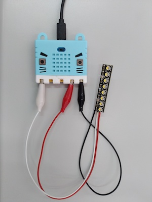

# Microbit Lesson 6: Lists with Neopixels

## Video

* [Microbit lesson 6 video](https://youtu.be/c1RAGaOKYNo)

## Connecting the Neopixels

The wiring of a neopixel matters. Get the cables the wrong way around and it won't work.

* Black must plug to GND
* Red must plug to 3.3V
* White is the data cable, it can connect to pin 0, 1 or 2



## Using Neopixels

Neopixels are little RGB LEDs (red-green-blue light-emiting-diodes) that are programmable so we can make them any colour we wish.

To use a Neopixel, we must add a new import statement, create a list variable for the Neopixels, assign colour codes to the individual LEDs, and then activate the Neopixel with the `show()` command.

Here is a simple example.

```python
from microbit import *
from neopixel import NeoPixel
leds = NeoPixel(pin1, 8)        # Create the variable for the Neopixels.
                                # The data wire is attached to Pin 1
                                # The Neopixel has 8 LEDs on it
leds[0] = [255,0,0]             # For LED 0 (the first one),
                                #  - set the Red to 255 (out of 255)
                                #  - set the Green to 0 (out of 255)
                                #  - set the Blue to 0 (out of 255)
leds[1] = [0,255,0]             # For LED 1 (the second one)
leds[2] = [0,0,255]             # For LED 2 (the third one)
leds[3] = [255,255,255]         # For LED 3 (the forth one)
leds.show()                     # Activate the LEDs as set above
```

## Using variable names for common colours

Rather than having to contiually specify the red/green/blue colour codes all the time, we can modify the above to use variables for our colors.

```python
from microbit import *
from neopixel import NeoPixel
leds = NeoPixel(pin1, 8)        # Create the variable for the Neopixels.
                                # The data wire is attached to Pin 1
                                # The Neopixel has 8 LEDs on it
red     = [255,0,0]
green   = [0,255,0]
blue    = [0,0,255]
white   = [255,255,255]
leds[0] = red
leds[1] = green
leds[2] = blue
leds[3] = white
leds.show()                     # Activate the LEDs as set above
```

## Defining a function

Sometimes we find outselves re-writing the same code over and over. It would be handy if there was a way we could write something once and re-use it. Turns out, we can! We can use `def` to define a new command (also called a function).

```python
from microbit import *
from neopixel import NeoPixel
leds = NeoPixel(pin1, 8)

# Define a command (function) to set all LEDs to off
def clear_leds():
    number = 0
    while number < 8
        leds[number] = [0,0,0]
        number = number + 1
    leds.show()

# Our main program starts here
white = [255, 255, 255]
n = 0
while True:
    clear_leds()    # Run the clear_leds() command
    leds[n] = white
    n = n + 1
    if n > 8:
        n = 0
    sleep(100)
```

Like the rest of Python, the indentation has special meaning. In this case we end indentation to indicate the end of the command definition.

When Python sees the `def`, it will load the indented code in as a new command and save it to memory but only run it when called later on.

We can now turn off all the LEDs with one command at any time we want by using `clear_leds()`, nifty right?!

## Another program

This will make a green and magenta LED chaser.

```python
from microbit import *
from neopixel import NeoPixel
leds = NeoPixel(pin1, 8)

# Define a function to set all LEDs to black
def clear_leds():
    number = 0
    while number < 8
        leds[number] = [0,0,0]
        number = number + 1
    leds.show()

# Define our colours
white =     [255, 255, 255]
blue =      [  0,   0, 255]
red =       [255,   0,   0]
green =     [  0, 255,   0]
magenta =   [255,   0, 255]
black =     [  0,   0,   0]

# Make green and magenta opposing chasers
clear_leds()
number = 0
while True:
    clear_leds()
    leds[number] = green
    leds[7-number] = magenta
    leds.show()
    number = number + 1
    if number == 8:
        number = 0
    sleep(100)
```

## What next?

How about turning on a random LED to a random colour each time?

```python
from microbit import *
from neopixel import NeoPixel
import random
leds = NeoPixel(pin1, 8)

# Define a function to set all LEDs to black
def clear_leds():
    number = 0
    while number < 8:
        leds[number] = [0,0,0]
        number = number + 1
    leds.show()

# Random LED to random color
clear_leds()
while True:
    clear_leds()
    # pick an LED
    n = random.randint(0,8)
    # pick a colour
    r = random.randint(0,255)
    g = random.randint(0,255)
    b = random.randint(0,255)
    # set the LED and show
    leds[n] = [r,g,b]
    leds.show()
    sleep(100)
```

## Activity

NeoPixels are a lot of fun, and we can easily combine them with buttons, the accelerometer or the random number generator to create interesting light shows.

1. What interesting colored light show can you create?
2. Can you use the buttons or the accelerometer to control your LED light show? For instance you could assign LEDs to indicate what angle way the microbit is on based through different colours for each axis.
3. Add a coloured light show to the song you created in the previous lesson.

## Note

Generic brand neopixels can be found by searching for `ws2812b` LED strips.
