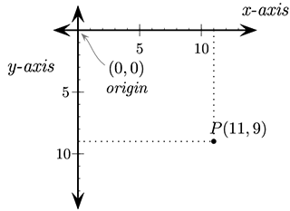
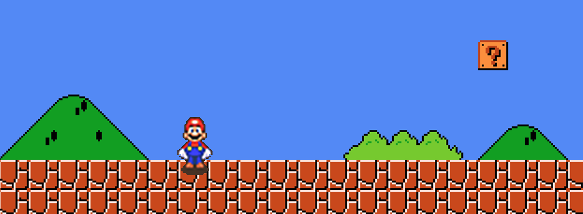
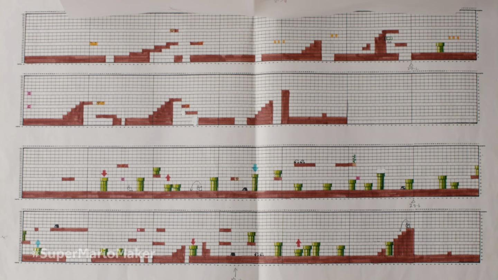

# Create a video game

## Summary

Who doesn't love a good, fun computer game? This unit will give you the opportunity to learn how it is done within Python and to have a go at creating your own.

## Unit information

| MYP item | This unit |
| ---- | ---- |
| Key concept | tba |
| Related concepts | tba |
| Global context | tba |
| Statement of inquiry | tba | 
| Assessment objectives | A (inquiring & analysing), B (devising ideas), C (creating the solution), D (evaluating) |

## Lesson overviews

12 lessons as follows:

1. Pygame basics
2. Shapes, colour and text
3. Keyboard events
4. Mouse events
5. Playing sound
6. Using images
7. Detecting collisions
8. Code a project sampler
9. Design modifications to your project
10. Code modifications to your project
11. Evaluate your project

## Website

The website for this unit is [https://pbaumgarten.com/myp-design/game-making/](https://pbaumgarten.com/myp-design/game-making/)

# 0. Pre-requisites

## Libraries required

Once you have Python installed, open the command prompt and run the following

```text
pip install pygame pygamemadeeasy Pillow ImageToolsMadeEasy
```

If you get a permissions error with the above, try it again with the `--user` switch as follows

```text
pip install --user pygame pygamemadeeasy Pillow ImageToolsMadeEasy
```

## Basic Python knowledge

This guide assumes a basic familiarity with Python. I have written a quick recap designed for a one hour lesson should you need it. It is available at:

* [https://pbaumgarten.com/python/recap/](https://pbaumgarten.com/python/recap/)

If you need a more detailed introduction to Python I have a set of detailed tutorials on my website. Each lesson contains detailed notes, videos and practice exercises. Each lesson is roughly an hour in length with 9 lessons in "the basics" (though only the first 5 are required for this tutorial).

* [https://pbaumgarten.com/python/](https://pbaumgarten.com/python/)

# 1. Pygame basics

## Cordinate system

Pygame is a graphics system for Python. The screen is divided into pixels. You use sets of pixel coordinates to tell Python where to draw shapes, place text or images etc.

Pygame coordinates start with the top-left of the screen being (x=0,y=0).

The x-axis increases as you move to the right.

The y-axis increases as you move down – this is different to the way you do it in Maths so be aware of that!



---

## Hello Pygame

All Pygames in my tutorials are built from this basic template. Please divide your games into these sections to make it easier to build and for me to assist you with any problems.

```python
import pygame, time, random
from pygame.locals import *
from pygamemadeeasy import *

pygame.init()
window = pygame.display.set_mode((500,500))     # set screen width,height
fps = pygame.time.Clock()

#********** Declare colors, images, sounds, fonts, variables **********
BLACK = (0,0,0)
quit = False
""" insert your code here """

#********** Main game loop starts **********
while not quit:
    window.fill(colors.black)           # Reset the screen to black background
    #********** Process events **********
    for event in pygame.event.get():
        print(event)
        if event.type == QUIT:
            quit = True
        elif event.type == KEYDOWN:
            if event.key == K_ESCAPE:
                quit = True
            """ insert your code here """

    #********** Perform calculations **********
    """ insert your code here """

    #********** Draw graphics **********
    """ insert your code here """

    #********** Update screen **********
    pygame.display.update()         # Actually does the screen update
    fps.tick(25)                    # Run the game at 25 frames per second

#********** Game over **********
pygame.quit()
```

The comments in the above program are important. They are recommendations on where you want to place the code for each part of your game. It's a good idea to follow the above as your "master template". Copy and paste it as the starting point each time you want to begin a new Pygame project.

To briefly explain a few commands:

* The `import` lines at the top are telling Python to load other code saved elsewhere (in this case the code that makes pygame exist)
* `pygame.display.set_mode((500,500))` is setting the width and height of your game window.
* `window` is a variable that we use to draw things onto the screen
* Pygame will only actually draw onto your screen when it hits the `pygaame.display.update()` command.
* `window.fill(BLACK)` will erase everything on screen and fill the screen with the specified color, in this case black.
* `fps.tick(25)` is saying we want the game to run at 25 frames per second

# 2. Shapes, colour & text

 

## Drawing basic shapes

An optional video walkthrough for this is at [https://www.youtube.com/watch?v=Dp9BvEFX8Tc](https://www.youtube.com/watch?v=Dp9BvEFX8Tc) or use the QR code

The following are the basic commands for drawing simple geometric shapes.

```python
# Rule for a line
pygame.draw.line( window, color, ( x1, y1 ), ( x2, y2 ), thickness )
# Example
pygame.draw.line( window, colors.blue, (50, 60), (50, 160), 10)

# Rule for a rectangle
pygame.draw.rect( window, color, ( x, y, width, height ), thickness )
# Example
pygame.draw.rect( window, colors.green, (52, 160, 120, 40) )

# Rule for a circle
pygame.draw.circle( window, color, ( x, y ), radius, thickness )
# Example
pygame.draw.circle( window, colors.white, (110, 110), 40, 10)

# Rule for an ellipse (oval)
pygame.draw.ellipse( window, colour, ( x, y, width, height ), thickness )
# Example
pygame.draw.ellipse( window, colors.fuchsia, (220, 100, 80, 40) )

# Rule for a multipoint polygone
pygame.draw.polygon( window, colour, ( (x1,y1), (x2,y2), (x3,y3), etc ) , thickness)
# Example
pygame.draw.polygon( window, colors.red, ((20,20), (52,60), (172,60), (200,20)), 5)
```

(If thickness is left out, the shape will be filled in)

Coordinates are always provided as a set of (X,Y) values including their own set of  parenthesis. That's why when you look at the sample for pygame.draw.line below you can see that the from-coordinate is (50,60) and the to-coordinate is (50,160).

To have a go drawing some basic shapes:

* Start with a copy of the basic master template from the previous page.
* Add the following code AFTER the `line BLACK = (0,0,0)`

```python
BLUE = (0,0,255)
GREEN = (0,255,0)
WHITE = (255,255,255)
RED = (255,0,0)
YELLOW = (255,255,0)
PINK = (0xFF, 0x65, 0xFF)
```

* Add the following code AFTER the `window.fill(BLACK)` and BEFORE the `pygame.display.update()`

```python
pygame.draw.line(window, BLUE, (50, 60), (50, 160), 10)
pygame.draw.rect(window, GREEN, (52, 160, 120, 40) )
pygame.draw.circle(window, WHITE, (110, 110), 40, 10)
pygame.draw.rect(window, YELLOW, (220, 100, 80, 40) )
pygame.draw.ellipse(window, PINK, (220, 100, 80, 40) )
pygame.draw.polygon(window, RED, ((20,20), (52,60), (172,60), (200,20)), 5)
```

## Using colour

Colours are created using a 3 number variable, COLORNAME = (red, green, blue), where each colour value is between 0 and 255.

```python
BLACK = (0, 0, 0)
WHITE = (255, 255, 255)
RED   = (227, 27, 27)
GREEN = (0, 255, 0)
BLUE  = (0, 0, 255)
```

Colours can also be written using hexadecimal numbers. This is handy as frequently colour charts will give you a colour in that form.

For instance, the colour PINK might be `#ff99cc`. To use that as a Python colour variable, you would write it as:

```python
PINK = (0xFF, 0x99, 0xCC)
```

To get a colour at a given pixel

```python
pixel_colour = window.get_at(( x , y ))
```

A good online resource for picking colours is [https://htmlcolorcodes.com](https://htmlcolorcodes.com/)

## Displaying text

 An optional video walkthrough to assist with some of the content of this topic [https://www.youtube.com/watch?v=mfRnTDJbM68](https://www.youtube.com/watch?v=mfRnTDJbM68) or use the QR code

There are two steps to displaying text within a Pygame Python program:

* Create the font variable
* Convert the text to an image that is then drawn on the screen

The following walks you through the two steps with the program we have been creating over the last few pages.

1. Create the font variable. Create a font variable before your game loop. Typically I would add it just after all the colours are defined.

```python
ARIAL = pygame.font.SysFont("Arial", 60)
```

2. Convert the text to an image and draw it to screen. Inside your loop, before the `pygame.display.update()`, add two lines to render your text to a bitmap, and then blit that bitmap to the screen window.

```python
label = ARIAL.render("Hello Python!", 1, (255,255,255))
window.blit(label, (300, 50))
```

The (300,50) in the `window.blit` command is the coordinates of where to draw the text.
The output should look like:


    **Watch out** - A common mistake students make is not realising the information for the `render()` function must be a string. So, for example, if you have an integer variable called `score` that you want to be displaying on screen, remember to convert it to a string first using `str(score)`.

## Your task/s

 * Draw a simple landscape scene? Perhaps a house with a triangle shaped roof, or a stick person?
 * Use different colours, shapes and add some text to your landscape scene.
 * Upload a screen shot of the image, and the Python code, to your portfolio.

# 3. Keyboard events

 An optional video walkthrough to assist with some of the content of this topic [https://www.youtube.com/watch?v=16DMTuQW3cY](https://www.youtube.com/watch?v=16DMTuQW3cY) or use the QR code


We have already been using the Pygame event handler without really looking too much at it. It is the `for event in pygame.event.get()`. Just like items in a list, the `for` loop will run through all the events that have occurred since the last time the program checked through them. This is how the program detects and processes keyboard and mouse events.

Let's start by looking at the keyboard.

All keyboard events have an `event.type == KEYDOWN` or `event.type == KEYUP`, which correspond to the time the key is first pressed, and the time it is released. Once we know it is a keyboard event, we can then check to see the contents of `event.key` which will tell Python which key was involved.

For a full list of the event.key codes, see https://www.pygame.org/docs/ref/key.html. 

The ones we are going to be concerned with primarily are: `K_ESCAPE, K_RETURN, K_SPACE, K_UP, K_DOWN, K_LEFT, and K_RIGHT`.

---

## Demo 1 - Space bar

Get your template code and add to it as shown in the demo code.

The following demonstration will highlight whether or not the user is pressing the space bar.

* Save a copy of the previous program from Displaying Text as a new file.
* Create a new variable in the section before the while loop

```python
import pygame, time, random
from pygame.locals import *

pygame.init()
window = pygame.display.set_mode((500,500))
fps = pygame.time.Clock()

# Declare colors, images, sounds, fonts, variables
BLACK = (0,0,0)
quit = False
spaceBar = False

# Main game loop
while not quit:

    # Process events
    for event in pygame.event.get():
        print(event)
        if event.type == QUIT:
            quit = True
        elif event.type == KEYDOWN:
            if event.key == K_ESCAPE:
                quit = True
            if event.key == K_SPACE:
                spaceBar = True
        elif event.type == KEYUP:
            if event.key == K_SPACE:
                spaceBar = False

    # Perform calculations

    # Draw graphics
    window.fill(BLACK)
    if spaceBar:
        msg = ARIAL60.render("Space bar", 1, GREEN)
    else:
        msg = ARIAL60.render("Space bar", 1, RED)
    window.blit(msg, (300,150))
    pygame.display.update() # Actually does the screen update
    fps.tick(25) # Run the game at 25 frames per second

# Loop over, game over
pygame.quit()
```

---

## Demo 2 - Arrow keys

Let's move onto something more useful for a game. This demo will use the arrow keys to move an object on the screen. While the arrow key is pressed, the object will move; once the key(s) are released, the movement will stop.

```python
import pygame, time, random
from pygame.locals import *

pygame.init()
window = pygame.display.set_mode((500,500))
fps = pygame.time.Clock()

# Declare colors, images, sounds, fonts, variables
BLACK = (0,0,0)
PINK = (0xFF, 0x99, 0xCC)
x = 400
y = 300
movex = 0
movey = 0
quit = False
spaceBar = False

# Main game loop
while not quit:

    # Process events
    for event in pygame.event.get():
        print(event)
        if event.type == QUIT:
            quit = True
        elif event.type == KEYDOWN:
            if event.key == K_ESCAPE:
                quit = True
            if event.key == K_UP:
                movey = -20
            if event.key == K_DOWN:
                movey = 20
            if event.key == K_LEFT:
                movex = -20
            if event.key == K_RIGHT:
                movex = 20
        elif event.type == KEYUP:
            if event.key == K_UP or event.key == K_DOWN:
                movey = 0
            if event.key == K_LEFT or event.key == K_RIGHT:
                movex = 0

    # Perform calculations

    # Draw graphics
    window.fill(BLACK)
    x = x + movex
    y = y + movey
    pygame.draw.circle(window, PINK, (x,y), 40, 0)
    pygame.display.update() # Actually does the screen update
    fps.tick(25) # Run the game at 25 frames per second

# Loop over, game over
pygame.quit()
```

---

## Your task/s

 * Get the two demonstration activities to work (do not just copy and paste the code - practice typing Python code for yourself so you learn how to correct the errors along the way)

# 4. Mouse events

 An optional video walkthrough to assist with some of the content of this topic [https://www.youtube.com/watch?v=Ttch-J4ulKM](https://www.youtube.com/watch?v=Ttch-J4ulKM) or use the QR code

Mouse events work very similar to keyboard events. They are stored in the same queue to be processed by the `for` event in `pygame.events.get()` loop.

There are three types of events we can check for:

* event.type == MOUSEMOTION
* event.type == MOUSEBUTTONDOWN
* event.type == MOUSEBUTTONUP

In all three cases, there will be an `event.pos` value that will indicate the `(x,y)` location of the mouse pointer when the event occurred. To illustrate the use of mousemotion, lets make a very simple pong game where the paddle will be controlled by the mouse. The sections relevant to the mouse motion event will be highlighted with comments.

---

## Demo - Basic pong game

```python
import pygame, time, random
from pygame.locals import *
pygame.init()
window = pygame.display.set_mode((500,500))
fps = pygame.time.Clock()

# Declare colors, fonts, images, variables etc
BLACK = (0,0,0)
WHITE = (255,255,255)
ball_x = 250                            # Starting position of the ball
ball_y = 250
ball_move_x = random.randint(5,10)      # Set a random horizontal speed
ball_move_y = random.randint(5,10)      # Set a random vertical speed
paddle_x = 220                          # Starting position of the paddle
paddle_y = 470
quit = False

# Main game loop
while not quit:
    # Process events
    for event in pygame.event.get():
        if event.type == QUIT:
            quit = True
        elif event.type == MOUSEMOTION:             ## The mouse has moved
            paddle_x = event.pos[0]                 ## We only need the x coordinate of the mouse position

    # Perform calculations
    ball_x = ball_x + ball_move_x
    ball_y = ball_y + ball_move_y

    ball_hit_zone = Rect(ball_x-10, ball_y-10,20,20)
    paddle = Rect(paddle_x, paddle_y, 60, 20)

    if paddle.colliderect(ball_hit_zone):
        ball_move_y = -abs(ball_move_y)
    if ball_x < 0 or ball_x > 500:
        ball_move_x = -ball_move_x
    if ball_y < 0:
        ball_move_y = -ball_move_y
    if ball_y > 500:
        quit = True
        print("You lost! Game over!")

    # Draw graphics
    window.fill(BLACK)
    pygame.draw.ellipse(window, WHITE, ball_hit_zone, 10)
    pygame.draw.rect(window, WHITE, paddle)
    pygame.display.update()
    fps.tick(25)
pygame.quit()
```

# 5. Playing sound

Like images, this will assume all your sound files are in your project folder. You can only have one track of "background" music playing at a time. You can, however, have multiple sound effects at once. 

## Background music

Playing a background song is dead easy... one command to load it, one command to play. Don’t put this in your loop! It should go where colours are declared etc.

```python
pygame.mixer.music.load('background.mp3')
pygame.mixer.music.play(-1) 		# 0 = play once, -1 = loop
```

**Important!** - Do not put your `pygame.mixer.music.load` in your game loop. Every time you run it you are reloading the file into memory, slowing your system down!

## Sound effects

Make sure you only load the sound effect once. You can use it multiple times, but it will chew up your system memory very quickly if you put the load inside your game loop!

Where you declare your colours etc...

```python
BOUNCE_SOUND = pygame.mixer.Sound('sound-effect.wav'))
```

When you want the sound to play

```python
BOUNCE_SOUND.play()
```

* Sound effects have to be WAV files.

## Your task/s

* Spend no more than 10 minutes searching for some good game sound effects.
* Remember if you find MP3, you will have to convert them to WAV files. Use an online converter, or Audacity if it is on your laptop.
* Create a new copy of your Pong game (or any other previous Pygame exercise) and add sound effects to it at key points.

# 6. Using images in Pygame

 An optional video walkthrough to assist with some of the content of this topic [https://www.youtube.com/watch?v=2ClnBpKGx7o](https://www.youtube.com/watch?v=2ClnBpKGx7o) or use the QR code

## Draw an image

Drawing an image file (jpeg or png) is really easy! Only two lines of code needed. The following assumes your image files are located in your PyCharms project folder.

Load the image to a variable. Do this only once, typically where you declare your colours, fonts etc. **It is important that your pygame.image.load is not in your game loop. Every time you run it you are reloading the file into memory, slowing your system down!**

```python
IMAGE = pygame.image.load("image.jpg").convert_alpha()
```

To draw the full image onto the screen, use the `blit()` command. The coordinates are the top-left corner of the image on your screen. Do this where you would have used `pygame.draaw.rect` or similar.

```pythoon
window.blit(IMAGE, (x, y))
```

## Resize an image

To resize an image before drawing it onto the screen.

```python
picture = pygame.image.load(filename)
picture = pygame.transform.scale(picture, (newWidth, newHeight))
```

## Rotate an image

* Will rotate counter-clockwise. Use a negative number to rotate clockwise.
* Unless rotating by 90 degree increments, the image will be padded larger to hold the new size. If the image has pixel alphas, the padded area will be transparent. Otherwise pygame will pick a color that matches the Surface colorkey or the topleft pixel value.

```python
originalPicture = pygame.image.load(filename)
rotatedPicture = pygame.transform.rotate(originalPicture, 90)
```

## Get colour at pixel

```python
pixel_colour = window.get_at(( x , y ))
```

## Draw part of an image

To only render part of an image onto the screen, you can supply the coordinates of the rectangle within the image you want to use.


```python
window.blit(IMAGE, (window-x, window-y), (image-x, image-y, image-width, image-height))
```

Where

* window-x, window-y: the coordinates where you want the partial image located on the screen
* image-x, image-y: within the image file, this is the top left of the part of the image to include
* image-width, image-height: the number of pixels wide and high to include

## Animated sprites

 An optional video walkthrough to assist with some of the content of this topic [https://www.youtube.com/watch?v=gT0qmgAauT8](https://www.youtube.com/watch?v=gT0qmgAauT8) or use the QR code

A sprite map is where one image has several icons drawn on it. The idea is you rotate through the icons to give the appearance of animation.

Sprite maps are easy to find online, or create your own using a site such as [piskelapp.com/](https://www.piskelapp.com/)

To simplify the process, use my pygamemadeeasy package:

```
pip install pygamemadeeasy
```

Required import statement

```python
from pygamemadeeasy import *
```

Then to create the sprite animation object

```python
animation = SpriteAnimation("animation.png", 32, 24) # each frame is 32 x 24
```

Use `object.next_frame()` to return the next frame as an image that is ready to blit. Each time you call the function it will increment to the next frame, and then sequence back to the start of the set.

```python
window.blit(animation.next_frame(), (x, y))
```

---

## Demo - Basic mario


The following exercise creates a simple Mario walking scene where his "walk" is animated through a series of cells for the left and right walking as shown

* mario-stationary.png
* mario-left-animation.png
* mario-right-animation.png
* mario-background-768p.png

from [https://github.com/paulbaumgarten/paulbaumgarten/tree/master/myp-design/game-making/img](https://github.com/paulbaumgarten/paulbaumgarten/tree/master/myp-design/game-making/img)

The sprite animation runs from functionality in the `pygamemadeeasy` library. Ensure you have it installed and import as follows

```python
from pygamemadeeasy import *
```

Creating an animation first requires creating an animation object called a `SpriteAnimation()` as can be seen below. In this case, the `90, 133` indicates the height and width of the individual frames within the image file. 

```python
mario_left_animation    = SpriteAnimation("mario-left-animation.png", 90, 133)
```

**Note** - The `SpriteAnimation()` object has been designed to work on PNG files exported from the Piskelapp website where columns have been set to `1`. It may not work properly if you have multiple columns.

To blit (draw) a frame of the image onto screen use the `.next_frame()` function. This will automatically move to the next frame each time it is called.

```python
window.blit( mario_right_animation.next_frame(), (player_x, player_y) )
```

---

The full demo is here...

```python
import pygame, time, random
from pygame.locals import *
from pygamemadeeasy import *

### START GAME CODE ###
pygame.init()
window = pygame.display.set_mode((300,300))
fps = pygame.time.Clock()

# Declare colors, fonts, images
mario_right_animation   = SpriteAnimation("mario-right-animation.png", 90, 133)

# Variables
player_x = 100                                      # x-value of player
player_y = 100                                      # y-value of player
quit = False                                        # game still playing while this is True

# Main game loop
while not quit:

    # Process events
    for event in pygame.event.get():
        if event.type == KEYDOWN:
            if event.key == K_ESCAPE:
                quit = True

    # Draw graphics
    window.fill( colors.black )

    # Draw the animated sprite    
    window.blit( mario_right_animation.next_frame(), ( player_x, player_y ) )

    # Update the window
    pygame.display.update()
    fps.tick(10)
pygame.quit()
```

---

## Demo - Running and jumping mario



This extends the Mario demo so he can walk, run, jump based on your keyboard input.

**You are not required to do this demo. It is for information purposes. Check your assigned tasks below.**

If you do choose to code this, you will need to download the following files:

* mario-stationary.png
* mario-left-animation.png
* mario-right-animation.png
* mario-background-768p.png

from [https://github.com/paulbaumgarten/paulbaumgarten/tree/master/myp-design/game-making/img](https://github.com/paulbaumgarten/paulbaumgarten/tree/master/myp-design/game-making/img)

```python
import pygame, time, random
from pygame.locals import *
from pygamemadeeasy import *

### FUNCTIONS ####

def jump(frame_number):
    """
    Calculate gravity effect for jumping.
    Returns change in y-axis for x-frames. Jumps to a height of 200 pixels and lands again over a total of 100 frames
    (~20 frames/sec = 5 second process)
    Who ever said quadratics and physics weren't useful!?
    """
    frame_number = float(frame_number)              # convert integer to float for calculation purposes
    delta_y = -(2.0/25.0)*(frame_number**2) + 8.0*frame_number
    return int(delta_y)                             # turn the decimal float back to an integer to represent change of pixels

### START GAME CODE ###
pygame.init()
window = pygame.display.set_mode((1000,760))
fps = pygame.time.Clock()

# Declare colors, fonts, images
background_image        = pygame.image.load("mario-background-768p.png").convert_alpha()
mario_left_animation    = SpriteAnimation("mario-left-animation.png", 90, 133)
mario_right_animation   = SpriteAnimation("mario-right-animation.png", 90, 133)
mario_stationary_image  = pygame.image.load("mario-stationary.png").convert_alpha()
arial_60                = pygame.font.SysFont("Arial", 60)

# Variables
player_x = 30                                       # x-value of player
player_y = 400                                      # y-value of player
quit = False                                        # game still playing while this is True
score = 0                                           # starting score
floor = 555                                         # y-value of the floor
gravity = 25                                         # Gravity speed
falling = True                                      # are we falling??
jumping = False                                     # are we jumping?
jumping_frames = 0                                  # number of frames we have been jumping
delta_x = 0
sprite_num = 0
sprite_scene =0
# Main game loop
while not quit:
    # Process events
    for event in pygame.event.get():
        if event.type == QUIT:
            quit = True
        elif event.type == KEYDOWN:
            if event.key == K_ESCAPE:
                quit = True
            if event.key == K_SPACE:
                if not falling and not jumping:     # We can't jump if we are already in the air
                    jumping = True                  # we are jumping!
                    jumping_frames = 0              # start of a new jump
            if event.key == K_LEFT:
                delta_x = -20
            if event.key == K_RIGHT:
                delta_x = 20
        elif event.type == KEYUP:
            if event.key == K_LEFT or event.key == K_RIGHT:
                delta_x = 0
        elif event.type == MOUSEMOTION:             ## The mouse has moved
            paddle_x = event.pos[0]                 ## We only need the x coordinate of the mouse position

    if jumping:
        player_y -= gravity
        jumping_frames += 1
        if jumping_frames > 10:                     # We've reached our jump limit, time to fall down again
            jumping = False
            falling = True
    elif player_y < floor:
        falling = True
        player_y += gravity
    else:
        falling = False
    player_x += delta_x
    # Draw graphics
    window.fill(colors.black)
    window.blit(background_image, (0, 0))
    if delta_x > 0: # moving right
        window.blit(mario_right_animation.next_frame(), (player_x, player_y))
    elif delta_x < 0:
        window.blit(mario_left_animation.next_frame(), (player_x, player_y))
    else:
        window.blit(mario_stationary_image, (player_x, player_y))
    window.blit(arial_60.render( str(score), 1, colors.white ), (20, 20))
    pygame.display.update()
    fps.tick(10)
pygame.quit()
```

---

## Your task/s

* Do the first demo to get an animated sprite working for yourself.
* Rather than doing the second demo, create your own PiskelApp animation, and then create your own simple demo that uses it.

# 7. Detecting collisions

Pygame has a couple of really handy built in collision detection functions you can use:  `colliderect` and `collidelist` are the main two I'll discuss here.

## Rectangle

It works by providing the coordinates to two sets of rectangles, and if there is any overlap it will trigger the collision. We've drawn rectangles using `pygame.draw.rect` but you can also create rectangle variables. These can then be used for collision detection as well as drawing on screen (though once you start using images/sprites you probably won't even draw them).

To create a rectangle variable

```python
my_rect = Rect( x, y, width, height )
```

To then draw that rectangle use

```python
pygame.draw.rect( window, COLOR, my_rect )
```

To check if two rectangles overlap (collide) at all, the "if" statement would look like this:

```python
if Rect( x, y, w, h ).colliderect( Rect( x, y, w, h ) ):
   print("There is a collision")
```

Example code with a couple of rectangle variables would be:

```python
ball = Rect( ball_x, ball_y, 20, 20 )
paddle = Rect( paddle_x, 470, 60, 20 )

if ball.colliderect( paddle ):
   print("Collision detected")
```

Look back at the "Basics Pong using mousemotion" sample code and you'll spot an example of it being used.

## List of rectangles

This works very similar as colliderect, the difference being that instead of checking if one rectangle is overlapping another single rectangle, it can check to see if a rectangle is overlapping any items in a list of rectangles!

This is very useful in a game scenario where you might have multiple enemies, bombs or bullets to avoid – you can check your player isn't touching any of them in one line of code!

The key difference is that instead of returning `True` or `False`, the function will return a number to indicate which item in the list there is collision with, or -1 if there is no collision.

A crude illustration of it's use might look like:

```python
baddies = [
   Rect( 0, 50, 50, 50 ),
   Rect( 50, 200, 50, 50 ),
   Rect( 200, 100, 50, 50 )
]
me = Rect( 75, 25, 50, 50 )
if me.collidelist(baddies) >= 0:
   print("Uh oh! A baddie has caught you!")
```

To see this in use properly, look at Space Invaders in the project starters section. Look for the comment "Check for collisions between bullets and aliens " and you'll see collidelist in action.

## Your task/s

* Implement the collision demo that follows.
* Make your own personalised modifications to it.

```python
import pygame, time, random
from pygame.locals import *

pygame.init()
window = pygame.display.set_mode((500,500))     # set screen width,height
fps = pygame.time.Clock()

#********** Declare colors, images, sounds, fonts, variables **********
arial_24 = pygame.font.SysFont("Arial", 24)
black = (0,0,0)
red = (255,0,0)
green = (0,255,0)
white = (255,255,255)
quit = False
x,y = 250,250

#********** Main game loop starts **********
while not quit:
    window.fill(black)           # Reset the screen to black background
    #********** Process events **********
    for event in pygame.event.get():
        print(event)
        if event.type == QUIT:
            quit = True
        elif event.type == MOUSEMOTION:
            x,y = event.pos

    #********** Calculations **********
    player = Rect(x,y,50,50)
    obj1 = Rect(50,50,50,50)
    blocks = [
        Rect(30,400,40,40),
        Rect(130,400,40,40),
        Rect(230,400,40,40),
        Rect(330,400,40,40),
        Rect(430,400,40,40)
    ]
    player_color = green
    if player.colliderect(obj1):            # Detect collision between one rectangle and another rectangle
        player_color = red
    if player.collidelist(blocks) >= 0:     # Detect collision between one rectangle and a list of rectangles
        block_num = player.collidelist(blocks)
        player_color = red
        window.blit( arial_24.render(f"Collision with block {block_num}", 1, white), (100,20))

    #********** Update screen **********
    pygame.draw.rect(window, white, obj1) 
    for block in blocks:
        pygame.draw.rect(window, white, block) 
    pygame.draw.rect(window, player_color, player) 
    pygame.display.update()         # Actually does the screen update
    fps.tick(25)                    # Run the game at 25 frames per second

#********** Game over **********
pygame.quit()
```

# 8. Project starters

I have a set of pre-written code as starters for the following games. The intention is you would use one of these as the *starting point*, from where you will then add your own features to the game.

* Pong
* Snake
* Simple platformer
* Space invaders
* 1942
* Candy crush
* Better platformer

Discuss with me if you feel you are ready one of these.

## Your task/s

* Get your selected project starter coded and successfully running.

# 9. Design your own game

## Task B1: Success criteria

Generate a list of project **success criteria** that you will use to judge how successful you have been with the project. Each success criterion should be as **specific** and **measurable** as possible. To assist you in brainstorming your success criteria, you try to create criteria for each of these categories:

* Functionality: What will your program do? How will it behave? Under what conditions?
* Aesthetics: What will it look like? Sound like? Will there be any movement/animation/colour?
* Technology: What will the client require to run it?
* Feasibility: What time constraints, resource constraints, knowledge constraints do you face?

## Task B2: Design ideas


Original sketches for SPACE INVADERS (1978) characters by Toshihiro Nishikado. [(source)](https://www.reddit.com/r/geek/comments/akr1n3/original_concept_sketches_for_space_invaders_1978/)


Original Donkey Kong, (Donkey Kong, Jumpman/Mario & Pauline) sprite drawings - Shigeru Miyamoto (~1981) [(source)](https://twitter.com/gameanim/status/1076985452903653378)




Original Mario levels - Shigeru Miyamoto [(source)](https://qz.com/429862/the-original-super-mario-game-was-designed-on-graph-paper/)

The above represent some original sketches for classic arcade games.  Your task is to create designs or detailed sketches for your product.

* Label key parts so other people can understand your ideas.
* You can draw screenshots or storyboards or what you anticipate the final solution may look like. 
* You may draw sketches or use modelling software if you prefer.
* You drawings should be able to be fully understood by others. (the idea being that someone else could build the app that's in your head based off your drawings).
* You are NOT being assessed on your artistic drawing capabilities but your work IS expected to be neat and have all possible care taken in its presentation. (for instance if a line is supposed to be straight then use a ruler!)

In general, you should produce at least 3 different designs/sketches.

Annotate your drawings to indicate the function of the various parts of the project. Try to ensure that accross your diagrams, you cover the following spread of categories:

* Functionality
* Aesthetics
* Technical requirements
* Characters (if relevant)
* Target market (I drew a character that looks like .... because I want it to appeal to ..... )
* Feasibility

If you need blank templates for your Criterion B design sketches, you can use my [Criterion B Prototype Sketches Template](../crit-b-prototype-desktop.pdf)

---

## Task B3: Design selection

How well do each of your proposed designs satisfy your success criteria from B1?

To adequately address strand B3 you should:

* Compare each of your B2 proposals against each of your B1 success criteria.
* With the comparison in mind, which of the proposals best solves the problem and why? Are there any changes you will make to this design to further improve it? 
* Reference your various elements of your B1 success criteria in your justification.

## Task B4: Final design proposal

Discuss the logic of your program? Here are some example bullet points that would describe product behaviour:

* The player starts with 10 health (or 3 lives, or 0 points, or….)
* When the up arrow is pressed: Player will jump for a few moments and gradually descent to land on a platform
* When the bullet hits the player: The player loses 5 health (or 1 life, or the game ends...)
* When the player touches a treasure chest: The player gains 50 points (or 10 health, or the game moves to the next level) etc
* When the colour sensor sees blue: The left wheel will turn at maximum speed, the right wheel will stop.

## Task C: Create

* Submit your Python code to your portfolio.

## Task D: Evaluate

The Criterion D deliverable should take the form of a narrated screen-cast video.

Your video needs to include the following:

* Write an outline for key points you want to make in your video before recording it (a word by word script is not necessary).
* Demonstrate the achievement of each of your success criteria identified in task B1
* Discuss what changes you would make to your product if given more time. This could either be to better address success criteria not fully completed, or to add enhancements to your product
* Within the video, identify who your client (or target audience) for the project was, and discuss whether you have achieved the original objective identified back in task A1. How has completed product impacted on your client (or target audience). Perhaps a brief on camera interview with your client (or a couple of representatives of the target audience).

In order to address this criterion thoroughly, I anticipate most videos to be around 4 or 5 minnutes.

* Submit your Video evaluation to your portfolio


