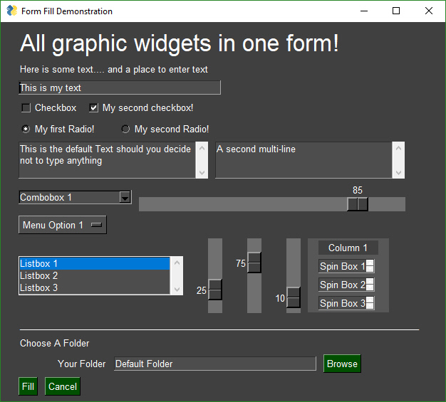
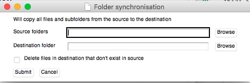
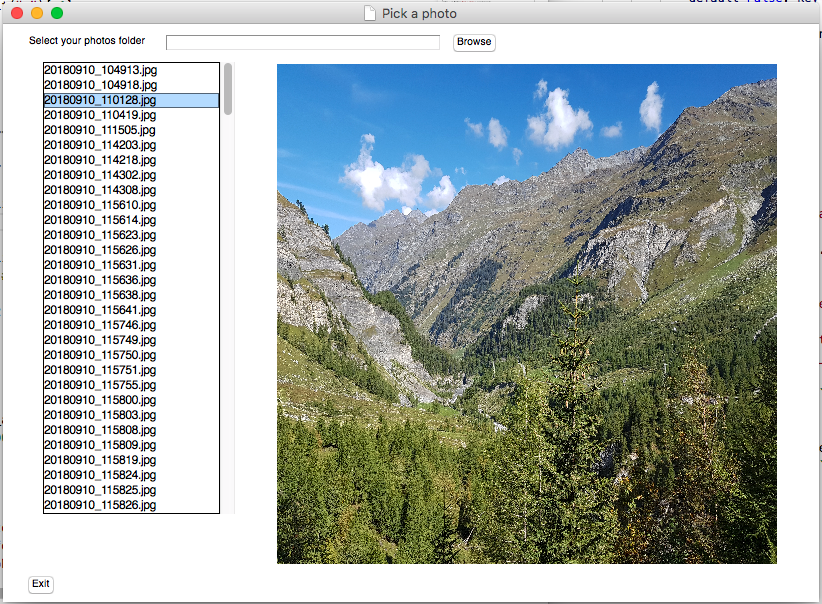

# GUIs with Python

Finally, there is a new GUI library available for Python that makes things a lot simpler than using TKinter or Qt directly. It is called, amazingly enough, [PySimpleGUI](https://pysimplegui.readthedocs.io/). This is now my go-to recommendation for making GUIs with Python. You can even use it to create Web applications! (at the time of writing the web implementation is still a little rough around the edges but it is improving very quickly).



(image from https://pysimplegui.readthedocs.io/#features)

PySimpleGUI is compatiable with:

* Windows
* Mac OSX (with the minor limitation that colour settings don't work on buttons)
* Linux including Raspberry Pi
* Web applications!

The online documentation is **extensive** (opening the printer box to the above linked document came to 158 pages), however, personally I find it is not as well organised as could be to easily find the relevant section you need. I think that's a symptom of the rapid pace of development it is going through. So, hopefully, my notes provide enough meaningful structure for my students to work with. If you can't find what you are looking for in my notes, open the [official docs](https://pysimplegui.readthedocs.io/) and do a "ctrl-f" to search for what you are wanting.

I'll split my notes into 3 sections: Getting started with a few basics; A brief discussion on layouts; then reference notes to how to use the common elements of a GUI in your projects.

## Getting started

As for all my Python notes, I will assume you are using Python 3.6 or above. Install the `PySimpleGUI` library.

```bash
pip install --upgrade PySimpleGUI
```

To import into your project

```python
#!/usr/bin/env python3
import PySimpleGUI as sg
```

For the web version, install `PySimpleGUIWeb` and then `import PySimpleGUIWeb as sg` and the rest should work! (though usually a couple of minor changes to the code base I'll discuss later)

## Window layouts

Window layouts are organised into a list of list of items, where each new entry in the list is treated as a new *row* of controls for the window.

I also recommend organising each layout and window into functions (or classes if you are familiar/comfortable with them) so my samples will be based on using functions. That means you could put all these samples into the one program without interferring with each other, thereby demonstrating how you can easily scale your programs into complex multi-window projects.

There are a few different design patterns in the documentation, but I recommend just being consistent with using loops with persistant windows as a "standard formula" from which you can build on for maximum flexiblity.

A first demo



A couple of notes about this formula:

* `event` will contain a string of the name of the button was clicked
* `values` will contain a dictionary of key values of the elements on screen. In this case, the dictionary will look like
* This approach depends on you having a function to contain the entire window. The use of `return` statements will terminate the infinite `while` loop because it will exit the function.

```python
{'source': '/path/to/folder/selected', 'destination': '/path/to/folder/selected', 'delete_nonexisting': False}
```

Let's code the demo...

```python
import PySimpleGUI as sg

def demo1():
    layout = [
        [ # ---- First row
            sg.Text('Will copy all files and subfolders from the source to the destination') 
        ], [ # ---- New row
            sg.Text('Source folders', size=(15, 1)), 
            sg.InputText(key="source"), 
            sg.FolderBrowse(target="source") 
        ], [ # ---- New row
            sg.Text('Destination folder ', size=(15, 1)), 
            sg.InputText(key="destination"), 
            sg.FolderBrowse(target="destination") 
        ], [ # ---- New row
            sg.Checkbox("Delete files in destination that don't exist in source", default=False, key="delete_nonexisting") 
        ], [ # ---- New row
            sg.Submit(), sg.Cancel()
        ]
    ]
    window = sg.Window('Folder synchronisation').Layout(layout)
    while True:
        event, values = window.Read() # Run the window until an "event" is triggered
        if event == "Submit":
            return values
        elif event is None or event == "Cancel":
            return None

if __name__ == "__main__":
    result = demo1()
    print(result)
```

# Reference notes

The following are some of the more common elements you'll want to use that come with pysimplegui.

## Popup (dialog box)

* Simple information dialogs with buttons

```python
button_pressed = sg.Popup('Simple popup box')
button_pressed = sg.PopupYesNo('Popup with yes & no buttons')
button_pressed = sg.PopupOKCancel('Popup with Ok & cancel buttons')
sg.PopupError('Popup with Error button') # doesn't return anything
```

In the above, `button_pressed` will be a string value with the name of the button that was pressed.

* Dialogs with text box

```python
text = sg.PopupGetText('Title', 'Please input something')  
```

* Dialog to select a file or folder

```python
# "Open" file dialog
file_name = sg.PopupGetFile('Please select file to open') 

# "Save As" file dialog (will ask to confirm if an existing file is picked)
file_name = sg.PopupGetFile('Please enter filename to save', save_as=True) 

# Only show JPG and PNG files
file_name = sg.PopupGetFile('Please select a photo to open', file_types=("*.jpg", "*.png") )

# Using a default folder location
file_name = sg.PopupGetFile('Please select file to open', default_path="..." )

# Folder location picker
folder_name = sg.PopupGetFolder("Please select folder location", default_path="..." )
```

* Easy debug window to use in lieu of console print

```python
import PySimpleGUI as sg

# Override the usual print function with SimpleGui's Print
print=sg.Print 

for i in range(100):
    # Use print as usual, except it will appear in a popup Debug window.
    print(i)
```

## Text (label)

```python
sg.Text('All graphic widgets in one window!', size=(30, 1), justification='center', font=("Helvetica", 25))
```

Note: Parameters such as `justification` and `font` can be provided for most other element types.

## InputText (one line text input)

```python
sg.InputText('Enter your name here', key="given_name")
```

* **key** is the name that you will use in the **values** dictionary to see the content of this textbox.

## Multiline (mutliline text input)

```python
sg.Multiline(default_text='This is a multiline text input', size=(35, 3), key="story")
```

* **key** is the name that you will use in the **values** dictionary to see the content of this textbox.
* **size** is number of characters wide by number of lines high

## ListBox

```python
items = ["item 1", "item 2", "item 3"]
sg.Listbox(values=items, size=(30, 3), key="items_listbox")
```

* **key** is the name that you will use in the **values** dictionary to see the content of this listbox. **It will return a list of selected values** so if you are only selecting one item, it would be `values["items_listbox"][0]` using this example.
* **size** is number of characters wide by number of lines high

## InputCombo (drop down box)

```python
items = ["item 1", "item 2", "item 3"]
sg.InputCombo(items, size=(20, 1), key="items_combobox")
```

* **key** is the name that you will use in the **values** dictionary to see the content of this combobox. 
* **size** is number of characters wide by number of lines high

## Radio (multi choice) selectors

Radio buttons only allow you to pick one item from those of the same group.

```python
[
    sg.Radio('Gryffindor', "radio_group1", key="house", default=True),
    sg.Radio('Hufflepuff', "radio_group1", key="house"),
    sg.Radio('Ravenclaw', "radio_group1", key="house"),
    sg.Radio('Slytherin', "radio_group1", key="house")
]
```

## Checkbox (tick box) selectors

```python
sg.Checkbox('I have read the terms and conditions', size=(10,1), key="terms_ok")
```

## Slider

```python
sg.Slider(range=(1, 100), orientation='v', size=(5, 20), default_value=25, key="slider")
```

* orientation: `v` for vertical, `h` for horizontal

## CalendarButton

Use a `sg.CalendarButton` in your layout, in conjunction with an InputText. The button will generate a popup to pick a date. Once the popup is closed, the date will be entered into the `InputBox`. Note the `target=` setting on the `CalendarButton()` is used to link it to the `InputBox()` with matching `key=`.

```python
def demo_date_picker():
    layout = [
        [ 
            sg.Text("Enter your date of birth"),
            sg.InputText(key="birthdate"), 
            sg.CalendarButton(button_text="Select date", target="birthdate") 
        ], [ 
            sg.Submit(), sg.Cancel()
        ]
    ]
    window = sg.Window('Birthdate').Layout(layout)
    while True:
        event, values = window.Read()
        if event == "Submit":
            return values
        if event is None or event == 'Cancel':
            return None
```

Will return a dictionary of the following format

```python
{'birthdate': '2019-02-21 00:00:00'}
```

## ColorChooserButton

Works similar to the `CalendarButton()` above, where the `target=` parameter is used to indicate the `InputText(key=....)` that should receive the value from the colour picker.

```python
def demo_color_picker():
    layout = [
        [ 
            sg.Text("Pick a color?"),
            sg.InputText(key="color"), 
            sg.ColorChooserButton(button_text="Select color", target="color")
        ], [ 
            sg.Submit(), sg.Cancel()
        ]
    ]
    window = sg.Window('Pick a color').Layout(layout)
    while True:
        event, values = window.Read()
        if event == "Submit":
            return values
        if event is None or event == 'Cancel':
            return None
```

Will return a dictionary of the following format

```python
{'color': '#c110ff'}
```

## Image

Images can be placed in your window provide they are in PNG, GIF, PPM/PGM format. JPGs cannot be shown because tkinter does not naively support JPGs. You can use the Python Imaging Library (PIL) package to convert your image to PNG prior to calling PySimpleGUI if your images are in JPG format as the provided demo shows.

To display an image, you use the `sg.Image()` object. 

You should provide it a `filename=` parameter (leading to a PNG, GIF or PPM file not JPG), or a `data=` parameter that leads to an `io.BytesIO()` array.

This first example will display any image file selected. If the selected file is a JPG it will create a copy of the file as PNG first and open that.

When you want to change the image being displayed, the filename parameter is updated by executing the line below which searches for a layout element with the key `image` and then updates the value of any parameters within the `Update()` function.

```python
    window.FindElement("image").Update(filename=new_filename)
```

The full code is...

```python
import PySimpleGUI as sg
import io, os
from PIL import Image

def demo_photo_picker():
    layout = [
        [ 
            sg.Text("Pick a photo"),
            sg.InputText(key="photo_file"),
            sg.FileBrowse(target="photo_file", file_types=("*.jpg", "*.png"))
        ], [
            sg.Image(key="image", size=(500,500), filename="logo.png")
        ], [
            sg.Button(button_text="Show"), sg.Button(button_text="Exit")
        ]
    ]
    window = sg.Window('Pick a photo').Layout(layout)
    while True:
        event, values = window.Read()
        print(event)
        if event == "Show":
            if values["photo_file"] != "":
                if os.path.isfile(values["photo_file"]):
                    extension = values["photo_file"].lower().split(".")[-1]
                    print("file name: "+values["photo_file"])
                    if extension in ["jpg", "jpeg", "jpe"]:  # JPG file
                        new_filename = values["photo_file"].replace(extension, "png")
                        im = Image.open(values["photo_file"])
                        im.save(new_filename)
                        window.FindElement("image").Update(filename=new_filename)
                    elif extension in ["png"]: # PNG file
                        window.FindElement("image").Update(filename=values["photo_file"])
        if event is None or event == 'Exit':
            return None

if __name__ == "__main__":
    result = demo_photo_picker("logo.png")
```

The other way you could do this is to load every image using PIL and convert it into a PNG based bytes array as per the following...

```python
import PySimpleGUI as sg
import io, os
from PIL import Image

def get_image_as_data(filename, width=None, height=None):
    im = Image.open(filename)
    if isinstance(width, int) and isinstance(height, int):
        im = im.resize((width, height))
    imBA = io.BytesIO()
    im.save(imBA, format="PNG")
    return imBA.getvalue()

def demo_photo_picker2(default_pic):
    layout = [
        [ 
            sg.Text("Pick a photo"),
            sg.InputText(key="photo_file"),
            sg.FileBrowse(target="photo_file", file_types=("*.jpg", "*.png"))
        ], [
            sg.Image(key="image", size=(500,500), data=get_image_as_data(default_pic))
        ], [
            sg.Button(button_text="Show"), sg.Button(button_text="Exit")
        ]
    ]
    window = sg.Window('Pick a photo').Layout(layout)
    while True:
        event, values = window.Read()
        print(event)
        if event == "Show":
            if values["photo_file"] != "":
                if os.path.isfile(values["photo_file"]):
                    window.FindElement("image").Update(data=get_image_as_data(values["photo_file"], 500, 500))
        if event is None or event == 'Exit':
            return None

if __name__ == "__main__":
    result = demo_photo_picker2("logo.png")
```

## Menu (menu bars)

```python
    menu_def = [['File', ['Open', 'Save', 'Exit', 'Properties']],      
                ['Edit', ['Paste', ['Special', 'Normal', ], 'Undo'], ],      
                ['Help', 'About...'], ] 
```

Then in your window layout, add the menu definition as a sublist within the layout

```python
layout = [
    [ sg.Menu(menu_def, tearoff=True) ],
    # ... other items as desired ...
]
```

## Column (column based layout)

Finally, for those feeling more adventurous, while the row based default layout is nice and all, what if you want to group elements together to make a different layout?

The `sg.Column( layout )` object can be used to create columns, within which you can insert your normal row based layouts.

I'll make a photo viewing demo that looks like this....



I've given the full code for the functional demo below, but to see how columns are implemented, look at the `column1` and `column2` lists (notice they are structured exactly the same as layouts have been). These columns are then inserted into the main layout through the use of `sg.Column()`.

```python
#!/usr/bin/env python3
import PySimpleGUI as sg
import os, io
from PIL import Image

def get_image_as_data(filename, width=None, height=None):
    # from PIL import Image         # use `pip install Pillow` to install PIL
    # import io
    im = Image.open(filename)
    if isinstance(width, int) and isinstance(height, int): # Resize if dimensions provided
        im = im.resize((width, height))
    im_bytes = io.BytesIO()
    im.save(im_bytes, format="PNG")
    return im_bytes.getvalue()

def get_image_files_list(folder):
    all_files = os.listdir(folder)
    image_files = []
    for file in all_files:
        extension = file.lower().split(".")[-1]
        print(file, extension)
        if extension in ["jpg", "png", "jpeg", "jpe"]:
            image_files.append(file)
    image_files.sort()
    return image_files

def demo_photo_picker3(default_folder, default_pic):
    folder = default_folder
    files_listing = get_image_files_list(folder)
    column1 = [
        [
            sg.Listbox(values=files_listing,
                change_submits=True, # trigger an event whenever an item is selected 
                size=(25, 30), 
                font=("Helvetica", 12),
                key="files_listbox")
        ]
    ]
    column2 = [
        [
            sg.Image( data=get_image_as_data(default_pic, 500, 500), 
                key="image", size=(500,500))
        ]
    ]
    layout = [
        [ 
            sg.Text("Select your photos folder"),
            sg.InputText(key="photo_folder", change_submits=True), # trigger an event whenever the item is changed 
            sg.FolderBrowse(target="photo_folder")
        ], [
            sg.Column( column1 ), 
            sg.Column( column2 )
        ], [
            sg.Button(button_text="Exit")
        ]
    ]
    window = sg.Window('Pick a photo').Layout(layout)
    while True:
        event, values = window.Read()
        print(event)
        print(values)
        if event == "photo_folder":
            if values["photo_folder"] != "":
                if os.path.isdir(values["photo_folder"]):
                    folder = values["photo_folder"]
                    image_files = get_image_files_list(values["photo_folder"])
                    window.FindElement("files_listbox").Update(values=image_files)
                    if len(image_files) > 0:
                        full_filename = os.path.join(folder,image_files[0])
                        window.FindElement("image").Update(data=get_image_as_data(full_filename, 500, 500))
        if event == "files_listbox":
            full_filename = os.path.join(folder,values["files_listbox"][0])
            window.FindElement("image").Update(data=get_image_as_data(full_filename, 500, 500))
        if event is None or event == 'Exit':
            return None

if __name__ == "__main__":
    default_pic = "icon-twitter-48.png"
    result = demo_photo_picker3(".", default_pic)
    print(result)
```