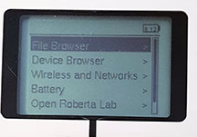
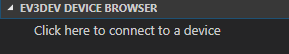
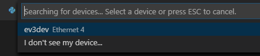
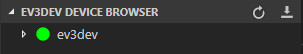
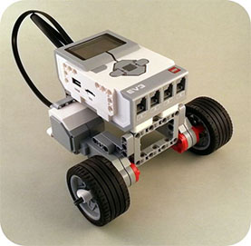

<!-- TITLE: Lego EV3 with Python -->
<!-- SUBTITLE: Programming the Lego EV3 with Python -->

# Prerequisites

This will assume you already have Python installed and working on your computer, and that you know the basics of Python programming.

# Install and setup

Note: If ever the ev3 asks for a password (such as if you SSH/Terminal into it and want to `sudo` for some reason) the default password is `maker`.

Step 1 - Setup a micro-SD card with the ev3dev software

* Download the latest "Stretch" image of ev3dev from https://www.ev3dev.org/downloads/ (currently `ev3dev-stretch-ev3-generic-2018-08-06`)
* Download and install Etcher https://etcher.io 
* Use Etcher to put the `ev3dev-stretch-ev3-generic-2018-08-06.iso` file onto your micro-SD card

Step 2 - Setup VS Code

* Download and install Microsoft VS Code from https://code.visualstudio.com/download
* Open VS Code, install the `ev3dev-browser` and `python` extensions
* Close and restart VS Code so the extensions are active
* Go to file / settings. Set "files.eol" to `\n` (ie: make sure it is not `\r\n`)
* Create a project folder on your computer, then in VS Code use File / Open to open the entire folder. (The EV3 extension will only work with entire folders, not individual files).

Step 3 - Connect the EV3 to VS Code on your computer

* Insert the micro-SD into the EV3
* Turn on the EV3. It will take a few minutes to boot up. When the EV3 screen has a list of options that shows the following, it is ready



* Use a USB cable to connect the EV3 to your computer. On the EV3 use the "PC" port (not the one labelled "USB"!)
* In VS Code, look for the EV3DEV-BROWSER section and click the bit of text that says "Click here to connect a device".



* At the top of VS Code, will appear a little pop up menu, click on the "ev3dev" when it appears (as shown)



* Looking back at the EV3DEV-BROWSER section, a coloured circle should appear. Red = connection failed, yellow = connection in progress, green = connection successful. 



* Once connected, you can click the little downward facing arrow to download your folder of python files to the EV3.

<div class="page"/>

# Demo code

If you have built the "standard template robot" as per the instructions that come with the ev3 lego kits, you should have a robot that looks like this.



The following demonstration code will:

* Import necessary libraries. Note: all ev3dev programs require a shebang! (ie: the first line must be `#!/usr/bin/env python3`)
* Say "I am EV3, watch me dance"
* Sound 3 warning beeps, flashing the LEDs red and green
* Set the LEDs to orange
* Drive forward 2 seconds
* Set the right LED to orange (like a car indicator since it is about to turn right)
* Spin clockwise for 2 seconds
* Set the left LED to orange (like a car indicator since it is about to turn right)
* Spin anti-clockwise for 2 seconds
* Set the LEDs to red (stop lights)
* Sound 1 long beep
* Say "Have a nice day"

```python
#!/usr/bin/env python3
import time
from ev3dev.ev3 import *
from ev3dev2.led import *

# Create variables
leds = Leds()
mB = LargeMotor('outB')
mC = LargeMotor('outC')

# Beeps and LED flashes
leds.all_off()
Sound.speak("I am E V 3, watch me dance.").wait()
for i in range(1,3): # run the indented loop three times
    leds.set_color("LEFT", "RED")
    leds.set_color("RIGHT", "GREEN")
    Sound.beep().wait()
    leds.set_color("LEFT", "GREEN")
    leds.set_color("RIGHT", "RED")
    Sound.beep().wait()

# Drive forward
leds.set_color("LEFT", "ORANGE")
leds.set_color("RIGHT", "ORANGE")
mB.run_forever(speed_sp=1000)
mC.run_forever(speed_sp=1000)
time.sleep(3)   # seconds
mB.stop(stop_action='brake')
mC.stop(stop_action='brake')

# Spin clockwise
leds.all_off()
leds.set_color("RIGHT", "ORANGE")
mB.run_forever(speed_sp=-1000) # negative = drive backwards
mC.run_forever(speed_sp=1000)
time.sleep(3)
mB.stop(stop_action='brake')
mC.stop(stop_action='brake')

# Spin anticlockwise
leds.all_off()
leds.set_color("LEFT", "ORANGE")
mB.run_forever(speed_sp=1000)
mC.run_forever(speed_sp=-1000) # negative = drive backwards
time.sleep(3)
mB.stop(stop_action='brake')
mC.stop(stop_action='brake')

# Say good bye
leds.set_color("LEFT", "RED")
leds.set_color("RIGHT", "RED")
Sound.beep().wait()
Sound.speak("Have a nice day.").wait()
leds.all_off()
```

<div class="page"/>

# Motors

Import the library to have motor functionality

```python
#!/usr/bin/env python3
from ev3dev.ev3 import *
```

Example using the motors

```
mB = LargeMotor('outB')
mC = LargeMotor('outC')

mB.run_forever(speed_sp=720)
mC.run_forever(speed_sp=720)

time.sleep(3)

mB.stop(stop_action='brake')
mC.stop(stop_action='brake')
```

* `speed_sp` is "number of degrees of rotation per second", so `speed_sp=360` will attempt to rotate once per second, `speed_sp=720` will rotate twice per second. From my experiments, the maximum speed is around 1050 which is almost three rotations per second (trying 1080 caused the program to fail. I'd recommend treating 1000 as maximum speed to ensure your program doesn't crash randomly).
* To distinguish between the individual motors, you should specify which port you are referring to via the parameter you pass to `LargeMotor()`. The names to use to refer to the 4 motor ports are `outA`, `outB`, `outC`, and `outD`.

To turn a motor a certain number of degrees

```python
# Turn wheel 180 degrees at speed 900 then apply strong brake.
mA.run_to_rel_pos( position_sp=180, speed_sp=900, stop_action="brake" )
```

To turn a motor a certain period of time

```python
# Turn wheel for 2000 milli seconds at speed 720
mA.run_timed(time_sp=2000, speed_sp=720)
```

To turn a motor "forever"

```python
# Turn wheel at speed 1080
mA.run_forever(speed_sp=1080)
```

To stop a motor

```python
# Stop actively turning and apply the brake
mA.stop(stop_action="brake")
# Stop actively turning, come to a rolling stop
mB.stop(stop_action="coast")
```

To pause your program while the motor is turning for an angle or set period of time

```python
mC = LargeMotor('outC')
mC.run_timed(time_sp=3000, speed_sp=-750, stop_action='brake')
mC.wait_while('running')       # Wait until the 3 seconds has finished
```

<div class="page"/>

# Sensors

For sensors to work, you must import the library as shown:

```
from ev3dev.ev3 import *
```

It is usually optional to specify the input port numbers for each sensor. If there is only one sensor of that type, Python can work out which one you are asking for. If you use more than one (such as two touch sensors) then you do need to specify which port you want to refer to at that time. The sensor port code names to use in the parameters are `in1`, `in2`, `in3` and `in4`.

Using ultrasonic sensor

```python
# Setup
us = UltrasonicSensor() 
assert us.connected, "Connect an EV3 ultrasonic sensor to any sensor port"

# Use
us.mode='US-DIST-CM'
distance = us.value()
if distance < 20:
   print("An object is less than 20 cm away")
```

Using touch sensors

```python
# Setup
ts1 = TouchSensor('in1')
ts2 = TouchSensor('in2')
assert ts1.connected, "Connect an EV3 touch sensor to sensor port 1"
assert ts2.connected, "Connect an EV3 touch sensor to sensor port 2"

# Use
if ts1.value() and ts2.value():
   print("Both touch are being pressed")
```

Using colour sensor to detect black/white reflection

```python
# Setup
assert cs.connected, "Connect an EV3 color sensor to any sensor port"
cs.mode='COL-REFLECT'              # Color intensity mode

# Use
reflection = cs.value()            # Value will be between 0 and 99
if reflection < 25:
   print("It's very dark in here")
elif reflection > 75:
   print("I need my sunglasses!")
else:
   print("Just another grey day")
```

Using colour sensor to detect colours

```python
# Setup
cs = ColorSensor('in3')
assert cs.connected, "Connect an EV3 color sensor to any sensor port"
cs.mode='COL-COLOR'            # Color detection mode
colorlist = ('unknown','black','blue','green','yellow','red','white','brown')

# Use
if colorlist[cs.value()] == "blue":
   print("The sensor can see blue")
```

<div class="page"/>

# Buttons

Create a variable for your button system

```python
button = Button()
```

While loop until any button is pressed

```python
while not button.any():
    # Do something
```

Checking button state

* Button "names" for this are: `left`, `right`, `up`, `down`, `enter`, `backspace`

```python
if button.backspace:
	print("You pressed backspace, so I'm going to quit")
	exit()
```

Create event handling functions

```python
def left(state):
   if state:
	    print("Left button pressed")
		else:
		  print("Left button released")

def right(state):
   if state:
	    print("Right button pressed")

def up(state):
   pass # Empty response just for demo purposes

def down(state):
   pass # Empty response just for demo purposes

def enter(state):
   pass # Empty response just for demo purposes

def backspace(state):
   pass # Empty response just for demo purposes

button.on_left = left
button.on_right = right
button.on_up = up
button.on_down = down
button.on_enter = enter
button.on_backspace = backspace
```

<div class="page"/>

# LEDs

For LEDs to work, you must import the library as shown:

```python
from ev3dev2.led import *
```

Create a variable for your LEDs

```python
leds = Leds()
```

To turn off all LEDs

```python
leds.all_off()
```

The following examples should demonstrate how to set on/off individual LEDs to individual colours.

```python
leds.set_color("LEFT", "RED")
leds.set_color("RIGHT", "GREEN")
leds.set_color("RIGHT", "AMBER")
leds.set_color("RIGHT", "ORANGE")
leds.set_color("RIGHT", "YELLOW")
leds.set_color("RIGHT", "BLACK")
```

<div class="page"/>

# Sounds

For sounds to work, you must import the full library as shown:

```python
from ev3dev.ev3 import *
```

Play a beep

```python
Sound.beep()
```

Play a tone

```python
frequency = 1500 # hertz
duration = 2000  # milli seconds
Sound.tone(frequency, duration)
```

Play a sound file

* It only works for .wav files, not .mp3. Recommend using a program like Audacity to convert. Copy your .wav file into the VS Code project folder and VS Code will copy it across for you.

```python
Sound.play( "songfile.wav" )
```

Text to speech

```python
Sound.speak("My name is C 3 P O. Human cyborg relations.")
```

<div class="page"/>

# References

A huge credit to Nigel Ward for his excellent written and video tutorials on using the EV3 with Python! I've simplified his notes to reduce the complexity for my students, but if you have questions I don't address or need extra detail, his pages would be a good place to start. After that, check out the official documentation for the ev3dev module.

Ward, Nigel (2018) "EV3 Python: Introduction" accessed 21.09.2018  
https://sites.google.com/site/ev3python/

Ward, Nigel (2018) "EV3 Python: The VS Code workflow" accessed 21.09.2018  
https://sites.google.com/site/ev3python/the-vs-code-workflow

Ward, Nigel (2018) "EV3 Python: LEDs" accessed 21.09.2018  
https://sites.google.com/site/ev3python/learn_ev3_python/leds

Ward, Nigel (2018) "EV3 Python: Buttons" accessed 21.09.2018  
https://sites.google.com/site/ev3python/learn_ev3_python/buttons

Ward, Nigel (2018) "EV3 Python: Using motors" accessed 21.09.2018  
https://sites.google.com/site/ev3python/learn_ev3_python/using-motors

Ward, Nigel (2018) "EV3 Python: Using sensors" accessed 21.09.2018  
https://sites.google.com/site/ev3python/learn_ev3_python/using-sensors

Ward, Nigel (2018) "EV3 Python: Sound" accessed 21.09.2018  
https://sites.google.com/site/ev3python/learn_ev3_python/loudspeaker_speech

Ward, Nigel (2018) "The VS Code workflow for EV3 Python programming" accessed 21.09.2018  
https://www.youtube.com/watch?v=cqtRqsI6xMc

Ward, Nigel (2018) "Setting up VS Code EV3 Python programming" accessed 21.09.2018  
https://www.youtube.com/watch?v=TNXqizQTZhs

ev3dev.org "ev3dev is your EV3 re-imagined" accessed 21.09.2018  
https://www.ev3dev.org/

ev3dev.org (n.d) "Sensors / Input Devices" accessed 21.09.2018  
http://docs.ev3dev.org/projects/lego-linux-drivers/en/ev3dev-jessie/sensors.html

Hempel, Ralph et al. (2015) "Python language bindings for ev3dev" accessed 21.09.2018  
https://python-ev3dev.readthedocs.io

Hempel, Ralph et al. (2015) "Sensor classes" accessed 21.09.2018
https://python-ev3dev.readthedocs.io/en/stable/sensors.html

ev3dev (2018) "Pure python bindings for ev3dev" accessed 21.09.2018  
https://github.com/ev3dev/ev3dev-lang-python
