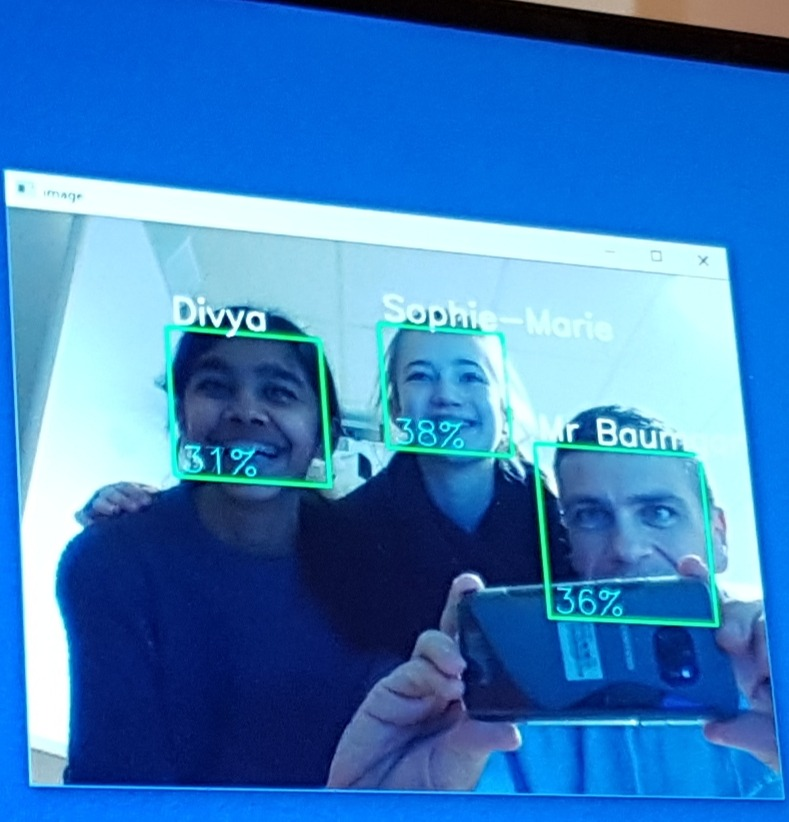

# OpenCV



OpenCV is an open source computer vision and machine learning software library. It is available for several common programming languages, most notably C++, Python and Javascript. The main documentation is available at

* [docs.opencv.org](https://docs.opencv.org/4.0.1/)

You'll quickly come across the term cascades. Cascades are pre-trained functions that programmers can use to detect commonly sought after features such as faces, eyes, ears, full bodies etc.

* [Face detection tutorial](https://docs.opencv.org/4.0.1/d7/d8b/tutorial_py_face_detection.html)

To find a cascade that suits your project, try the following github repo's:

* [https://github.com/opencv/opencv/tree/master/data/haarcascades](https://github.com/opencv/opencv/tree/master/data/haarcascades)
* [https://github.com/opencv/opencv_contrib/tree/master/modules/face/data/cascades](https://github.com/opencv/opencv_contrib/tree/master/modules/face/data/cascades)

## VisionMadeEasy

To help beginner programmers get up and running even quicker, I've created a Python library called **VisionMadeEasy** that is available for install from the Python package repository. Either use PyCharm or pip to install as follows.

```
pip install visionmadeeasy
```

To successfully run the demo, you will also have to...

* Download a cascade file such as `haarcascade_frontalface_default.xml` from [https://github.com/opencv/opencv/tree/master/data/haarcascades](https://github.com/opencv/opencv/tree/master/data/haarcascades) and save it into your project folder
* Create a sub-folder called "datasets" in your project folder. This is where it will store your training photos.
* Make sure you have a web camera attached :-)

The demo code follows:

```python
import visionmadeeasy

def i_see_a_face( location, img ):
    print(f"I see a face!!! It is at {location['x']},{location['y']}")
    return True # must return True to keep the loop alive

def i_recognise_a_face( location, person_name, confidence, img ):
    print(f"Hello {person_name}! I am {confidence}% sure it is you :-)")
    return True # must return True to keep the loop alive

if __name__ == "__main__":
    vme = visionmadeeasy.VisionMadeEasy(0, "dataset")
    quit = False
    while not quit:
        print("Demonstration time! Menu of options...")
        print("1. Detect faces")
        print("2. Record faces")
        print("3. Train for faces recorded")
        print("4. Recognise faces (must do training first)")
        print("5. Exit")
        choice = int(input("Enter your option (1 to 5):"))

        if choice == 1:
            print("[face_vision] Task: Searching for faces.\nLook at the camera! (press ESC to quit)")
            # Demo of detecting faces
            vme.detect_face(i_see_a_face)

        elif choice == 2:
            print("About to save 50 images of different angles etc of a person, saving to folder ./dataset")
            id = int(input("Enter unique person number: "))
            n = input("Enter person name: ")
            print("Smile! :-)")
            # Demo of recording faces
            vme.record_face_dataset(images_to_record=50, interval=1, person_identifier=id, person_name=n)

        elif choice == 3:
            print("[face_vision] Task: Training... please wait...")
            # Demo of training faces
            vme.train_from_faces()

        elif choice == 4:
            print("[face_vision] Task: Searching for faces I recognise.\nLook at the camera! (press ESC to quit)")
            # Demo of recognising faces
            vme.recognise_face(i_recognise_a_face)

        elif choice == 5:
            quit = True

print("Goodbye!")
```

## Automated photo booth

Those who attended the February 2019 middle school disco would be aware I had my laptop running an automated photo booth that was taking photos when it detected at least 3 people standing in front of it. I thought I might share the code for those who are interested.

```python
from PIL import Image
import cv2                      # use opencv-contrib-python rather than opencv-python
import os, sys, time, math
import requests

class Vision():

    def __init__(self, camera_device_id=0, images_folder=".", cascade_file="haarcascade_frontalface_default.xml" ):
        self.camera_device_id=camera_device_id
        self.images_folder = images_folder
        if not os.path.exists(images_folder):
            exit("[SimpleVision] ERROR: images folder not found: "+images_folder)
        self.cascade_file = cascade_file
        if not os.path.exists(cascade_file):
            exit("[SimpleVision] ERROR: cascade file not found: "+cascade_file)
        self.cascade = cv2.CascadeClassifier(cascade_file)
        self.flip = False
        self.camera_width = 1280
        self.camera_height = 720
        self.min_detect_width = 70
        self.min_detect_height = 70
        self.mode = "scanning"
        self.wait_until = 0
        self.countdown_to = 0
        self.last_seen = []

    def set_camera_device(self, camera_device_id):
        """ Set the camera id number (default: 0) """
        self.camera_device_id=camera_device_id

    def set_camera_resolution(self, width, height):
        if isinstance(width, int) and isinstance(height, int) and width > 0 and width <= 4096 and height > 0 and height <= 4096:
            self.camera_width = width
            self.camera_height = height

    def set_flip(self, flip ):
        """ Set to true to vertically flip the image from the camera (usually required for Raspberry Pi) """
        if isinstance(flip, bool):
            self.flip = flip
        else:
            self.flip = False

    ### Internal/private functions

    def __get_camera(self):
        # cv2.namedWindow("preview") # Mac
        cap = cv2.VideoCapture(self.camera_device_id)
        cap.set(3, self.camera_width)
        cap.set(4, self.camera_height)
        return cap

    ### Public functions

    def detect_face(self, callback ):
        cap = self.__get_camera()
        loop = True # loop can be stopped by the callback function
        while loop:
            # Read image from the camera
            ret, img = cap.read()
            assert ret, "Error reading from capture device "+str(self.camera_device_id)
            if self.flip:
                img = cv2.flip(img, -1)
            if self.mode == "scanning" or self.mode=="wait a bit":
                # Convert image to grey scale
                gray = cv2.cvtColor(img, cv2.COLOR_BGR2GRAY)
                # Detect any faces in the image? Put in an array
                faces = self.cascade.detectMultiScale(
                    gray,
                    scaleFactor=1.2,
                    minNeighbors=5,     
                    minSize=(self.min_detect_width, self.min_detect_height)
                )
                # For every face we found
                for (x,y,w,h) in faces:
                    # Draw a rectangle around the face
                    color = (0,255,255) # Yellow
                    if self.mode == "wait a bit":
                        color = (0,0,255) # Red
                    elif len(faces) >= 3:
                        color = (0,255,0) # Green
                    cv2.rectangle(img,(x,y),(x+w,y+h),color,2)
                if self.mode == "wait a bit":
                    if self.wait_until < time.time():
                        self.mode = "scanning"
                elif self.mode == "scanning":
                    if (len(faces) >= 3) and (callback is not None):
                        # I see three faces.
                        self.last_seen.append(int(time.time())) # add timestamp to occassions that 3 faces have been seen
                        for item in self.last_seen:
                            if item < int(time.time()-2.0):
                                self.last_seen.remove(item)
                        # print(self.mode,self.last_seen)
                        # Have I seen 3 faces at least 10 times in the last two seconds?
                        if len(self.last_seen) > 4:
                            self.mode = "photo"
                            self.countdown_to = time.time()+6
            elif self.mode == "photo":
                time_remaining = math.trunc(self.countdown_to-time.time())
                msg = str( time_remaining ) 
                if time_remaining > 0:
                    cv2.putText(img, msg, (450,400), cv2.FONT_HERSHEY_SIMPLEX, 15, (0,255,255), 15)
                elif time_remaining == 0:
                    print(self.mode,"Taking photo!")
                    ret, img = cap.read()
                    if self.flip:
                        img = cv2.flip(img, -1)
                    loop = callback(faces, img)
                    cv2.imshow('video',img)
                    self.mode = "wait a bit"
                    k = cv2.waitKey(30) & 0xff
                    time.sleep(3)
                    self.wait_until = time.time() + 5
            cv2.imshow('video',img)
            # Check for exit key press
            k = cv2.waitKey(30) & 0xff
            if k == 27: # press 'ESC' to quit
                break
        cap.release()
        cv2.destroyAllWindows()
        return img

def convert_cv2_to_pil( cv2_image ):
    import cv2
    from PIL import Image
    cv2_image_rgb = cv2.cvtColor(cv2_image, cv2.COLOR_BGR2RGB)
    pil_image = Image.fromarray(cv2_image_rgb)
    return pil_image

def convert_pil_to_cv2( pil_image ):
    import cv2
    import numpy as np
    from PIL import Image
    cv2_image = cv2.cvtColor(np.array(pil_image), cv2.COLOR_RGB2BGR)
    return cv2_image

def http_upload( url, local_filename ):
    files = {"file": open(local_filename, "rb")}
    r = requests.post(url, files=files)
    print(r)

def save_photo( location, image ):
    photo = convert_cv2_to_pil(image)
    filename = "full_photos/"+str(int(time.time())) + ".jpg"
    photo.save(filename)
    http_upload("http://www.cs.isl.ch:10004/photo/"+str(int(time.time())) + ".jpg", filename)
    return True # must return True to keep the loop alive

if __name__ == "__main__":
    v = Vision(0, "dataset")
    v.set_camera_resolution(1920, 1080)
    v.set_flip(True)
    v.detect_face(save_photo)
    print("Goodbye!")

```