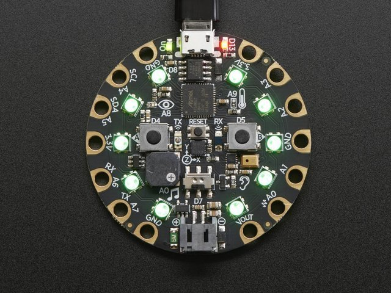

# Circuit Python

The Adafruit Circuit Playground Express is a cool bit of tech that allows you to program a microcontroller with Python.



Some of the features on board:

* 10 x mini NeoPixels, each one can display any color
* 1 x Motion sensor (LIS3DH triple-axis accelerometer with tap detection, free-fall detection)
* 1 x Temperature sensor (thermistor)
* 1 x Light sensor (phototransistor). Can also act as a color sensor and pulse sensor.
* 1 x Sound sensor (MEMS microphone)
* 1 x Mini speaker with class D amplifier (7.5mm magnetic speaker/buzzer)
* 2 x Push buttons, labeled A and B
* 1 x Slide switch
* Infrared receiver and transmitter - can receive and transmit any remote control codes, as well as send messages between Circuit Playground Expresses. Can also act as a proximity sensor.
* 8 x alligator-clip friendly input/output pins
* Includes I2C, UART, 8 pins that can do analog inputs, multiple PWM output
* 7 pads can act as capacitive touch inputs and the 1 remaining is a true analog output
* Green “ON” LED so you know its powered
* Red board.D13 LED for basic blinking
* Reset button
* ATSAMD21 ARM Cortex M0 Processor, running at 3.3V and 48MHz
* 2 MB of SPI Flash storage, used to store code and libraries.
* MicroUSB port for programming and debugging
* USB port can act like serial port, keyboard, mouse, joystick or MIDI!

## Adafruit links

* [Adafruit learning guide](https://learn.adafruit.com/adafruit-circuit-playground-express/overview)
* Check the [pin out diagram here](https://learn.adafruit.com/adafruit-circuit-playground-express/pinouts). (links to  Adafruit)
* [Makecode (blocks programming)](https://makecode.adafruit.com/)

## Getting started

* If you have a Mac, please [update the bootloader](https://learn.adafruit.com/adafruit-circuit-playground-express/updating-the-bootloader) on your board before going any further.
* For a new board, [update the version of Circuit Python here](https://circuitpython.org/board/circuitplayground_express/)
* Write your Python and then save directly to the "disk" that should be mounted on your computer as `code.py`. The board will automatically reset and being execution.

## Reference for the various i/o

This document was created as I couldn't find a simple all-in-one document that provides a reference for all the various sensors and ports on board.

I don't take the credit for these samples. Most are verbatium or heavily based on Adafruit's own examples, it's just for some reason their documents are spread over three different locations and I was getting frustrated at tracking everything down so I brought them all together into one place for ease of reference purposes. I hope to add my own examples and further notes to this page as my use of the board grows.

Sources:

* [Avafruit CircuitPython playground](https://learn.adafruit.com/adafruit-circuit-playground-express/circuitpython-playground)
* [Adafruit CircuitPython made easy](https://learn.adafruit.com/circuitpython-made-easy-on-circuit-playground-express/)
* [Adafruit Github repo with examples](https://github.com/adafruit/Adafruit_CircuitPython_CircuitPlayground)

### Onboard Neopixels

```python
import time
import board
import neopixel

# On CircuitPlayground Express, and boards with built in status NeoPixel use board.NEOPIXEL
# Otherwise choose an open pin connected to the Data In of the NeoPixel strip, i.e. board.D1
# pixel_order could be .RGB, .GBR, .RGBW, .GBRW - you need to know your neopixels.
pixel_pin = board.NEOPIXEL
num_pixels = 10

pixels = neopixel.NeoPixel(
    pixel_pin, num_pixels, brightness=0.2, auto_write=False, pixel_order=neopixel.GRB
)

featured_pixel = 0
while True:
    pixels.fill((255, 0, 0))    # Set all pixels red
    pixels[featured_pixel] = (255,255,255)       # Set featured pixel white
    pixels.show()
    time.sleep(1)
    featured_pixel = ( featured_pixel + 1 ) % num_pixels
```

### Motion sensor

* Tap

```python
"""This example prints to the serial console when the board is double-tapped."""
import time
from adafruit_circuitplayground import cp

# Change to 1 for single-tap detection.
cp.detect_taps = 2

while True:
    if cp.tapped:
        print("Tapped!")
    time.sleep(0.05)
```

* Shake

```python
"""This example prints to the serial console when the Circuit Playground is shaken."""
from adafruit_circuitplayground import cp

while True:
    if cp.shake():
        print("Shake detected!")
```

* Accelerometer

```python
"""
This example uses the accelerometer on the Circuit Playground. It prints the values. Try moving
the board to see the values change. If you're using Mu, open the plotter to see the values plotted.
"""
import time
from adafruit_circuitplayground import cp

while True:
    x, y, z = cp.acceleration
    print((x, y, z))

    time.sleep(0.1)
```

### Temperature sensor

```python
import time
import board
import adafruit_thermistor

# these values work with the Adafruit CircuitPlayground Express.
# they may work with other thermistors as well, as they're fairly standard,
# though the pin will likely need to change (ie board.A1)
# pylint: disable=no-member
pin = board.TEMPERATURE
resistor = 10000
resistance = 10000
nominal_temp = 25
b_coefficient = 3950

thermistor = adafruit_thermistor.Thermistor(
    pin, resistor, resistance, nominal_temp, b_coefficient
)

# print the temperature in C and F to the serial console every second
while True:
    celsius = thermistor.temperature
    print((celsius,))
    time.sleep(1)
```

### Light sensor

```python
"""This example uses the light sensor on your Circuit Playground, located next to the picture of
the eye. Try shining a flashlight on your Circuit Playground, or covering the light sensor with
your finger to see the values increase and decrease."""
import time
from adafruit_circuitplayground import cp

while True:
    print("Light:", cp.light)
    time.sleep(0.2)
```

### Sound sensor/microphone

This is apparently a lot simplier if you get the Bluefruit (I haven't been able to get my hands on one yet)

```python
"""This example uses the sound sensor, located next to the picture of the ear on your board, to
light up the NeoPixels as a sound meter. Try talking to your Circuit Playground or clapping, etc,
to see the NeoPixels light up!"""
import array
import math
import board
import audiobusio
from adafruit_circuitplayground import cp

def constrain(value, floor, ceiling):
    return max(floor, min(value, ceiling))

def log_scale(input_value, input_min, input_max, output_min, output_max):
    normalized_input_value = (input_value - input_min) / (input_max - input_min)
    return output_min + math.pow(normalized_input_value, 0.630957) * (
        output_max - output_min
    )

def normalized_rms(values):
    minbuf = int(sum(values) / len(values))
    return math.sqrt(
        sum(float(sample - minbuf) * (sample - minbuf) for sample in values)
        / len(values)
    )

mic = audiobusio.PDMIn(
    board.MICROPHONE_CLOCK, board.MICROPHONE_DATA, sample_rate=16000, bit_depth=16
)

samples = array.array("H", [0] * 160)
mic.record(samples, len(samples))
input_floor = normalized_rms(samples) + 10

# Lower number means more sensitive - more LEDs will light up with less sound.
sensitivity = 300
input_ceiling = input_floor + sensitivity

peak = 0
while True:
    mic.record(samples, len(samples))
    magnitude = normalized_rms(samples)
    print((magnitude,))

    c = log_scale(
        constrain(magnitude, input_floor, input_ceiling),
        input_floor,
        input_ceiling,
        0,
        10,
    )

    cp.pixels.fill((0, 0, 0))
    for i in range(10):
        if i < c:
            cp.pixels[i] = (i * (255 // 10), 50, 0)
        if c >= peak:
            peak = min(c, 10 - 1)
        elif peak > 0:
            peak = peak - 1
        if peak > 0:
            cp.pixels[int(peak)] = (80, 0, 255)
    cp.pixels.show()
```

### Speaker

* Play tone for fixed duration

```python
"""This example plays two tones for 1 second each. Note that the tones are not in a loop - this is
to prevent them from playing indefinitely!"""
from adafruit_circuitplayground import cp

cp.play_tone(262, 1)
cp.play_tone(294, 1)
```

* Start and stop tones

```python
"""This example plays a different tone for each button, while the button is pressed."""
from adafruit_circuitplayground import cp

while True:
    if cp.button_a:
        cp.start_tone(262)
    elif cp.button_b:
        cp.start_tone(294)
    else:
        cp.stop_tone()
```

* Play a WAV file

```python
"""THIS EXAMPLE REQUIRES A WAV FILE FROM THE examples FOLDER IN THE
Adafruit_CircuitPython_CircuitPlayground REPO found at:
https://github.com/adafruit/Adafruit_CircuitPython_CircuitPlayground/tree/master/examples

Copy the "dip.wav" file to your CIRCUITPY drive.

Once the file is copied, this example plays a wav file!"""
from adafruit_circuitplayground import cp

cp.play_file("dip.wav")
```

### Push buttons

```python
from adafruit_circuitplayground import cp
import time

while True:
    if cp.button_a:
        print("Button A pressed!")
        cp.red_led = True
    if cp.button_b:
        print("Button B pressed!")
        cp.red_led = False
    sleep(0.1)
```

### Slide switch

```python
"""This example prints the status of the slide switch. Try moving the switch back and forth to see
what's printed to the serial console!"""
import time
from adafruit_circuitplayground import cp

while True:
    print("Slide switch:", cp.switch)
    time.sleep(0.1)
```

### IR transmitter & receive

* Transmitter

```python
"""THIS EXAMPLE REQUIRES A SEPARATE LIBRARY BE LOADED ONTO YOUR CIRCUITPY DRIVE.
This example requires the adafruit_irremote.mpy library.

THIS EXAMPLE WORKS WITH CIRCUIT PLAYGROUND EXPRESS ONLY.

This example uses the IR transmitter found near the center of the board. Works with another Circuit
Playground Express running the circuitplayground_ir_receive.py example. Press the buttons to light
up the NeoPixels on the RECEIVING Circuit Playground Express!"""
import time
import pulseio
import board
import adafruit_irremote
from adafruit_circuitplayground import cp

# Create a 'pulseio' output, to send infrared signals from the IR transmitter
try:
    pwm = pulseio.PWMOut(board.IR_TX, frequency=38000, duty_cycle=2 ** 15)
except AttributeError:
    raise NotImplementedError(
        "This example does not work with Circuit Playground Bluefruit!"
    )
pulseout = pulseio.PulseOut(pwm)  # pylint: disable=no-member
# Create an encoder that will take numbers and turn them into NEC IR pulses
encoder = adafruit_irremote.GenericTransmit(
    header=[9500, 4500], one=[550, 550], zero=[550, 1700], trail=0
)

while True:
    if cp.button_a:
        print("Button A pressed! \n")
        cp.red_led = True
        encoder.transmit(pulseout, [66, 84, 78, 65])
        cp.red_led = False
        # wait so the receiver can get the full message
        time.sleep(0.2)
    if cp.button_b:
        print("Button B pressed! \n")
        cp.red_led = True
        encoder.transmit(pulseout, [66, 84, 78, 64])
        cp.red_led = False
        time.sleep(0.2)
```

* Receiver

```python
"""THIS EXAMPLE REQUIRES A SEPARATE LIBRARY BE LOADED ONTO YOUR CIRCUITPY DRIVE.
This example requires the adafruit_irremote.mpy library.

THIS EXAMPLE WORKS WITH CIRCUIT PLAYGROUND EXPRESS ONLY.

This example uses the IR receiver found near the center of the board. Works with another Circuit
Playground Express running the circuitplayground_ir_transmit.py example. The NeoPixels will light
up when the buttons on the TRANSMITTING Circuit Playground Express are pressed!"""
import pulseio
import board
import adafruit_irremote
from adafruit_circuitplayground import cp

# Create a 'pulseio' input, to listen to infrared signals on the IR receiver
try:
    pulsein = pulseio.PulseIn(board.IR_RX, maxlen=120, idle_state=True)
except AttributeError:
    raise NotImplementedError(
        "This example does not work with Circuit Playground Bluefruti!"
    )
# Create a decoder that will take pulses and turn them into numbers
decoder = adafruit_irremote.GenericDecode()

while True:
    cp.red_led = True
    pulses = decoder.read_pulses(pulsein)
    try:
        # Attempt to convert received pulses into numbers
        received_code = decoder.decode_bits(pulses)
    except adafruit_irremote.IRNECRepeatException:
        # We got an unusual short code, probably a 'repeat' signal
        continue
    except adafruit_irremote.IRDecodeException:
        # Something got distorted
        continue

    print("Infrared code received: ", received_code)
    if received_code == [66, 84, 78, 65]:
        print("Button A signal")
        cp.pixels.fill((100, 0, 155))
    if received_code == [66, 84, 78, 64]:
        print("Button B Signal")
        cp.pixels.fill((210, 45, 0))
```

### I/O pins

* Digital I/O

```python
# Circuit Playground digitalio example

import time
import board
import digitalio

led = digitalio.DigitalInOut(board.D13)
led.switch_to_output()

button = digitalio.DigitalInOut(board.BUTTON_A)
button.switch_to_input(pull=digitalio.Pull.DOWN)

while True:
    if button.value:  # button is pushed
        led.value = True
    else:
        led.value = False

    time.sleep(0.01)
```

* Analog in

```python
# Circuit Playground AnalogIn
# Reads the analog voltage level from a 10k potentiometer connected to GND, 3.3V, and pin A1
# and prints the results to the serial console.

import time
import board
import analogio

analogin = analogio.AnalogIn(board.A1)


def getVoltage(pin):  # helper
    return (pin.value * 3.3) / 65536


while True:
    print("Analog Voltage: %f" % getVoltage(analogin))
    time.sleep(0.1)
```

* Analog out

Note: Port A0 is the only DAC capable pin

```python
# CircuitPython IO demo - analog output
import board
from analogio import AnalogOut

analog_out = AnalogOut(board.A0)

while True:
    # Count up from 0 to 65535, with 64 increment
    # which ends up corresponding to the DAC's 10-bit range
    for i in range(0, 65535, 64):
        analog_out.value = i
```

* Capacitive touch

```python
"""This example prints to the serial console when you touch capacitive touch pad A1."""
from adafruit_circuitplayground import cp

while True:
    if cp.touch_A1:
        print("Touched pad A1")
```

* PWM

Your board has pulseio support, which means you can PWM LEDs, control servos, beep piezos, and manage "pulse train" type devices like DHT22 and Infrared.

Nearly every pin has PWM support! For example, all ATSAMD21 board have an A0 pin which is 'true' analog out and does not have PWM support.

```python
import time
import board
import pulseio

led = pulseio.PWMOut(board.D13, frequency=5000, duty_cycle=0)

while True:
    for i in range(100):
        # PWM LED up and down
        if i < 50:
            led.duty_cycle = int(i * 2 * 65535 / 100)  # Up
        else:
            led.duty_cycle = 65535 - int((i - 50) * 2 * 65535 / 100)  # Down
        time.sleep(0.01)
```

* Servo control

Servos require 5V. Do not use 3.3V for powering a servo!

An alternative to raw pulseio at 50hz is to use the Adafruit motor library.

Servos will only work on PWM-capable pins! Check your board details to verify which pins have PWM outputs.

For Circuit Playground Express and Circuit Playground Bluefruit, use jumper wire alligator clips to connect the ground wire to GND, the power wire to VOUT, and the signal wire to a PWM pin, such as A2 in this example.

```python
import time
import board
import pulseio
from adafruit_motor import servo

# create a PWMOut object on Pin A2.
pwm = pulseio.PWMOut(board.A2, duty_cycle=2 ** 15, frequency=50)

# Create a servo object, my_servo.
my_servo = servo.Servo(pwm)

while True:
    for angle in range(0, 180, 5):  # 0 - 180 degrees, 5 degrees at a time.
        my_servo.angle = angle
        time.sleep(0.05)
    for angle in range(180, 0, -5): # 180 - 0 degrees, 5 degrees at a time.
        my_servo.angle = angle
        time.sleep(0.05)
```

### Serial communication over USB

* Source: https://stackoverflow.com/a/61739338

On the Express board:

```python
import supervisor

while True:
    if supervisor.runtime.serial_bytes_available:
        value = input().strip()
        print(f"I am the Circuit Express. You sent me: {value}\r") 
```

To find your correct serial address on Mac, run the following terminal command with the device unplugged and then plugged in: `ls /dev/tty.*`.

To find the correct serial (COM) on Windows, use Device Manager (check instructions [here](https://learn.adafruit.com/adafruit-feather-m4-express-atsamd51/advanced-serial-console-on-windows) if unsure).

Code on the PC/Mac:

```python
import time
import serial
ser = serial.Serial('COM6', 115200)  # open serial port

function send( ser, msg ):
    command = bytes(msg+'\n\r', 'ascii')
    ser.write(command)     # write a string
    for _ in range(len(command)):
        a = ser.read() # Read the loopback chars and ignore

function receive(ser):
    reply = b''
    while True:
        a = ser.read()
        if a== b'\r':
            break
        else:
            reply += a
        time.sleep(0.01)
    return reply.decode('ascii')

send(ser, 'testing')
reply = receive(ser)
print(f"Reply was: {reply}")

ser.close()
```

Console output of the above

```
Sending Command: [b'hello\n\r']
Reply was: [b'Received: hello']
```

### I2C & UART

* [CircuitPython UART Serial](https://learn.adafruit.com/adafruit-circuit-playground-express/circuitpython-uart-serial)
* [CircuitPython I2C](https://learn.adafruit.com/adafruit-circuit-playground-express/circuitpython-i2c)

### HID support

Circuit Playground Express can act like a keyboard device and press keys, or a mouse and have it move the mouse around and press buttons.

You'll need to copy the adafruit_hid module from the library bundle which include Keyboard, Keycode and Mouse support

```python
# Circuit Playground HID Keyboard

import time

import board
import usb_hid
from adafruit_hid.keyboard import Keyboard
from adafruit_hid.keyboard_layout_us import KeyboardLayoutUS
from adafruit_hid.keycode import Keycode
from digitalio import DigitalInOut, Direction, Pull

# A simple neat keyboard demo in CircuitPython

# The button pins we'll use, each will have an internal pulldown
buttonpins = [board.BUTTON_A, board.BUTTON_B]
# our array of button objects
buttons = []
# The keycode sent for each button, will be paired with a control key
buttonkeys = [Keycode.A, "Hello World!\n"]
controlkey = Keycode.SHIFT

# the keyboard object!
# sleep for a bit to avoid a race condition on some systems
time.sleep(1)
kbd = Keyboard(usb_hid.devices)
# we're americans :)
layout = KeyboardLayoutUS(kbd)

# make all pin objects, make them inputs with pulldowns
for pin in buttonpins:
    button = DigitalInOut(pin)
    button.direction = Direction.INPUT
    button.pull = Pull.DOWN
    buttons.append(button)

led = DigitalInOut(board.D13)
led.direction = Direction.OUTPUT

print("Waiting for button presses")

while True:
    # check each button
    # when pressed, the LED will light up,
    # when released, the keycode or string will be sent
    # this prevents rapid-fire repeats!
    for button in buttons:
        if button.value:  # pressed?
            i = buttons.index(button)
            print("Button #%d Pressed" % i)

            # turn on the LED
            led.value = True

            while button.value:
                pass  # wait for it to be released!
            # type the keycode or string
            k = buttonkeys[i]  # get the corresponding keycode or string
            if isinstance(k, str):
                layout.write(k)
            else:
                kbd.press(controlkey, k)  # press...
                kbd.release_all()  # release!

            # turn off the LED
            led.value = False

    time.sleep(0.01)
```
