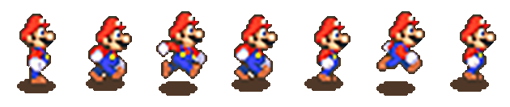

# Pygame

Welcome to an introduction to using Pygame within the Python programming language.

The focus of this will be on making some simple computer games through the use of a graphical library known as Pygame. To proceed with this section, you will need Python running on your own computer with a proper editing program such as Jetbrains Pycharm. 
Fortunately, Jetbrains make a community edition version of the product the release for free.

* Get Pycharm here: [https://www.jetbrains.com/pycharm/](https://www.jetbrains.com/pycharm/)
* Install PyCharms if you don't already have it on your computer (my students should have it installed automatically by IT)
* Start Pycharms and create a new project (I recommend creating a new folder for all your Python programs)
* Install the Pygame library following the instructions I provide in class. I won't include it in this handbook as the instructions might change when Pycharm updates, and are also slightly different for Windows vs Macs.

# Coordinate system

Pygame is a graphics system for Python. The screen is divided into pixels. You use sets of pixel coordinates to tell Python where to draw shapes, place text or images etc.

Pygame coordinates start with the top-left of the screen being (x=0,y=0).

The x-axis increases as you move to the right.

The y-axis increases as you move down – this is different to the way you do it in Maths so be aware of that!


---

# Hello Pygame!

All Pygames in my tutorials are built from this basic template. Please divide your games into these sections to make it easier to build and for me to assist you with any problems.

```python
import pygame, time, random
from pygame.locals import *
from pygamemadeeasy import *

pygame.init()
window = pygame.display.set_mode((500,500))     # set screen width,height
fps = pygame.time.Clock()

#********** Declare colors, images, sounds, fonts, variables **********
BLACK = (0,0,0)
quit = False
""" insert your code here """

#********** Main game loop starts **********
while not quit:
    window.fill(colors.black)           # Reset the screen to black background
    #********** Process events **********
    for event in pygame.event.get():
        print(event)
        if event.type == QUIT:
            quit = True
        elif event.type == KEYDOWN:
            if event.key == K_ESCAPE:
                quit = True
            """ insert your code here """

    #********** Perform calculations **********
    """ insert your code here """

    #********** Draw graphics **********
    """ insert your code here """

    #********** Update screen **********
    pygame.display.update()         # Actually does the screen update
    fps.tick(25)                    # Run the game at 25 frames per second

#********** Game over **********
pygame.quit()
```

The comments in the above program are important. They are recommendations on where you want to place the code for each part of your game. It's a good idea to follow the above as your "master template". Copy and paste it as the starting point each time you want to begin a new Pygame project.

To briefly explain a few commands:

* The `import` lines at the top are telling Python to load other code saved elsewhere (in this case the code that makes pygame exist)
* `pygame.display.set_mode((500,500))` is setting the width and height of your game window.
* `window` is a variable that we use to draw things onto the screen
* Pygame will only actually draw onto your screen when it hits the `pygaame.display.update()` command.
* `window.fill(BLACK)` will erase everything on screen and fill the screen with the specified color, in this case black.
* `fps.tick(25)` is saying we want the game to run at 25 frames per second

---

# Drawing basic shapes

The following are the basic commands for drawing simple geometric shapes.

```python
# Rule for a line
pygame.draw.line( window, color, ( x1, y1 ), ( x2, y2 ), thickness )
# Example
pygame.draw.line( window, colors.blue, (50, 60), (50, 160), 10)

# Rule for a rectangle
pygame.draw.rect( window, color, ( x, y, width, height ), thickness )
# Example
pygame.draw.rect( window, colors.green, (52, 160, 120, 40) )

# Rule for a circle
pygame.draw.circle( window, color, ( x, y ), radius, thickness )
# Example
pygame.draw.circle( window, colors.white, (110, 110), 40, 10)

# Rule for an ellipse (oval)
pygame.draw.ellipse( window, colour, ( x, y, width, height ), thickness )
# Example
pygame.draw.ellipse( window, colors.fuchsia, (220, 100, 80, 40) )

# Rule for a multipoint polygone
pygame.draw.polygon( window, colour, ( (x1,y1), (x2,y2), (x3,y3), etc ) , thickness)
# Example
pygame.draw.polygon( window, colors.red, ((20,20), (52,60), (172,60), (200,20)), 5)
```

(If thickness is left out, the shape will be filled in)

Coordinates are always provided as a set of (X,Y) values including their own set of  parenthesis. That's why when you look at the sample for pygame.draw.line below you can see that the from-coordinate is (50,60) and the to-coordinate is (50,160).

To have a go drawing some basic shapes:

* Start with a copy of the basic master template from the previous page.
* Add the following code AFTER the `line BLACK = (0,0,0)`

```python
BLUE = (0,0,255)
GREEN = (0,255,0)
WHITE = (255,255,255)
RED = (255,0,0)
YELLOW = (255,255,0)
PINK = (0xFF, 0x65, 0xFF)
```

* Add the following code AFTER the `window.fill(BLACK)` and BEFORE the `pygame.display.update()`

```python
pygame.draw.line(window, BLUE, (50, 60), (50, 160), 10)
pygame.draw.rect(window, GREEN, (52, 160, 120, 40) )
pygame.draw.circle(window, WHITE, (110, 110), 40, 10)
pygame.draw.rect(window, YELLOW, (220, 100, 80, 40) )
pygame.draw.ellipse(window, PINK, (220, 100, 80, 40) )
pygame.draw.polygon(window, RED, ((20,20), (52,60), (172,60), (200,20)), 5)
```

## Exercise

Can you draw a simple landscape scene? Perhaps a house with a triangle shaped roof, or a stick person?

---

# Using colour

Colours are created using a 3 number variable, COLORNAME = (red, green, blue), where each colour value is between 0 and 255.

```python
BLACK = (0, 0, 0)
WHITE = (255, 255, 255)
RED   = (227, 27, 27)
GREEN = (0, 255, 0)
BLUE  = (0, 0, 255)
```

Colours can also be written using hexadecimal numbers. This is handy as frequently colour charts will give you a colour in that form.

For instance, the colour PINK might be `#ff99cc`. To use that as a Python colour variable, you would write it as:

```python
PINK = (0xFF, 0x99, 0xCC)
```

To get a colour at a given pixel

```python
pixel_colour = window.get_at(( x , y ))
```

A good online resource for picking colours is [https://htmlcolorcodes.com](https://htmlcolorcodes.com/)

---

# Displaying text

There are two steps to displaying text within a Pygame Python program:

* Create the font variable
* Convert the text to an image that is then drawn on the screen

The following walks you through the two steps with the program we have been creating over the last few pages.

1. Create the font variable. Create a font variable before your game loop. Typically I would add it just after all the colours are defined.

```python
ARIAL = pygame.font.SysFont("Arial", 60)
```

2. Convert the text to an image and draw it to screen. Inside your loop, before the `pygame.display.update()`, add two lines to render your text to a bitmap, and then blit that bitmap to the screen window.

```python
label = ARIAL.render("Hello Python!", 1, (255,255,255))
window.blit(label, (300, 50))
```

The (300,50) in the `window.blit` command is the coordinates of where to draw the text.
The output should look like:


## Common mistake: Trying to display numbers

Rendering text is not as friendly as the old `print()` command you are used to. Everything must be a string. So, for example, if you have an integer variable called `score` that you want to be displaying on screen, remember to convert it to a string first using `str(score)`.

---

# Keyboard events

We have already been using the Pygame event handler without really looking too much at it. It is the `for event in pygame.event.get()`. Just like items in a list, the `for` loop will run through all the events that have occurred since the last time the program checked through them. This is how the program detects and processes keyboard and mouse events.

Let's start by looking at the keyboard.

All keyboard events have an `event.type == KEYDOWN` or `event.type == KEYUP`, which correspond to the time the key is first pressed, and the time it is released. Once we know it is a keyboard event, we can then check to see the contents of `event.key` which will tell Python which key was involved.

For a full list of the event.key codes, see https://www.pygame.org/docs/ref/key.html. 

The ones we are going to be concerned with primarily are: `K_ESCAPE, K_RETURN, K_SPACE, K_UP, K_DOWN, K_LEFT, and K_RIGHT`.

## Demo exercise 1: Space bar

Get your template code and add to it as shown in the demo code.

The following demonstration will highlight whether or not the user is pressing the space bar.

* Save a copy of the previous program from Displaying Text as a new file.
* Create a new variable in the section before the while loop

```python
import pygame, time, random
from pygame.locals import *

pygame.init()
window = pygame.display.set_mode((500,500))
fps = pygame.time.Clock()

# Declare colors, images, sounds, fonts, variables
BLACK = (0,0,0)
quit = False
spaceBar = False

# Main game loop
while not quit:

    # Process events
    for event in pygame.event.get():
        print(event)
        if event.type == QUIT:
            quit = True
        elif event.type == KEYDOWN:
            if event.key == K_ESCAPE:
                quit = True
            if event.key == K_SPACE:
                spaceBar = True
        elif event.type == KEYUP:
            if event.key == K_SPACE:
                spaceBar = False

    # Perform calculations

    # Draw graphics
    window.fill(BLACK)
    if spaceBar:
        msg = ARIAL60.render("Space bar", 1, GREEN)
    else:
        msg = ARIAL60.render("Space bar", 1, RED)
    window.blit(msg, (300,150))
    pygame.display.update() # Actually does the screen update
    fps.tick(25) # Run the game at 25 frames per second

# Loop over, game over
pygame.quit()
```

---

## Demo exercise 2: Arrow keys

Let's move onto something more useful for a game. This demo will use the arrow keys to move an object on the screen. While the arrow key is pressed, the object will move; once the key(s) are released, the movement will stop.

```python
import pygame, time, random
from pygame.locals import *

pygame.init()
window = pygame.display.set_mode((500,500))
fps = pygame.time.Clock()

# Declare colors, images, sounds, fonts, variables
BLACK = (0,0,0)
PINK = (0xFF, 0x99, 0xCC)
x = 400
y = 300
movex = 0
movey = 0
quit = False
spaceBar = False

# Main game loop
while not quit:

    # Process events
    for event in pygame.event.get():
        print(event)
        if event.type == QUIT:
            quit = True
        elif event.type == KEYDOWN:
            if event.key == K_ESCAPE:
                quit = True
            if event.key == K_UP:
                movey = -20
            if event.key == K_DOWN:
                movey = 20
            if event.key == K_LEFT:
                movex = -20
            if event.key == K_RIGHT:
                movex = 20
        elif event.type == KEYUP:
            if event.key == K_UP or event.key == K_DOWN:
                movey = 0
            if event.key == K_LEFT or event.key == K_RIGHT:
                movex = 0

    # Perform calculations

    # Draw graphics
    window.fill(BLACK)
    x = x + movex
    y = y + movey
    pygame.draw.circle(window, PINK, (x,y), 40, 0)
    pygame.display.update() # Actually does the screen update
    fps.tick(25) # Run the game at 25 frames per second

# Loop over, game over
pygame.quit()
```

---

# Mouse events

Mouse events work very similar to keyboard events. They are stored in the same queue to be processed by the `for` event in `pygame.events.get()` loop.

There are three types of events we can check for:

* event.type == MOUSEMOTION
* event.type == MOUSEBUTTONDOWN
* event.type == MOUSEBUTTONUP

In all three cases, there will be an `event.pos` value that will indicate the `(x,y)` location of the mouse pointer when the event occurred. To illustrate the use of mousemotion, lets make a very simple pong game where the paddle will be controlled by the mouse. The sections relevant to the mouse motion event will be highlighted with comments.

## Evercise: Really basic "pong" using mousemotion

```python
import pygame, time, random
from pygame.locals import *
pygame.init()
window = pygame.display.set_mode((500,500))
fps = pygame.time.Clock()

# Declare colors, fonts, images, variables etc
BLACK = (0,0,0)
WHITE = (255,255,255)
ball_x = 250                            # Starting position of the ball
ball_y = 250
ball_move_x = random.randint(5,10)      # Set a random horizontal speed
ball_move_y = random.randint(5,10)      # Set a random vertical speed
paddle_x = 220                          # Starting position of the paddle
paddle_y = 470
quit = False

# Main game loop
while not quit:
    # Process events
    for event in pygame.event.get():
        if event.type == QUIT:
            quit = True
        elif event.type == MOUSEMOTION:             ## The mouse has moved
            paddle_x = event.pos[0]                 ## We only need the x coordinate of the mouse position

    # Perform calculations
    ball_x = ball_x + ball_move_x
    ball_y = ball_y + ball_move_y

    ball_hit_zone = Rect(ball_x-10, ball_y-10,20,20)
    paddle = Rect(paddle_x, paddle_y, 60, 20)

    if paddle.colliderect(ball_hit_zone):
        ball_move_y = -abs(ball_move_y)
    if ball_x < 0 or ball_x > 500:
        ball_move_x = -ball_move_x
    if ball_y < 0:
        ball_move_y = -ball_move_y
    if ball_y > 500:
        quit = True
        print("You lost! Game over!")

    # Draw graphics
    window.fill(BLACK)
    pygame.draw.ellipse(window, WHITE, ball_hit_zone, 10)
    pygame.draw.rect(window, WHITE, paddle)
    pygame.display.update()
    fps.tick(25)
pygame.quit()
```

---

# Playing a sound

Like images, this will assume all your sound files are in your project folder. You can only have one track of "background" music playing at a time. You can, however, have multiple sound effects at once. 

## Background music

Playing a background song is dead easy... one command to load it, one command to play. Don’t put this in your loop! It should go where colours are declared etc.

```python
pygame.mixer.music.load('background.mp3')
pygame.mixer.music.play(-1) 		# 0 = play once, -1 = loop
```

**It really is important that your pygame.mixer.music.load is not in your game loop. Every time you run it you are reloading the file into memory, slowing your sstem down!**

## Sound effects

Make sure you only load the sound effect once. You can use it multiple times, but it will chew up your system memory very quickly if you put the load inside your game loop!

Where you declare your colours etc...

```python
BOUNCE_SOUND = pygame.mixer.Sound('sound-effect.wav'))
```

When you want the sound to play

```python
BOUNCE_SOUND.play()
```

* Sound effects have to be WAV files.

---

# Using Images in Pygame

## Draw an image

Drawing an image file (jpeg or png) is really easy! Only two lines of code needed. The following assumes your image files are located in your PyCharms project folder.

Load the image to a variable. Do this only once, typically where you declare your colours, fonts etc. **It is important that your pygame.image.load is not in your game loop. Every time you run it you are reloading the file into memory, slowing your system down!**

```python
IMAGE = pygame.image.load("image.jpg").convert_alpha()
```

To draw the full image onto the screen, use the `blit()` command. The coordinates are the top-left corner of the image on your screen. Do this where you would have used `pygame.draaw.rect` or similar.

```pythoon
window.blit(IMAGE, (x, y))
```

## Resize an image

To resize an image before drawing it onto the screen.

```python
picture = pygame.image.load(filename)
picture = pygame.transform.scale(picture, (newWidth, newHeight))
```

## Rotate an image

* Will rotate counter-clockwise. Use a negative number to rotate clockwise.
* Unless rotating by 90 degree increments, the image will be padded larger to hold the new size. If the image has pixel alphas, the padded area will be transparent. Otherwise pygame will pick a color that matches the Surface colorkey or the topleft pixel value.

```python
originalPicture = pygame.image.load(filename)
rotatedPicture = pygame.transform.rotate(originalPicture, 90)
```

## Get a colour at a given pixel

```python
pixel_colour = window.get_at(( x , y ))
```

## Draw part of an image

To only render part of an image onto the screen, you can supply the coordinates of the rectangle within the image you want to use.


```python
window.blit(IMAGE, (window-x, window-y), (image-x, image-y, image-width, image-height))
```

Where

* window-x, window-y: the coordinates where you want the partial image located on the screen
* image-x, image-y: within the image file, this is the top left of the part of the image to include
* image-width, image-height: the number of pixels wide and high to include

## Animated sprites or sprite maps

A sprite map is where one image has several icons drawn on it. The idea is you rotate through the icons to give the appearance of animation.

Sprite maps are easy to find online, or create your own using a site such as [piskelapp.com/](https://www.piskelapp.com/)

To simplify the process, use my pygamemadeeasy package:

```
pip install pygamemadeeasy
```

Required import statement

```python
from pygamemadeeasy import *
```

Then to create the sprite animation object

```python
animation = SpriteAnimation("animation.png", 32, 24) # each frame is 32 x 24
```

Use `object.next_frame()` to return the next frame as an image that is ready to blit. Each time you call the function it will increment to the next frame, and then sequence back to the start of the set.

```python
window.blit(animation.next_frame(), (x, y))
```

## Walking mario example

The following exercise creates a simple Mario walking scene where his "walk" is animated through a series of cells for the left and right walking as shown



You will need to download the following files:

* [mario-stationary.png](img/pygame-mario-stationary.png)
* [mario-left-animation.png](img/pygame-mario-left-animation.png)
* [mario-right-animation.png](img/pygame-mario-right-animation.png)
* [mario-background-768p.png](img/pygame-mario-background-768p.png)

The sprite animation runs from functionality in the `pygamemadeeasy` library. Ensure you have it installed and import as follows

```python
from pygamemadeeasy import *
```

Creating an animation then involves creating an animation object such as below. In this case, the `90, 133` indicates the height and width of the individual frames within the image file. The `SpriteAnimation()` object has been designed to work on PNG files exported from Piskelapp where columns has been set to `1`.

```python
mario_left_animation    = SpriteAnimation("media/mario-left-animation.png", 90, 133)
```

To then obtain the image data to blit onto screen, use the `.next_frame()` function which will automatically iterate through the set of sprite frames each time it is called.

```python
window.blit(mario_right_animation.next_frame(), (player_x, player_y))
```

THe full code for the demo is:

```python
import pygame, time, random
from pygame.locals import *
from pygamemadeeasy import *
from spritemap import load_sprite_map

### FUNCTIONS ####

def jump(frame_number):
    """
    Calculate gravity effect for jumping
    Returns change in y-axis for x-frames. Jumps to a height of 200 pixels and lands again over a total of 100 frames
    (~20 frames/sec = 5 second process)
    Who ever said quadratics and physics weren't useful!?
    """
    frame_number = float(frame_number)              # convert integer to float for calculation purposes
    delta_y = -(2.0/25.0)*(frame_number**2) + 8.0*frame_number
    return int(delta_y)                             # turn the decimal float back to an integer to represent change of pixels

### START GAME CODE ###
pygame.init()
window = pygame.display.set_mode((1000,760))
fps = pygame.time.Clock()

# Declare colors, fonts, images
background_image        = pygame.image.load("media/mario-background-768p.png").convert_alpha()
mario_left_animation    = SpriteAnimation("media/mario-left-animation.png", 90, 133)
mario_right_animation   = SpriteAnimation("media/mario-right-animation.png", 90, 133)
mario_stationary_image  = pygame.image.load("media/mario-stationary.png").convert_alpha()
arial_60                = pygame.font.SysFont("Arial", 60)

# Variables
player_x = 30                                       # x-value of player
player_y = 400                                      # y-value of player
quit = False                                        # game still playing while this is True
score = 0                                           # starting score
floor = 555                                         # y-value of the floor
gravity = 25                                         # Gravity speed
falling = True                                      # are we falling??
jumping = False                                     # are we jumping?
jumping_frames = 0                                  # number of frames we have been jumping
delta_x = 0
sprite_num = 0
sprite_scene =0
# Main game loop
while not quit:
    # Process events
    for event in pygame.event.get():
        if event.type == QUIT:
            quit = True
        elif event.type == KEYDOWN:
            if event.key == K_ESCAPE:
                quit = True
            if event.key == K_SPACE:
                if not falling and not jumping:     # We can't jump if we are already in the air
                    jumping = True                  # we are jumping!
                    jumping_frames = 0              # start of a new jump
            if event.key == K_LEFT:
                delta_x = -20
            if event.key == K_RIGHT:
                delta_x = 20
        elif event.type == KEYUP:
            if event.key == K_LEFT or event.key == K_RIGHT:
                delta_x = 0
        elif event.type == MOUSEMOTION:             ## The mouse has moved
            paddle_x = event.pos[0]                 ## We only need the x coordinate of the mouse position

    if jumping:
        player_y -= gravity
        jumping_frames += 1
        if jumping_frames > 10:                     # We've reached our jump limit, time to fall down again
            jumping = False
            falling = True
    elif player_y < floor:
        falling = True
        player_y += gravity
    else:
        falling = False
    player_x += delta_x
    # Draw graphics
    window.fill(colors.black)
    window.blit(background_image, (0, 0))
    if delta_x > 0: # moving right
        window.blit(mario_right_animation.next_frame(), (player_x, player_y))
    elif delta_x < 0:
        window.blit(mario_left_animation.next_frame(), (player_x, player_y))
    else:
        window.blit(mario_stationary_image, (player_x, player_y))
    window.blit(arial_60.render( str(score), 1, colors.white ), (20, 20))
    pygame.display.update()
    fps.tick(10)
pygame.quit()
```

---

# Detecting collisions

Pygame has a couple of really handy built in collision detection functions you can use:  `colliderect` and `collidelist` are the main two I'll discuss here.

## Collide with a rectangle

It works by providing the coordinates to two sets of rectangles, and if there is any overlap it will trigger the collision. We've drawn rectangles using `pygame.draw.rect` but you can also create rectangle variables. These can then be used for collision detection as well as drawing on screen (though once you start using images/sprites you probably won't even draw them).

To create a rectangle variable

```python
my_rect = Rect( x, y, width, height )
```

To then draw that rectangle use

```python
pygame.draw.rect( window, COLOR, my_rect )
```

To check if two rectangles overlap (collide) at all, the "if" statement would look like this:

```python
if Rect( x, y, w, h ).colliderect( Rect( x, y, w, h ) ):
   print("There is a collision")
```

Example code with a couple of rectangle variables would be:

```python
ball = Rect( ball_x, ball_y, 20, 20 )
paddle = Rect( paddle_x, 470, 60, 20 )

if ball.colliderect( paddle ):
   print("Collision detected")
```

Look back at the "Basics Pong using mousemotion" sample code and you'll spot an example of it being used.

## Collide with a list of rectangles

This works very similar as colliderect, the difference being that instead of checking if one rectangle is overlapping another single rectangle, it can check to see if a rectangle is overlapping any items in a list of rectangles!

This is very useful in a game scenario where you might have multiple enemies, bombs or bullets to avoid – you can check your player isn't touching any of them in one line of code!

The key difference is that instead of returning `True` or `False`, the function will return a number to indicate which item in the list there is collision with, or -1 if there is no collision.

A crude illustration of it's use might look like:

```python
baddies = [
   Rect( 0, 50, 50, 50 ),
   Rect( 50, 200, 50, 50 ),
   Rect( 200, 100, 50, 50 )
]
me = Rect( 75, 25, 50, 50 )
if me.collidelist(baddies) >= 0:
   print("Uh oh! A baddie has caught you!")
```

To see this in use properly, look at Space Invaders in the project starters section. Look for the comment "Check for collisions between bullets and aliens " and you'll see collidelist in action.

---

# Part 3 - Pygame project starters

## About the project starters

All of these projects are provided with only basic functionality. Your goal is to take one and turn it into something special.

* Add sprites
* Add background graphics
* Add background music
* Add sound effects
* Add scores
* Save / load high scores to/from a file
* Add life points / health points to your game
* Vary the level of difficulty (new levels, faster as time increases etc)
* Add new levels, new characters, new obstacles, new enemies
* Make it two player

Some of the code in these projects uses aspects of programming you haven't been taught yet. That's ok... So long as you can follow the logic of what's going on, you should still be able to modify them. That said, if you want me to walk you through a section of code, I'm happy to do so.

---

# Pong

```python
import pygame, time, random
from pygame.locals import *
pygame.init()
window = pygame.display.set_mode((500,500))
fps = pygame.time.Clock()

# Varibles
BLACK = (0,0,0)
WHITE = (255,255,255)
ball_x = 250
ball_y = 250
ball_move_x = random.randint(-10,10)
ball_move_y = random.randint(-10,10)
paddle_x = 220
paddle_y = 470
paddle_move_x = 0
paddle_move_y = 0
quit = False

# Main game loop
while not quit:
    # Process events
    for event in pygame.event.get():
        print(event)
        if event.type == QUIT:
            quit = True
        elif event.type == KEYDOWN:
            if event.key == K_LEFT:
                paddle_move_x = -20
            elif event.key == K_RIGHT:
                paddle_move_x = 20
            elif event.key == K_ESCAPE:
                quit = True
            elif event.key == K_SPACE:
                ball_x = 250
                ball_y = 250
                ball_move_x = random.randint(5,10)
                ball_move_y = random.randint(5,10)
        elif event.type == KEYUP:
            if event.key == K_LEFT or event.key == K_RIGHT:
                paddle_move_x = 0
    # Perform calculations
    ball_x = ball_x + ball_move_x
    ball_y = ball_y + ball_move_y 
    if ball_x < 0 or ball_x > 500:
        ball_move_x = -ball_move_x
    if ball_y < 0:
        ball_move_y = -ball_move_y
    if ball_y > 500:
        ball_x = 250
        ball_y = 250
        ball_move_x = 0
        ball_move_y = 0
    paddle_x = paddle_x + paddle_move_x
    if paddle_x < 0:
        paddle_x = 0
    if paddle_x > 440:
        paddle_x = 440
    paddleRect = Rect(paddle_x, paddle_y, 60, 20)
    ballRect = Rect(ball_x, ball_y,20,20)
    if paddleRect.colliderect(ballRect):
        ball_move_y = -abs(ball_move_y)
        ball_move_x = int(ball_move_x * 1.2)
        ball_move_y = int(ball_move_y * 1.2)
    # Draw graphics
    window.fill(BLACK)
    pygame.draw.ellipse(window, WHITE, ballRect)
    pygame.draw.rect(window, WHITE, paddleRect)
    pygame.display.update()
    fps.tick(25)
pygame.quit()
```

---

# Snake

```python
import pygame, sys, random
from pygame.locals import *

pygame.init()
fps = pygame.time.Clock()
window = pygame.display.set_mode((500,500))
pygame.display.set_caption("Snake")

# Variables
colorRed = pygame.Color(255,0,0)
colorGreen = pygame.Color(0,255,0)
colorBlue = pygame.Color(0,0,255)
colorYellow = pygame.Color(255,255,0)
colorSnakeTail = pygame.Color(196,196,0)
colorBlack = pygame.Color(0,0,0)
colorWhite = pygame.Color(255,255,255)
gameRunning = True
snakeXY = [(10,10)]
snakeTail = []
fruitXY = (5,5)
fullWindow = (0,0,500,500)
currentX = 10
currentY = 10
dirX = 0
dirY = 0

while gameRunning:
    for event in pygame.event.get():
        if event.type == QUIT:
            gameRunning = False
        elif event.type == KEYDOWN:
            if event.key == K_LEFT:
                dirX = -1
                dirY = 0
            elif event.key == K_RIGHT:
                dirX = +1
                dirY = 0
            elif event.key == K_UP:
                dirX = 0
                dirY = -1
            elif event.key == K_DOWN:
                dirX = 0
                dirY = +1

    # Reset window
    window.fill(colorBlack)

    # Calculations
    currentX += dirX
    currentY += dirY
    snakeXY.insert(0,(currentX, currentY))
    nothing = snakeXY.pop()
    fruit = (fruitXY[0]*20, fruitXY[1]*20, 20, 20)

    # Check for fruit collision
    fruitCollide = False
    for snakePiece in snakeXY:
        snakeRect = Rect(snakePiece[0] * 20, snakePiece[1] * 20, 20, 20)
        pygame.draw.rect(window, colorYellow, snakeRect)
        if snakeRect.colliderect(fruit):
            fruitCollide = True
    if fruitCollide:
        snakeXY.append((currentX, currentY))
        # Reposition the fruit
        fruitXY = (random.randint(1, 25), random.randint(1, 25))

    pygame.draw.rect(window, colorRed, fruit)
    pygame.display.update()
    fps.tick(10)

pygame.quit()
print("Good bye!")
```

---

# Simple platformer

```python
import pygame, sys, random
from pygame.locals import *
pygame.init()
fps = pygame.time.Clock()
window = pygame.display.set_mode((800,700))
pygame.display.set_caption("Platformer")
cRed = pygame.Color(255,0,0)
cGreen = pygame.Color(0,255,0)
cBlue = pygame.Color(0,0,255)
cYellow = pygame.Color(255,255,0)
cBlack = pygame.Color(0,0,0)
cWhite = pygame.Color(255,255,255)

# Create platform rectangles
platforms = []
for i in range(0,30):
    platforms.append( Rect( random.randint(0,39)*20, random.randint(2,34)*20, random.randint(1,10)*20, 20 ) )
gameRunning = True
onGround = False
gravity = 0.5
me = Rect( 0, 0, 10, 20 )
dX = 0
dY = 0
holdLeft = False
holdRight = False

while gameRunning:
    for event in pygame.event.get():
        if event.type == QUIT:
            gameRunning = False
        elif event.type == KEYDOWN:
            if event.key == K_LEFT:
                holdLeft = True
            elif event.key == K_RIGHT:
                holdRight = True
            elif event.key == K_UP:
                if onGround:
                    dY = -10
        elif event.type == KEYUP:
            if event.key == K_LEFT:
                holdLeft = False
            elif event.key == K_RIGHT:
                holdRight = False
            elif event.key == K_UP:
                if dY < -3:
                    dY = -3

    # Calculations
    onGround = False
    if me.collidelist( platforms ) >= 0:
        onGround = True
    if holdLeft:
        dX -= 2
    if holdRight:
        dX += 2
    if onGround:
        dX *= 0.8 # We move a bit slower on the ground
        if dY > 0:
            dY = 0
    else:
        dY += gravity
    me.move_ip( dX, dY )

    # Draw graphics
    window.fill( cBlack )
    for platform in platforms:
        pygame.draw.rect( window, cWhite, platform )
    pygame.draw.rect( window, cYellow, me )
    pygame.display.update()
    fps.tick(10)

pygame.quit()
```


---

# Space invaders

```python
import pygame, sys, random
from pygame.locals import *

pygame.init()
fps = pygame.time.Clock()

# Create window
window = pygame.display.set_mode((700,700))
pygame.display.set_caption("Space invaders!")

# Create colours
colorRed = (255,0,0)
colorGreen = (0,255,0)
colorBlue = (0,0,255)
colorYellow = (255,255,0)
colorBlack = (0,0,0)
colorWhite = (255,255,255)

aliens = [
[50, 50], [150, 50], [250, 50], [350, 50], [450, 50], [550, 50], [650, 50], [50, 150], [150, 150], [250, 150], [350, 150], [450, 150], [550, 150], [650, 150], [50, 250], [150, 250], [250, 250], [350, 250], [450, 250], [550, 250], [650, 250], [50, 350], [150, 350], [250, 350], [350, 350], [450, 350], [550, 350], [650, 350], [50, 450], [150, 450], [250, 450], [350, 450], [450, 450], [550, 450], [650, 450]
]
bullets = []
player = [50, 650]
alien_direction = 1
player_direction = 0
bullet_speed = -20
gameRunning = True

while gameRunning:
    # Events
    for event in pygame.event.get():
        if event.type == QUIT:
            gameRunning = False
        elif event.type == KEYDOWN:
            if event.key == K_LEFT:
                player_direction = -10
            elif event.key == K_RIGHT:
                player_direction = 10
            elif event.key == K_SPACE:
                bulletFrom = player[0]+25
                bullets.append(Rect(bulletFrom, 650, 2, 20))

    # Clear window
    window.fill(colorBlack)

    ### MANAGE ALIENS
    for alien in aliens:
        # If we hit the edge, we need to swap direction and move down some
        if alien[0]+alien_direction >= 650 or alien[0]+alien_direction < 0:
            alien_direction = -1.1*alien_direction
            for a in aliens:
                a[1] = a[1] + 20

        # move this alien left/right
        alien[0] = alien[0] + alien_direction

        # Check for collisions between bullets and aliens
        alien_rect = Rect(alien[0], alien[1], 50, 50)
        if alien_rect.collidelist(bullets) >= 0:
            # remove the bullet
            bullet_number = alien_rect.collidelist(bullets)
            bullets.pop(bullet_number)
            # remove the alien
            aliens.remove(alien)

        # Draw the alien sprite
        pygame.draw.rect(window, colorWhite, alien_rect)

    ### MANAGE PLAYER
    # Adjsut player locaiton
    player[0] = player[0] + player_direction
    # Make sure we don't move off edge of screen
    player[0] = player[0] % 650
    # Draw player
    player_rect = Rect(player[0], player[1], 50, 50)
    pygame.draw.rect(window, colorBlue, player_rect)

    ### MANAGE BULLETS
    for bullet in bullets:
        # Adjust bullet location
        bullet.y = bullet.y + bullet_speed
        # get rid of any bullets that have flown off the screen
        bullets.remove(bullet)
        # Draw bullet
        pygame.draw.rect(window, colorRed, bullet)

    # Update screen and wait for clock tick
    pygame.display.update()
    fps.tick(20)

# End of loop
pygame.quit()
print("Good bye!")
```

---

# 1942

```python
import pygame, time, random
from pygame.locals import *

WIDTH = 500
HEIGHT = 500
pygame.init()
window = pygame.display.set_mode((WIDTH,HEIGHT))
fps = pygame.time.Clock()

def load_sprite_sheet_array(filename, rows, cols, offsetx, offsety):
    images = []
    SS = pygame.image.load(filename).convert_alpha()
    for col in range(0, cols):
        for row in range(0, rows):
            x = row*offsetx
            y = col*offsety
            image = pygame.Surface((offsetx,offsety), pygame.SRCALPHA).convert_alpha()
            image.blit(SS, (0, 0), (x,y,offsetx,offsety))
            images.append( image )
    return images

# Declare colours, fonts, sprites and sounds
BACKGROUND = (0x04, 0x92, 0xfc)
PLAYER_COLOUR = (0,0,0)
ENEMY_COLOUR = (0xFF, 0, 0)

# Variables needed for keeping track of positions
quit = False
deltaX = 0
deltaY = 0
playerX = 250
playerY = 350
enemies = []
enemySpeed = 20

# Main game loop
while not quit:

    # Process events
    for event in pygame.event.get():
        if event.type == QUIT:
            quit = True
        elif event.type == KEYDOWN:
            if event.key == K_ESCAPE:
                quit = True
            elif event.key == K_LEFT:
                deltaX = -20
            elif event.key == K_RIGHT:
                deltaX = 20
            elif event.key == K_UP:
                deltaY = -10
            elif event.key == K_DOWN:
                deltaY = 10
        elif event.type == KEYUP:
            if event.key == K_UP or event.key == K_DOWN:
                deltaY = 0
            elif event.key == K_LEFT or event.key == K_RIGHT:
                deltaX = 0

    # Perform calculations
    print(enemies)
    for enemy in enemies:
        enemy[1] = enemy[1]+enemySpeed
        if enemy[1] > 500:
            enemies.remove(enemy)
    if random.randint(0,10) == 0: # create a new enemy??
        enemies.append( [random.randint(0,500), 0] )
    playerX += deltaX
    playerX = playerX % WIDTH
    playerY += deltaY
    if playerY < 0:
        playerY = 0
    elif playerY > HEIGHT:
        playerY = HEIGHT

    # Draw graphics
    window.fill(BACKGROUND)
    for enemy in enemies:
        pygame.draw.polygon(window, ENEMY_COLOUR, ( 
            (enemy[0], enemy[1]+15), 
            (enemy[0]+15, enemy[1]-15), 
            (enemy[0]-15, enemy[1]-15) 
        ))
    pygame.draw.polygon(window, PLAYER_COLOUR, ( 
        (playerX, playerY-15), 
        (playerX+15, playerY+15), 
        (playerX-15, playerY+15)
    ))
    pygame.display.update()
    fps.tick(10)

pygame.quit()
```


---

# Candy crush (basic)

```python
import pygame, sys, random
from pygame.locals import *

pygame.init()
fps = pygame.time.Clock()
window = pygame.display.set_mode((450,450))
cols, rows = 9, 9
gameplay = True
score = 0
map = [
    [0, 0, 0, 0, 0, 0, 0, 0, 0],
    [0, 0, 0, 0, 0, 0, 0, 0, 0],
    [0, 0, 0, 0, 0, 0, 0, 0, 0],
    [0, 0, 0, 0, 0, 0, 0, 0, 0],
    [0, 0, 0, 0, 0, 0, 0, 0, 0],
    [0, 0, 0, 0, 0, 0, 0, 0, 0],
    [0, 0, 0, 0, 0, 0, 0, 0, 0],
    [0, 0, 0, 0, 0, 0, 0, 0, 0],
    [0, 0, 0, 0, 0, 0, 0, 0, 0]
]

# Colours for the different candy.
candyOptions = [
    (0,0,0),
    (255,0,0),
    (0,255,0),
    (0,0,255),
    (255,255,0),
    (255,0,255),
    (0,255,255)
]

def swap_jewels(pressed, released):
    global map
    fromrow, fromcol = pressed
    torow, tocol = released
    tmp = map[fromrow][fromcol]
    map[fromrow][fromcol] = map[torow][tocol]
    map[torow][tocol] = tmp

def delete_jewel( target ):
    global score
    row, col = target
    # if the cell has a jewel...
    # we have to do this check otherwise the score will be increased everytime an empty cell is "deleted" when 3 empty cells exist
    if not map[row][col] == 0:
        map[row][col] = 0
        score = score + 1
        print("score: ", score)

def get_matches_for_this_cell(matches, target):
    rows = len(map)
    cols = len(map[0])
    targetrow, targetcol = target
    val = map[targetrow][targetcol]
    if targetrow > 0 and map[targetrow-1][targetcol] == val:
        new = (targetrow-1, targetcol)
        if not new in matches:
            matches.append( new )
            matches = get_matches_for_this_cell(matches, new)
    if targetrow < (rows-1) and map[targetrow+1][targetcol] == val:
        new = (targetrow+1, targetcol)
        if not new in matches:
            matches.append( new )
            matches = get_matches_for_this_cell(matches, new)
    if targetcol > 0 and map[targetrow][targetcol-1] == val:
        new = (targetrow, targetcol-1)
        if not new in matches:
            matches.append( new )
            matches = get_matches_for_this_cell(matches, new)
    if targetcol < (cols-1) and map[targetrow][targetcol+1] == val:
        new = (targetrow, targetcol+1)
        if not new in matches:
            matches.append( new )
            matches = get_matches_for_this_cell(matches, new)
    return matches

def check_near_this_cell_for_matches(target):
    global map, score
    matches = [ target ]            # start initial list of matches with our target
    matches = get_matches_for_this_cell(matches, target)
    if len( matches ) >= 3:         # if at least 3 jewels match
        for match in matches:       # for all our matches
            delete_jewel( match )   # delete the jewel at the match location
        return True
    return False

def check_entire_board_for_matches():

def get_random_jewel():
    return random.randint(1, len(candyOptions) - 1)

def draw_jewel( cell ):
    global window
    row, col = cell
    candyNumber = map[row][col]
    candyColor = candyOptions[candyNumber]
    y = row * 50
    x = col * 50
    pygame.draw.circle(window, candyColor, (x + 25, y + 25), 25, 0)

# MAIN
while gameplay:
    # Events
    for event in pygame.event.get():
        if event.type == QUIT:
            gameplay = False
        elif event.type == KEYDOWN:
            if event.key == K_ESCAPE:
                gameplay = False
            if event.key == K_SPACE:
                check_entire_board_for_matches()
        elif event.type == MOUSEBUTTONDOWN:
            pressed = (event.pos[1]//50, event.pos[0]//50)
        elif event.type == MOUSEBUTTONUP:
            released = (event.pos[1]//50, event.pos[0]//50)
            print("Mouse pressed at  ",pressed)
            print("Mouse released at ",released)
            # For a move to be valid, it has to be an ajoining sprite
            if abs(pressed[0] - released[0]) <= 1 and abs(pressed[1] - released[1]) <= 1:
                swap_jewels(pressed, released)
                check_near_this_cell_for_matches(released)
            else:
                print("move is not valid")

    # Calculations
    check_entire_board_for_matches()

    # Draw everything
    for row in reversed(range(rows)):
        for col in range(cols):
            # if our cell is missing candy
            if map[row][col] == 0:
                if row>0:
                    map[row][col] = map[row - 1][col]
                    map[row - 1][col] = 0
                else:
                    map[row][col] = get_random_jewel()
            # draw the candy in our cell
            draw_jewel( (row, col) )
    pygame.display.update()
    fps.tick(15)

pygame.quit()
print("Good bye")
```

---

# Candy crush (better)

With images, background music and sound effects

```python
import pygame, sys, random
from pygame.locals import *

"""
Credits:
 Sound effects from https://freesound.org/people/Kastenfrosch/packs/10069/
 Sprites from http://mcsdr-salem.deviantart.com/art/Candy-Crush-Saga-P-404413206
 Theme music from http://www.gamemusicthemes.com/sheetmusic/gameboy/bubblebobble/maintheme/index.html
 Pacman sounds from http://sweetsoundeffects.com/pacman-game-sfx/
"""
options = { "music": True, "sfx": True}
pygame.init()
fps = pygame.time.Clock()
window = pygame.display.set_mode((450,450))
cols, rows = 9, 9
gameplay = True
score = 0
jewel_type_count = 6

map = [
    [0, 0, 0, 0, 0, 0, 0, 0, 0],
    [0, 0, 0, 0, 0, 0, 0, 0, 0],
    [0, 0, 0, 0, 0, 0, 0, 0, 0],
    [0, 0, 0, 0, 0, 0, 0, 0, 0],
    [0, 0, 0, 0, 0, 0, 0, 0, 0],
    [0, 0, 0, 0, 0, 0, 0, 0, 0],
    [0, 0, 0, 0, 0, 0, 0, 0, 0],
    [0, 0, 0, 0, 0, 0, 0, 0, 0],
    [0, 0, 0, 0, 0, 0, 0, 0, 0]
]

sounds = [
    pygame.mixer.Sound("sfx_gotitem.wav"),
    pygame.mixer.Sound("sfx_levelup.wav")
]

def get_image_partial( filename, x, y, w, h ):
    spritesheet = pygame.image.load( filename ).convert()
    image = pygame.Surface( [w,h] ).convert()
    image.blit( spritesheet, (0,0), (x,y,w,h))
    return image

sprites = [
    get_image_partial("candy_crush_sprites.gif", 0, 0, 50, 50),
    get_image_partial("candy_crush_sprites.gif", 50, 0, 50, 50),
    get_image_partial("candy_crush_sprites.gif", 100, 0, 50, 50),
    get_image_partial("candy_crush_sprites.gif", 150, 0, 50, 50),
    get_image_partial("candy_crush_sprites.gif", 200, 0, 50, 50),
    get_image_partial("candy_crush_sprites.gif", 250, 0, 50, 50),
    get_image_partial("candy_crush_sprites.gif", 0, 100, 50, 50),
    get_image_partial("candy_crush_sprites.gif", 50, 100, 50, 50),
    get_image_partial("candy_crush_sprites.gif", 100, 100, 50, 50),
    get_image_partial("candy_crush_sprites.gif", 150, 100, 50, 50),
    get_image_partial("candy_crush_sprites.gif", 200, 100, 50, 50),
    get_image_partial("candy_crush_sprites.gif", 250, 100, 50, 50),
    get_image_partial("candy_crush_sprites.gif", 0, 150, 50, 50),
    get_image_partial("candy_crush_sprites.gif", 50, 150, 50, 50),
    get_image_partial("candy_crush_sprites.gif", 100, 150, 50, 50),
    get_image_partial("candy_crush_sprites.gif", 150, 150, 50, 50),
    get_image_partial("candy_crush_sprites.gif", 200, 150, 50, 50),
    get_image_partial("candy_crush_sprites.gif", 250, 150, 50, 50),
    get_image_partial("candy_crush_sprites.gif", 0, 200, 50, 50),
    get_image_partial("candy_crush_sprites.gif", 50, 200, 50, 50),
    get_image_partial("candy_crush_sprites.gif", 100, 200, 50, 50),
    get_image_partial("candy_crush_sprites.gif", 150, 200, 50, 50),
    get_image_partial("candy_crush_sprites.gif", 200, 200, 50, 50),
    get_image_partial("candy_crush_sprites.gif", 250, 200, 50, 50),
]

# Create candy
candyOptions = [
    pygame.Color(0,0,0),
    pygame.Color(255,0,0),
    pygame.Color(0,255,0),
    pygame.Color(0,0,255),
    pygame.Color(255,255,0),
    pygame.Color(255,0,255),
    pygame.Color(0,255,255)
]

def soundfx( effect ):
    sound = sounds[ effect ]
    sound.set_volume(0.1)
    sound.play( loops=0 )

def swap_jewels(pressed, released):
    global map
    fromrow, fromcol = pressed
    torow, tocol = released
    tmp = map[fromrow][fromcol]
    map[fromrow][fromcol] = map[torow][tocol]
    map[torow][tocol] = tmp

def get_random_jewel():
    return random.randint(1, jewel_type_count - 1)

def delete_jewel( target ):
    global score
    global jewel_type_count
    row, col = target
    # if the cell has a jewel...
    # we have to do this check otherwise the score will be increased everytime an empty cell is "deleted" when 3 empty cells exist
    if not map[row][col] == 0:
        map[row][col] = 0
        score = score + 1
        print("score: ", score)
        if score > 0 and score % 100 == 0:
            jewel_type_count += 6
            soundfx(1)
            print("increasing jewel_type_count to", jewel_type_count)

def draw_jewel( cell ):
    global window
    row, col = cell
    candyNumber = map[row][col]
    y = row * 50
    x = col * 50
    if False: # circles
        candyColor = candyOptions[candyNumber]
        pygame.draw.circle(window, candyColor, (x + 25, y + 25), 25, 0)
    else: # sprites
        sprite = sprites[ candyNumber ]
        window.blit( sprite, (x, y))

def get_matches_for_this_cell(matches, target):
    rows = len(map)
    cols = len(map[0])
    targetrow, targetcol = target
    val = map[targetrow][targetcol]
    if targetrow > 0 and map[targetrow-1][targetcol] == val:
        new = (targetrow-1, targetcol)
        if not new in matches:
            matches.append( new )
            matches = get_matches_for_this_cell(matches, new)
    if targetrow < (rows-1) and map[targetrow+1][targetcol] == val:
        new = (targetrow+1, targetcol)
        if not new in matches:
            matches.append( new )
            matches = get_matches_for_this_cell(matches, new)
    if targetcol > 0 and map[targetrow][targetcol-1] == val:
        new = (targetrow, targetcol-1)
        if not new in matches:
            matches.append( new )
            matches = get_matches_for_this_cell(matches, new)
    if targetcol < (cols-1) and map[targetrow][targetcol+1] == val:
        new = (targetrow, targetcol+1)
        if not new in matches:
            matches.append( new )
            matches = get_matches_for_this_cell(matches, new)
    return matches

def check_near_this_cell_for_matches(target):
    global map, score
    matches = [ target ]            # start initial list of matches with our target
    matches = get_matches_for_this_cell(matches, target)
    if len( matches ) >= 3:         # if at least 3 jewels match
        soundfx(0)
        for match in matches:       # for all our matches
            delete_jewel( match )   # delete the jewel at the match location
        return True
    return False

def check_entire_board_for_matches():
    for row in reversed(range(rows)):
        for col in range(cols):
            target = (row,col)
            check_near_this_cell_for_matches(target)

# ********** MAIN **********

# Start theme music
if options.get("music", False):
    pygame.mixer.music.load("theme.midi")
    pygame.mixer.music.play( loops=-1) # -1 = indefinitely
    pygame.mixer.music.set_volume(1)

# game loop
while gameplay:
    # loop through the matrix, drawing the jewel sprites
    for row in reversed(range(rows)):
        for col in range(cols):
            # if our cell is missing candy
            if map[row][col] == 0:
                if row>0:
                    map[row][col] = map[row - 1][col]
                    map[row - 1][col] = 0
                else:
                    map[row][col] = get_random_jewel()
            # draw the candy in our cell
            draw_jewel( (row, col) )

    # update screen
    pygame.display.update()

    # process events
    for event in pygame.event.get():
        if event.type == QUIT:
            gameplay = False
        elif event.type == KEYDOWN:
            if event.key == K_ESCAPE:
                gameplay = False
            if event.key == K_SPACE:
                check_entire_board_for_matches()
        elif event.type == MOUSEBUTTONDOWN:
            pressed = (event.pos[1]//50, event.pos[0]//50)
        elif event.type == MOUSEBUTTONUP:
            released = (event.pos[1]//50, event.pos[0]//50)
            print("Mouse pressed at  ",pressed)
            print("Mouse released at ",released)
            # For a move to be valid, it has to be an ajoining sprite
            if abs(pressed[0] - released[0]) <= 1 and abs(pressed[1] - released[1]) <= 1:
                swap_jewels(pressed, released)
                check_near_this_cell_for_matches(released)
            else:
                print("move is not valid")

    # detect if block of 3 exists anywhere on the board
    check_entire_board_for_matches()
    # number of frames per second
    fps.tick(15)

# close game
pygame.quit()
print("Good bye")
```

---

# More complex platformer

One frquent request from students in 2017/18 was that the sample platformer (included earlier) was fine, but a real platformer involved a large scene that the player moved through. This is me answering that call. I have a video on my youtube channel that walks through the full process of making this and explaining the logic at key parts: [https://youtube.com/pbaumgarten](https://youtube.com/pbaumgarten) 

That said, I've still left plenty for you to do to complete this game. I've only used the pygame shapes, so it still needs sprites and sound effects amongst other things. Also some of the player event detection could be improved (so the player can't jump up through a platform for instance).


---

## Step 1: Design

In creating a more complex platformer the first step was to design the level that I wanted. To do this I turned to traditional paper and pen. I taped 5 A3 sheets together and spent am hour and half drawing my scene. The result can be sseen below.


Just to show the level of detail, every platform, wall and firepit had their individual coordinates measured out as you can see in this zoom in:


---

## Step 2: Code the level

I took all the coordinates from the drawing and created a file called `levels.py` and created several lists containing the coordinates of all the platforms, firepits, walls and coins.  An excerpt of that file is below ... You'll have to create your own equivilant of this before you can move onto step 3.

Note: That I converted all these coordinates to millimeters. This turned out to be quite important to provide the level of fine-grained accuracy and movement that you want in game play.

```python
### File:               levels.py
### Grid dimensions:    1710 x 400 millimeters

platforms = [
    [100, 60, 50, 10], 
    [300, 240, 30, 10], 
    [410, 370, 80, 10], 
    [590, 210, 120, 10], 
    [940, 380, 220, 10], 
    [1000, 70, 130, 10], 
    [1510, 40, 10, 10], 
    [1520, 270, 20, 10] 
]

firepits = [
    [100, 310, 30, 10], 
    [340, 380, 50, 10], 
    [720, 210, 80, 10], 
    [1470, 390, 140, 10]
]

walls = [
    [330, 310, 10, 70], 
    [1160, 310, 10, 40]
]

coins = [
    [ 100,  40,  10,  10], 
    [ 100,  160,  10,  10], 
    [ 460,  350,  10,  10], 
    [ 1070,  360,  10,  10], 
    [ 1390,  370,  10,  10], 
    [ 1490,  210,  10,  10], 
    [ 630,  190,  10,  10], 
    [ 1250,  130,  10,  10]
]

goal = [[1580,  30,  10,  10]]
```

---

## Step 3: Main game code

With the hard work done, it was now simply a matter of writing some Pygame code that used the coordinates. Because all the coordinates are based on rectangles, it makes it really easy to see if the player is touching a wall, firepit or platform.

```python
import pygame
from pygame.locals import *
import levels       # Load my cordinates file

pygame.init()
window = pygame.display.set_mode((500,500))
fps = pygame.time.Clock()

scale = 2

def convertGridToPixels(r, offset):
    return Rect(r[0]*scale - offset[0], r[1]*scale - offset[1], r[2]*scale, r[3]*scale)

# Declare colors, images, sounds, fonts
font = pygame.font.SysFont("Arial",24)
fontLarge = pygame.font.SysFont("Arial",64)
BACKGROUND = (0,0,0)
PLAYER = (255,255,255)
PLATFORM = (255,178,102) # Brown
WALL = (128,128,128)
COIN = (255,255,51)
LAVA = (255,51,51)
GOAL = (0,255,0)

player = Rect([20,200,10,20])
offset = [0,25*scale]
centering = [255,300]
movingLeft = False
movingRight = False
horizontalSpeed = 5
verticalSpeed = 5
jumpHeight = 50
jumpFor = -1
onGround = False
points = 0
health = 10
quit = False
victorious = False

# Main game loop
while not quit:

    # Process events
    for event in pygame.event.get():
        if event.type == QUIT:
            quit = True
        elif event.type == KEYDOWN:
            if event.key == K_ESCAPE:
                quit = True
            if event.key == K_LEFT:
                movingLeft = True
                movingRight = False
            if event.key == K_RIGHT:
                movingRight = True
                movingLeft = False
            if event.key == K_UP:
                if onGround:
                    jumpFor = jumpHeight
        elif event.type == KEYUP:
            if event.key == K_LEFT:
                movingLeft = False
            if event.key == K_RIGHT:
                movingRight = False

    # Reset screen
    window.fill(BACKGROUND)

    # Calculate player position
    if movingLeft:
        player.x -= horizontalSpeed
    elif movingRight:
        player.x += horizontalSpeed
    if jumpFor >= 0: # We're jumping
        player.y -= verticalSpeed
        jumpFor -= verticalSpeed
    elif not onGround and jumpFor < 0:
        # We're not onGround and not jumping, so we must be falling
        player.y += verticalSpeed

    # Re-center the screen around our player
    offset[0] = -centering[0] + player.x*scale
    offset[1] = -centering[1] + player.y*scale

    print("L:",movingLeft," R:",movingRight," JumpFor:",jumpFor," OffsetX:",offset[0]," OffsetY:",offset[1]," OnGround:",onGround)

    # Draw platforms
    for platform in levels.platforms:
        pygame.draw.rect(window, PLATFORM, convertGridToPixels(platform, offset))

    # Draw lava
    for lava in levels.firepits:
        pygame.draw.rect(window, LAVA, convertGridToPixels(lava, offset))

    # Draw walls
    for wall in levels.walls:
        pygame.draw.rect(window, WALL, convertGridToPixels(wall, offset))

    # Draw coins
    for coin in levels.coins:
        pygame.draw.ellipse(window, COIN, convertGridToPixels(coin, offset))

    # Draw endpoint
    for endpoint in levels.goal:
        pygame.draw.ellipse(window, GOAL, convertGridToPixels(endpoint, offset))

    # Draw the player
    draw = convertGridToPixels(player, offset)
    pygame.draw.rect(window, PLAYER, draw)

    # Are we touching a platform?
    if player.collidelist(levels.platforms) > -1:
        if not onGround and jumpFor < 0:
            onGround = True
            jumpFor = -1 # If we were jumping, we just landed
    else:
        onGround = False

    # Are we touching lava?
    if player.collidelist(levels.firepits) >-1:
        onGround = True
        health = health - 1

    # Are we touching a wall?
    if player.collidelist(levels.walls) > -1:
        if movingLeft:
            movingLeft = False
            movingRight = True
        elif movingRight:
            movingRight = False
            movingLeft = True

    # Are we touching a coin?
    coinNumber = player.collidelist(levels.coins)
    if coinNumber >= 0:
        points = points + 1
        del levels.coins[coinNumber]

    # We reached the goal!
    if player.collidelist(levels.goal) > -1:
        victorious = True
        quit = True

    # We're dead, game over
    if health <= 0:
        quit = True

    # Display our stats on screen
    pointsText = font.render(str(points), 1, (0,255,0))
    healthText = font.render(str(health), 1, (255,128,0))
    window.blit(pointsText, (20,20))
    window.blit(healthText, (20,50))

    # Refresh the screen
    pygame.display.update()
    fps.tick(20)

# End of game message
waiting = True
while waiting:
    for event in pygame.event.get():
        if event.type == KEYDOWN:
            if event.key == K_ESCAPE:
                waiting = False
    message = fontLarge.render("Goodbye :-(", 1, (128,128,255))
    if health <= 0:
        message = fontLarge.render("Sorry, you died.", 1, (255,0,0))
    elif victorious:
        message = fontLarge.render("Congratulations!", 1, (0,255,0))
    window.blit(message, (20,220))
    message = font.render("You collected "+str(points)+" coins", 1, (255,255,255))
    window.blit(message, (20,300))
    message = font.render("Press ESC to close.", 1, (255,255,255))
    window.blit(message, (20,320))
    pygame.display.update()
    fps.tick(20)

# Exit
pygame.quit()
```
