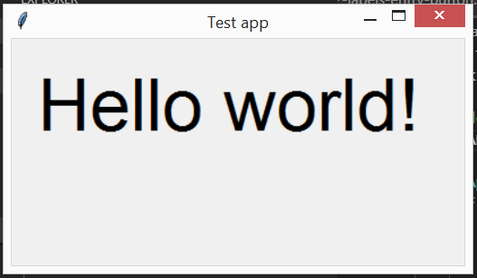
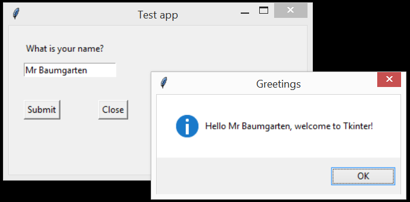
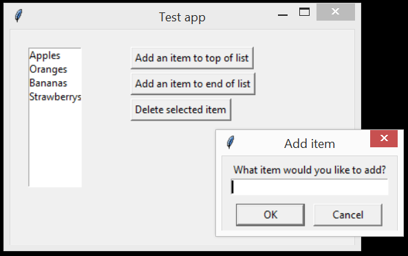
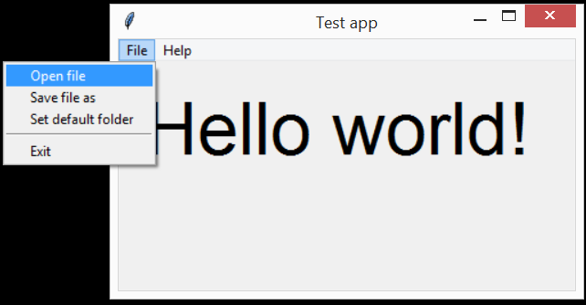
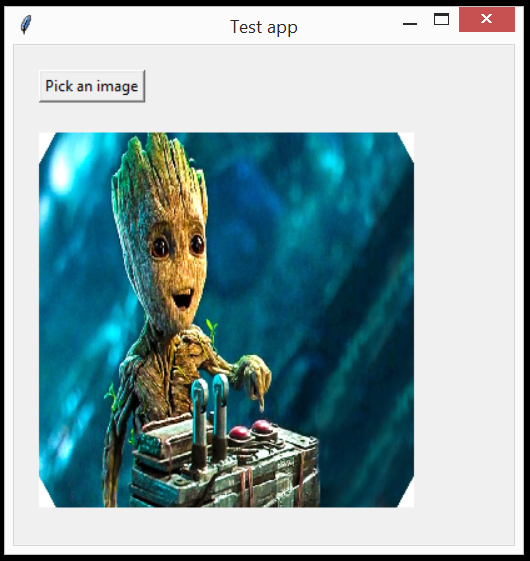
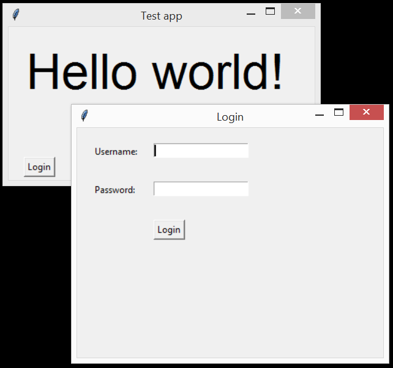
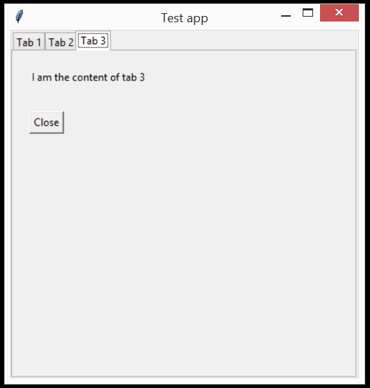

# Tkinter GUI

## Contents

1. [Starting a basic app](#a-basic-app)
2. [Label, entry box and button](#labels-entry-box-button)
3. [Listbox and simpledialog](#listbox-simpledialog)
4. [Menubar and filedialog](#menubar-filedialog)
5. [Images](#images)
6. [Second window](#second-window)
7. [Tabs](#tabs)
8. [Reference](#reference)
9. [Assorted tips and tricks](#tips-and-tricks)
10. [Suggested resources](#suggested-resources)


## Videos

* Video: [A quick intro to Tkinter and object orientated programming](https://youtu.be/olxgc9F8mzk)
* Video: [Using buttons in Tkinter](https://youtu.be/MoyIk66vlmk)
* Video: [Using entry textbox in Tkinter](https://youtu.be/4dN5Ef4rTzo)


## Reference

### Creating a window

Imports

```python
import tkinter as tk
from tkinter import ttk
```

Main code
Withdrawing the default

Creating the class

```python
class AppWindow():
    def __init__(self, parent):
        # Create the window
        self.parent = parent
        self.window = tk.Toplevel()
        self.window.geometry("400x200")     # Create a screen 400 wide by 200 high
        self.window.title("Test app")
        self.window.protocol("WM_DELETE_WINDOW", self.window.quit) # Enable the close icon
        # Add all your widgets here...
```

Main code to run the program

```python
if __name__ == "__main__":
    root = tk.Tk()          # Initialise the tk system into an object called `root`
    root.withdraw()         # Hide the default window
    app = AppWindow(root)   # Run our window, called AppWindow
    root.mainloop()         # Start the program loop until all windows exit
```

Execute a function (in this case, `self.window.quit()`) when the window close icon is clicked

```python
self.window.protocol("WM_DELETE_WINDOW", self.window.quit)
```

Make the window partially transparent

```python
self.window.attributes('-alpha', 0.8)
```

Force the window to stay visibly on top of all other programs

```python
root.wm_attributes("-topmost", 1)
```

Opening a second window

```python
# Create login window        
login_window = LoginWindow()
# Wait until the login window is closed
self.window.wait_window(login_window.window)  
print("Finished waiting")
uid, pwd = login_window.get_info()
```

Closing the second window

```python
self.window.destroy()  
```

Closing your main window

```python
self.window.quit()
```

### Label

* Creating a label

```python
self.hello_label = tk.Label(self.window, text="Hello world!", font=FONT_LARGE)
self.hello_label.place(x=20, y=20)
```

* Set style parameters (color, font, etc)

```python
self.image_label.place(x=20,y=70,width=300,height=300) # in pixels
```

* Set/change the text on a label

```python
self.hello_label["text"] = "My new text"
```

* Styling a label

```python
self.hello_label["font"] = ("Arial", 16)
self.hello_label["background"] = (255,255,0)      # Yellow
self.hello_label["foreground"] = (128,128,128)    # Grey
```

In order to fill a label with an image, see the *Image* section.

### Text (Entry) box

* Creating a text entry box

```python
# Create a text entry box
self.name_entry = tk.Entry(self.window)
self.name_entry.place(x=20, y=50)
```

```python
self.name_entry.focus()   # Put the cursor in the text box
```

* Get the text value

```python
person = self.name_entry.get()
```

* Set/change the text value

```python
self.name_text.delete(0, tk.END)
self.name_text.insert(0, contact["name"])
```

* Set style and formatting parameters (color, font, etc)

To disable the text entry box (so text can't be modified)

```python
self.name_text["state"] = "disabled"    # set to "normal" to re-enable
self.name_text["font"] = ("Arial", 16)
self.name_text["background"] = (255,255,0)      # Yellow
self.name_text["foreground"] = (128,128,128)    # Grey
self.name_text["width"] = 20                    # Width in number of characters. Does not limit number that can be typed
```

* Mask the user input for use as a password entry box

Use the `show=` parameter.

```python
self.widget = Entry(parent, show="*", width=15)
```

### Button

* Creating a button

```python
self.submit_button = tk.Button(self.window, text="Submit", command=self.greetings)
self.submit_button.place(x=20, y=100)
```

* Set style parameters (color, font, etc)

```python
self.button["text"] = "New description"
self.name_text["state"] = "disabled"    # set to "normal" to re-enable
self.name_text["font"] = ("Arial", 16)
self.name_text["background"] = (255,255,0)      # Yellow
self.name_text["foreground"] = (128,128,128)    # Grey
self.name_text["width"] = 20                    # Width in number of characters. Does not limit number that can be typed
```

* Execute a function when clicked

### Listbox

* Creating a listbox

```python
# Create a list box
# -- width is characters, height is lines
self.list = tk.Listbox(self.window, width=10, height=10)    
for item in items:
    # Add each item to the end of the list
    self.list.insert(tk.END, item)                     
self.list.place(x=20, y=20)
# -- When an item in the list is selected, execute the list_clicked function
self.list.bind('<<ListboxSelect>>', self.list_clicked) 
# -- Give `selected` a default of -1
self.selected = -1                                     
```

* Add item to list

```python
self.list.insert(0, answer)
self.list.insert(tk.END, answer)
```        

* Delete item from list

```python
self.list.delete(self.selected)
# Empty list
self.contact_list.delete(0, tk.END)
```

* Get currently selected item in list

```python
self.selected = int(self.list.curselection()[0])      # item number selected in list
item = self.list.get(self.selected)                   # text of selected item
```

* Set currently selected item in list

```python
self.listbox.select_set(0) #This only sets focus on the first item.
self.listbox.event_generate("<<ListboxSelect>>")
```

* Execute a function when selection changed

```python
def list_clicked(self, e): # requires the 2nd parameter even though it doesn't tell you anything useful
    pass
```

### Menu

* Create a menu

```python
# Create a menu bar
menubar = tk.Menu(self.window)
filemenu = tk.Menu(menubar, tearoff=0)
filemenu.add_command(label="Open file", command=self.file_open)
filemenu.add_command(label="Save file as", command=self.file_saveas)
filemenu.add_command(label="Set default folder", command=self.select_folder)
filemenu.add_separator()
filemenu.add_command(label="Exit", command=self.window.quit)
helpmenu = tk.Menu(menubar, tearoff=0)
helpmenu.add_command(label="About", command=self.about)
menubar.add_cascade(label="File", menu=filemenu)
menubar.add_cascade(label="Help", menu=helpmenu)
self.window.config(menu=menubar)
```

* Respond to menu item selected/clicked

### Tab

* Create a tab system

```python
# Create 3 tabs
self.tab_container = tk.Frame(self.window)
self.tab_container.place(x=0,y=0,width=400,height=400)
self.tabs = ttk.Notebook(self.tab_container)
self.tab_1 = tk.Frame(self.tabs)
self.tab_2 = tk.Frame(self.tabs)
self.tab_3 = tk.Frame(self.tabs)
self.tabs.add(self.tab_1, text="Tab 1")
self.tabs.add(self.tab_2, text="Tab 2")
self.tabs.add(self.tab_3, text="Tab 3")
self.tabs.place(x=0,y=0,height=400,width=400)
# Define what function to run when current tab is changed
self.tabs.bind("<<NotebookTabChanged>>", self.on_tab_selected)
```

* Add content to a tab

```python
# Content for tab 1
self.label1 = tk.Label(self.tab_1, text="I am the content of tab 1")
self.label1.place(x=20, y=20) # Coordinates are relative to within the tab area    
```

### Image

* Add an image to a label

```python
from PIL import Image, ImageTk
```

```python
# Open the image file
img = Image.open(filename)
# (optional) resize the image
img = img.resize((300, 300))        
# 1. Reformat the image into tk compatible form, and
# 2. Save a copy of the image to self otherwise it will be cleared from memory when this function closes
self.tkimg = ImageTk.PhotoImage(img)
# Display the image in the label
self.image_label.configure(image=self.tkimg)
```

### Message box

```python
from tkinter import messagebox
```

```python
messagebox.showinfo("Greetings", f"Hello {person}, welcome to Tkinter!")
messagebox.showerror("Error", "Can't delete the selected item if you haven't selected anything!")
```

### Simple Dialog box

```python
from tkinter import simpledialog
```

```python
answer = simpledialog.askstring("Add item","What item would you like to add?")
```

### File Dialog box

```python
from tkinter import filedialog
```

```python
filename = filedialog.askopenfilename(title="Select image", filetypes=ALLOWED_FILES)
filename = filedialog.askopenfilename(initialdir=self.default_folder, title="Select file", filetypes=ALLOWED_FILES)
filename = filedialog.asksaveasfilename(initialdir=self.default_folder, title="Select file", filetypes=ALLOWED_FILES)
folder = filedialog.askdirectory(initialdir=self.default_folder, title = "Select folder containing student photos")
```

## Examples

### Example 1: A basic app



```python
import tkinter as tk
from tkinter import ttk

# Pre-define some defaults
FONT_LARGE = ("Arial", 48)

class AppWindow():
    def __init__(self, parent):
        # Create the window
        self.window = parent
        self.window.geometry("400x200")
        self.window.title("Test app")
        self.window.protocol("WM_DELETE_WINDOW", self.window.quit) # Enable the close icon
        # Create a text label and place it in the window
        self.hello_label = tk.Label(self.window, text="Hello world!", font=FONT_LARGE)
        self.hello_label.place(x=20, y=20)

if __name__ == "__main__":
    root = tk.Tk()
    app = AppWindow(root)
    root.mainloop()
```

### Example 2: Labels, entry box, button




```python
import tkinter as tk
from tkinter import ttk
from tkinter import messagebox

# Pre-define some defaults
FONT_LARGE = ("Arial", 48)

class AppWindow():
    def __init__(self, parent):
        # Create the window
        self.window = parent
        self.window.geometry("400x200")
        self.window.title("Test app")
        # Create a text label
        self.question_label = tk.Label(self.window, text="What is your name?")
        self.question_label.place(x=20, y=20)
        # Create a text entry box
        self.name_entry = tk.Entry(self.window)
        self.name_entry.place(x=20, y=50)
        self.name_entry.focus()   # Put the cursor in the text box
        # Create a button
        self.submit_button = tk.Button(self.window, text="Submit", command=self.greetings)
        self.submit_button.place(x=20, y=100)
        # Create a second button
        self.close_button = tk.Button(self.window, text="Close", command=self.window.quit)
        self.close_button.place(x=120, y=100)

    def greetings(self):
        # This function is executed when the submit button is clicked
        # Retrieve the text from the entry box
        person = self.name_entry.get()
        # Display a message box
        messagebox.showinfo("Greetings", f"Hello {person}, welcome to Tkinter!")

if __name__ == "__main__":
    root = tk.Tk()
    app = AppWindow(root)
    root.mainloop()
```

---

### Example 3: Listbox, simpledialog



```python
import tkinter as tk
from tkinter import ttk
from tkinter import messagebox
from tkinter import simpledialog

# Pre-define some defaults
FONT_LARGE = ("Arial", 48)

# List of items to demo listbox
items = ["Apples", "Oranges", "Bananas", "Strawberrys"]

class AppWindow():
    def __init__(self, parent):
        # Create the window
        self.window = parent
        self.window.geometry("400x250")
        self.window.title("Test app")
        # Create a list box
        # -- width is characters, height is lines
        self.list = tk.Listbox(self.window, width=10, height=10)    
        for item in items:
            # Add each item to the end of the list
            self.list.insert(tk.END, item)                     
        self.list.place(x=20, y=20)
        # -- When an item in the list is selected, execute the list_clicked function
        self.list.bind('<<ListboxSelect>>', self.list_clicked) 
        # -- Give `selected` a default of -1
        self.selected = -1                                     
        # Create some buttons
        self.add_to_top_button = tk.Button(self.window, text="Add an item to top of list", command=self.add_to_top_clicked)
        self.add_to_top_button.place(x=140, y=20)
        self.add_to_end_button = tk.Button(self.window, text="Add an item to end of list", command=self.add_to_end_clicked)
        self.add_to_end_button.place(x=140, y=50)
        self.close_button = tk.Button(self.window, text="Delete selected item", command=self.delete_selected_clicked)
        self.close_button.place(x=140, y=80)

    def add_to_top_clicked(self):
        answer = simpledialog.askstring("Add item","What item would you like to add?")
        self.list.insert(0, answer)

    def add_to_end_clicked(self):
        answer = simpledialog.askstring("Add item","What item would you like to add?")
        self.list.insert(tk.END, answer)

    def delete_selected_clicked(self):
        if self.selected >= 0:      # Check this still isn't -1
            self.list.delete(self.selected)
            self.selected = -1      # Reset back to -1
        else:
            messagebox.showerror("Error", "Can't delete the selected item if you haven't selected anything!")

    def list_clicked(self, e):
        print(e)
        self.selected = int(self.list.curselection()[0])      # item number selected in list
        item = self.list.get(self.selected)                   # text of selected item
        print(f"You have clicked item {self.selected} which is {item}")

if __name__ == "__main__":
    root = tk.Tk()
    app = AppWindow(root)
    root.mainloop()
```

---

### Example 4: Menubar, filedialog



```python
import tkinter as tk
from tkinter import ttk
from tkinter import messagebox
from tkinter import filedialog

# Pre-define some defaults
FONT_LARGE = ("Arial", 48)
ALLOWED_FILES = (("JPEG files","*.jpg"),("PNG files","*.png"),("all files","*.*"))

class AppWindow():
    def __init__(self, parent):
        # Create the window
        self.window = parent
        self.window.geometry("400x200")
        self.window.title("Test app")
        # Create a text label and place it in the window
        self.hello_label = tk.Label(self.window, text="Hello world!", font=FONT_LARGE)
        self.hello_label.place(x=20, y=20)
        # Create a menu bar
        menubar = tk.Menu(self.window)
        filemenu = tk.Menu(menubar, tearoff=0)
        filemenu.add_command(label="Open file", command=self.file_open)
        filemenu.add_command(label="Save file as", command=self.file_saveas)
        filemenu.add_command(label="Set default folder", command=self.select_folder)
        filemenu.add_separator()
        filemenu.add_command(label="Exit", command=self.window.quit)
        helpmenu = tk.Menu(menubar, tearoff=0)
        helpmenu.add_command(label="About", command=self.about)
        menubar.add_cascade(label="File", menu=filemenu)
        menubar.add_cascade(label="Help", menu=helpmenu)
        self.window.config(menu=menubar)
        # Intialise the default folder location
        self.default_folder = "."

    def file_open(self):
        filename = filedialog.askopenfilename(initialdir=self.default_folder, title="Select file", filetypes=ALLOWED_FILES)
        print(f"Open file: {filename}")

    def file_saveas(self):
        filename = filedialog.asksaveasfilename(initialdir=self.default_folder, title="Select file", filetypes=ALLOWED_FILES)
        print(f"Save file as: {filename}")

    def select_folder(self):
        folder = filedialog.askdirectory(initialdir=self.default_folder, title = "Select folder containing student photos")
        self.default_folder = folder
        print(f"New default folder: {folder}")

    def about(self):
        messagebox.showinfo("About", "Copyright (c) 2019 Paul Baumgarten\nWebsite: pbaumgarten.com")

if __name__ == "__main__":
    root = tk.Tk()
    app = AppWindow(root)
    root.mainloop()
```

---

### Example 5: Images




```python
import tkinter as tk
from tkinter import filedialog
from PIL import Image, ImageTk

# Pre-define some defaults
FONT_LARGE = ("Arial", 48)
ALLOWED_FILES = (("JPEG files","*.jpg"),("PNG files","*.png"),("all files","*.*"))

class AppWindow():
    def __init__(self, parent):
        # Create the window
        self.window = parent
        self.window.geometry("400x400")
        self.window.title("Test app")
        # Button
        self.pick_file_button = tk.Button(self.window, text="Pick an image", command=self.show_image)
        self.pick_file_button.place(x=20,y=20)
        # Create a label reserved for displaying image later
        self.image_label = tk.Label(self.window)
        self.image_label.place(x=20,y=70,width=300,height=300)

    def show_image(self):
        # Get image selection
        filename = filedialog.askopenfilename(title="Select image", filetypes=ALLOWED_FILES)
        print(f"Opening file: {filename}")
        # Open the image file
        img = Image.open(filename)
        # (optional) resize the image
        img = img.resize((300, 300))        
        # 1. Reformat the image into tk compatible form, and
        # 2. Save a copy of the image to self otherwise it will be cleared from memory when this function closes
        self.tkimg = ImageTk.PhotoImage(img)
        # Display the image in the label
        self.image_label.configure(image=self.tkimg)

if __name__ == "__main__":
    root = tk.Tk()
    app = AppWindow(root)
    root.mainloop()
```

---

### Example 6: Second window



To have Tkinter open second windows, use the `tk.Toplevel()` function as shown in the `LoginWindow.__init__()` function.

With respect to organising your code, it is generally good practice to make each window its own class.

```python
import tkinter as tk
from tkinter import ttk
import time

# Pre-define some defaults
FONT_LARGE = ("Arial", 48)

class LoginWindow():
    def __init__(self, parent):
        # Create a variable with which we can reference our parent
        self.parent = parent
        # Secondary windows are made using tk.Toplevel() instead of using parent
        self.window = tk.Toplevel()
        self.window.geometry("400x300")
        self.window.title("Login")
        # Labels
        self.username_label = tk.Label(self.window, text="Username:")
        self.username_label.place(x=20,y=20)
        self.password_label = tk.Label(self.window, text="Password:")
        self.password_label.place(x=20,y=70)
        # Entry boxes
        self.username_text = tk.Entry(self.window)
        self.username_text.place(x=100,y=20)
        self.username_text.focus()
        self.password_text = tk.Entry(self.window, show="*")
        self.password_text.place(x=100,y=70)
        # Button
        self.login_button = tk.Button(self.window, text="Login", command=self.login)
        self.login_button.place(x=100,y=120)

    def login(self):
        self.userid = self.username_text.get()
        self.passwd = self.password_text.get()
        print(f"Your username is {self.userid} and password is {self.passwd}")
        # Close the login window
        self.window.destroy()  

    def get_info(self):
        return self.userid, self.passwd

class AppWindow():
    def __init__(self, parent):
        # Create the window (linked to the app parent)
        self.window = parent
        self.window.geometry("400x200")
        self.window.title("Test app")
        # Create a text label and place it in the window
        self.hello_label = tk.Label(self.window, text="Hello world!", font=FONT_LARGE)
        self.hello_label.place(x=20, y=20)
        # Create a button
        self.login_button = tk.Button(self.window, text="Login", command=self.login_clicked)
        self.login_button.place(x=20, y=170)
    
    def login_clicked(self):
        # Create login window        
        login_window = LoginWindow()
        # Wait until the login window is closed
        self.window.wait_window(login_window.window)  
        print("Finished waiting")
        uid, pwd = login_window.get_info()
        self.hello_label.configure(text=f"Hello {uid}")

if __name__ == "__main__":
    root = tk.Tk()
    app = AppWindow(root)
    root.mainloop()
```

<div class="page"/>

### Example 7: Tabs



```python
import tkinter as tk
from tkinter import ttk
from tkinter import messagebox

class AppWindow():
    def __init__(self, parent):
        # Create the window
        self.window = parent
        self.window.geometry("400x400")
        self.window.title("Test app")
        # Create a text label and place it in the window
        self.hello_label = tk.Label(self.window, text="Hello world!", font=FONT_LARGE)
        self.hello_label.place(x=20, y=20)
        # Create 3 tabs
        self.tab_container = tk.Frame(self.window)
        self.tab_container.place(x=0,y=0,width=400,height=400)
        self.tabs = ttk.Notebook(self.tab_container)
        self.tab_1 = tk.Frame(self.tabs)
        self.tab_2 = tk.Frame(self.tabs)
        self.tab_3 = tk.Frame(self.tabs)
        self.tabs.add(self.tab_1, text="Tab 1")
        self.tabs.add(self.tab_2, text="Tab 2")
        self.tabs.add(self.tab_3, text="Tab 3")
        self.tabs.place(x=0,y=0,height=400,width=400)
        # Define what function to run when current tab is changed
        self.tabs.bind("<<NotebookTabChanged>>", self.on_tab_selected)
        # Content for tab 1
        self.label1 = tk.Label(self.tab_1, text="I am the content of tab 1")
        self.label1.place(x=20, y=20) # Coordinates are relative to within the tab area    
        # Content for tab 2
        self.label2 = tk.Label(self.tab_2, text="I am the content of tab 2")
        self.label2.place(x=20, y=20) # Coordinates are relative to within the tab area
        # Content for tab 3
        self.label3 = tk.Label(self.tab_3, text="I am the content of tab 3")
        self.label3.place(x=20, y=20) # Coordinates are relative to within the tab area
        self.close_button = tk.Button(self.tab_3, text="Close", command=self.close_clicked)
        self.close_button.place(x=20,y=70)

    def on_tab_selected(self, e):
        # Function to execute whenever current tab is changed
        selected_tab = e.widget.select()
        tab_text = e.widget.tab(selected_tab, "text")
        if tab_text == "Tab 1":
            print("You clicked into tab 1")
        if tab_text == "Tab 2":
            print("You clicked into tab 2")
        if tab_text == "Tab 3":
            print("You clicked into tab 3")

    def close_clicked(self):
        result = messagebox.askyesno("Confirm", message="Do you want to quit?")
        if result:
            self.parent.quit()

if __name__ == "__main__":
    root = tk.Tk()
    app = AppWindow(root)
    root.mainloop()
```


## Demo project: Contacts app


This project can be found at [https://github.com/paulbaumgarten/python-gui-contacts-app](https://github.com/paulbaumgarten/python-gui-contacts-app)

```python
import tkinter as tk
from tkinter import ttk
from tkinter import messagebox
from tkinter import filedialog
from datetime import datetime, timedelta
import os
from PIL import Image, ImageTk

contacts = [
  {"phoneNumber":"555 0001","name":"Sheldon Lee Cooper","dateOfBirth":"1980-02-26","email":"sheldon@gmail.com"},
  {"phoneNumber":"555 0002","name":"Howard Joel Wolowitz","dateOfBirth":"1981-03-01","email":"howard@gmail.com"},
  {"phoneNumber":"555 0003","name":"Rajesh Ramayan Koothrappali","dateOfBirth":"1981-10-06","email":"raj@gmail.com"},
  {"phoneNumber":"555 0004","name":"Penny Hofstadter","dateOfBirth":"1985-12-02","email":"penny@gmail.com"},
  {"phoneNumber":"555 0005","name":"Amy Farrah Fowler","dateOfBirth":"1979-12-17","email":"amy@gmail.com"},
  {"phoneNumber":"555 0002","name":"Bernadette Rostenkowski-Wolowitz","dateOfBirth":"1984-01-01","email":"bernadette@gmail.com"},
  {"phoneNumber":"555 0006","name":"Leonard Hofstadter","dateOfBirth":"1980-05-17","email":"leonard@gmail.com"}
]

class AppWindow():
    def __init__(self, parent):
        # Create the window
        self.parent = parent
        self.window = tk.Toplevel()
        self.window.geometry("670x350")
        self.window.title("Contacts app")
        self.window.protocol("WM_DELETE_WINDOW", self.window.quit)
        # Create a text label and place it in the window
        self.title_label = tk.Label(self.window, text="Contacts app", font=("Arial", 16))
        self.title_label.place(x=10, y=10)
        # Create the list box
        self.contact_list = tk.Listbox(self.window, width=25, height=17)
        self.contact_list.place(x=10, y=40)
        # -- When an item in the list is selected, execute the list_clicked function
        self.contact_list.bind('<<ListboxSelect>>', self.list_clicked) 
        self.update_list()
        # Name
        self.name_label = tk.Label(self.window, text="Name", font=("Arial", 13))
        self.name_label.place(x=250,y=40)
        self.name_text = tk.Entry(self.window, width=25)
        self.name_text.place(x=250,y=60)
        # Email
        self.email_label = tk.Label(self.window, text="Email", font=("Arial", 13))
        self.email_label.place(x=250,y=100)
        self.email_text = tk.Entry(self.window, width=25)
        self.email_text.place(x=250,y=120)
        # Phone number
        self.phone_label = tk.Label(self.window, text="Phone", font=("Arial", 13))
        self.phone_label.place(x=250,y=160)
        self.phone_text = tk.Entry(self.window, width=25)
        self.phone_text.place(x=250,y=180)
        # Date of birth
        self.dob_label = tk.Label(self.window, text="Date of birth", font=("Arial", 13))
        self.dob_label.place(x=250,y=160)
        self.dob_text = tk.Entry(self.window, width=25)
        self.dob_text.place(x=250,y=180)
        # Age
        self.age_label = tk.Label(self.window, text="Age", font=("Arial", 13))
        self.age_label.place(x=250,y=220)
        self.age_info = tk.Label(self.window, text="", font=("Arial", 13))
        self.age_info.place(x=250,y=240)
        # Photo
        self.image_label = tk.Label(self.window)
        self.image_label.place(x=500,y=40,width=150,height=200)
        # Buttons
        self.new_button = tk.Button(self.window, text="Save new", command=self.save_new)
        self.new_button.place(x=250, y=280, width=100, height=40)
        self.existing_button = tk.Button(self.window, text="Save existing", command=self.save_existing)
        self.existing_button.place(x=370, y=280, width=100, height=40)

    def list_clicked(self, e):
        self.selected = int(self.contact_list.curselection()[0])      # item number selected in list
        print(f"You clicked item number {self.selected}")
        # Get the selected contact
        contact = contacts[self.selected]
        # Show name
        self.name_text.delete(0, tk.END)
        self.name_text.insert(0, contact["name"])
        # Show email
        self.email_text.delete(0, tk.END)
        self.email_text.insert(0, contact["email"])
        # Show phone number
        self.phone_text.delete(0, tk.END)
        self.phone_text.insert(0, contact["phoneNumber"])
        # Show date of birth and age
        birthday = datetime.strptime(contact["dateOfBirth"], "%Y-%m-%d")
        self.dob_text.delete(0, tk.END)
        self.dob_text.insert(0, birthday.strftime("%d/%m/%Y"))
        today = datetime.now()
        age = today.year - birthday.year
        if today.month < birthday.month:
            age = age - 1
        elif today.month == birthday.month and today.day < birthday.day:
            age = age - 1
        self.age_info["text"] = str(age) + " years"
        # Show photo if it exists
        if os.path.exists(contact["name"]+".jpg"):
            img = Image.open(contact["name"]+".jpg")
            img = img.resize((150, 200))
            self.contact_photo = ImageTk.PhotoImage(img)
            self.image_label.configure(image=self.contact_photo)
        else:
            self.contact_photo = None
            self.image_label.configure(image=None)

    def update_list(self):
        # Empty list
        self.contact_list.delete(0, tk.END)
        # Add all contacts to list
        for contact in contacts:
            # Add each item to the end of the list
            self.contact_list.insert(tk.END, contact["name"])                     
        # Set a default to indicate no item selected
        self.selected = -1      

    def save_new(self):
        print("You clicked button save_new")
        new_contact = {}
        new_contact["name"] = self.name_text.get()
        new_contact["email"] = self.email_text.get()
        new_contact["phoneNumber"] = self.phone_text.get()
        new_contact["dateOfBirth"] = datetime.strptime(self.dob_text.get(), "%d/%m/%Y").strftime("%Y-%m-%d")
        contacts.append(new_contact)
        self.update_list()

    def save_existing(self):
        print("You clicked button save_existing")
        if self.selected >= 0:
            contacts[self.selected]["name"] = self.name_text.get()
            contacts[self.selected]["email"] = self.email_text.get()
            contacts[self.selected]["phoneNumber"] = self.phone_text.get()
            contacts[self.selected]["dateOfBirth"] = datetime.strptime(self.dob_text.get(), "%d/%m/%Y").strftime("%Y-%m-%d")
        self.update_list()
            
if __name__ == "__main__":
    root = tk.Tk()
    root.withdraw()
    app = AppWindow(root)
    root.mainloop()
```

## Suggested resources

* https://python-textbok.readthedocs.io/en/1.0/Introduction_to_GUI_Programming.html
* http://www.effbot.org/tkinterbook/grid.htm
* https://docs.python.org/3.7/library/tkinter.html
* https://www.python-course.eu/python_tkinter.php

