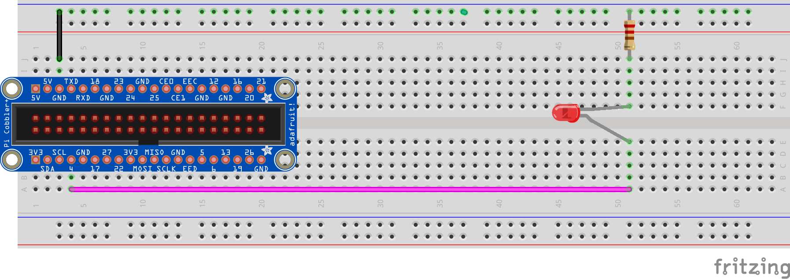

# Raspberry Pi: Using LEDs

You will need:

* An LED (obviously)
* A resistor around 200 ohms (these are the ones with the blue shell in your pack). 
* Two connector wires

Wire your LED on the breadboard similar to the following diagram. Have a go and then if you are unsure, have an instructor check it. The resistor is important to moderate the flow of current so we don't overload the Raspberry Pi CPU which is quite delicate.

**Notice the lengths of the pins on the LED are different. This is because the LED will only work one way. In this case, the longer pin should be the one that gets wired up to GPIO 4, and the shorter pin should go to Ground.**



First a really simple test, let's make the LED turn on for 2 seconds then turn off.

```python
import time
import easyaspi

LED_PIN = 4                 # change this number to whatever GPIO pin you used
led = easyaspi.LED(LED_PIN) # Create our LED variable

led.set(True)               # Turn the LED on
time.sleep(2)               # Wait 2 seconds
led.set(False)              # Turn the LED off

print("All done!")
```

To up the ante, modify `main.py` to make it blink a given number of times.

```python
import time
import easyaspi

LED_PIN = 4                 # change this number to whatever GPIO pin you used
led = easyaspi.LED(LED_PIN) # Create our LED variable

blinks = int(input("How many times do you want the LED to blink?"))
while blinks > 0:
    led.set(True)           # Turn the LED on
    time.sleep(0.5)         # Wait half a second
    led.set(False)          # Turn the LED off
    time.sleep(0.5)         # Wait half a second
    blinks = blinks - 1
print("All done!")
```

From now on, any time we want an LED to turn on or off, we only need to update our `main.py` code.  

## LED summary

The key parts to using an LED are:

* Create the LED variable

```python
import time
import easyaspi

led = easyaspi.LED( pin_number )
```

* Turn an LED on

```python
led.set(True)
```

* Turn an LED off

```python
led.set(False)
```
