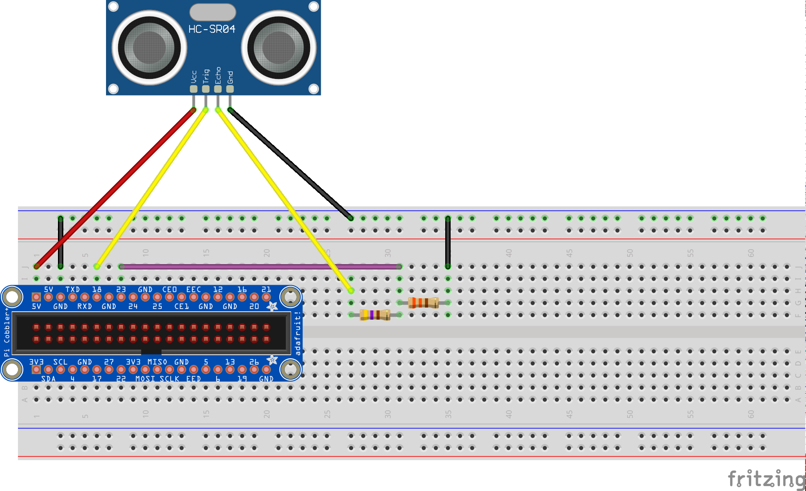

# Raspberry Pi: Using ultrasonic sensors

An ultrasonic sensor works by sending a high freqency sound pulse, and using the speed of sound (we assume sea-level), it can calculate how far an object is by measuring how long it took for it to hear an echo of that pulse. Pretty cool eh?! Who would have thought you'd be using Physics today!

Parts list:

* HC-SR04 or similar ultrasonic sensor
* 330 ohm resister (approximately)
* 470 ohm resister (approximately)
* Connector wires



Here is some demo code for using the sensor.

```python
import time
import easyaspi

ULTRASONIC_TRIGGER = 18             # Change to whatever pin you connected to
ULTRASONIC_ECHO = 23                # Change to whatever pin you connected to

ultra = easyaspi.Ultrasonic(ULTRASONIC_TRIGGER, ULTRASONIC_ECHO)

end_at = time.time() + 30           # We'll run for 30 seconds
while time.time() < end_at:
    distance = ultra.get_distance()
    if distance > 0:
        print("Nearest object is",distance,"centimeters")
    else:
        print("Object out of range")
    time.sleep(0.2)                 # Wait part of a second and check again
```

Still got an LED connected? We could make the LED turn on if someone is getting too close!

```python
import time
import easyaspi

LED_PIN = 4                         # Change to whatever pin you connected to
ULTRASONIC_TRIGGER = 18             # Change to whatever pin you connected to
ULTRASONIC_ECHO = 23                # Change to whatever pin you connected to
ultra = easyaspi.Ultrasonic(ULTRASONIC_TRIGGER, ULTRASONIC_ECHO)
led = easyaspi.LED(LED_PIN)

end_at = time.time() + 30           # We'll run for 30 seconds
while time.time() < end_at:
    distance = ultra.get_distance()
    if distance > 0 and distance < 20:
        led.set(True)
        print("TOO CLOSE! Only",distance,"centimeters")
    elif distance > 0:
        led.set(False)
        print("Nearest object is",distance,"centimeters")
    else:
        led.set(False)
        print("Object out of range")
    time.sleep(0.5)                 # Wait part of a second and check again
```

## Ultrasonic summary

The key parts to using an Ultrasonic are:

* Create the Ultrasonic variable

```python
import easyaspi
ultra = easyaspi.Ultrasonic( trigger_pin_number, echo_pin_number )
```

* Retrieve the distance in centimeters

```python
distance = ultra.get_distance()
```
