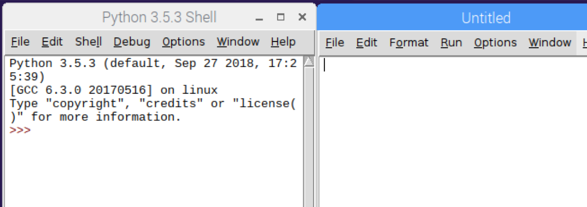

# Introduction to the Raspberry Pi

The Raspberry Pi 3b, which is what we are using today, comes with a range of built in ports and functions including:

* Quad core ARM Cortex-A53 1.2 GHz processor
* 1 GB of RAM (LPDDR2 900 Mhz)
* 4 x USB 2.0
* 1 x HDMI video out
* 1 x 3.5mm analog audio out
* 1 x Ethernet 10/100 networking
* 1 x Wifi 802.11n 2.4 GHz
* 1 x Bluetooth 4.1 classic
* Camera serial interface (CSI)
* Display serial interface (DSI)
* 40 GPIO (general purpose input/output) pins

Don't worry if none of the above means much to you (I really just mention it for any curious nerds who are into that kind of thing). The important bits for us today will be the camera interface and the GPIO.

The GPIO, or general purpose input/output, are wires that are directly connected to the CPU of the Raspberry Pi, and you can control them through your Python program. You can instruct the pins to turn on or off electrical power (at 3.3 volts), or use Python to ask if there is a source of power being supplied to a particular pin (coming from a sensor of some kind).  We will use the GPIOs to connect our various buttons, sensors and LEDs.

The following diagram will be important to reference as you work with the GPIOs. It shows the purpose and numbering of each pin.


To make wiring our sensors and accessories a bit easier, you have also got a breadboard. The holes on this device are all interconnected making it easier to wire different components together than if we were doing it with loose wire.

The broadboard is split into a few different sections, the long columns running down the long edges are all connected (as seen in purple in the diagram). In the middle section, each horizontal row of holes is interconnected, with a break at the midway point (as seen in blue in the diagram).


## Power on and login

The Pi will automatically turn itself on when you plug the power in. The Pi draws power through its micro USB port. Note: You need a power supply of at least 2500 mA (be aware most phone chargers only provide 1500 to 2000 mA). The Pi will sometimes "appear" to work with a less capable power supply but will sometimes behave in weird unexplained ways if you aren't giving it enough power.

The Pi's for this weekend have been pre-installed ready for our workshop. They should automatically start up and connect to the wifi. If you are asked for a username and password at any time, they are as follows:

* Username: pi
* Password: raspberry

# Using Python

Using the main menu (icon on the top-left of screen), open `Programming` and then start `Python 3 (IDLE)`.

By default, IDLE will only open the `shell` screen. You also need to open a second screen for your Python program code. Use the menu `file` / `new file` so it looks like this:



Test your Python works with a simple program. In the `Untitled` window, type

```python
name = input("What is your name?")
print("Hello, "+name)
```

Use the menu `file` / `save` to save your Python program. Then menu `run` / `run module` to execute. If all works correctly you will be prompted with the question on the shell screen. Ensure you click the mouse into the shell screen before typing your response. Once tested, you can create any Python program you like this way. If you have time feel free to experiment with your own programs, in the meantime we'll move on with the workshop.
