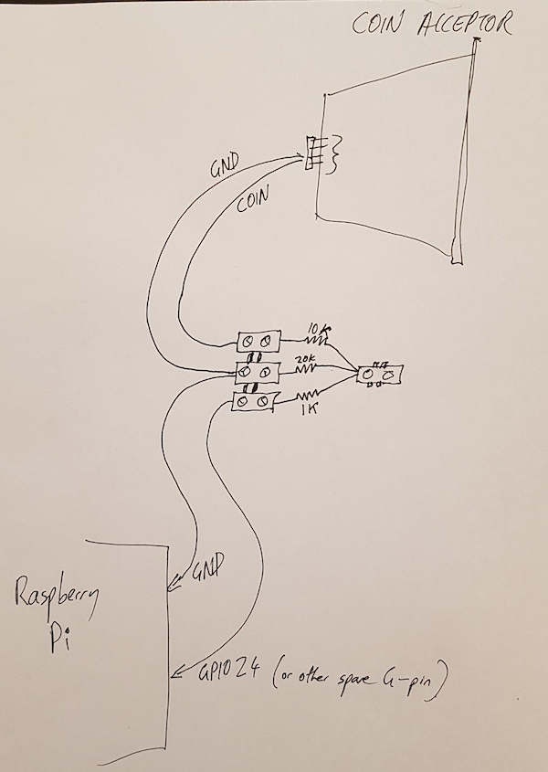

# Coin acceptor with Raspberry Pi

These instructions are based on the Adafruit 4 type coin accepter

* https://www.adafruit.com/product/787

## Setup and training instructions


## Wiring to the Raspberry Pi

* Ensure switch 3 is set to NC (normally open)???
* Ensure switch 4 (output signal) is set to SLOW



## Sample code

```python
import RPi.GPIO as GPIO
import time

credit = 0
print(f"You have {credit/100} CHF in credit")

def pulse_received(pin):
    global credit
    print("Pulse received")
    credit += 50
    print(f"You have {credit/100} CHF in credit")

counter_pin = 27 # or whatever...
GPIO.setmode( GPIO.BCM )
GPIO.setup( counter_pin, GPIO.IN, pull_up_down=GPIO.PUD_DOWN)
GPIO.add_event_detect(counter_pin, GPIO.RISING)
GPIO.add_event_callback(counter_pin, pulse_received)
```

Credit: Code and wiring instructions derived from https://lb.raspberrypi.org/forums/viewtopic.php?t=127870 
