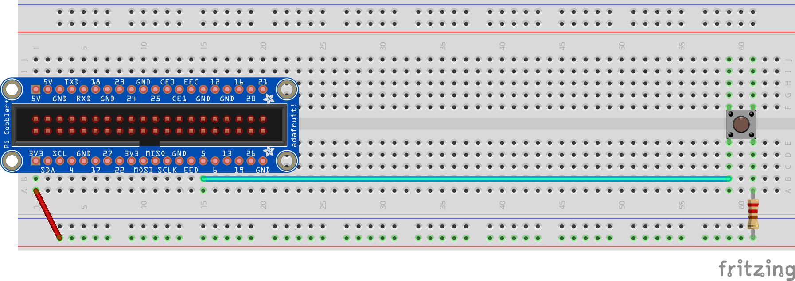

# Raspberry Pi: Using buttons

This diagram shows the new wiring to add. **Do not disconnect the LED wiring, you will still use the LED!**



There's a couple of different ways a button can be used. We're just going to query the state of the button at a given moment in time. Using the Button class we have created, the `.get()` function will return `True` if the button is being pressed and `False` if it is not.

Replace the content of your `main.py` with the following to test a button:

```python
import time
import easyaspi

BUTTON_PIN = 5                      # Change to whatever pin you connected to
button = easyaspi.Button(BUTTON_PIN)# Create our button vairable

end_at = time.time() + 30           # We'll run for 30 seconds
while time.time() < end_at:
    if button.get():
        print("You are pressing the button")
    time.sleep(0.3)                 # Wait part of a second and check again
```

Do you still have your LED wired up? We could use our button to turn it on and off! Press once to turn the LED on, press again to turn it off.

```python
import time
import easyaspi

LED_PIN = 4
BUTTON_PIN = 5
led = easyaspi.LED(LED_PIN)
button = easyaspi.Button(BUTTON_PIN)

end_at = time.time() + 30           # We'll run for 30 seconds
while time.time() < end_at:
    if button.get():
        print("You are pressing the button")
        led_status = led.get()      # What is the status of the LED?
        led.set( not led_status )   # Flip the status of the LED
    time.sleep(0.3)                 # Wait part of a second and check again
```

## Button summary

The key parts to using a Button are:

* Create the Button variable

```python
import easyaspi
button = easyaspi.Button( pin_number )
```

* Retrieve if the button is being pressed

```python
button_state = button.get()
```
