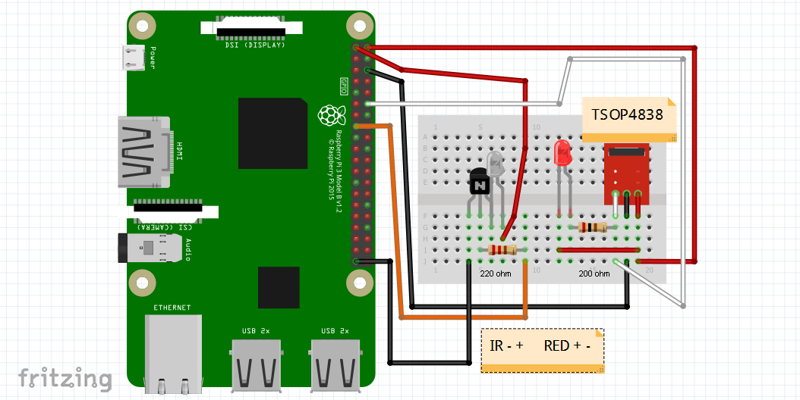
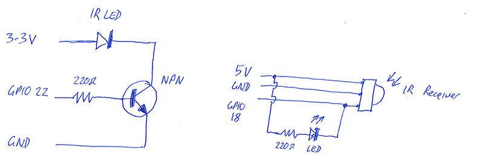
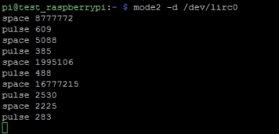

# LIRC with Python

The following is to use Python on the Raspberry Pi to receive/transmit infrared signals. ie: To have the Raspberry Pi act as an IR remote control unit.

## Requirements

Components Required:

* Raspberry PI 3
* 220ohms resistors
* LED
* IR LED
* BC547 (PnP) Transistors
* TSOP4838 IR Recievers
* Breadboard
* Jumper cables

## Wiring





* **Warning: Check the pin layout of your IR receiver as some of them are wired with the data and ground pins swapped**

## Raspberry Pi configuration

Ensure your Raspberry Pi is up to date

```bash
sudo apt-get update
sudo apt-get upgrade
```

Install LIRC

```bash
sudo apt-get install lirc
```

Edit /etc/modules file

```bash
sudo nano /etc/modules
```

Add to the bottom of file:

```bash
lirc_dev
lirc_rpi gpio_in_pin=18 gpio_out_pin=22
```

Edit /etc/lirc/hardware.conf:

```bash
sudo nano /etc/lirc/hardware.conf
```

Change it to:

```
LIRCD_ARGS="--uinput"
LOAD_MODULES=true
DRIVER="default"
DEVICE="/dev/lirc0"
MODULES="lirc_rpi"
LIRCD_CONF=""
LIRCMD_CONF=""
```

Edit the /boot/config.txt file:

```bash
sudo nano /boot/config.txt
```

Add this line:

```bash
dtoverlay=lirc-rpi,gpio_in_pin=18,gpio_out_pin=22
```

Create /etc/modprobe.d/ir-remote.conf file:

```bash
sudo nano /etc/modprobe.d/ir-remote.conf
```

Add this line:

```bash
options lirc_rpi gpio_in_pin=18 gpio_out_pin=22
```

Go ahead and reboot the Pi:

```bash
sudo reboot
```

## Test IR receiver

Time to test IR Reciever:

```bash
sudo modprobe lirc_rpi
```

then

```bash
sudo kill $(pidof lircd)
```

then

```bash
mode2 -d /dev/lirc0
```

At this point you should be able to press buttons on your remote and see output similar to this:



(hit “ctrl + c” to exit)


```bash
sudo kill $(pidof lircd)
```

save output to text file for future reference:

```bash
irrecord -d /dev/lirc0 /home/pi/lircd.conf
```

## Recording IR signals 

run
```bash
sudo kill $(pidof lircd)
```

then

```bash
irrecord --disable-namespace -d /dev/lirc0 /home/pi/lircd.conf
```

**Important**

* Carefully read and follow the prompts given by the program. The instructions are quite exact.
* Write down (case-sensitive) the name of your device and the names used for each key when prompted. These will be the codes you need to use in your program later.

verify /home/pi/lircd.conf created successfully:

```bash
cat /home/pi/lircd.conf
```

(if so continue, if not start over at MAPPING REMOTE CODES section)

copy/overwrite /home/pi/lircd.conf to /etc/lirc/

```bash
sudo cp /home/pi/lircd.conf /etc/lirc/lircd.conf
```

Restart LIRC:

```bash
sudo /etc/init.d/lircd restart
```

## Sending IR signals

Before issuing commands run this:

```bash
sudo lircd --device /dev/lirc0
```

Test sample command:

* Note: 'projector' and 'Power' are the device name and key code as recorded in `/etc/lirc/lircd.conf`

```bash
irsend SEND_ONCE projector Power
```

## Python coding

```python
#!/usr/bin/env python
import os
import time

#turn projector on, change input source etc
os.system('irsend SEND_ONCE projector Power')
time.sleep(12)
os.system('irsend SEND_ONCE projector Source')
time.sleep(4)
os.system('irsend SEND_ONCE projector Freeze')
time.sleep(4)
os.system('irsend SEND_ONCE projector Mute')
```

## Sourced from

* [http://www.piddlerintheroot.com/ir-blaster-lirc/](http://www.piddlerintheroot.com/ir-blaster-lirc/)
* [https://www.youtube.com/watch?v=7vmzQ8bWwmo](https://www.youtube.com/watch?v=7vmzQ8bWwmo)

## Sample lircd.conf

This was for an Epson projector

```text
begin remote

  name  epson
  bits           16
  flags SPACE_ENC|CONST_LENGTH
  eps            30
  aeps          100

  header       9013  4452
  one           607  1646
  zero          607   521
  ptrail        608
  pre_data_bits   16
  pre_data       0xC1AA
  gap          107902
  toggle_bit_mask 0x0
  frequency    38000

      begin codes
          Power                    0x09F6
          Source                   0x31CE
          Freeze                   0x49B6
          Mute                     0xC936
      end codes

end remote
```